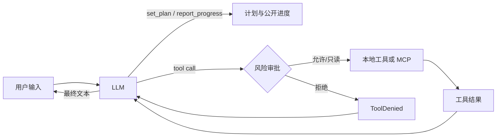

# Lumen

文本 Agent 支持统一推理强度：模型配置 `reasoning_effort: medium`，CLI
`lumen --thinking low` / `lumen web --thinking medium`，TUI 与 Web `/thinking`。
可用档位按模型能力提供，只在空闲时切换，按 Session 与模型保存并供子 Agent 继承。
DeepSeek V4、Kimi Coding K3、百炼 Anthropic Qwen 3.8 已提供原生参数映射；
选择器显示 `medium → high` 等实际映射，未知模型会说明推理控制尚未配置。
新初始化模板明确 medium；旧配置省略时维持 Provider 默认，`off` 必须由模型支持。
默认安全工具并行、子 Agent 同时 3 个；独立任务先派发后等待，写入仍隔离到 worktree。
详细优先级与兼容规则见[推理配置](docs/architecture-guide/07-configuration-and-data.md)。
Provider 能力按供应商端点、协议和精确模型 ID 匹配；[对应关系列表](docs/generated/provider-reasoning.md)
与代码同源生成，附官方依据和核对日期。[供应商升级流程](docs/architecture-guide/15-provider-catalog.md)
包括更新目录、参数契约验证及生成物检查。未知新型号不自动套用旧规则。

<p align="center">
  <picture>
    <source media="(prefers-color-scheme: dark)" srcset="docs/brand/lumen-lockup-dark.svg">
    
  </picture>
</p>

Lumen（拉丁文 *lumen*，意为“光”）是一个轻量、可配置的 Python Agent 框架：模型根据自然语言提示自行选择本地工具或 MCP 工具，读取工具结果后继续运行，直到形成最终回答。`LumenAgentLoop` 是唯一模型—工具循环权威；低层 `PydanticAIModelDriver` 保留 PydanticAI 成熟的 Model/Provider 适配价值。Textual TUI、FastAPI + Next.js Web 和 headless CLI 共用同一运行契约。

Lumen 是框架身份，OpenAI、Anthropic、Google 或任何 OpenAI-compatible 模型只是可替换的推理 provider。Python 包、CLI 命令与本地配置目录统一使用 `lumen` / `.lumen/`。



## 功能

- OpenAI、Anthropic、Google、Ollama 及 OpenAI-compatible 模型。
- YAML 配置模型、提示词、限制、本地插件和多个 MCP 服务。
- **三种一致入口**：全屏 TUI、本机单工作区 Web 客户端，以及适合脚本/CI 的 `lumen -p` headless 模式；共用会话、审批、上下文、记忆、Skill 和 MCP 运行内核。
- **Web 实时语音**：通过 capability-aware Router 支持 OpenAI Realtime 与阿里云百炼 Qwen Realtime；API Key、工具执行、审批和完成门禁始终留在 Lumen Host。语音与文字 turn 共用 Session v10、工作对象、MCP 和 Agent 能力。
- stdio 与 Streamable HTTP MCP；工具统一使用 `<server>_<tool>` 名称，通过 `search_tools` 的有界目录、关键词搜索或分页浏览发现后加载完整 schema，`/mcp` 查看连接状态。只有明确声明 `tool_effects: observe` 的调用在断线后自动重连重试一次；其他调用返回 `mcp_outcome_unknown`，要求先核实远端结果。
- 内置只读工具 `read_file`、`list_directory`、`search_text`，严格限制在 `--cwd` 工作区内；
  `search_text.path` 可传文件或目录，传文件时只搜索该文件。
- 可选启用的工作区能力工具 `write_file`、`edit_file`、`run_command`，默认需要审批。
- 计划与公开进度：模型在动手前调用 `set_plan`，过程中通过 `report_progress` 输出简短、公开的进度说明。
- **Agent Skills**：扫描 `.lumen/skills/` 和 `~/.lumen/skills/` 发现 `SKILL.md` 技能包，模型自主按需加载或用户手动 `/skill:<name>` 触发；精确正文以内容寻址 artifact 固定在当前 session，resume 恢复同一 revision。
- **显式并发契约**：默认 `parallel_safe`；显式 `sequential` 逐个执行。原生 Loop 中 `parallel_safe` 和 `parallel` 都只重叠 Gateway 判定为 `ToolConcurrency.PARALLEL_SAFE` 的调用，未声明并发能力时串行。工具完成立即显示，模型结果仍按调用顺序回填。Risk 只决定审批；同轮审批聚合展示。
- **原生多 Agent Runtime**：`AgentOrchestrator` 持久化 depth-one Agent Thread，统一提供并行调度、消息路由、权限收窄、隔离 worktree、证据、恢复与完成门禁；旧 child 工具仅作为弃用兼容入口。
- **自研 Agent Loop**：`LumenAgentLoop` 是唯一模型—工具循环权威，负责模型请求、工具批次、继续、重试、取消和 terminal candidate；Provider 传输与生命周期由低层 `PydanticAIModelDriver` 适配。
- **生命周期钩子**：command/Python 钩子覆盖 prompt、工具前后与 stop，本地和 MCP 工具共用同一执行 seam。
- **MCP resources/prompts/OAuth**：资源显式激活为当前 session 的 retrieved-context snapshot，prompt 按需渲染并标记外部来源；OAuth 使用 PKCE、刷新令牌与 0600 本地凭证。
- 时间线 TUI：默认 Normal 信息密度会折叠 commentary，并按读取、搜索、本地探索、Web、MCP 等可见意图分别聚合低风险活动；命令、修改、失败和审批保持独立。Provider 工具卡片使用“正在读取/已读取”“正在搜索/已搜索”等中文文案，可用 `Ctrl+O` 切到 Verbose 审计视图。还提供语义化 loading、Lazy 消息渲染、流式 Markdown、工具专用卡片、固定队列式审批、可搜索 transcript、Agent 面板和请求/工具/token/耗时度量。
- 工具展示由 Tool Contract V2 生成可重放的 `ToolCallView/ToolResultView`；TUI 与 Web 消费同一 schema intent，未知工具自动降级为通用卡片，展示失败不影响工具真实结果。
- 结构化上下文：system、memory、Skill、MCP catalog、历史和当前输入分区计费并执行硬上限；超过软阈值时只摘要上一 checkpoint 之后的 delta，完整 JSONL 历史仍追加持久化。
- 大工具输出 receipt 化：旧轮次的超大工具结果只留摘要与 head/tail，正文写入 0600 内容寻址 artifact；模型追问细节时可用 `read_artifact` 按 ref 分页读回全文，涉密输出（`artifact_policy="never"`）永不落盘也不可回读。
- Provider request ledger：每个 terminal turn 持久化实际模型 route、逐 step token 预算、完整有序工具 schema digest、Context fingerprint，以及内嵌的 `ModelInputManifest`（来源 ref/digest、stable prefix、dynamic tail、request fingerprint 与 replay eligibility）；不保存密钥、instructions、完整消息或大正文。
- 持久记忆：显式记忆默认可用，自动学习默认关闭；可审计 SQLite/Markdown 投影、项目隔离、敏感信息过滤、崩溃恢复与 incognito 开关。
- 会话恢复：可恢复计划、压缩 checkpoint、活动 Skill/MCP snapshot 与待回答澄清；孤立 running turn 显示为 interrupted，`/retry` 恢复输入与附件，未解决的 unknown Effect 会阻止重试。执行期使用 OS advisory workspace lock 保证跨进程单 writer，只读 Session 不受影响。

## 公开进度与私有推理

- Agent Loop 与模型思考开关独立。未显式配置时保留 Provider 默认，不按模型名称
  自动开关思考。`settings.thinking` 或 Provider 原生参数控制调用行为；Anthropic
  路由显式设为 `thinking: false` 时，Driver 发送 `thinking: {type: disabled}`，
  避免 SDK 省略字段后继续沿用上游默认。
- 模型生成工具参数期间会显示准备提示，参数完整并通过校验后才进入工具执行；
  思考开关不会关闭工具、调研进度或执行结果事件。
- 多阶段工作使用一份简短计划，简单问答、单次修改或命令不强制规划。计划有验收条件时，
  工具结果向模型附带 `plan_evidence` receipt；用 `link_evidence` 关联真实执行证据后
  再完成步骤。未知证据和缺少验收仍安全失败，不能通过删条件冒充验证。
  Web 进度胶囊明确显示“已完成 N / M”，不把当前步骤序号当作完成数量。
- `report_progress` 仅承载面向用户的简短说明：发现、改动、错误、恢复与下一步动作。
- 系统提示词明确禁止把私有思维链（chain-of-thought）写入进度。
- 运行时不会把模型专属 reasoning/thinking 当成公开进度、最终文本或 canonical completion 证据；公开进度始终是结构化、经过校验的文本。
- Provider 返回的 reasoning/thinking 流（如 extended thinking）以只读的 `ThinkingDelta` 事件呈现在“处理过程”中：仅用于展示，不进入最终答案，也不会被工具调用回撤；verbose 密度下默认展开。Lumen 会按当前用户请求识别本轮主要语言，并要求可见推理、工具调用前说明、公开进度和最终回答使用该语言；Provider 原生私有推理不会被事后翻译或改写。

## 工作区能力工具

- `write_file(path, content, overwrite=False)`：UTF-8 原子写入；默认拒绝覆盖，需显式 `overwrite=True`。
- `edit_file(path, find, replace)`：要求 `find` 在文件中精确出现一次，否则失败。
- `run_command(argv, cwd=".", timeout=None, env=None)`：以 `argv` 数组直接 `exec`，**不经过 shell**；超时或取消时终止整个进程组；stdout/stderr 并发 drain,各自只保留头尾各 64 KiB(中间丢弃但计入总字节数),所以 100 MB 的输出也不会撑爆内存,同时开头和结尾(通常是真正的报错/堆栈)都保留可见。
- `web_fetch(url, start_char=1, max_chars=20000)`：读取网页、API、JSON 或 RSS/XML 的默认工具，不写工作区。HTML 转为保留链接的 plain text，结构化文本原样返回，支持按 `next_start_char` 翻页；请求携带明确的 Accept/User-Agent，对 408/425/429/5xx 和传输故障最多尝试 3 次并遵守数值型 `Retry-After`。响应按流式 2 MiB 上限停止读取。SSRF 防护：DNS 解析后拒绝 loopback/私网/链路本地地址，重定向逐跳重新校验。`Risk=external`（默认需审批），`EffectKind=observe`；当前未声明并发策略，按 exclusive 执行。
- `web_search(query)`：需在 `tools.web.search` 配置 provider（`tavily` 或 `brave`）与 `api_key_env` 后才会注册；返回 `title — url — snippet` 行。
- `download_file(url, path, overwrite=False, sha256=None)`：仅用于把已知原始 URL 的完整 UTF-8 文件保存到工作区；读取网页、API 或 RSS 应使用 `web_fetch`。它不经模型转写或 HTML 提取，仅返回路径、字节数和 SHA-256；与 `web_fetch` 使用相同的请求标识和瞬时故障重试，并继续流式限制下载大小、拒绝二进制、HTML、哈希不符和路径逃逸，最后原子发布并通过 TaskWorkspace journal 验证。`Risk=external`、`EffectKind=mutation`，默认需审批，Plan 模式不允许执行；需加入 `tools.builtins` 显式启用。
- 文件工具及命令 cwd 受 `--cwd` 工作区约束，禁止路径逃逸；Web 工具访问公共 URL，使用独立的网络与审批约束。
- `install_skill(source, path=None, ref=None, name=None, scope="project", overwrite=False)`：从 GitHub 或工作区本地目录安装完整 Skill，包括二进制资源、脚本可执行标记和空目录。自动解析默认分支并固定 commit，目录发布后验证全部内容，返回简短回执；安装后当前运行即可通过 `list_skills` / `load_skill` 发现与加载。需在 `tools.builtins` 显式启用；与其他写工具共用审批，Plan 模式不可执行。

```yaml
tools:
  builtins:
    - read_file
    - list_directory
    - search_text
    - web_fetch
    - download_file
    - install_skill
    - write_file
    - edit_file
    - run_command
  web:
    fetch_timeout_seconds: 20
    fetch_max_bytes: 2097152
    # search:                        # 配置后才会注册 web_search
    #   provider: tavily
    #   api_key_env: TAVILY_API_KEY
    #   max_results: 8
```

网页能力按用途分三层：已核对支持的 Responses/Anthropic provider 可使用模型原生 `web_search`；需要独立搜索结果时可配置 Tavily/Brave `web_search` 或外部 MCP；已有 URL 的静态 HTML/API/RSS 内容使用内置 `web_fetch`。需要登录、点击、执行 JavaScript 或处理反爬挑战的页面不由 `web_fetch` 冒充支持，应连接受控 Browser MCP。实现与 Codex、Claude Code、Pi 的公开能力对照见 [网页检索能力审计](docs/research/2026-09-10-web-retrieval-capability-audit.md)。

命令执行同时经过审批策略和 OS 沙箱。默认 `workspace_write`：macOS 使用 Seatbelt、Linux 使用 bubblewrap，网络关闭，隔离 `HOME/TMPDIR`，环境变量按 allowlist 构建；适配器缺失时 fail closed。只有显式配置 `sandbox.mode: disabled` 才放弃隔离。

启用安装工具后可直接说“安装 https://github.com/leonxlnx/taste-skill 中的 skills/taste-skill”。支持仓库 URL、`owner/repo`、GitHub `tree/blob/raw` URL 和 `./本地目录`；含 `/` 的分支使用显式 `ref`。多 Skill 仓库会返回候选路径，必须明确选择。默认安装到受信任项目的 `.lumen/skills/<name>/`；`scope="user"` 写入 `~/.lumen/skills/`。设置 `agent.user_skill_install_enabled: true` 可单独授权这个受管目录，无需关闭 `workspace_write` 命令沙箱，仍经过安装工具审批。该开关默认关闭，当前项目和示例配置已启用；原 `sandbox.mode: disabled` 的安装能力保留兼容。用户明确要求全局时不会静默改装到项目目录。

需要澄清时，Web 显示可点击选项与自由回答框；点击后继续原会话，刷新页面也能恢复尚未回答的问题。此前的工具重试和过程文字默认收起，完整内容仍可在处理过程和运行记录中查看。

相同内容重复安装不修改文件；更新需明确 `overwrite=True`，受管目录存在本地修改时拒绝覆盖。安装保留来源与 commit 元数据，并复用 TaskWorkspace 目录快照与恢复；不会执行下载的脚本或 Skill 正文。私有 GitHub 仓库读取操作者环境中的 `GH_TOKEN` / `GITHUB_TOKEN`，当前不提供 Git/SSH 回退。压缩包和展开内容各限 32 MiB，文件和目录各限 4096，拒绝路径逃逸、符号链接与大小写冲突。已有会话激活的正文仍使用原 artifact，重新加载才更新。

`sandbox.network` 只约束 SandboxRunner 子进程，不是 Host 的全局网络开关。已配置的 MCP/Web 工具
按各自权限执行；命令失败应根据 stderr、退出码和结果中的 sandbox 策略诊断。Skill 的正文和相邻
资源通过 `load_skill` / `read_skill_resource` 读取，无需让命令访问用户级 Skill 目录。

## 计划与时间线符号

- `set_plan` 后 TUI 显示计划面板：`✓` 完成、`●` 进行中、`○` 待办、`!` 阻塞。
- 修订同一目标的计划会保留未改动步骤的进度与证据；步骤开始/结束时通过 `update_step` 即时更新。普通模式也会在最终回答前检查本轮计划的待办项，不由 UI 自动填成完成；Plan 模式的未来步骤仍保持待审批。
- 每个工具调用渲染为一张卡片，包含来源（builtin/plugin/mcp/control）、风险等级、耗时，必要时附带内联审批选择器（`→ Allow / Deny`，左右键切换 + Enter 确认，无突兀按钮）。
- provider 的文本增量到达 runtime 后立即发送给 TUI，由 33ms 合并帧增量渲染，不等待整轮或整段回答结束。
- 因为 provider 可能先输出文字、随后才给出工具调用，Lumen 会先显示暂定文本；若同一响应后来调用工具，则通过 `TextRetracted` 将该段原位转为淡色 `CommentaryDelta`，最终答案不会重复。
- 每条回答始终由一个 Markdown 文档 widget 承载；文档内部按顶层块增量渲染——已闭合的块冻结为静态子 widget 不再重解析，只有未闭合的尾部块随流式帧重渲染；结束时强制最终渲染。

## 内联审批

- 写入、执行与外部工具默认进入审批：时间线只保留一行工具审计记录，完整参数在输入框上方的编号确认列表中展示。
- `↑` / `↓` 移动，`Enter` 选择，也可直接按数字；单个请求支持“仅允许一次 / 本会话始终允许 / 本项目始终允许 / 拒绝”，批量请求支持“全部允许 / 逐个查看 / 全部拒绝”。确认后焦点自动回到输入框。`Esc` 取消运行会把所有待审请求一并置为拒绝。
- “本项目始终允许”持久化到 `~/.lumen/state/approval-rules/<project>.json`（机器管理的 JSON，与含凭据/注释的 agent.yaml 分离），重启与跨会话生效；键格式与 session 规则一致（`origin:tool[:executable]`），删除该文件即全部撤销。
- `always_allow` / `always_deny` 仍然支持,可让特定工具跳过或永远隐藏。

### 协作模式与权限模式

两种 mode 正交且都按 session 持久化：`collaboration.default_mode` 为 `default | plan`；`permissions.default_mode` 为 `manual | accept_edits | auto`。Plan 只决定可否规划/执行，审批模式只决定执行阶段的副作用是否需要确认。

- **`manual`（默认）** —— 读取直接放行；文件修改、命令和外部动作显示确认列表。
- **`accept_edits`** —— 自动批准工作区内置 `write_file` / `edit_file` 以及路径不逃逸工作区的 `mkdir` / `touch` / `mv` / `cp`；其余命令、插件与 MCP 写操作仍需确认。
- **`collaboration: plan`** —— 自动放行读取和严格白名单内的只读检查命令；写入、变更命令与外部操作直接阻止。非空且全 pending 的计划进入 revision review；批准记录持久化后才以新 turn 执行。
- **`auto`** —— 自动批准已明确分类为 `read` / `write` / `execute` / `external` 的操作。未声明风险的远端能力归类为 `external_unknown`，始终需要确认。

`Shift+Tab` 按 `manual → accept_edits → plan → auto` 循环，切到 `auto` 立即生效，不弹确认框或成功提示。模式切换不会追溯批准已经显示的 pending 请求。MCP 工具默认 risk=`external_unknown`；只有显式声明风险后才可能在 auto 下自动放行。

当前模式只在输入框下方显示；`accept_edits` / `auto` 使用双箭头，`manual` / `plan` 使用暂停标记。

```yaml
permissions:
  default_mode: manual   # manual | accept_edits | auto
  always_allow: []
  always_deny: []
collaboration:
  default_mode: default  # default | plan
sandbox:
  mode: workspace_write  # workspace_write | disabled
  network: false
work_products:
  enabled: true          # 持久化当前工作对象、目标与副作用回执
  auto_attach: true      # write_file/edit_file 自动挂接文件
  strict: true           # 未验证 mutation/unknown effect 阻止虚假完成
  max_context_items: 8   # 每轮只注入有界的最近状态
```

`TaskWorkspace` 是跨 Skill 通用的持续工作对象层，不保存整份正文到 Session。模型可用
`open_work_product`、`inspect_work_product`、`change_work_product`、`restore_work_product`
处理 UTF-8 文本、JSON 和 YAML；正文快照与变更载荷进入内容寻址 ArtifactStore，Session
只持久化 revision/ref、目标、effect receipt 和验证摘要。文本支持标题路径、唯一 anchor、
明确行区间；JSON/YAML 使用 JSON Pointer。零匹配或多匹配只返回候选，不执行修改。
现有 `write_file` / `edit_file` 接口不变并自动接入相同 journal；`run_command` 只记录
execution receipt，不声称完整发现命令内部任意文件副作用。

配置格式为 `version: 2`。历史 v1 配置会在内存中迁移并给出升级警告（原文件不会被改写，v1 的 `ask` 映射为 `manual`）；v2 中继续使用 `ask` 或 `permissions.default_mode: plan` 会明确校验失败。

## 上下文压缩

```yaml
context:
  enabled: true
  soft_ratio: 0.80                # profile window 的自动压缩阈值
  hard_ratio: 0.92                # provider preflight 硬阈值
  target_ratio: 0.55              # 压缩后的目标占用
  summary_tool_result_chars: 2000  # 摘要时每个工具结果的字符上限
  summary_max_tokens: 2000       # 摘要生成本身的 token 预算
  background_compaction: true
  background_trigger_ratio: 0.90
```

模型能力与传输协议独立配置；`openai:` 仅选择兼容 API，不推断窗口或 tokenizer：

```yaml
agent:
  prompt:
    mode: append                 # minimal | preset | append | replace
    preset: lumen
    append_file: prompts/system.md
  models:
    deepseek-v4-flash:
      id: openai:deepseek-v4-flash
      context:
        profile: deepseek-v4-flash
        # window_tokens / max_output_tokens / tokenizer 均可按部署显式覆盖
```

`agent.prompt` 是稳定 Provider instructions 的唯一配置入口。`minimal` 使用精简内置指令，
`preset` 使用版本化的 `lumen` preset，`append` 在 preset 后加入 `append_file`，`replace` 用
`replace_file` 替换 preset。`replace` 仍保留 Lumen 的运行控制 policy，因为计划验收、澄清和并发
语义属于 Runtime 契约。旧 `instructions_file` 已删除，配置中出现该字段会直接校验失败。

模型名称、模型 ID、MCP 状态、工作目录和 Skill 目录属于动态运行上下文，由 ContextEngine 在每次
请求中以 system role 注入，不进入稳定 instructions。`/instructions` 可查看当前 mode、preset 版本、
摘要 digest 和来源，不回显正文。

解析优先级为模型显式字段 → 显式 profile → 精确模型 slug alias → 80k conservative fallback。未知模型的初始输出 reserve 按 window 自适应：以 16K 为现代基线、32K 为未验证能力上限，同时不超过窗口的 1/4；发生 `LENGTH` 时可继续有界扩容。旧 `soft_token_limit` / `keep_recent_tokens` 仍可读取，但 `/context` 和配置诊断会显示弃用提示。

- token 估算按模型 profile 选择 adapter，而不是按 provider 前缀：GPT-5.6 使用 `o200k_base`（缺少本地 `tiktoken` 时回退），DeepSeek/Kimi/GLM 与未知模型使用 conservative-CJK；不会下载或远程调用 tokenizer。压缩软触发、zone 预算与 provider preflight 共用同一份计数器。
- 摘要由独立的、无工具 Agent 以严格结构化输出（`ContextSummary`）生成；失败时执行确定性历史降级，无法在固定前缀与输出预留下安全装入时会在 provider 调用前明确报错。
- 摘要以 `<history-summary trust="recalled">` 写入活动上下文并带明确 metadata；checkpoint 持久化 parent、连续 message source range 与 digest；**完整原始历史始终以追加方式持久化**。
- **token 预算切点**（对照 coding-agent 的 `findCutPoint`）：压缩时从最新消息反向累积 token，达到 `keep_recent_tokens` 预算后**向前吸附到安全边界**（用户 prompt 请求的起点），保证工具结果永远不会和它的调用分离。替代了旧的固定轮次计数（6 轮可能 2K 或 60K token，不可控）。
- **每个工具结果独立截断**：序列化给摘要器时，每个工具结果单独截到 `summary_tool_result_chars` 字符，避免单个巨型输出挤掉其他轮次（对照 coding-agent 的 `TOOL_RESULT_MAX_CHARS = 2000`）。
- **同一 run 的动态窗口**：每次 Provider I/O 前重新计量；当前 run 新产生的大型工具结果会先变成可回读的 artifact receipt，再裁剪旧 canonical history，避免长工具输出在单个 turn 内持续膨胀。
- **真正的 delta 摘要**：多次压缩时，前次 rolling state 作为 `<previous-summary>` 传入，而摘要器只接收 checkpoint V2 绝对 transcript cursor 之后的新消息。恢复时校验 parent、连续范围、source/state digest 和 full-history 长度；损坏 checkpoint 不推进状态，而从最后一个合法 checkpoint 继续回放原始 JSONL。
- **单一 rolling state，不堆叠摘要**：模型始终只注入最新 V2 rolling state 与 recent window。旧 checkpoint 保留为不可变 episode archive，仅在当前问题相关时按需检索；后台候选只在 turn 已经持久化后生成，采用前再次校验 cursor/digest。
- **持久化后发布**：ContextEngine 的 `commit` 先构造候选 active history；RunCoordinator 缓冲 `RunCompleted` / `RunWaitingForUser` 等 terminal candidate，完成 JSONL append + `fsync` 后才发布 terminal event、checkpoint/cursor 和内存状态，因此写盘失败不会造成“客户端已完成、磁盘未记录”或“内存已压缩、磁盘未记录”。
- **逐步骤真实预检**：`LumenAgentLoop` 在每次低层 Driver 调用前通过 `ContextEngine.adapt_request_history()` 冻结实际 messages、instructions 与有序工具 schema，并生成 manifest。必要时只裁剪旧 canonical history；仍超 hard limit 时在 provider I/O 前失败。
- **Prompt 分层**：native role/message 是语义边界；Plan/Skill 使用 system-role `<session-policy-context>`，Memory/MCP 使用 user-role `<context-data>`，标签内正文保留 Markdown 并统一 XML 转义。

## 原生多 Agent Runtime

多 Agent 能力默认以 `adaptive` 策略启用。用户、项目指令或 Skill 明确要求并行 Agent 时必须委派；其他场景仅在并行调查、上下文隔离或独立验证有明显收益时使用。根 Agent 通过 `spawn_agent`、`send_message`、`followup_task`、`wait_agent`、`interrupt_agent`、`list_agents`、`close_agent` 管理 Session 内持久化的 depth-one Agent Thread：

```yaml
agents:
  enabled: true
  autonomy: adaptive
  max_depth: 1
  max_concurrency: 3
  max_agents_per_run: 8
  default_agent: default
  recovery: safe
  worktree_root: ~/.lumen/worktrees
  request_count: null
  tool_calls: null
  timeout_seconds: null
```

内置 `explorer` 只继承父 Agent 已启用工具中的 `observe` 交集；`default` / `worker` 在独立 Git worktree 中执行本地修改。项目可在 `.lumen/agents/*.md`、用户可在 `~/.lumen/agents/*.md` 定义角色，项目角色仅在项目已信任时加载，并且角色只能收窄父 Agent 的工具和权限。远程动作仍通过根 Host 的审批通道；worktree 导入前做三方预检和 dirty path 重叠检查，绝不覆盖用户未提交修改。旧 `delegation` 配置与 child 工具仍作为弃用兼容入口。

## 运行限制（usage limits）

长任务默认不设模型请求数、工具调用数和单请求总时长硬上限。部署者仍可显式配置预算；已有配置中的有限值继续生效，`null` 表示关闭该项硬限制：

```yaml
agent:
  limits:
    request_count: null        # 可选的单次 run 模型请求预算
    tool_calls: null           # 可选的单次 run 工具调用预算
    output_limit_retries: 3    # 隐式输出上限被截断后的安全重试次数
    tool_timeout_seconds: 60
    model_stream_idle_timeout_seconds: 300  # 无数据到达的等待上限
    model_request_timeout_seconds: null     # 可选绝对时限，持续输出不会重置
    model_retries: 5
    model_retry_delay_seconds: 2
    model_retry_max_delay_seconds: 60
    skill_script_timeout_seconds: 30
    parallel_tool_calls: parallel_safe  # sequential | parallel_safe | parallel
```

> **没有 `total_tokens` 字段**（已彻底删除）。Context 增长由 `ContextEngine` 按当前模型的 ratio policy 自动压缩，不使用累计 token 硬墙中断任务。旧 `soft_token_limit` 仍可作为兼容绝对覆盖；新配置建议使用 `soft_ratio`。如果 `agent.yaml` 里还有 `total_tokens: ...`，必须删除，否则 `StrictModel` 会因未知字段报错。

> 请求/工具预算耗尽、连接空闲超时、显式总时限和 Provider 配额耗尽分别报告。根 Agent 与原生子 Agent 默认均可持续运行；子 Agent 的显式请求/工具预算会与父配置取更严格值。取消、工具超时、审批、effect 和完成门禁继续有效。

## 运行时健壮性

当前实现、故障分类与踩坑检查见[长任务持续执行与排障](docs/architecture-guide/14-long-running-recovery.md)。

- **Provider 自动恢复**：瞬时错误默认重试最多 5 次，指数退避带抖动，遵循允许等待范围内的 `Retry-After`。OpenAI/Anthropic SDK 隐式重试关闭，重试由原生 Loop 统一记录。已输出的候选文字先撤回再生成；已完成工具步骤保持不变。检测到 Provider 内置工具活动时不自动重放。配额耗尽、拒答、内容过滤和协议错误直接报告。
- **滑动等待**：OpenAI/Anthropic 以 HTTP 流数据（含心跳）刷新空闲计时；其他 ModelDriver 以标准事件刷新。持续输出不再触发默认 300 秒总时限。
- **同轮压缩**：每个完成工具批次后的模型请求都会检查上下文压力，必要时滚动总结并保留目标和最近完整批次。Provider 报告上下文超限时允许一次有效压缩后的恢复请求。失败或取消仍保留已完成模型/工具消息，继续任务时无需重做这些步骤。
- **异常时保留部分输出**：运行中途失败（取消、超时、模型错误）时，已缓冲的流式文本会先 flush 到时间线，再显示错误消息。用户不会再看到"半截答案消失"。
- **`@` 文件补全不阻塞 UI**：`search_files`（含 `fd` 子进程或 `os.walk` 回退）在线程池中执行（`asyncio.to_thread`），不再冻结 TUI。
- **原子写入不留垃圾**：`write_file` / `edit_file` 的临时文件在 `os.replace` 失败或取消时自动清理（`except BaseException` 中 `unlink`），不再累积 `.tmp-*` 孤儿文件。

## 快速开始

运行要求 Python 3.11–3.13；源码开发示例使用 [uv](https://docs.astral.sh/uv/)，全局安装也可改用 `pipx`。

### 1. 安装依赖

```bash
uv sync

# 需要 Web Live 语音时安装可选传输依赖
uv sync --extra live
```

### 2. 准备配置文件

推荐先创建一次用户级配置。它让全局安装后的 `lumen` 可以从任意项目直接启动：

```bash
uv run lumen init --global
export OPENAI_API_KEY="sk-..."
```

也可创建项目共享配置或只在本机生效的覆盖：

```bash
uv run lumen init          # .lumen/agent.yaml
uv run lumen init --local  # .lumen/agent.local.yaml，并加入 .git/info/exclude
```

三个命令都拒绝覆盖已有文件。仓库里的 `agent.example.yaml` 是常用配置示例；字段全集以 `src/lumen/config.py` 的严格 schema 为准。旧的根目录 `agent.yaml` 继续兼容，但启动时会给出迁移提示。

### 3. 启动 TUI(全屏交互界面)

**推荐:在仓库根目录启动**(原因见下面的"工作目录说明"):

```bash
# 最简启动 —— 自动合并用户与当前项目配置
uv run lumen

# 独占单文件兼容模式（不参与分层合并）
uv run lumen --config agent.yaml --cwd .

# 启动时直接选定某个模型(覆盖 agent.default_model)
uv run lumen --model glm-5.2
uv run lumen -m qwen3.7-max      # -m 是 --model 的简写
```

启动后进入全屏 TUI：`Enter` 发送，`Shift+Enter` 换行，`Esc` 上下文感知（关闭补全→取消运行→清空输入），`Ctrl+C` 运行中取消/空闲时退出。输入 `! command args` 可直接通过同一 OS 沙箱执行 argv（Plan 模式和 Agent 运行期间禁用，不经过 shell 展开）。

### 3.1 启动 Web 客户端

发布 wheel 已内置静态前端，运行时只启动一个 Python 进程，不需要 Node：

```bash
lumen web --cwd .
lumen web --cwd . --model glm-5.2 --resume <session-id>
lumen web --cwd . --background
lumen web --cwd . --status
lumen web --cwd . --stop
```

服务默认只监听 `127.0.0.1:8765`，并通过一次性启动链接换取本机 `HttpOnly` cookie；当前版本主动拒绝非 loopback 监听。Web 与 TUI 共用 JSONL 会话、运行时、工具审批、context、memory、Skill 和 MCP 配置，同一工作区同时只允许一个 Agent run，但运行期间仍可浏览其他会话。浏览器刷新会按 SSE sequence 重连，不会取消后台 run。

Web 侧栏支持任务重命名、归档、恢复和删除。只点击“新建任务”不会提前持久化空 Session；没有 turn 且没有显式标题的历史空 Session 也不会出现在列表。首条任务输入被 Host 接受时，会先追加带唯一 `interaction_id` 的 `running` turn，再调度模型或工具；terminal turn 以相同 ID 追加并在读取投影中取代 running 状态，因此进程重启也不会得到空时间线，且完成后不会重复显示用户输入。`SessionRepository` 在统一 JSONL 写入 Seam 使用 Pydantic JSON 语义规范化 provider、MCP 和 usage 载荷；例如 provider 返回的 `Decimal` 计费值会精确保存为十进制字符串，而未知的不透明对象仍然安全失败。若完整 terminal record 仍因其他富载荷无法序列化，`RunCoordinator` 会改为追加只含已流出 timeline 与错误信息的最小 `failed` terminal record；Host 还会对协调层外的未处理异常执行同样的最终对账，避免 UI 已显示的助手文本在切换任务后静默消失。规范化标题同时追加到 v9 `session_catalog`，归档和删除状态也追加到同一 JSONL journal。旧版本遗留的“只有自动标题、没有 turn、但已有 effect/Agent 证据”的中断记录会只读恢复标题中的输入并明确提示回答不可重建，不改写历史。删除使用 tombstone 从客户端视图移除，不原地改写历史，活动 run、未处理 Agent 或未验证 Work Product 会阻止归档与删除。

Web 转录按用户 turn 组织阅读层级：最终回答、计划摘要、澄清和错误保持在主阅读流；thinking、commentary、progress、工具、MCP、Skill、Agent 与 Work Product 事件归入同一个可展开的“处理过程”。过程默认收起，需要处理当前审批时自动展开；工具调用前的中间助手说明也归入过程，最终回答保持直接可读。折叠只改变 Web 投影，不删除 Session journal 中的任何事件或工具输入输出。代码块提供独立复制按钮，宽表格在自己的区域横向滚动。

Web 输入区采用紧凑圆角输入框。点击 `+` 可添加图片或打开模型、计划、审批、复制与分支等快捷操作；输入 `/` 按名称、说明或关键词检索命令。菜单优先展示动作名称，`Enter` 执行完整命令或打开选择器，`Tab` 只补全。`/model` 和输入区模型按钮共用可搜索选择器，`/model <name>` 仍可直接切换；运行期间由 Host 拒绝模型切换。通过快捷入口查看模型、计划或审批会保留草稿。侧栏提供任务标题搜索与收起功能。

计划采用“正文摘要 → 单列步骤 → 按需展开说明”的层级。右上角计划入口或 `/tasks` 打开最新计划侧栏，显示目标、版本、完成数、跳过数、依赖与验收条件；跳过不计为完成。待确认方案放在输入框附近，支持查看完整计划、提交调整意见和确认执行。工作方式（直接执行 / 先规划）与审批模式分别显示；步骤全部完成不会被前端推断为执行授权或 Run 成功。

历史工具错误不会让已结束的处理过程一直展开或显示“需要确认”；失败记录仍可展开查看。Web 的 `@文件` 支持在光标处插入、键盘选择和中文/空格路径，并保持高亮层与输入光标的字宽、换行和滚动同步。

右上角“设置”在新任务页和已打开任务中始终可用。模型页读取脱敏后的最终配置、来源和字段状态，并可配置 provider 原生联网模式；保存时只接受 API key 环境变量名，不接收或回显密钥明文。Web 不改写可能含注释或凭据的 User/Project/Local YAML，而是原子写入 `.lumen/agent.web.yaml` 受管覆盖层；并发修改、未受管的同名文件、无效合并结果和活动 Run 都会安全失败。首次把旧的单模型配置转换为模型注册表时会保留原模型和原默认选择；含内联密钥的单模型必须先改为环境变量引用，不能被不安全地复制进受管层。扩展能力页可独立启停已配置的 MCP server；开关只写 `mcp.enabled`，不会复制 URL、header 或凭据，保存后需要重启 Web 才会重建资源连接。其余能力与 Agent 预设清单仍来自 `ResourceManager.capabilities_report()` 的真实投影。

#### Web Live 实时语音

先安装 `live` extra，并在合并后的 Lumen 配置中显式启用。密钥只从 Host 环境读取，不会通过 bootstrap、SDP、SSE 或浏览器 bundle 下发：

```bash
export DASHSCOPE_API_KEY="sk-..."
export DASHSCOPE_WORKSPACE_ID="your-workspace-id"
```

```yaml
live:
  enabled: true
  default_route: cn-primary
  fallback_routes: [cn-fast]
  routes:
    cn-primary:
      provider: bailian
      model: qwen3.5-omni-plus-realtime
      region: cn-beijing
      api_key_env: DASHSCOPE_API_KEY
      workspace_id_env: DASHSCOPE_WORKSPACE_ID
      voice: Tina
      completion_control: host_gated_synthesis
    cn-fast:
      provider: bailian
      model: qwen3.5-omni-flash-realtime
      region: cn-beijing
      api_key_env: DASHSCOPE_API_KEY
      workspace_id_env: DASHSCOPE_WORKSPACE_ID
      voice: Tina
      completion_control: host_gated_synthesis
  reasoning_effort: low
  turn_detection:
    type: semantic_vad
    eagerness: auto
    interrupt_response: true
  input_transcription:
    enabled: true
    model: qwen3-asr-flash-realtime
    language: zh
  strict_completion: true
  max_sessions: 1
  rollover_seconds: 3300
  persist_audio: false
```

启动 Web 后，在输入框旁点击麦克风并授权浏览器即可对讲。控件支持静音、按住说话、打断、输入设备切换、实时字幕、工具审批和结束会话。OpenAI Route 保留 direct WebRTC + sideband；百炼 Route 由浏览器 AudioWorklet 将 16 kHz PCM 发给 Lumen，Host 再连接百炼原生 WebSocket，Provider 凭据和工具事件不经过浏览器。接近 Route 时限时会发出安全续接事件。

Live 不是一套旁路 Agent：`CapabilityGateway` 把本地工具、工作对象、原生 Agent 控制工具和已连接 MCP 工具投影为同一能力目录，仍执行参数校验、Risk 审批、EffectKind receipt、超时和幂等。OpenAI 使用原生 required-tool completion；百炼严格模式先生成文本，经共享 `CompletionGate` 通过后才由浏览器合成语音。TaskWorkspace、AgentOrchestrator 或 Plan 仍有待处理项时不会播放完成声明。只持久化转写、usage、Route snapshot 和 Provider item ID，默认不保存原始音频。

`--background` 在 macOS/Linux 上将服务放到后台，并把进程状态和日志写入工作区的 `.lumen/web.json`、`.lumen/web.log`。使用 `--status` 查看，使用 `--stop` 优雅停止。默认不记录逐请求 access log，因此浏览器缓存产生的正常 `304 Not Modified` 不会刷屏；排查 HTTP 请求时可显式添加 `--access-log`。

源码开发时先构建静态资源，或分别启动 API 与 Next dev server：

```bash
pnpm --dir src/web install
pnpm --dir src/web build
uv run lumen web --cwd .

# 热更新开发
uv run lumen web --cwd . --api-only --no-open
LUMEN_API_URL=http://127.0.0.1:8765 pnpm --dir src/web dev
```

`--api-only` 不提供静态页面；`--no-open` 禁止自动打开浏览器。Web 已支持会话、模型、审批、context sources、压缩、memory、Skill、MCP resource/prompt、hooks 和复制等主要 slash 命令；`/sessions`、`/resume` 由侧边栏承担，`/theme`、`/resources` 和 `/exit` 仍仅属于 TUI。完整 CLI/slash 语法与 TUI/Web 支持矩阵见 [`docs/commands.md`](docs/commands.md)。

#### 键盘交互

| 按键 | 行为 |
|------|------|
| `Enter` | 发送 prompt(或接受补全建议) |
| `Shift+Enter` | 插入换行(多行编辑) |
| `Esc` | **上下文感知**:补全打开→关闭补全;有运行→取消运行;有文本→清空输入;空闲→无操作 |
| `Ctrl+C` | 运行中→取消运行;空闲→退出应用 |
| `Ctrl+P` | 打开命令面板 |
| `Ctrl+T` | 打开可搜索 transcript（展开、Raw、复制、逐匹配导航） |
| `Ctrl+R` | 反向搜索并恢复 prompt 历史 |
| `Ctrl+B` | 打开持久化 Agent 面板（状态、角色、时长、中断） |
| `Ctrl+O` | 切换 Normal / Verbose transcript 密度 |
| `Shift+Tab` | 按 manual → accept_edits → Plan → auto 循环会话工作模式；Plan 是独立 collaboration mode |
| `Alt+C` | 复制最近一条完整助手回复（也可用 `/copy`） |
| `Alt+P` | 打开可搜索模型选择器；选择或取消均保留已有草稿 |
| `Alt+M` | 打开工作/审批模式选择器；使用既有模式切换契约 |
| `Alt+T` | 展开或收起最近的计划（也可用 `/tasks`） |
| `↑` / `↓` | 编辑器首行首列时:浏览 prompt 历史 |
| `Ctrl+↑` / `Ctrl+↓` | 任意位置浏览 prompt 历史（Emacs 风格） |
| `Tab` | 接受补全建议 |
| `Y` / `N` | 明确允许 / 拒绝待审批工具 |
| `E` | 展开 / 收起已完成工具的完整参数与结果 |
| `End` | 回到最新活动并恢复智能追尾 |

> `@` 和 `/` 均在任意 token 边界(空白后或行首)触发补全,不限于行首。

TUI 中，当整段输入是 `/model`、`/mode` 或 `/tasks` 补全时，按 `Enter` 直接打开对应交互；`Tab` 只插入命令。模型选择器支持搜索、方向键、`Enter` 选择和 `Esc` 取消，运行中只读。计划获得焦点后，`Enter` / `Space` 折叠步骤，`E` 展开或收起说明；`skipped` 使用独立标记与计数。

#### 界面与视觉

- **柔和深色主题(lumen-dark)**:GitHub-dark 标准色板(`#0D1117` 底 + `#58A6FF` primary + `#79C0FF` accent),正文对比度 ≥ 7:1(WCAG AAA),长时间盯不累眼。同时注册了 `lumen-light` 浅色主题,可在 `agent.yaml` 里配置 `ui: {theme: lumen-light}` 持久切换,或在会话中用 `/theme lumen-light` 即时切换(`/theme` 无参数列出可用主题并标出当前)。
- **无 Send 按钮**:输入框是唯一的输入入口,聚焦时边框由 primary 升到 accent。`Enter` 直接发送,键盘流不断。
- **启动上下文面板**:首屏直接显示 Agent、当前模型、审批模式、session、工作目录以及 tool/skill/MCP 数量；`/clear` 只清空可见 Timeline 并恢复该面板，不会清除模型会话上下文。
- **消息视觉层次**:用户消息带 `»` 前缀 + accent 左线,助手消息纯 prose 无边框,评论块(commentary)secondary 色斜体降权,进度块带 `↳` 前缀。
- **状态栏三段式**:`[mode·运行态/usage] │ [model] │ [/ commands · @ files · Alt+C copy]`,删除了无法准确反映 provider 上下文的 `ctx 0%`;模型和审批模式始终可见,auto 模式用醒目色提示。
- **语义化 loading**:运行期间在输入框上方显示动画、耗时与当前动作,例如 `Reading README.md`、`Searching query in src/`、`Writing outputs/report.md`、`Running command uv run pytest`,完成/失败/取消后自动收起。
- **固定审批队列**:审批选择区固定在输入框上方,每次只展示一个请求和纵向 `Allow once`/`Always allow for this session`/`Always allow for this project`/`Deny` 选项；连续请求自动推进。`Y`/`N` 可直接决定,或 `↑`/`↓` 后按 `Enter` 确认。
- **固定帧流式 Markdown**:每个 token 不再触发一次完整 markdown 重解析；控制器按 33ms 固定帧合并 token，更新严格串行，结束/失败/取消时强制 flush。渲染侧按顶层块增量冻结：闭合块只解析一次， fenced code 未闭合或后续块可能并入（松散列表续行、缩进代码）时不冻结，链接引用定义（`[label]: url`）晚到时只重渲染含引用占位的冻结块，长回答的解析成本从 O(n²) 降到近似 O(n)。
- **有限 Timeline 窗口**:结构化 TimelineStore 与 Textual widget 分离，默认最多挂载 200 项（待审批卡片除外）；离开底部后保持阅读位置并显示 `New activity ↓`。

### `@path` 文件补全

输入框里打 `@` 触发文件 mention 补全,下拉框浮在输入框**上方**(绝不遮挡输入),借鉴 [pi/tui](https://github.com/earendil-works/pi/tree/main/packages/tui) 的设计:

- **全树搜索** —— 输入 `@app` 直接找到 `src/lumen/ui/app.py`,不需要逐层 `@src/` → `@src/lumen/` 下降。按文件名评分排序(exact > startswith > contains),top 20 条。
- **尊重 `.gitignore`** —— 优先使用 [`fd`](https://github.com/sharkdp/fd)(若已安装,`brew install fd`)做底层搜索,自动排除 `.venv/`、`node_modules/`、`__pycache__/` 等 gitignored 目录。无 fd 时降级为纯 Python `os.walk`(硬编码排除常见 vendor 目录)。这是正确性的关键 —— 没有它,vendored 依赖的几千个文件会淹没真实结果。
- **scoped 模式** —— 输入 `@src/lumen/ui/` 时自动 scope 到该目录,只列其下文件。
- **目录导航** —— 选中目录(`@src/`)后 insert 文本带尾 `/`,补全继续在子目录触发;选中文件后带尾空格,补全关闭。
- **`.git` 永不出现** —— 双重过滤(walk 时 prune + 结果过滤)。
- **最佳匹配高亮** —— 打 `@rea` 时高亮 `README.md`,不是按字母序的第一个。
- **内容展开** —— 发送时 `@path` 自动展开为 `<file path="...">内容</file>` 块注入 prompt,模型直接拿到内容,省一轮 `read_file` 调用。

### 3.2 Headless 单次执行(print 模式)

对标 `claude -p`:不进 TUI,跑一轮 agent run,把最终回答写到 stdout 后退出,适合脚本与管道:

```bash
uv run lumen -p "解释 src/lumen/cli.py 的结构"
uv run lumen --print "..." --output-format json   # 结构化结果,方便 jq 消费
uv run lumen -p "..." --model glm-5.2 --cwd .
uv run lumen -p "继续总结" --resume <session-uuid>
```

- **退出码**:成功为 0;模型错误、usage limit 等失败会把错误写到 stderr 并以非 0 退出。
- **`--output-format text|json`**(默认 `text`):`text` 模式把助手文本增量直接流式写到 stdout;`json` 模式在结束后一次性输出单个 JSON 文档(含 `result`、`session_id`、`model`、`usage`、`num_turns`、`is_error`、`error` 等字段),失败时同样输出 JSON 且 `is_error: true`。
- **审批策略**:headless 无交互,凡是权限策略仍需人工确认的工具调用一律自动拒绝(模型收到拒绝结果后继续)。可用 `--permission-mode accept_edits|auto` 放宽(默认 `manual` 即全拒)。Plan 是独立的 session collaboration mode，可通过 `collaboration.default_mode: plan` 启动。
- 会话与 TUI 一致持久化到 `.lumen/sessions/`,`-p` 产生的 session 可以被 `--resume` 接续;`-p` 与 `--check-config` 互斥。

### 4. 仅校验配置(不进 TUI,不调用模型)

```bash
uv run lumen --check-config
```

严格校验合并后的 YAML、加载已信任插件、连接已批准的 MCP、列出模型可见工具，并显示配置来源、session 目录、项目可信状态、MCP scope/审批状态及可选模型；**不会调用真实模型**。失败会以非 0 退出码返回。

需要解释最终配置或能力来源时，可使用以下只读诊断入口；输出会隐藏 API key、MCP env/header 和其他 secret：

```bash
uv run lumen --dump-effective-config
uv run lumen capabilities --json
```

### 5. 恢复历史会话

```bash
# 列出全部历史 session
uv run lumen --check-config  # 看 sessions 目录路径
ls .lumen/sessions/

# 按 UUID 恢复(从上次结束的地方继续)
uv run lumen --resume <session-uuid>
```

恢复后会重建活动上下文与计划,但不重放历史工具卡片。

### CLI 选项速查

| 选项 | 简写 | 默认 | 说明 |
|------|------|------|------|
| `--config` | `-c` | 自动分层发现 | 独占使用一个 YAML；优先于 `LUMEN_CONFIG`，不再合并其他 scope |
| `--cwd` | — | `.` | 工作区根,builtin 文件工具和 stdio MCP 子进程都以它为基准 |
| `--model` | `-m` | 配置里的 `default_model` | 启动时选定的模型名(必须是 `agent.models` 里的某个 key) |
| `--resume` | — | — | 启动时恢复的 session UUID |
| `--check-config` | — | `false` | 校验配置 + 发现工具后立即退出,不进 TUI |
| `--dump-effective-config` | — | `false` | 输出脱敏的最终配置与字段 provenance 后退出 |
| `--print` | `-p` | — | headless 单次执行:跑一轮后把最终回答写到 stdout 并退出(与 `--check-config` 互斥) |
| `--output-format` | — | `text` | 配合 `-p`:`text` 流式输出正文,`json` 输出单个结构化结果文档 |
| `--permission-mode` | — | `manual` | 配合 `-p` 的副作用审批模式:`manual`(全拒)/`accept_edits`/`auto`；不承载 Plan collaboration mode |
| `--version` | `-V` | — | 打印版本号并退出 |
| `--install-completion` | — | — | 为当前 shell 安装 Typer 补全 |
| `--show-completion` | — | — | 输出当前 shell 的补全脚本 |

### 配置 scope、合并与信任

未指定 `--config` / `LUMEN_CONFIG` 时，Lumen 按以下顺序加载；越靠后优先级越高：

| Scope | 路径 | 用途 |
|-------|------|------|
| User | `~/.lumen/agent.yaml` | 跨项目共享的模型、工具与偏好 |
| Legacy | `<workspace>/agent.yaml` | 旧版兼容；会显示迁移警告 |
| Project | `<workspace>/.lumen/agent.yaml` | 可提交的项目共享配置 |
| Local | `<workspace>/.lumen/agent.local.yaml` | 本机覆盖，不建议提交 |
| Managed | `<workspace>/.lumen/agent.web.yaml` | Web 设置的机器管理覆盖；最高优先级，不保存密钥明文 |

各层可以只写覆盖字段，合并后才执行完整 schema 校验。普通 mapping 深度合并；`agent.models` 和 `mcp_servers` 按名称合并，同名项整项替换，YAML `null` 删除继承项；`tools.builtins` 整体替换；插件与权限列表合并去重，`always_deny` 最终优先。设置 `agent.model` 会清除继承的多模型配置，设置 `agent.models` 会清除继承的单模型配置。

`agent.prompt.append_file` / `replace_file`、显式 session 目录和插件来源相对于**声明它的配置文件**解析。未配置 session 目录时固定使用 `<workspace>/.lumen/sessions`；stdio MCP 始终以 workspace 为 cwd。MCP 字符串支持 `${VAR}` 与 `${VAR:-default}`，`${LUMEN_PROJECT_DIR}` 始终由 Lumen 设置为 workspace，不能被配置覆盖。

Legacy、Project、Local 配置和项目 Skills 在项目受信任前不会被解析或执行。交互终端会列出文件并询问；CI 等非交互环境默认拒绝，可显式管理：

```bash
lumen trust --cwd /path/to/project
lumen trust --revoke --cwd /path/to/project
```

User 与 Local MCP 自动连接；Legacy/Project MCP 还需按定义指纹审批，定义变化后会重新询问：

```bash
lumen mcp list --cwd .
lumen mcp approve server-name --cwd .
lumen mcp deny server-name --cwd .
lumen mcp reset --name server-name --cwd .  # 省略 --name 则清空本项目全部决定
```

审批状态只保存未展开配置的指纹，不会写入环境变量中的 secret。高优先级同名 MCP 被拒绝时，不会回退启动低优先级定义。

### 全局安装、打包与发布

Lumen 将发行包名、Python 包名和终端命令分开：

| 层级 | 名称 | 用途 |
|------|------|------|
| PyPI 发行包 | `lumen-agent` | `uv tool`、`pipx` 和 PyPI 使用的安装名 |
| Python 包 | `lumen` | `import lumen` |
| CLI 命令 | `lumen` | 由 `pyproject.toml` 的 `[project.scripts]` 注册 |

从当前源码仓库安装为全局工具（该命令中的 `.` 是 shell 当前目录，必须先进入 Lumen 源码根目录）：

```bash
cd /path/to/lumen
uv tool install .
```

安装后无需 `uv run`，可以在任意项目目录调用：

```bash
# 首次创建全局配置；之后任意项目直接启动
lumen init --global
lumen

# 显式把当前项目暴露给文件、命令和 MCP 工具
lumen --cwd .

# 使用集中存放的配置，同时操作当前项目
lumen --config /absolute/path/to/agent.yaml --cwd .
```

默认 workspace 是当前目录，配置按 User → Legacy → Project → Local → Managed 分层发现。因而只要 `~/.lumen/agent.yaml` 存在，就能在其他项目直接运行；workspace、默认 session 目录和 stdio MCP cwd 仍指向目标项目。`--config` 与 `LUMEN_CONFIG` 保留为独占单文件兼容模式，并在 Web 设置中只读。

如果安装成功但 shell 报 `command not found: lumen`，请确认 uv 的工具目录已加入 `PATH`：

```bash
# zsh / bash
uv tool update-shell
exec "$SHELL" -l
which lumen
```

Windows 中 `~` 对应 `%USERPROFILE%`，用户配置通常是 `%USERPROFILE%\.lumen\agent.yaml`：

```powershell
uv tool install lumen-agent
uv tool update-shell
# 重新打开 PowerShell 后
lumen init --global
$env:OPENAI_API_KEY = "sk-..."
lumen --cwd .
```

当前构建产物是纯 Python 的 `py3-none-any` wheel，安装格式本身不绑定 CPU 或操作系统；但这不等于所有运行路径都已经跨平台验收。现阶段本地完整验证仅覆盖 macOS，仓库 CI 已配置 Linux / macOS / Windows 矩阵；其中 `run_command` 的超时与取消仍使用 POSIX 进程组 API，Windows 上不能视为已完整支持。发布前必须让三平台 CI 实际通过，并为 Windows 增加独立的进程树终止实现与回归测试。

uv 只是开发、构建和可选的全局安装工具；安装完成后的配置发现与 Lumen 运行时不依赖 `uv run`。也可使用下面的 `pipx` 安装方式。

开发 Lumen 本身时，希望源码修改立即对全局命令生效，可以使用 editable 安装。直接调用 `uv` 时同样必须位于 Lumen 源码根目录：

```bash
cd /path/to/lumen
uv tool install --editable .

# 已安装普通版本时，用 editable 版本替换它
uv tool install --editable --force .
```

如果终端或 IDE 的当前目录不确定，请使用仓库自带的安装入口。它根据脚本位置定位源码根目录，因此可以从任意目录执行：

```bash
python3 /absolute/path/to/lumen/scripts/install_editable.py
```

也可以使用 pipx：

```bash
pipx install .
lumen
```

构建 wheel 和源码包：

```bash
uv build
# 产物：dist/lumen_agent-0.1.0-py3-none-any.whl
#      dist/lumen_agent-0.1.0.tar.gz

# 在另一台机器或隔离环境验证本地 wheel
uv tool install dist/lumen_agent-0.1.0-py3-none-any.whl
```

发布到 PyPI 后，用户可以直接安装发行包：

```bash
uv tool install lumen-agent
# 或
pipx install lumen-agent

lumen
```

首次发布前先构建并检查产物，再执行 `uv publish`；`uv tool install lumen-agent` 只有在该版本已发布到 PyPI 后才会生效。

与 TypeScript/npm 生态的对应关系：

| TypeScript/npm | Python/Lumen |
|----------------|--------------|
| `npm install -g package` | `uv tool install package` 或 `pipx install package` |
| `package.json` 的 `bin` | `pyproject.toml` 的 `[project.scripts]` |
| npm registry | PyPI |
| Node.js runtime | Python runtime |
| `claude` / `pi` | `lumen` |

全局安装解决的是“在任何项目里都有 `lumen` 命令”的分发问题。配置好模型、API key、审批策略和可选 MCP/skills 后，Lumen 可以在目标项目中读取与搜索文件、编辑文件、运行命令、制定计划、恢复会话并调用 MCP，使用形态与 Claude Code、pi 相同；但这不表示三者功能逐项完全等价，实际能力仍取决于 Lumen 当前实现、所选模型和配置。

其他等价入口：

```bash
# Python 模块入口
uv run python -m lumen.cli --check-config

# 从当前项目临时运行，无需安装为全局工具
uvx --from . lumen --check-config
```

### 工作目录说明(重要)

`--cwd` 同时承担两个角色:

1. **builtin 文件工具的工作区根** —— `read_file` / `write_file` / `run_command` 等只能在这个目录内读写,禁止 `..` 和符号链接越界。
2. **stdio MCP 子进程的启动目录** —— MCP 配置里的相对 `command` / `args` 路径都以它为基准。

如果 stdio MCP 使用相对脚本路径，请让 `--cwd` 指向脚本所在工作区；也可以改用绝对路径或 Streamable HTTP MCP（没有本地路径依赖）。

### 第一次启动的检查清单

```bash
# 1. 确认环境就绪
uv sync

# 2. 配置校验(无 TTY 也能跑,验证 API key 和 MCP 都通)
uv run lumen --check-config
# 期望输出:Configuration OK + JSON 摘要(active_model / available_models / mcp_status 全 ok)

# 3. 进 TUI(必须真实终端)
uv run lumen

# 4. 在 TUI 里发个 "你好" 试试
#    Enter 发送,Shift+Enter 换行
```

### 命令面板(Ctrl+P)

按 **`Ctrl+P`** 打开命令面板 —— 这是 Lumen 借鉴 [posting](https://github.com/darrenburns/posting) 的可发现性设计，用 Textual 原生命令面板实现，内置模糊搜索。比记忆 `/` 命令更直观：

- 输入 `model` → 列出所有可切换的模型(动态反映 `agent.models` 配置)
- 输入 `session` → 新建/列出/恢复会话
- 输入 `tools` → 查看模型可见工具
- 输入 `approval` → 切换 manual / accept_edits / plan / auto 权限模式
- 输入 `exit` → 退出

空 query 时显示 4 个最高频命令作为 discovery hint。`Enter` 执行高亮命令,`Esc` 关闭面板。

### Slash 命令(传统方式,仍保留)

也可以直接在输入框用 `/` 触发（带自动补全）。TUI 的 30 条可见命令由 `src/lumen/ui/slash_commands.py` 注册表统一派生 `/help`、补全、运行中 gate 和命令面板；`/quit` 只作为 `/exit` 的隐藏兼容别名。以下是快速索引，参数、运行中行为以及 Web 支持情况见 [`docs/commands.md`](docs/commands.md)：

```text
/help
/clear                   # 清空可见 Timeline,保留当前 session 与模型上下文
/new                     # 新建会话
/children [action] <id>  # TUI 查看或协调 Agent；/agents 是隐藏 canonical alias
/checkpoints             # 浏览 receipt 并从历史 turn 创建非破坏式分支
/model [name]            # 无参数:列出全部模型;有参数:切换活动模型
/mode [manual|accept_edits|plan|auto]  # 无参数:查看当前权限模式;有参数:切换
/status                  # 查看 workspace、session、权限、沙箱和 UI 状态
/theme [lumen-dark|lumen-light]  # 无参数:列出可用主题并标出当前;有参数:即时切换(仅当前会话)
/sessions                # 列出历史 session
/resume <session-uuid>   # 恢复某个 session
/tools                   # 列出当前可见工具
/mcp                     # MCP 连接、工具数及延迟 schema 状态
/hooks                   # 钩子、最近触发时间与 deny 计数
/resources               # 列出 MCP resources
/resource <server::uri>  # 注入独立 retrieved-context zone
/resource unload <ref>   # 从当前 session 卸载 resource
/resource refresh <ref>  # 显式刷新当前 session 的 resource 快照
/prompts                 # 列出 MCP prompt 模板
/prompt <server:name> [key=value]  # 渲染模板并提交
/skills                  # 列出已发现的 Agent Skills
/skill:<name> [args]     # 手动触发某个 skill
/skill unload <name>     # 从当前 session 卸载 Skill
/context [--json]        # 查看当前 session 的分区预算和真实请求快照
/context sources         # 查看活动 Skill/MCP revision 与可用状态
/clarification cancel    # 取消当前 session 的待回答澄清
/compact [focus]         # 下一轮强制压缩，可附带 focus
/memory [list|status]    # 查看记忆与后台学习状态
/memory remember <text> [--scope project|user]
/memory forget <id|text>
/memory edit <id>         # 导出私有 Markdown 草稿
/memory edit <id> --apply # 校验草稿并写回 SQLite 权威存储
/memory edit <id> --set <new content>
/memory use|learn|incognito on|off
/memory rebuild          # 从 SQLite 权威存储重建 Markdown 投影
/retry                   # 重发上一条 prompt/附件；精确 receipt 可复用，未解决 Effect 会阻止中断重试
/edit                    # 编辑上一条 prompt，并在保留原历史的新分支上重发
/transcript              # 打开结构化、可搜索 transcript
/copy                    # 复制最近一条完整助手回复
/exit                    # 退出（/quit 仍作为隐藏别名可用）
```

> 命令面板覆盖会话、模型、工具、审批、重试和退出等高频操作；Slash 命令还提供 MCP、Skill、上下文压缩和记忆等完整管理能力。Web 实现其中适合浏览器会话的子集，详细差异以命令说明文档为准。

Slash 候选使用与输入框近似同宽的双栏布局；`/model` 与 `/mode` 的说明会标出当前值，单条匹配（例如 `/qu`）也保留完整内容行。顶栏在多模型配置下显示 `model <name> [<id>] n/total`,让你随时看到当前用哪个、一共几个可切换。

### 默认文件输出目录

用户没有指定路径时,生成的报告、导出文件和其他交付物默认写入 `outputs/<描述性文件名>`。源码修改仍写回真实项目路径,不会被重定向到 `outputs/`。该约定同时写入基础系统指令和 `write_file` 工具说明,模型在规划与调用工具时都能看到。

## 模型配置

Lumen 支持两种等价的配置形式，**互斥**（同时给会报错）：

### 单模型(向后兼容)

模型 ID 使用 `<provider>:<model>`。API Key 通过环境变量名称引用,不会写入会话文件。

```yaml
agent:
  model:
    id: anthropic:claude-sonnet-4-6
    api_key_env: ANTHROPIC_API_KEY
```

### 多模型(推荐)

在 `models:` 下命名每个模型,用 `default_model:` 选启动时的活动模型:

```yaml
agent:
  default_model: deepseek-v4-flash
  models:
    deepseek-v4-flash:
      id: openai:deepseek-v4-flash
      api_key_env: DEEPSEEK_API_KEY           # 或 api_key: sk-...(明文,仅本地)
      base_url: https://api.deepseek.com
      settings: {max_tokens: 65536}
    glm-5.2:
      id: openai:glm-5.2
      api_key_env: DASHSCOPE_API_KEY
      base_url: https://dashscope.aliyuncs.com/compatible-mode/v1
    qwen3.8-max:
      id: anthropic:qwen3.8-max
      api_key_env: DASHSCOPE_API_KEY
      base_url: https://YOUR_WORKSPACE.cn-beijing.maas.aliyuncs.com/apps/anthropic
      context: {profile: alibaba-qwen3.8}
      settings: {max_tokens: 65536}
```

启动后用 `--model <name>` 或 TUI `/model <name>` 实时切换。切换会事务性**重建 AgentRuntime**：candidate Runtime 与 Driver 先在局部 Scope 内完整打开，随后以一次无等待发布同时替换 Runtime、Scope 与活动模型名，再关闭旧 Scope；构建期间并发读取仍看到完整旧 Runtime。Host 使用与启动 run 相同的状态锁禁止切换/start 竞争。MCP 连接、会话历史、计划和工具注册全部保留，只替换活动模型运行实例。

### 内置 provider

| Provider 前缀 | 说明 |
|---------------|------|
| `openai:` | OpenAI 官方,或任意 OpenAI 兼容端点(配合 `base_url`)。 |
| `anthropic:` | Anthropic 官方或 Anthropic Messages 兼容端点（配合 `base_url`）。 |
| `google:` / `gemini:` | Google AI。 |
| `ollama:` | Ollama 本地服务(走 OpenAI 兼容协议,需配 `base_url`)。 |

### `api` 字段：Responses（默认）与 Chat 兼容路径

`openai:` provider 支持两条可选路径，用 `api` 字段显式选择：

| `api` 值 | 走的端点 | Pydantic AI 模型 | 适用场景 |
|----------|---------|-----------------|---------|
| `responses`（默认） | `/responses` | `OpenAIResponsesModel` | OpenAI、DeepSeek、Kimi、阿里云百炼及其他 Responses-compatible 服务 |
| `chat`（可选兼容） | `/chat/completions` | `OpenAIChatModel` | 仅实现 Chat Completions 的旧服务、代理或本地网关 |

也接受外部工具(Roo Code 等)用的别名:`openai-completions` → chat,`openai-responses` → responses,`chat-completions` → chat,粘贴现成配置不用改。

**省略 `api` 字段时默认走 Responses**，无论是否配置自定义 `base_url`。若目标服务只实现
Chat Completions，必须显式写 `api: chat`；`ollama:` provider 仍固定使用其 Chat-compatible Adapter。

```yaml
agent:
  models:
    deepseek-v4-flash:
      id: openai:deepseek-v4-flash
      base_url: https://api.deepseek.com
      # api: responses         # 可省略；这是默认值
    legacy-chat-gateway:
      id: openai:legacy-model
      base_url: https://gateway.example.com/v1
      api: chat                # 仅在目标端点没有 /responses 时显式选择
```

> **关于 Responses API 的状态与内置工具**：Lumen 自己拥有 Session journal、ContextEngine、
> ToolRegistry、审批和 Sandbox，因此 Responses 路径仍不开 `previous_response_id` / `conversation`；
> 每次请求携带 Lumen 准备的历史与 function tools。provider 原生 `web_search` 是一个明确例外：
> 它按模型配置进入冻结请求清单，由 provider 在服务端执行，不成为 Lumen 本地 ToolRegistry 的第二套
> 权威。

模型原生联网按路由配置，不与 Exa 等 MCP 混为一个开关：

```yaml
agent:
  models:
    deepseek-v4-flash:
      id: openai:deepseek-v4-flash
      base_url: https://api.deepseek.com
      api: responses
      native_web_search:
        mode: auto              # auto | enabled | disabled
        search_context_size: medium  # low | medium | high
```

- `auto` 只为 Provider Catalog 中“模型 ID + 协议 + 官方端点”精确核对过的路由开启；当前配置的
  DeepSeek V4 Flash / Pro、Kimi Code K3 和百炼 Qwen3.8 Max / Flash 都会默认启用。
  未知兼容代理不会被猜测为支持。
- `enabled` 用于显式开启其他已知支持 provider 原生搜索的 Responses 路由；`disabled` 强制关闭。
- 原生搜索由 provider 执行，不经过 Lumen 的 MCP `CapabilityGateway`、本地审批或 Sandbox；请求
  manifest 仍记录它的 schema digest，并把原生调用视为不可安全重放的外部动作。
- `search_context_size` 只会发送给接受该字段的 Responses provider。Kimi Code K3 已实测会拒绝此
  可选字段，因此 Adapter 保留原生搜索、自动省略该参数；Anthropic 协议使用自身的 server tool 形状。

### DeepSeek / Kimi / 阿里云百炼示例

它们都是 OpenAI-compatible 端点，直接使用 `openai:` 前缀和对应 `base_url`：

- **DeepSeek V4 Flash / Pro**：`base_url: https://api.deepseek.com`，默认 `api: responses`。其 Responses 实现支持 function tools、provider 原生 `web_search`、reasoning Items 和语义化 SSE，但不支持 `previous_response_id`、`conversation`、`store` 或 background（[官方兼容性明细](https://api-docs.deepseek.com/zh-cn/guides/responses_api/)）。精确匹配该官方路由时，`native_web_search.mode: auto` 默认生效。
- **Kimi Code K3**：`id: openai:k3`，`base_url: https://api.kimi.com/coding/v1`，默认 `api: responses`；K3 已验证支持 `input_image` 和 provider 原生 `web_search`，应声明 `input_modalities: [text, image]`；原生搜索请求不能携带 `search_context_size`，由 Adapter 自动省略。需要回退时显式 `api: chat`（[Kimi K3 模型能力](https://www.kimi.com/code/docs/kimi-code/models.html) / [provider 协议配置](https://www.kimi.com/code/docs/kimi-code-cli/configuration/providers.html#openai-responses)）。
- **阿里云百炼 GLM-5.2 / Qwen**：OpenAI 与 Anthropic 兼容端点均可使用；协议前缀只选择传输，不推断模型能力。当前 Token Plan Qwen 配置使用已验证的 Anthropic 兼容端点 `https://token-plan.cn-beijing.maas.aliyuncs.com/apps/anthropic`。`qwen3.8-max` / `qwen3.8-flash` 可使用 `alibaba-qwen3.8` profile（1M context、131072 最大输出），且 `auto` 会添加 Anthropic server-side `web_search`（[百炼联网搜索](https://help.aliyun.com/zh/model-studio/web-search) / [Token Plan 快速开始](https://help.aliyun.com/zh/model-studio/token-plan-personal-quick-start)）。

### 本地 oMLX / Qwen3.8

oMLX 也作为 OpenAI-compatible provider 配置，不要使用固定走 Chat Completions 的
`ollama:` 前缀。模型 `Qwen3.8-27B-4bit` 已在 oMLX 0.6.2 上完成 `/v1/responses`
非流式、SSE 流式、reasoning Item、function call 和 Pydantic AI 工具回传测试：

```yaml
agent:
  models:
    omlx-qwen3.8-27b-4bit:
      id: openai:Qwen3.8-27B-4bit
      api_key_env: OMLX_API_KEY
      base_url: http://127.0.0.1:8091/v1
      api: responses
      input_modalities: [text, image]
      context:
        window_tokens: 262144
        max_output_tokens: 32768
        tokenizer: {kind: conservative}
      settings: {max_tokens: 32768}
```

`id` 必须使用 oMLX `GET /v1/models` 返回的模型 ID（本机返回
`Qwen3.8-27B-4bit`），不是 Hugging Face 仓库路径。端口和每次请求的输出预算应按本机 oMLX
设置调整；启动后执行 `/model omlx-qwen3.8-27b-4bit` 即可切换。

模型必须原生支持 function/tool calling,才能自主使用工具。

### API Key 安全

- 推荐用 `api_key_env: <NAME>` 引用环境变量,key 不会写入会话文件。
- 明文 `api_key: sk-...` 仅建议本地使用,且 `agent.yaml` 应放进 `.gitignore`(本仓库已默认忽略)。
- 切换模型时不同模型可用不同的 key/env,互不影响。

## MCP 配置

本地 stdio 服务由 Lumen 管理子进程生命周期：

```yaml
mcp_servers:
  local-tools:
    transport: stdio
    command: python
    args: [/absolute/path/to/server.py]
    # 用 tool_risks 精确声明每个工具的风险等级。声明为 read 的工具在
    # auto 模式下自动放行;未声明的工具归为 external_unknown,任何模式都
    # 需要确认。
    tool_risks:
      lookup: read
    # effect 与审批 risk 正交：用于并发、回执和完成验证。未声明默认为
    # unknown；strict 模式下成功返回也需要重新检查或用户 waiver。
    tool_effects:
      lookup: observe
    # 默认 true：完整 JSON Schema 经 tool search 命中后才进入活动上下文。
    defer_tools: true
    # 少量核心工具可以始终加载；名称不带 server 前缀。
    always_load_tools: [status]
```

> **`read_only_tools` 已弃用。** 旧配置用 `read_only_tools: [add, ...]` 把一组工具标为只读(等价于全部 `read`),仍可工作但会发出弃用警告 —— 请改用上面的 `tool_risks`,它还能声明 `write` / `execute`。任何既不在 `tool_risks` 也不在 `read_only_tools` 里的远端工具,默认是 `external_unknown`,**auto 模式也不会放行**。

远程 Streamable HTTP：

```yaml
mcp_servers:
  weather:
    transport: streamable_http
    url: https://mcp.example.com/mcp
    headers:
      Authorization: Bearer ${WEATHER_TOKEN}
    tool_risks:
      forecast: read
    load_resources: true
    load_prompts: true
    required: false
```

每个已配置 server 可用独立策略停用，而不删除其连接定义：

```yaml
mcp:
  enabled:
    weather: false
```

未写入 `mcp.enabled` 的 server 默认启用，兼容既有配置。设为 `false` 后不会建立连接，也不会加载
该 server 的 tools、resources 或 prompts；Web“设置 → 扩展能力”提供同一开关，保存后需重启。
策略中的名称必须存在于最终合并后的 `mcp_servers`，拼错会在配置检查阶段失败。

需要 OAuth 的远程服务可配置 `oauth.client_id`、`scopes` 与凭证文件。Lumen 通过
MCP protected-resource metadata 发现授权端点，使用浏览器 PKCE 流程，并自动刷新、
持久化 token：

```yaml
mcp_servers:
  github:
    transport: streamable_http
    url: https://example.com/mcp
    oauth:
      client_id: ${GITHUB_MCP_CLIENT_ID}
      scopes: [repo, read:user]
      credential_file: mcp_oauth/github.json
```

`/resources` 与 `/prompts` 只列目录；只有显式 `/resource` 才把外部资源以
`untrusted_external` 标签注入 retrieved-context zone，避免自动撑大历史。

可复制的 MCP 配置集中维护在 [agent.example.yaml](agent.example.yaml)，测试使用占位环境变量验证
该文件；本机私有 `agent.yaml` 不属于发行契约。远端 URL、鉴权与工具名称以操作者配置和实际
Server 返回值为准，示例不能证明远端连通性。`required: false` 的 Server 启动失败会形成 warning
和 error 状态，并出现在模型的启动状态快照中；`required: true` 的失败会阻止启动。

`tool_risks: read` 只声明审批风险。已审核确认为只读的工具还需独立声明 `tool_effects: observe`，
才能使用安全重试。strict 模式在调用前拒绝 `unknown` effect，返回 `effect_contract_required`，
而不是先执行再等到完成时失败。缺失声明同时出现在启动 warning、MCP 状态投影和工具说明中。
已发生但结果不确定的远端操作仍保留待核实记录；模型不能通过改报告、改进度或再次声明完成来解除。
Web 的“查看并处理”可按单条操作记录人工确认依据，沿用 Host 的验证 waiver 契约；不会重试远端调用。

`defer_tools: true` 是默认值。`search_tools` 的实际 Schema description 包含约 6,000 字符的工具名称/
用途目录，完整参数 Schema 仍延迟加载。搜索支持 Unicode；跨语言未命中时使用 `queries: [""]`
或 `["*"]` 浏览下一批最多 10 个未加载工具。发现结果从下一次请求生效，不改变审批、effect 或子 Agent
权限。少数每轮必需的工具可放入 `always_load_tools`。`/mcp` 查看连接与加载配置，`/context` 查看
当前请求的 Schema 状态和 token 成本。

## Hooks

`hooks` 可绑定 `user_prompt_submit`、`pre_tool_use`、`post_tool_use`、`stop` 与
`notification`。Command hook 从 stdin 接收 JSON，不启用 shell；Python hook 指向
`module` + `factory`。完整 context、退出码和 decision 语义见 `docs/hooks/README.md`。

```yaml
hooks:
  - event: pre_tool_use
    matcher: run_command
    command: [bash, .lumen/hooks/guard.sh]
  - event: post_tool_use
    matcher: write_file
    module: my_hooks.autoformat
    factory: hook
```

使用 `/hooks` 查看注册项、最近触发时间和 deny 次数。

## Python 工具插件

配置项 `module` 与 `factory` 指向一个无参数工厂：

```python
from lumen.tools import Risk, ToolSpec

def lookup(query: str) -> str:
    """Look up a value."""
    return query

def create_tools() -> list[ToolSpec]:
    return [ToolSpec(lookup, risk=Risk.READ)]
```

函数签名和 docstring 会生成模型看到的 JSON Schema。插件默认应视为受信代码；`risk` 只决定是否需要人机审批，不构成沙箱。

控制工具名（`set_plan`、`update_step`、`report_progress`）被运行时保留，插件或 MCP 服务尝试注册同名工具会在配置检查阶段被拒绝。

权限覆盖使用模型可见的完整工具名称：

```yaml
permissions:
  always_allow: [weather_forecast]
  always_deny: [filesystem_delete_file]
```

`always_deny` 工具不会暴露给模型，未知或冲突的权限名称会使配置检查失败。

## Agent Skills

Agent Skills 是一种**指令包机制**:用 `SKILL.md` 文件封装特定任务的指令(procedure),模型按需加载或用户手动触发。设计遵循 [Agent Skills 开放标准](https://agentskills.io/specification)(Claude Code / Codex CLI / ZCode 共用同一格式),参考了 pi/coding-agent 的 `skills.ts` 实现。

### Skill 指令与受限脚本

Skill 的主体仍是**提示词片段/指令包**。运行时注册两个只读加载工具；若 frontmatter
声明 `scripts`，还会注册审批受控的 `run_skill_script`：

1. **渐进式披露**:只有 `{name, description}` 常驻 system prompt(成本低)；正文会在发现阶段解析进内存，但只在触发后才披露给模型
2. **双触发**:模型自主调用 `load_skill(name)` + 用户手动 `/skill:<name>`

Skill 正文引用的相对文件通过 `read_skill_resource(name, path)` 加载。该工具只接受相对路径，并将读取范围限制在已发现 Skill 的目录内；通用 `read_file` 仍严格限制在项目 workspace。

### 目录结构

```
my-skill/
├── SKILL.md          # 必需:YAML frontmatter + markdown 指令体
├── references/       # 可选:按需加载的参考文档
├── scripts/          # 可选:受限执行脚本；仍需 EXECUTE 审批
└── assets/           # 可选:模板、fixture
```

### SKILL.md 格式

```yaml
---
name: commit-message          # 可选;缺省时用目录名。kebab-case, 1-64 字符
description: Write concise…   # 必填;告诉模型何时用。1-1024 字符
disable-model-invocation: false  # 可选;true=仅手动 /skill 触发
scripts:                     # 可选;名称 -> Skill 目录内相对路径
  check: scripts/check.sh
---
Markdown 指令体...
```

- `description` 必填 —— 空则该 skill 被丢弃(模型无从判断何时用)
- `disable-model-invocation: true` 让 skill 对模型不可见,只能 `/skill:<name>` 手动触发
- 脚本只接受 `.sh` / `.bash` / `.py`，禁止越界，使用净化环境、独立超时并按 EXECUTE 风险审批。详见 `docs/skills/authoring.md`。

### 发现路径

启动时扫描两个目录(项目级覆盖用户级,同名 project 优先):

| 路径 | 作用域 |
|------|--------|
| `<workspace>/.lumen/skills/` | 项目本地(优先级高) |
| `~/.lumen/skills/` | 用户全局 |

可在 `agent.yaml` 中关闭:

```yaml
agent:
  skills_enabled: false   # 省略默认 true
  builtin_skills_enabled: true  # 启用随 wheel 分发的 commit/test-runner/review-pr
```

### 触发方式

**模型自主**:模型看到 system prompt 中的 `<available_skills>` 目录后,判断任务相关时调用 `load_skill(name)` 加载正文；若正文引用 `reference.md` 等文件，再调用 `read_skill_resource(name, path)`。

加载后的 Skill 正文立即写入 0600 内容寻址 artifact。由 schema v5 引入、并由当前 Session v10 继续承载的 `context_state` 只保存 name/revision/source/ref。它只在当前 session 的后续请求中重注入；其他 session 不可见。resume 使用同一 artifact，不会因磁盘上的 `SKILL.md` 已变化而静默升级；重新激活才采用新 revision。`/context sources` 可查看当前活动来源。

**用户手动**:在输入框打 `/skill:<name> [args]`,skill body 被包装为 `<skill>` XML 块作为用户消息发送。带补全自动补全:

```
/skills                  # 列出全部已发现的 skill
/skill:commit-message    # 手动触发 commit-message skill
```

### 示例

```bash
# 创建项目级 skill
mkdir -p .lumen/skills/my-skill
# 编辑 .lumen/skills/my-skill/SKILL.md
```

当前实现只把 Skill 视为受约束的文本指令包：**激活 Skill 不会自动执行 `scripts/`**。脚本只能由模型显式调用 `run_skill_script`，且继续经过路径限制、超时、EXECUTE 风险与审批；没有热重载或隐式升级语义。

## 上下文与持久记忆

`ContextEngine.prepare / commit / control` 是运行时唯一的上下文入口，但不是第二套 Session history。`ContextAssembler` 负责 zone 预算、来源、trust 和裁剪；`LumenAgentLoop` 在每次 Driver 调用前冻结 instructions、tools、provider history 与当前输入。稳定内容只在 provider 请求前重注入，commit 只保存 canonical history，避免恢复或压缩后重复膨胀。`/context` 按 session 给出 zone、来源、每步真实请求快照、token 压力，以及从 durable receipts/usage/timeline 生成的最新 Run 脱敏诊断；未知模型窗口和非工具耗时明确标记为估算值。完整逻辑见 [`docs/architecture-guide/03-context-and-memory.md`](docs/architecture-guide/03-context-and-memory.md)。

完整的 13 章技术正文、当前实现审计与核心源码可以在 [`docs/architecture-guide/index.html`](docs/architecture-guide/index.html) 的 Trace Reader 中直接预览。它使用确定性生成的当前事实快照；research、plans、archive 与 spikes 不混入检索。正文或源码变化后，CI freshness gate 会阻止仍携带旧内容的 Atlas 通过。文档权威与归档分层见 [`docs/README.md`](docs/README.md)。

记忆配置默认安全值如下：

```yaml
memory:
  use: true                 # 使用显式记忆与已有记忆
  learn: false              # 自动 extraction 必须显式开启
  external_context: exclude # 仅来自 MCP/Web 的事实不自动学习
  min_session_turns: 4
  idle_seconds: 120
  max_attempts: 5
  retry_base_seconds: 2
```

权威数据保存在 `~/.lumen/state/memory.sqlite3`，后台 outbox 在 `memory-work.sqlite3`，可审计投影位于 `~/.lumen/projects/<project-id>/memory/`。项目记忆按 Git common directory 的稳定标识隔离，user scope 才跨项目共享。`/memory edit <id>` 会在投影目录的 `.edits/` 导出权限为 `0600` 的 YAML frontmatter Markdown 草稿；编辑后用 `--apply` 校验字段、scope、敏感信息与项目可见性，再以显式 mutation 写回 SQLite 并重建投影，数据库与 Markdown 不会成为双主。也可用 `--set` 直接修改正文。自动学习只处理达到最小轮数且有稳定结果的 session，通过 host 生成的事件来源排除外部单一来源，并在写入前过滤凭据和常见 PII。`/memory incognito on` 会停止召回、阻止新任务并取消已经排队的学习任务。

## 会话与安全

- 会话保存在 `.lumen/sessions/<uuid>.jsonl`；新会话使用 schema v11。v1–v10 可兼容加载，首次追加高版本事实时只写入 `schema_upgrade`，不会改写 header 或历史记录。Web 编辑历史消息会在同一 Session 追加 `history_rewind` 后重新生成，保留标题和窗口；旧分支仍可审计，但不会进入活动上下文。
- 加载会话时活动上下文以最近一次压缩前缀为起点重建；完整 JSONL 始终是权威事实。read projection cache 只加速 materialized 读取，digest 不一致时从 journal 冷算，删除缓存不会丢失历史。
- 内置文件工具阻止 `..` 和符号链接越过工作区。`read_file` 流式返回带 `has_more` / `next_start_line` 的分页结果，默认每页 400 行并受 64 KiB 内容预算约束；二进制、无效 UTF-8 和单行超预算会返回可恢复错误。`list_directory` / `search_text` 输出截到 64 KiB；`run_command` 并发 drain stdout/stderr，各自保留头尾各 64 KiB。
- Python 插件仍在 Lumen 进程内执行，MCP 远端副作用也不受本地 workspace sandbox 代替约束；两者必须经过 Tool Registry、Risk、PermissionPolicy、Hook 与单调 `ToolGuard`。未声明的外部副作用按 `external_unknown` 处理，不能在恢复时自动重放；OS sandbox 只对进入执行 Seam 的本地进程强制实际系统权限。
- 配置文件可启动 MCP 子进程并读取指定环境变量，只应加载可信配置。

## 开发与验证

```bash
uv run ruff format .
uv run ruff format --check .
uv run ruff check .
uv run pyright
uv run python -m lumen.contracts --check
uv run python scripts/build_architecture_atlas.py --check
uv run pytest
```

自动化测试使用 Pydantic AI `FunctionModel/TestModel`，真实覆盖 stdio 与 Streamable HTTP MCP 发现，不需要外部 API Key。包含端到端：`set_plan → report_progress → read_file → edit_file（审批）→ run_command（审批）→ update_step → 最终 Markdown`，以及“拒绝后恢复”的回退场景。
