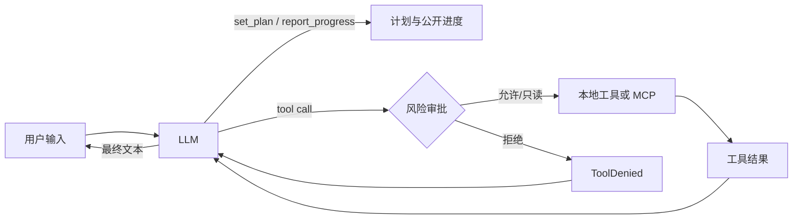

# Lumen

Lumen（拉丁文 *lumen*，意为“光”）是一个轻量、可配置的 Python Agent 框架：模型根据自然语言提示自行选择本地工具或 MCP 工具，读取工具结果后继续运行，直到形成最终回答。项目使用 Pydantic AI 负责多模型与 tool-call loop，使用 Textual 提供全屏 TUI。

Lumen 是框架身份，OpenAI、Anthropic、Google 或任何 OpenAI-compatible 模型只是可替换的推理 provider。Python 包、CLI 命令与本地配置目录统一使用 `lumen` / `.lumen/`。



## 功能

- OpenAI、Anthropic、Google、Ollama 及 OpenAI-compatible 模型。
- YAML 配置模型、提示词、限制、本地插件和多个 MCP 服务。
- stdio 与 Streamable HTTP MCP；工具统一使用 `<server>_<tool>` 名称。
- 内置只读工具 `read_file`、`list_directory`、`search_text`，严格限制在 `--cwd` 工作区内。
- 可选启用的工作区能力工具 `write_file`、`edit_file`、`run_command`，默认需要审批。
- 计划与公开进度：模型在动手前调用 `set_plan`，过程中通过 `report_progress` 输出简短、公开的进度说明。
- **Agent Skills**：扫描 `.lumen/skills/` 和 `~/.lumen/skills/` 发现 `SKILL.md` 技能包，模型自主按需加载或用户手动 `/skill:<name>` 触发（渐进式披露，仅目录常驻 system prompt）。
- 时间线 TUI:lumen-dark 柔和深色主题、**固定顶部 Todo 面板**(执行区独立滚动)、语义化 loading、Lazy 消息渲染、流式 Markdown 节流、工具卡片、固定队列式审批、上下文压缩状态、请求/工具/token/耗时度量。
- 上下文压缩：超过软阈值时由模型生成结构化摘要并保留最近完整轮次，完整 JSONL 历史仍以追加方式持久化。
- 会话恢复：可恢复计划与活动上下文，按用户指令 `/new`、`/resume <id>`、`/retry`。

## 公开进度与私有推理

- `report_progress` 仅承载面向用户的简短说明：发现、改动、错误、恢复与下一步动作。
- 系统提示词明确禁止把私有思维链（chain-of-thought）写入进度。
- 运行时从不读取模型专属的推理字段；进度始终是结构化、经过校验的公开文本。

## 工作区能力工具

- `write_file(path, content, overwrite=False)`：UTF-8 原子写入；默认拒绝覆盖，需显式 `overwrite=True`。
- `edit_file(path, find, replace)`：要求 `find` 在文件中精确出现一次，否则失败。
- `run_command(argv, cwd=".", timeout=None, env=None)`：以 `argv` 数组直接 `exec`，**不经过 shell**；超时或取消时终止整个进程组；stdout/stderr 并发 drain,各自只保留头尾各 64 KiB(中间丢弃但计入总字节数),所以 100 MB 的输出也不会撑爆内存,同时开头和结尾(通常是真正的报错/堆栈)都保留可见。
- 上述工具均受 `--cwd` 工作区约束，禁止 `..` 与符号链接越界。

```yaml
tools:
  builtins:
    - read_file
    - list_directory
    - search_text
    - write_file
    - edit_file
    - run_command
```

命令执行权限模型：**审批不是沙箱**。`run_command` 仍以启动 Lumen 的用户身份运行；不受信的工具应放在容器或沙箱中执行。

## 计划与时间线符号

- `set_plan` 后 TUI 显示计划面板：`✓` 完成、`●` 进行中、`○` 待办、`!` 阻塞。
- 每个工具调用渲染为一张卡片，包含来源（builtin/plugin/mcp/control）、风险等级、耗时，必要时附带内联审批选择器（`→ Allow / Deny`，左右键切换 + Enter 确认，无突兀按钮）。
- provider 的文本增量到达 runtime 后立即发送给 TUI，由 33ms 合并帧增量渲染，不等待整轮或整段回答结束。
- 因为 provider 可能先输出文字、随后才给出工具调用，Lumen 会先显示暂定文本；若同一响应后来调用工具，则通过 `TextRetracted` 将该段原位转为淡色 `CommentaryDelta`，最终答案不会重复。
- 每条回答始终由一个完整 Markdown 文档承载，流式更新不会按段落创建大量 widget；结束时强制最终渲染。

## 内联审批

- 写入、执行与外部工具默认进入审批：模型先调用工具，Lumen 把请求转成时间线卡片上的内联选择器（`→ Allow / Deny`）。
- 左右键(或 h/l)切换选中项,Enter 确认;选择器获得焦点时整个卡片高亮,确认后焦点自动回到输入框。`Esc` 取消运行会把所有待审请求一并置为拒绝。
- `always_allow` / `always_deny` 仍然支持,可让特定工具跳过或永远隐藏。

### 审批模式（manual / accept_edits / auto）

`permissions.default_mode` 控制会话启动时的默认审批策略,可在运行时通过 `Shift+Tab`（推荐）、`/mode`、`Ctrl+M` 或命令面板(`Ctrl+P` → "approval: Switch to …")切换,**不重建 runtime,不重启会话**。

- **`manual`（默认）** —— 任何被权限策略路由到 CONFIRM 的工具都会显示 Allow/Deny 面板。
- **`accept_edits`** —— 仅自动批准工作区内置 `write_file` / `edit_file`；命令、插件与 MCP 写操作仍需确认。
- **`auto`** —— 自动批准已明确分类为 `read` / `write` / `execute` / `external` 的操作。未声明风险的远端能力归类为 `external_unknown`，始终需要确认。

每次从交互界面进入 `auto` 都会显示风险确认；取消后维持原模式。模式切换不会追溯批准已经显示的 pending 请求。MCP 工具默认 risk=`external_unknown`；只有显式声明风险后才可能在 auto 下自动放行。

顶栏和 Footer 会持续显示当前模式；auto 使用醒目的双箭头标记。

```yaml
permissions:
  default_mode: manual   # manual | accept_edits | auto；旧 ask 映射为 manual
  always_allow: []
  always_deny: []
```

## 上下文压缩

```yaml
context:
  enabled: true
  soft_token_limit: 60000        # 超过此估算即触发压缩
  keep_recent_tokens: 20000      # 压缩后保留的最近窗口 token 预算
  summary_tool_result_chars: 2000  # 摘要时每个工具结果的字符上限
  summary_max_tokens: 2000       # 摘要生成本身的 token 预算
```

- 估算使用序列化 UTF-8 长度除以 4（向上取整），与具体 provider 无关。
- 摘要由独立的、无工具 Agent 以严格结构化输出（`ContextSummary`）生成；失败时回退为原始历史，运行照常完成。
- 摘要写入活动上下文作为一条 `SystemPromptPart`，并在会话文件中记录压缩记录；**完整原始历史始终以追加方式持久化**。
- **token 预算切点**（对照 coding-agent 的 `findCutPoint`）：压缩时从最新消息反向累积 token，达到 `keep_recent_tokens` 预算后**向前吸附到安全边界**（用户 prompt 请求的起点），保证工具结果永远不会和它的调用分离。替代了旧的固定轮次计数（6 轮可能 2K 或 60K token，不可控）。
- **每个工具结果独立截断**：序列化给摘要器时，每个工具结果单独截到 `summary_tool_result_chars` 字符，避免单个巨型输出挤掉其他轮次（对照 coding-agent 的 `TOOL_RESULT_MAX_CHARS = 2000`）。
- **迭代式摘要**：多次压缩时，前次摘要作为 `<previous-summary>` 传入，模型保留已有条目、只增量更新，避免长会话的摘要漂移（对照 coding-agent 的 `UPDATE_SUMMARIZATION_PROMPT`）。每次运行结束后从 `outcome.compaction` 提取新摘要，下次运行时传入 `runtime.run(previous_summary=...)`，形成完整的迭代链路。

## 运行限制（usage limits）

每次 run 的 LLM 调用次数和工具调用次数有上限，防失控花费。**默认值**已为多步计划任务校准:

```yaml
agent:
  limits:
    request_count: 50          # 单次 run 最多 50 次 LLM 请求(默认)
    tool_calls: 100            # 最多 100 次工具调用
    tool_timeout_seconds: 60
```

> **没有 `total_tokens` 字段**（已彻底删除）。对照 coding-agent 的设计，context 增长由 `ContextManager` 的自动压缩处理（超过 `soft_token_limit` 时触发摘要），不用累积 token 硬墙中断任务。如果你的 `agent.yaml` 里还有 `total_tokens: ...` 这行，**必须删掉**，否则 `StrictModel` 会因未知字段报错。

> **如果你的复杂任务中途被 "Run stopped at a usage limit" 中断**,把 `agent.yaml` 里的 `request_count` 调高(例如 80 或 100)。8 步计划每步平均 2-3 次请求 = 16-24 次,加反思/重试可能到 40+。

## 运行时健壮性

- **provider 自动重试**：对瞬时错误（429 限流、503 服务不可用、连接重置、超时）自动重试最多 3 次，指数退避（1s → 2s → 4s）。仅在流开始前重试——一旦 token 已流式输出到时间线就不再重试（避免重复内容）。非瞬时错误（usage limit、tool 截断）不重试，直接报错。
- **异常时保留部分输出**：运行中途失败（取消、超时、模型错误）时，已缓冲的流式文本会先 flush 到时间线，再显示错误消息。用户不会再看到"半截答案消失"。
- **`@` 文件补全不阻塞 UI**：`search_files`（含 `fd` 子进程或 `os.walk` 回退）在线程池中执行（`asyncio.to_thread`），不再冻结 TUI。
- **原子写入不留垃圾**：`write_file` / `edit_file` 的临时文件在 `os.replace` 失败或取消时自动清理（`except BaseException` 中 `unlink`），不再累积 `.tmp-*` 孤儿文件。

## 快速开始

要求 Python 3.11–3.13 和 [uv](https://docs.astral.sh/uv/)。

### 1. 安装依赖

```bash
uv sync
```

### 2. 准备配置文件

仓库自带两份配置:

- `agent.example.yaml` —— 脱敏模板,API key 用 `${ENV_VAR}` 占位,适合作为起点。
- `agent.yaml` —— 本地明文配置(已在 `.gitignore`),用于真实运行。

第一次使用,二选一:

```bash
# 方式 A:复制模板,然后填入环境变量(推荐,避免明文 key)
cp agent.example.yaml agent.yaml
export DEEPSEEK_API_KEY="sk-..."
export DASHSCOPE_API_KEY="sk-..."
export TYC_TOKEN="..."
export EXA_API_KEY="..."

# 方式 B:直接用仓库已有的 agent.yaml(明文 key,仅本地)
# 无需任何 export
```

### 3. 启动 TUI(全屏交互界面)

**推荐:在仓库根目录启动**(原因见下面的"工作目录说明"):

```bash
# 最简启动 —— 默认 --config agent.yaml --cwd .
uv run lumen

# 等价显式写法
uv run lumen --config agent.yaml --cwd .

# 启动时直接选定某个模型(覆盖 agent.default_model)
uv run lumen --model glm-5.2
uv run lumen -m qwen3.7-max      # -m 是 --model 的简写
```

启动后进入全屏 TUI:`Enter` 发送,`Shift+Enter` 换行,`Esc` 上下文感知(关闭补全→取消运行→清空输入),`Ctrl+C` 运行中取消/空闲时退出。

#### 键盘交互

| 按键 | 行为 |
|------|------|
| `Enter` | 发送 prompt(或接受补全建议) |
| `Shift+Enter` | 插入换行(多行编辑) |
| `Esc` | **上下文感知**:补全打开→关闭补全;有运行→取消运行;有文本→清空输入;空闲→无操作 |
| `Ctrl+C` | 运行中→取消运行;空闲→退出应用 |
| `Ctrl+P` | 打开命令面板 |
| `Shift+Tab` | 按 manual → accept_edits → auto 循环审批模式 |
| `Ctrl+M` | 切换审批模式(兼容快捷键) |
| `↑` / `↓` | 编辑器首行首列时:浏览 prompt 历史 |
| `Ctrl+↑` / `Ctrl+↓` | 任意位置浏览 prompt 历史(Emacs 风格) |
| `Tab` | 接受补全建议；审批未选择时无动作 |
| `Y` / `N` | 明确允许 / 拒绝待审批工具 |
| `E` | 展开 / 收起已完成工具的完整参数与结果 |
| `End` | 回到最新活动并恢复智能追尾 |

> `@` 和 `/` 均在任意 token 边界(空白后或行首)触发补全,不限于行首。

#### 界面与视觉

- **柔和深色主题(lumen-dark)**:GitHub-dark 标准色板(`#0D1117` 底 + `#58A6FF` primary + `#79C0FF` accent),正文对比度 ≥ 7:1(WCAG AAA),长时间盯不累眼。同时注册了 `lumen-light` 浅色主题,可在代码里 `app.theme = "lumen-light"` 切换。
- **无 Send 按钮**:输入框是唯一的输入入口,聚焦时边框由 primary 升到 accent。`Enter` 直接发送,键盘流不断。
- **启动上下文面板**:首屏直接显示 Agent、当前模型、审批模式、session、工作目录以及 tool/skill/MCP 数量；`/clear` 只清空可见 Timeline 并恢复该面板，不会清除模型会话上下文。
- **消息视觉层次**:用户消息带 `»` 前缀 + accent 左线,助手消息纯 prose 无边框,评论块(commentary)secondary 色斜体降权,进度块带 `↳` 前缀。
- **状态栏三段式**:`[mode·运行态/usage] │ [model] │ [Shift+Tab · / · @ · Ctrl+P]`,删除了无法准确反映 provider 上下文的 `ctx 0%`;模型和审批模式始终可见,auto 模式用醒目色提示。
- **语义化 loading**:运行期间在输入框上方显示动画、耗时与当前动作,例如 `Reading README.md`、`Searching query in src/`、`Writing outputs/report.md`、`Running command uv run pytest`,完成/失败/取消后自动收起。
- **固定审批队列**:审批选择区固定在输入框上方,每次只展示一个请求和纵向 `Allow once`/`Deny` 选项；连续请求自动推进。初始不预选,`Y`/`N` 可直接决定,或 `↑`/`↓` 后按 `Enter` 确认。
- **固定帧流式 Markdown**:每个 token 不再触发一次完整 markdown 重解析；控制器按 33ms 固定帧合并 token，更新严格串行，结束/失败/取消时强制 flush。
- **有限 Timeline 窗口**:结构化 TimelineStore 与 Textual widget 分离，默认最多挂载 200 项（待审批卡片除外）；离开底部后保持阅读位置并显示 `New activity ↓`。

### `@path` 文件补全

输入框里打 `@` 触发文件 mention 补全,下拉框浮在输入框**上方**(绝不遮挡输入),借鉴 [pi/tui](https://github.com/earendil-works/pi/tree/main/packages/tui) 的设计:

- **全树搜索** —— 输入 `@app` 直接找到 `src/lumen/ui/app.py`,不需要逐层 `@src/` → `@src/lumen/` 下降。按文件名评分排序(exact > startswith > contains),top 20 条。
- **尊重 `.gitignore`** —— 优先使用 [`fd`](https://github.com/sharkdp/fd)(若已安装,`brew install fd`)做底层搜索,自动排除 `.venv/`、`node_modules/`、`__pycache__/` 等 gitignored 目录。无 fd 时降级为纯 Python `os.walk`(硬编码排除常见 vendor 目录)。这是正确性的关键 —— 没有它,vendored 依赖的几千个文件会淹没真实结果。
- **scoped 模式** —— 输入 `@src/lumen/ui/` 时自动 scope 到该目录,只列其下文件。
- **目录导航** —— 选中目录(`@src/`)后 insert 文本带尾 `/`,补全继续在子目录触发;选中文件后带尾空格,补全关闭。
- **`.git` 永不出现** —— 双重过滤(walk 时 prune + 结果过滤)。
- **最佳匹配高亮** —— 打 `@rea` 时高亮 `README.md`,不是按字母序的第一个。
- **内容展开** —— 发送时 `@path` 自动展开为 `<file path="...">内容</file>` 块注入 prompt,模型直接拿到内容,省一轮 `read_file` 调用。

### 4. 仅校验配置(不进 TUI,不调用模型)

```bash
uv run lumen --check-config
```

严格校验 YAML、加载插件、连接所有 MCP、列出模型可见的工具(含控制工具与本地能力工具),并显示当前活动模型与全部可选模型;**不会调用真实模型**,所以 API key 即使无效也能跑通(只要格式对)。失败会以非 0 退出码返回。

### 5. 恢复历史会话

```bash
# 列出全部历史 session
uv run lumen --check-config  # 看 sessions 目录路径
ls .lumen/sessions/

# 按 UUID 恢复(从上次结束的地方继续)
uv run lumen --resume <session-uuid>
```

恢复后会重建活动上下文与计划,但不重放历史工具卡片。

### CLI 选项速查

| 选项 | 简写 | 默认 | 说明 |
|------|------|------|------|
| `--config` | `-c` | `agent.yaml` | YAML 配置文件路径(相对路径相对于当前 shell 的 cwd) |
| `--cwd` | — | `.` | 工作区根,builtin 文件工具和 stdio MCP 子进程都以它为基准 |
| `--model` | `-m` | 配置里的 `default_model` | 启动时选定的模型名(必须是 `agent.models` 里的某个 key) |
| `--resume` | — | — | 启动时恢复的 session UUID |
| `--check-config` | — | `false` | 校验配置 + 发现工具后立即退出,不进 TUI |

### 其他启动方式

除了 `uv run lumen`，以下方式等价（都调用同一个 Typer app）：

```bash
# Python 模块入口
uv run python -m lumen.cli --check-config

# Python 内联
uv run python -c "from lumen.cli import app; app(['--check-config'])"

# 构建后用 wheel / sdist 安装(有 console_scripts entry point)
uv build                                                    # 产出 dist/lumen-0.1.0-*.whl
pipx install dist/lumen-0.1.0-py3-none-any.whl         # 然后 lumen ... 直接可用（无需 uv run）
# 或
uv pip install dist/lumen-0.1.0-py3-none-any.whl
# 或(从当前项目直接运行,无需先 build)
uvx --from . lumen --check-config
```

### 工作目录说明(重要)

`--cwd` 同时承担两个角色:

1. **builtin 文件工具的工作区根** —— `read_file` / `write_file` / `run_command` 等只能在这个目录内读写,禁止 `..` 和符号链接越界。
2. **stdio MCP 子进程的启动目录** —— MCP 配置里的相对 `command` / `args` 路径都以它为基准。

如果 stdio MCP 使用相对脚本路径，请让 `--cwd` 指向脚本所在工作区；也可以改用绝对路径或 Streamable HTTP MCP（没有本地路径依赖）。

### 第一次启动的检查清单

```bash
# 1. 确认环境就绪
uv sync

# 2. 配置校验(无 TTY 也能跑,验证 API key 和 MCP 都通)
uv run lumen --check-config
# 期望输出:Configuration OK + JSON 摘要(active_model / available_models / mcp_status 全 ok)

# 3. 进 TUI(必须真实终端)
uv run lumen

# 4. 在 TUI 里发个 "你好" 试试
#    Enter 发送,Shift+Enter 换行
```

### 命令面板(Ctrl+P)

按 **`Ctrl+P`** 打开命令面板 —— 这是 Lumen 借鉴 [posting](https://github.com/darrenburns/posting) 的可发现性设计，用 Textual 原生命令面板实现，内置模糊搜索。比记忆 `/` 命令更直观：

- 输入 `model` → 列出所有可切换的模型(动态反映 `agent.models` 配置)
- 输入 `session` → 新建/列出/恢复会话
- 输入 `tools` → 查看模型可见工具
- 输入 `approval` → 切换 manual / accept_edits / auto 审批模式
- 输入 `quit` → 退出

空 query 时显示 4 个最高频命令作为 discovery hint。`Enter` 执行高亮命令,`Esc` 关闭面板。

### Slash 命令(传统方式,仍保留)

也可以直接在输入框用 `/` 触发(带自动补全):

```text
/help
/clear                   # 清空可见 Timeline,保留当前 session 与模型上下文
/new                     # 新建会话
/model [name]            # 无参数:列出全部模型;有参数:切换活动模型
/mode [manual|accept_edits|auto]  # 无参数:查看当前审批模式;有参数:切换
/sessions                # 列出历史 session
/resume <session-uuid>   # 恢复某个 session
/tools                   # 列出当前可见工具
/skills                  # 列出已发现的 Agent Skills
/skill:<name> [args]     # 手动触发某个 skill
/retry                   # 重发上一条 prompt
/quit                    # 退出
```

> 命令面板和 slash 命令是**同一套命令的两种入口** —— 前者模糊搜索、适合探索;后者精确输入、适合肌肉记忆。两者执行的是同一份 `action_*` 方法,行为完全一致。

Slash 候选使用与输入框近似同宽的双栏布局；`/model` 与 `/mode` 的说明会标出当前值，单条匹配（例如 `/qu`）也保留完整内容行。顶栏在多模型配置下显示 `model <name> [<id>] n/total`,让你随时看到当前用哪个、一共几个可切换。

### 默认文件输出目录

用户没有指定路径时,生成的报告、导出文件和其他交付物默认写入 `outputs/<描述性文件名>`。源码修改仍写回真实项目路径,不会被重定向到 `outputs/`。该约定同时写入基础系统指令和 `write_file` 工具说明,模型在规划与调用工具时都能看到。

## 模型配置

Lumen 支持两种等价的配置形式，**互斥**（同时给会报错）：

### 单模型(向后兼容)

模型 ID 使用 `<provider>:<model>`。API Key 通过环境变量名称引用,不会写入会话文件。

```yaml
agent:
  model:
    id: anthropic:claude-sonnet-4-6
    api_key_env: ANTHROPIC_API_KEY
```

### 多模型(推荐)

在 `models:` 下命名每个模型,用 `default_model:` 选启动时的活动模型:

```yaml
agent:
  default_model: deepseek-v4-pro
  models:
    deepseek-v4-pro:
      id: openai:deepseek-v4-pro
      api_key_env: DEEPSEEK_API_KEY           # 或 api_key: sk-...(明文,仅本地)
      base_url: https://api.deepseek.com/v1
      settings: {max_tokens: 4096}
    glm-5.2:
      id: openai:glm-5.2
      api_key_env: DASHSCOPE_API_KEY
      base_url: https://dashscope.aliyuncs.com/compatible-mode/v1
    qwen3-max:
      id: openai:qwen3-max
      api_key_env: DASHSCOPE_API_KEY
      base_url: https://dashscope.aliyuncs.com/compatible-mode/v1
```

启动后用 `--model <name>` 或 TUI `/model <name>` 实时切换。切换会**重建 AgentRuntime**(Pydantic AI 在构造期绑定模型),MCP 连接、会话历史、计划、工具注册全部保留,只换底层模型实例。

### 内置 provider

| Provider 前缀 | 说明 |
|---------------|------|
| `openai:` | OpenAI 官方,或任意 OpenAI 兼容端点(配合 `base_url`)。 |
| `anthropic:` | Anthropic 官方。 |
| `google:` / `gemini:` | Google AI。 |
| `ollama:` | Ollama 本地服务(走 OpenAI 兼容协议,需配 `base_url`)。 |

### `api` 字段:Chat vs Responses 路径选择

OpenAI 兼容端点有两条等价路径,用 `api` 字段显式选择:

| `api` 值 | 走的端点 | Pydantic AI 模型 | 适用场景 |
|----------|---------|-----------------|---------|
| `chat`(默认) | `/chat/completions` | `OpenAIChatModel` | DeepSeek、阿里云百炼 Chat、绝大多数 OpenAI 兼容服务 |
| `responses` | `/responses` | `OpenAIResponsesModel` | 阿里云百炼 Responses API、OpenAI 官方 Responses |

也接受外部工具(Roo Code 等)用的别名:`openai-completions` → chat,`openai-responses` → responses,`chat-completions` → chat,粘贴现成配置不用改。

**省略 `api` 字段时的默认行为**(向后兼容):
- 配了 `base_url` → chat
- 没配 `base_url`(走官方 OpenAI) → responses

```yaml
agent:
  models:
    deepseek-v4-pro:
      id: openai:deepseek-v4-pro
      base_url: https://api.deepseek.com/v1
      api: chat                # 显式(可省略,有 base_url 默认就是 chat)
    qwen3-max-via-responses:
      id: openai:qwen3-max
      base_url: https://dashscope.aliyuncs.com/compatible-mode/v1
      api: responses           # 走阿里云百炼 Responses API
```

> **关于 Responses API 的 `previous_response_id` 和内置工具**：阿里云 Responses API 支持[服务端会话托管](https://help.aliyun.com/zh/model-studio/compatibility-with-openai-responses-api)和内置工具（`web_search` 等），但 Lumen **自己管理会话历史（JSONL）和工具注册**，两条机制并存会冲突。因此我们走 Responses 路径时**不开** `previous_response_id` 和内置工具 —— 每次请求自带完整历史，Lumen 的 `set_plan` / `report_progress` / 工具审批 / MCP 工具都照常工作。

### DeepSeek / 阿里云百炼示例

两者都是 OpenAI 兼容端点,直接用 `openai:` 前缀 + `base_url` 即可:

- **DeepSeek V4 Pro**:`id: openai:deepseek-v4-pro`,`base_url: https://api.deepseek.com/v1`,`api: chat`([官方文档](https://api-docs.deepseek.com/))。
- **阿里云百炼 GLM-5.2 / Qwen**:`base_url: https://dashscope.aliyuncs.com/compatible-mode/v1`,`api: chat`(默认)或 `api: responses`([Chat Completions 文档](https://help.aliyun.com/zh/model-studio/compatibility-of-openai-with-dashscope) / [Responses API 文档](https://help.aliyun.com/zh/model-studio/compatibility-with-openai-responses-api))。已验证的合法 model id:`glm-5.2`、`qwen3.7-max`、`qwen3-max` 等。

模型必须原生支持 function/tool calling,才能自主使用工具。

### API Key 安全

- 推荐用 `api_key_env: <NAME>` 引用环境变量,key 不会写入会话文件。
- 明文 `api_key: sk-...` 仅建议本地使用,且 `agent.yaml` 应放进 `.gitignore`(本仓库已默认忽略)。
- 切换模型时不同模型可用不同的 key/env,互不影响。

## MCP 配置

本地 stdio 服务由 Lumen 管理子进程生命周期：

```yaml
mcp_servers:
  local-tools:
    transport: stdio
    command: python
    args: [/absolute/path/to/server.py]
    # 用 tool_risks 精确声明每个工具的风险等级。声明为 read 的工具在
    # auto 模式下自动放行;未声明的工具归为 external_unknown,任何模式都
    # 需要确认。
    tool_risks:
      lookup: read
```

> **`read_only_tools` 已弃用。** 旧配置用 `read_only_tools: [add, ...]` 把一组工具标为只读(等价于全部 `read`),仍可工作但会发出弃用警告 —— 请改用上面的 `tool_risks`,它还能声明 `write` / `execute`。任何既不在 `tool_risks` 也不在 `read_only_tools` 里的远端工具,默认是 `external_unknown`,**auto 模式也不会放行**。

远程 Streamable HTTP：

```yaml
mcp_servers:
  weather:
    transport: streamable_http
    url: https://mcp.example.com/mcp
    headers:
      Authorization: Bearer ${WEATHER_TOKEN}
    tool_risks:
      forecast: read
    required: false
```

已内置示例的两个真实 MCP 服务(在 `agent.yaml` / `agent.example.yaml`):

```yaml
mcp_servers:
  tyc-mcp:                              # 天眼查
    transport: streamable_http
    url: https://mcp.tianyancha.com/v1
    headers:
      Authorization: ${TYC_TOKEN}       # 直接写 token 也行
    required: false                     # 远程服务,失败只警告不崩
  exa:                                  # Exa 搜索
    transport: streamable_http
    url: https://mcp.exa.ai/mcp
    headers:
      x-api-key: ${EXA_API_KEY}
    required: false
```

注意 tyc 用 `Authorization: <token>`(无 `Bearer` 前缀),exa 用 `x-api-key`,各自按官方要求设置。两个都是 `required: false`,远程不可达时只会在顶栏打 `error` 标记并加一条警告,不会阻塞启动。

可选 MCP 失败会在顶栏以 `error` 标记并在警告中说明；`required: true` 的服务失败会让启动直接报错。

## Python 工具插件

配置项 `module` 与 `factory` 指向一个无参数工厂：

```python
from lumen.tools import Risk, ToolSpec

def lookup(query: str) -> str:
    """Look up a value."""
    return query

def create_tools() -> list[ToolSpec]:
    return [ToolSpec(lookup, risk=Risk.READ)]
```

函数签名和 docstring 会生成模型看到的 JSON Schema。插件默认应视为受信代码；`risk` 只决定是否需要人机审批，不构成沙箱。

控制工具名（`set_plan`、`update_step`、`report_progress`）被运行时保留，插件或 MCP 服务尝试注册同名工具会在配置检查阶段被拒绝。

权限覆盖使用模型可见的完整工具名称：

```yaml
permissions:
  always_allow: [weather_forecast]
  always_deny: [filesystem_delete_file]
```

`always_deny` 工具不会暴露给模型，未知或冲突的权限名称会使配置检查失败。

## Agent Skills

Agent Skills 是一种**指令包机制**:用 `SKILL.md` 文件封装特定任务的指令(procedure),模型按需加载或用户手动触发。设计遵循 [Agent Skills 开放标准](https://agentskills.io/specification)(Claude Code / Codex CLI / ZCode 共用同一格式),参考了 pi/coding-agent 的 `skills.ts` 实现。

### Skill 不是工具

Skill 是**提示词片段/指令包**,不是可执行能力。运行时只注册两个只读加载工具，用来安全披露 Skill 内容:

1. **渐进式披露**:只有 `{name, description}` 常驻 system prompt(成本低),指令体(body)在触发时才加载
2. **双触发**:模型自主调用 `load_skill(name)` + 用户手动 `/skill:<name>`

Skill 正文引用的相对文件通过 `read_skill_resource(name, path)` 加载。该工具只接受相对路径，并将读取范围限制在已发现 Skill 的目录内；通用 `read_file` 仍严格限制在项目 workspace。

### 目录结构

```
my-skill/
├── SKILL.md          # 必需:YAML frontmatter + markdown 指令体
├── references/       # 可选:按需加载的参考文档
├── scripts/          # 可选:可执行脚本
└── assets/           # 可选:模板、fixture
```

### SKILL.md 格式

```yaml
---
name: commit-message          # 可选;缺省时用目录名。kebab-case, 1-64 字符
description: Write concise…   # 必填;告诉模型何时用。1-1024 字符
disable-model-invocation: false  # 可选;true=仅手动 /skill 触发
---
Markdown 指令体...
```

- `description` 必填 —— 空则该 skill 被丢弃(模型无从判断何时用)
- `disable-model-invocation: true` 让 skill 对模型不可见,只能 `/skill:<name>` 手动触发

### 发现路径

启动时扫描两个目录(项目级覆盖用户级,同名 project 优先):

| 路径 | 作用域 |
|------|--------|
| `<workspace>/.lumen/skills/` | 项目本地(优先级高) |
| `~/.lumen/skills/` | 用户全局 |

可在 `agent.yaml` 中关闭:

```yaml
agent:
  skills_enabled: false   # 省略默认 true
```

### 触发方式

**模型自主**:模型看到 system prompt 中的 `<available_skills>` 目录后,判断任务相关时调用 `load_skill(name)` 加载正文；若正文引用 `reference.md` 等文件，再调用 `read_skill_resource(name, path)`。

**用户手动**:在输入框打 `/skill:<name> [args]`,skill body 被包装为 `<skill>` XML 块作为用户消息发送。带补全自动补全:

```
/skills                  # 列出全部已发现的 skill
/skill:commit-message    # 手动触发 commit-message skill
```

### 示例

```bash
# 创建项目级 skill
mkdir -p .lumen/skills/my-skill
# 编辑 .lumen/skills/my-skill/SKILL.md
```

> Python 生态没有成熟的框架无关 skill 库可直接用(pydantic-ai-skills 硬耦合框架,官方 skills-ref 不生产就绪)。本实现是自建的 ~250 行 loader,遵循开放标准,与项目现有移植模式一致(`file_search.py` 同样从 pi 移植)。

## 会话与安全

- 会话保存在 `.lumen/sessions/<uuid>.jsonl`；新会话使用 schema v4 记录逐事件 Timeline、计划、诊断与压缩信息，v1–v3 仍可只读兼容加载。
- 加载会话时活动上下文以最近一次压缩前缀为起点重建，完整原始历史仍可在 `full_history` 中取得。
- 内置文件工具阻止 `..` 和符号链接越过工作区,读工具(`read_file` / `list_directory` / `search_text`)输出截到 64 KiB;`run_command` 并发 drain stdout/stderr,各自保留头尾各 64 KiB。
- MCP 服务和 Python 插件仍拥有当前用户进程权限。审批用于阻止模型未经同意执行动作，不是操作系统级安全边界；不受信工具应运行在容器或沙箱中。
- 配置文件可启动 MCP 子进程并读取指定环境变量，只应加载可信配置。

## 开发与验证

```bash
uv run ruff format .
uv run ruff format --check .
uv run ruff check .
uv run pyright
uv run pytest
```

自动化测试使用 Pydantic AI `FunctionModel/TestModel`，真实覆盖 stdio 与 Streamable HTTP MCP 发现，不需要外部 API Key。包含端到端：`set_plan → report_progress → read_file → edit_file（审批）→ run_command（审批）→ update_step → 最终 Markdown`，以及“拒绝后恢复”的回退场景。

仓库中的 `pi/` 是保留的 TypeScript 参考实现（包括 `pi/tui/` 差分渲染引擎和 `pi/packages/coding-agent/` 的 skills/slash-command/compaction 等模块），不参与 Python 包构建或运行，作为设计参考。
