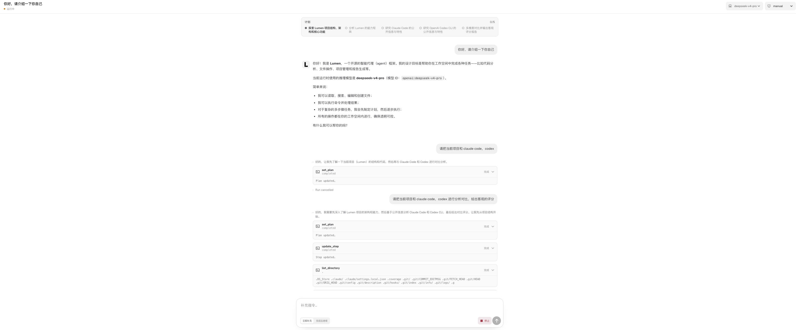
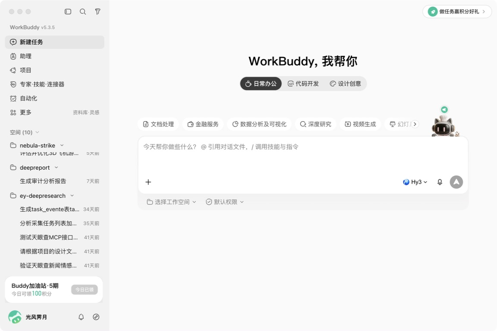
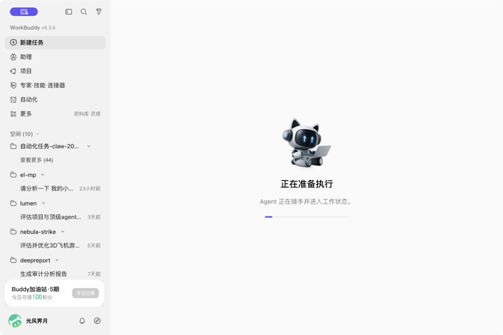
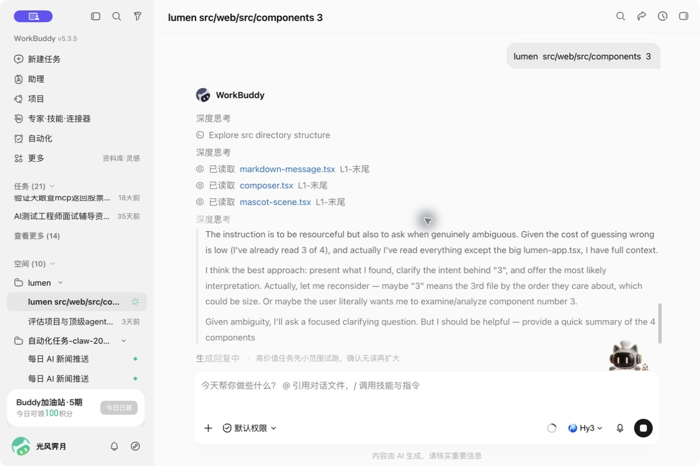
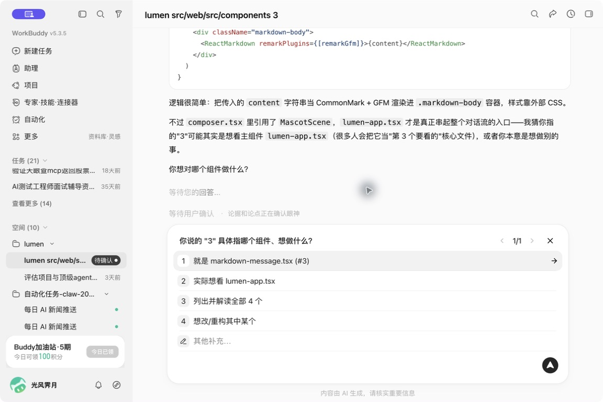
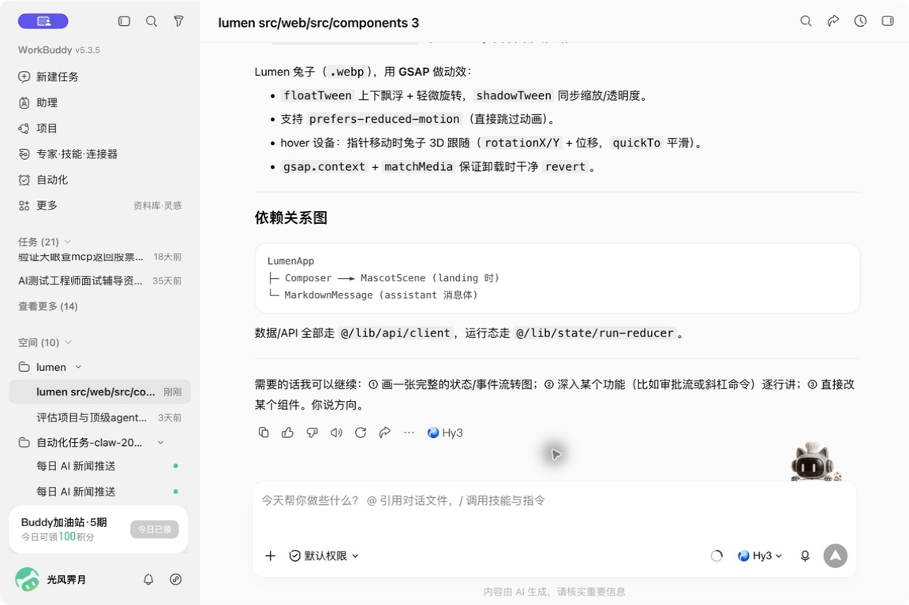
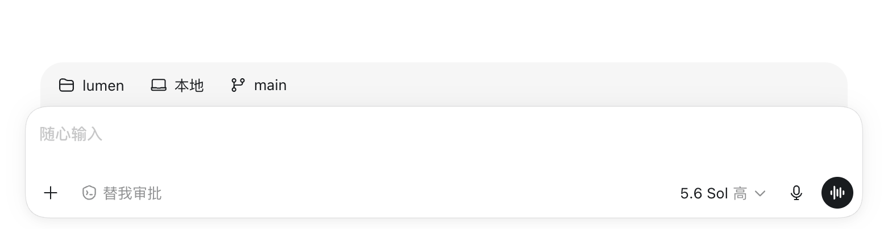
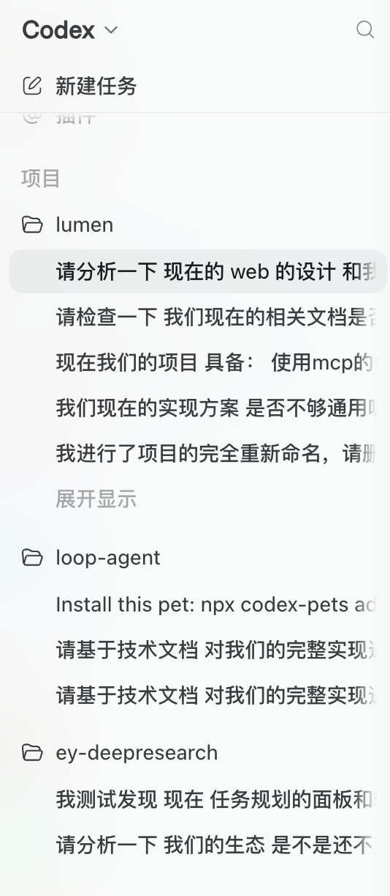
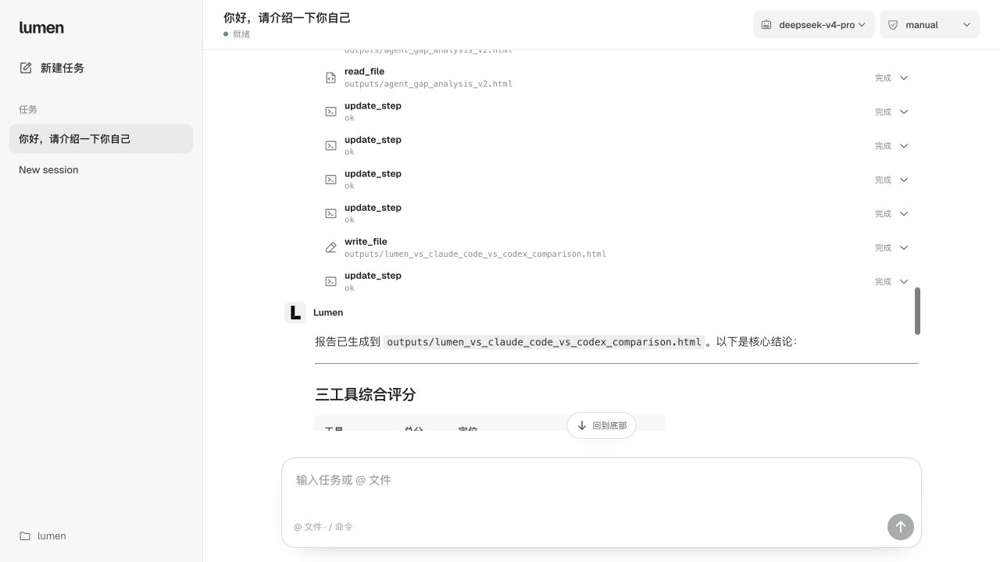
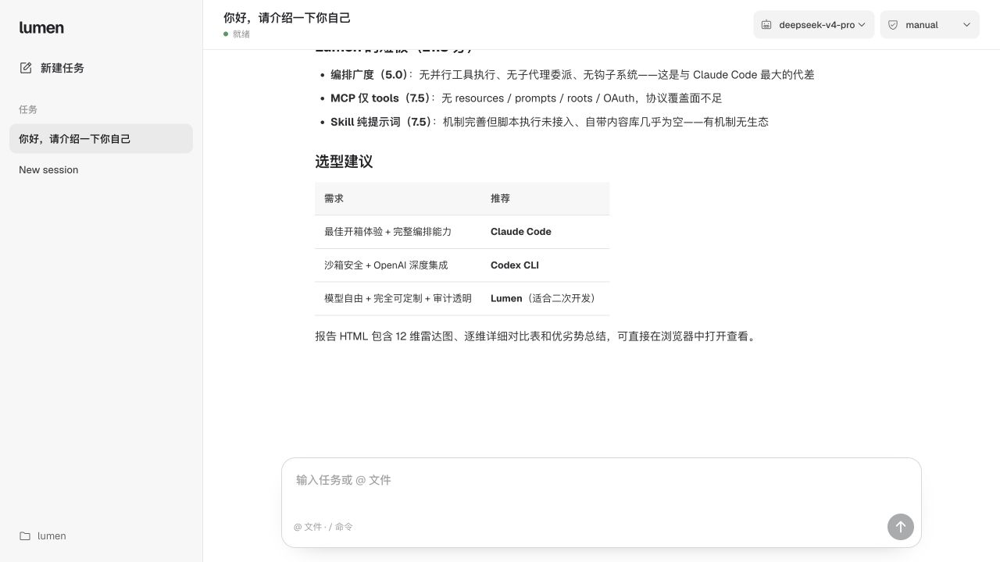

# Lumen Web coding-agent UI audit

Date: 2026-07-27

## Scope

Combined UX and screenshot-based accessibility audit of the Lumen Web conversation surface. The target flow was: open or create a task, observe a live agent run, read tool activity and the final answer, scroll through a long transcript, and continue from the composer.

Comparators were captured from the locally running WorkBuddy app and user-provided Codex screenshots. The Lumen before-state and implementation after-state were captured at the same stage of this work.

## Overall verdict

The original Lumen surface had the right product pieces but treated every event at nearly the same visual weight. At 3148 × 1309, a fixed 780px rail and 13px transcript made the entire run look miniature. Tool results dominated the vertical rhythm, while the final answer and live state were too quiet.

The implemented direction follows the shared pattern found in WorkBuddy and Codex: keep navigation and controls neutral, make the assistant answer the primary reading surface, compress routine tools into one-line events, disclose detail on demand, and keep the composer plus a route back to the latest output available during long runs.

## Captured flow

### 1. Lumen before — needs attention

- Strength: plan, tool, progress, final answer, and composer are all present.
- UX risk: the fixed 780px/13px scale becomes too small on a wide display; the final answer has no stronger visual priority than tool cards.
- Accessibility risk: small tool labels and low-contrast secondary copy can become difficult at normal viewing distance. Screenshot evidence cannot prove zoom reflow or screen-reader behavior.

### 2. WorkBuddy task entry — healthy

- Strength: the first action is obvious, the composer is the visual anchor, and secondary controls stay inside the composer.
- Opportunity for Lumen: keep the centered new-task state, but retain Lumen's coding-specific `@file`, slash commands, model, and permission controls.

### 3. WorkBuddy live preparation — mixed

- Strength: ownership and state are unmistakable.
- UX risk: replacing the entire transcript with a preparation screen delays continuity. Lumen should show a compact live status while preserving the submitted prompt and incoming events.

### 4. WorkBuddy live tools and reasoning — healthy

- Strength: routine reads are single-line events, the active reasoning block uses a subtle left rule, and the stop action remains in the composer.
- Opportunity for Lumen: collapse completed, non-error tools by default; reserve bordered cards for running, failed, or approval-sensitive operations.

### 5. WorkBuddy interactive clarification — healthy, not yet protocol-equivalent

- Strength: the question is inline, choices are easy to scan, and the composer is temporarily repurposed without losing context.
- Gap: Lumen's current Web event contract exposes queued `steer` and `follow_up` text, but not a structured choice event equivalent to this screen. This needs a protocol addition before it can be implemented faithfully.

### 6. WorkBuddy completed output — healthy

- Strength: completion becomes a readable document, routine actions disappear from the foreground, and the composer remains available at the bottom.
- Opportunity for Lumen: preserve Markdown semantics, stronger headings, tables, code, and a clear assistant identity without turning every response into a card.

### 7. Codex composer and sidebar — healthy

- Strength: model, permission, project, and branch controls are compact; sidebar selection is neutral; no decorative accent competes with the task.
- Opportunity for Lumen: retain the existing neutral palette and avoid adding mode descriptions, selection outlines, or decorative purple states.

### 8. Lumen after — improved

- Completed read/list/update tools now render as one-line disclosure rows.
- Running, error, and approval states retain stronger containers.
- Assistant output uses a named Lumen header, larger adaptive type, clearer Markdown hierarchy, and a constrained reading measure.
- The content rail adapts from 820px to 1040px instead of staying fixed at 780px.
- The composer stays at the bottom for history; the new-task composer remains centered.
- Manual upward scrolling pauses auto-follow and reveals a tested “回到底部” control. Clicking it returns to the latest output and hides the control.
- Running state now appears directly above the composer, next to queue and stop behavior.

## Highest-impact recommendations

1. Keep the newly implemented two-tier tool treatment. Routine successful tools should remain compact; approvals, active work, and failures should be prominent.
2. Add a structured `interaction.requested` / `interaction.resolved` event to the Web protocol before implementing WorkBuddy-style selectable clarification cards.
3. Add duration metadata to run snapshots/events if Lumen should show WorkBuddy-like “已完成 4m28s” history labels without client-side guessing.
4. Test keyboard order, screen-reader announcements, 200% zoom, and reduced motion separately; screenshots only establish visual risk, not conformance.

## Evidence limits

- Codex Desktop could not be controlled directly by Computer Use, so the Codex comparison uses screenshots explicitly supplied by the user.
- WorkBuddy was inspected live with a user-authorized read-only question against the `lumen` workspace. No files were modified by that task.
- This audit does not claim full WCAG compliance; semantic DOM snapshots, visual focus behavior, and responsive layout were checked, but assistive-technology testing was not performed.
