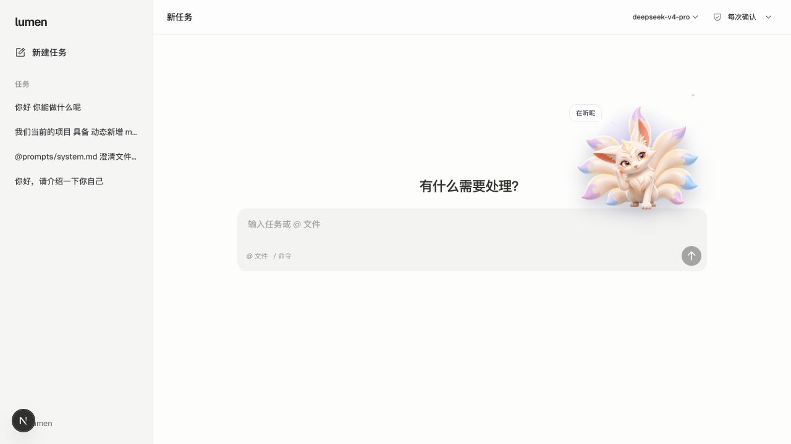
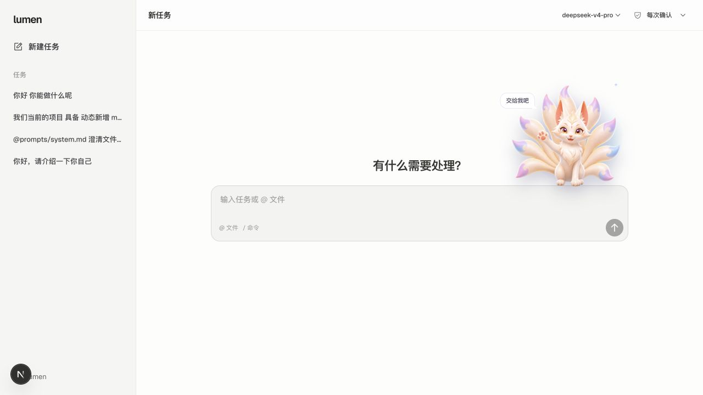
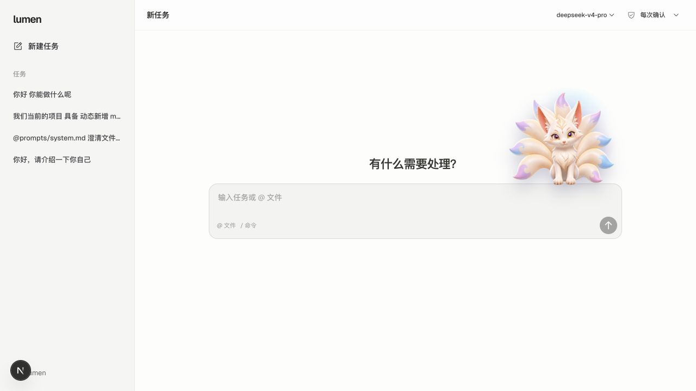
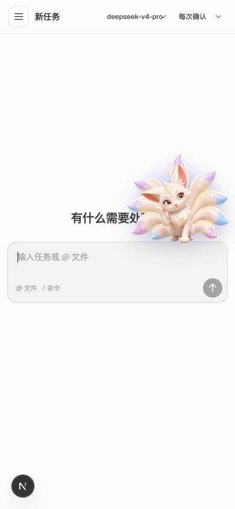
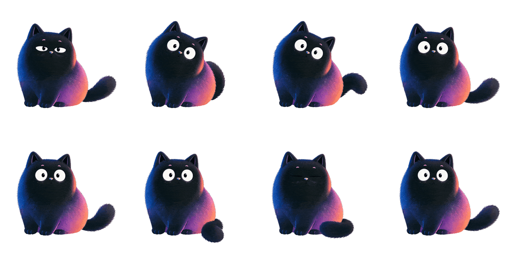
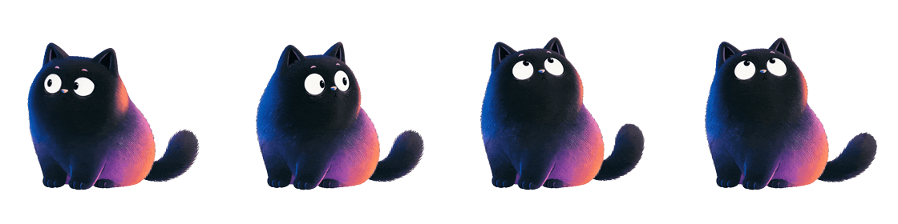

# Lumen Web UI 与动态角色审计

日期：2026-08-02

## 审计范围

本次为桌面端与移动端的组合 UX / 视觉 / 动效 / 截图可访问性审计。核心任务是：用户打开新任务页，理解主操作，关注但不被角色打扰，聚焦输入框并开始任务。

对比对象为 Lumen 当前实现、Meoo 公开生产页面与角色素材，以及 Web 端 2D rig、预渲染动画、Live2D、Rive、glTF + Three.js / R3F 等实现路线。完整技术研究见 `docs/research/web-3d-character-benchmark.md`。

## 总体结论

Lumen 的 UI 主体已经是成熟、克制的 coding-agent 布局；问题主要集中在空白页角色。当前角色不是实时 3D，而是四张 PNG 经 Canvas 规则网格形变，再叠加 GSAP 整体旋转、缩放、光环和粒子形成 2.5D 效果。

桌面角色盒为 218px，约占 760px composer 的 28.7%；移动端为 190px，约占 366px composer 的 51.9%。桌面端视觉偏重，移动端已经遮挡标题。动效“不自然”主要来自硬切姿势、整图呼吸、整平面跟随鼠标、固定频率大动作和常驻装饰同时运行。

推荐顺序：先缩小和做动效减法，再把角色升级为 Rive 状态机；只有真实多角度、动态灯光或大场景复用成为明确产品需求时，才上 glTF + Three/R3F。

## 捕捉流程

### 1. 桌面端空白页 / idle — 一般

- 优点：新任务标题、主提示和 composer 居中，界面干净；角色只出现在空白页，不干扰长对话；角色脚部与 composer 建立了关系。
- UX 风险：角色与光环形成的视觉面积过大，右侧比左侧重，角色与“有什么需要处理？”争夺首要注意力。
- 视觉风险：角色是高细节、九尾、发光材质，而产品 chrome 是近黑白极简风；色彩和信息密度没有共同节奏。
- 建议：桌面角色先测 168px；移除常驻 sparkle，aura 改为静态柔光；默认不显示气泡。

### 2. 输入框聚焦 / wave — 一般

- 优点：角色对输入聚焦有响应，能强化“正在听”的人格感。
- UX 风险：每次 focus 都触发完整 wave 与气泡，反馈强度高于实际动作的重要性；反复点击输入框会显得机械。
- 动效风险：完整角色图在约 0.135 秒处切换，轮廓、四肢和重心没有中间姿态；10% 的纵向 squash 只能遮掩跳变，不能产生连续运动。
- 建议：focus 只做眼睛向输入区移动、耳朵轻动或 1–2px 头部下沉；wave 留给首次进入或明确提交成功。

### 3. 指针跟随与自动姿势 — 一般

- 优点：GSAP quickTo 让跟随响应有缓动，离开后能回中。
- 动效风险：整张平面做 rotationX / rotationY，边缘透视会暴露“纸片”属性；指针横向位置还被用于尾巴形变，而不是眼睛和头部视线。
- 节奏风险：alert、stretch、wave 等大动作约每 1–2 秒出现，整个固定循环约 9.85 秒，很快就能被用户识别为机械循环。
- 实现风险：`switchPose` 的 `killTweensOf(character)` 会在首次切姿后杀掉同一元素上的常驻 `breathTween`，导致开场前后微动不一致。
- 建议：拆分 pointer、breath、pose 三层 transform；大动作改为 8–18 秒随机调度；眼睛先跟、头部后跟、身体几乎不跟。

### 4. 390×844 移动端 — 需要立即处理

- 主要问题：190px 角色约占 composer 宽度 51.9%，并遮挡主标题，影响任务入口可读性。
- 结构问题：角色绝对定位在 composer 上方，没有为移动端建立独立安全区域；单纯等比例缩小不足以保证不同语言、字体放大和窄屏布局。
- 可访问性风险：截图已经确认文本被装饰内容遮挡；仍需另外测试 200% zoom、系统字体放大、键盘顺序与屏幕阅读器。
- 建议：移动端使用 116–128px，并给角色独立的 landing slot；标题和角色不能共享重叠区域。

## Meoo 对比

### idle 逐秒采样

### hover 逐秒采样

Meoo 公开生产实现使用两个绝对定位的 `img`：idle 为 560×560、8.08 秒、97 帧；hover 为 800×800、4.08 秒、49 帧；两者都约 12fps，通过 hover 状态切换透明度。默认组件尺寸 130px，另有 160px 变体。

Meoo 值得借鉴的不是 GIF 格式，而是以下动效设计：

1. 角色轮廓小，输入仍然是第一主角。
2. 脚和躯干的重心稳定，尾巴、视线、眨眼承担生命感。
3. 8 秒 idle 有足够停顿和不对称节奏，不会每两秒表演一次。
4. 只有 idle / hover 两个主要状态，动作语义清楚。

Lumen 不应照搬 GIF：Meoo 两段素材合计约 3.9MB。更现代的路线是 Rive 状态机，或带 poster 与按需加载的预渲染 Animated WebP / alpha video。

## UI 优化方向

### 信息层级

- 主标题和 composer 始终保持第一、第二视觉层级；角色是第三层级。
- 桌面端角色右侧悬停可以保留，但视觉轮廓目标为 145–157px。
- 移动端不再悬浮压住标题，改为“角色 → 标题 → composer”的明确纵向关系，或在 600px 以下隐藏角色大动作。
- 气泡只在首次出现、用户点击角色或重要事件时显示；避免自动文案循环。

### 视觉语言

- 保留狐狸的奶白、粉紫、浅蓝品牌色，但降低 aura 和 drop-shadow 的饱和度与面积。
- 九尾轮廓本身已经复杂，不再叠加常驻星粒和旋转光环。
- 阴影只表达脚与 composer 的接触，不跟随所有全身形变做大幅呼吸。

## 推荐技术方案

### P0：现有实现减法与修复

- 桌面宽 168px；移动宽 116–128px。
- 停用全身规则 mesh warp，或至少只作用于独立尾部图层。
- 用独立 wrapper 拆开 pointer-follow、idle-breath、pose-transition，避免 tween 相互误杀。
- 自动大动作改为 8–18 秒随机出现；眨眼 3–7 秒随机；大动作后至少停 1.5–3 秒。
- 姿势切换使用 0.25–0.45 秒 crossfade；删除 10% 全身纵向 squash。
- 去除常驻粒子；首屏 poster 固定尺寸，后台与离屏完全暂停。

### P1：Rive 状态机（推荐主线）

把狐狸拆为头、耳、眼睑、瞳孔、胸肩、身体、前爪、尾巴和阴影。状态机分开管理：

- base idle
- breath
- blink
- look target
- one-shot：alert / wave / stretch
- emotion：neutral / thinking / success / error

Rive 比真 3D 更适合当前插画品牌：能平滑混合独立运动通道，也能在 settled、后台、离屏或 reduced motion 时停止推进。

### P2：glTF + Three.js / R3F（条件式选择）

仅在至少两项成立时投入：需要真实转身、动态灯光/材质、多角度镜头、3D 场景复用、运行时组合大量道具或动作。届时采用骨骼 clips、眼睑/嘴型 morph targets、AnimationMixer crossfade、窄 FOV 或正交相机、KTX2/Draco/Meshopt 与自适应 DPR。

WebGPU 不是当前升级理由；自然度瓶颈在角色 rig、动作层级和节奏，而不在渲染 API。

## 验收目标

- 桌面角色视觉轮廓缩小约 19–27%；移动端不超过 composer 宽度约 35%。
- 390×844、768×1024、1207×516、1440×900、2560×1440 均不遮挡标题、输入、错误或发送状态。
- `prefers-reduced-motion: reduce` 下无自动换姿、mesh warp、pointer parallax 和常驻粒子。
- 提供“暂停/关闭角色动画”，并持久化偏好。
- 首屏先显示 poster，角色不阻塞 LCP；初始关键资源建议小于 2MB。
- 桌面主流设备 p75 至少 55fps，中端移动设备至少 45fps；离屏、后台完全暂停。

## 证据限制

- Meoo 完整交互页在本次浏览器自动化中加载超时，因此没有将整页截图作为对比证据；其实现、尺寸和素材结论来自同日公开生产 HTML、bundle 与 CDN 动画资源。
- 截图不能证明完整 WCAG 合规；需要继续做 200% zoom、动态偏好切换、键盘、屏幕阅读器和性能录制。
