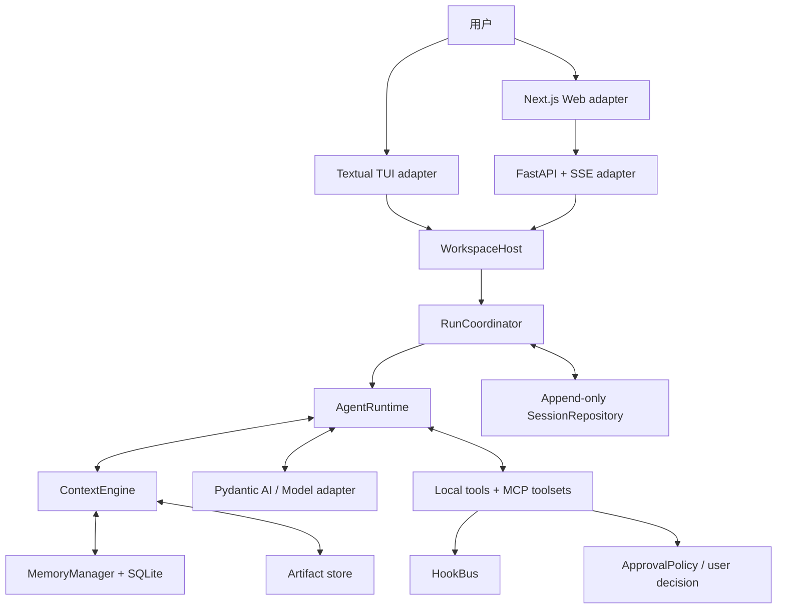

# 1. 系统全景与设计原则

## 1.1 分层结构

系统可以理解为六层：

| 层 | 主要职责 | 关键源码 |
|---|---|---|
| 交互层 | 输入、展示、审批交互、断线重连 | `ui/`、`web/`、`api/app.py` |
| 应用层 | 命令分派、workspace 并发规则、run 生命周期 | `application/host.py` |
| 会话层 | 恢复、交互队列、turn 持久化 | `run_coordinator.py`、`sessions.py` |
| Agent 层 | 模型调用、工具循环、流式输出、重试 | `runtime.py` |
| 上下文层 | token 预算、压缩、记忆、artifact | `context/` |
| 能力层 | 本地工具、MCP、Skill、Hook、子 Agent | `tools/`、`mcp_*`、`skills.py`、`delegation.py` |

## 1.2 最重要的 deep modules

### WorkspaceHost

`WorkspaceHost.dispatch(command)` 是 TUI 与 Web 共享的外部 seam。调用者只需要知道命令模型和返回模型，不需要理解 runtime、会话恢复或审批 future 如何协调。

它隐藏的复杂度包括：

- 每个 session 对应一个 `_SessionActor`；
- workspace 级单 run 互斥；
- `client_request_id` 幂等；
- run 事件 journal 与订阅；
- pending approval 的创建、决策与取消清理；
- model 切换和 context 控制命令。

### AgentRuntime

`AgentRuntime.run(...) -> RunOutcome` 是执行 seam。它将 Pydantic AI 的底层事件翻译为稳定的 Lumen `RunEvent`，并统一处理：

- planning/progress 控制工具；
- context prepare/commit；
- provider 重试；
- 流式文本与 commentary 回撤；
- 并行工具调度；
- deferred approval；
- 部分失败结果保存。

### ContextEngine

`prepare`、`commit`、`control` 构成上下文 seam。调用者无需知道 token counter、压缩器、checkpoint 或 memory repository 的内部结构。

## 1.3 核心设计原则

1. **完整事实与活动上下文分离**：JSONL 永远追加；模型只接收预算内的 active history。
2. **客户端不拥有 Agent 状态**：TUI/Web 都是 adapter，权威状态在 `WorkspaceHost` 和 `RunCoordinator`。
3. **公开事件不包含私有推理**：进度是结构化工具输出，不读取 provider reasoning 字段。
4. **权限不是沙箱**：审批决定“允不允许”，workspace confinement 决定“能访问哪里”；操作系统隔离仍需外部 sandbox。
5. **远端能力默认不可信**：未分类 MCP 工具使用 `external_unknown`，即使 auto 模式也要确认。
6. **失败也要形成可审计结果**：取消、模型失败、超时会携带 partial outcome，而不是丢弃已发生事实。

## 1.4 依赖方向

上层可以依赖下层 interface，但 UI 不应直接操作 `AgentRuntime` 内部状态。新的客户端应接入 `WorkspaceHost`；新的上下文来源应接入 `ContextEngine`/`ContextAssembler`；新的工具来源应接入 `ToolRegistry` 或 MCP toolset seam。
