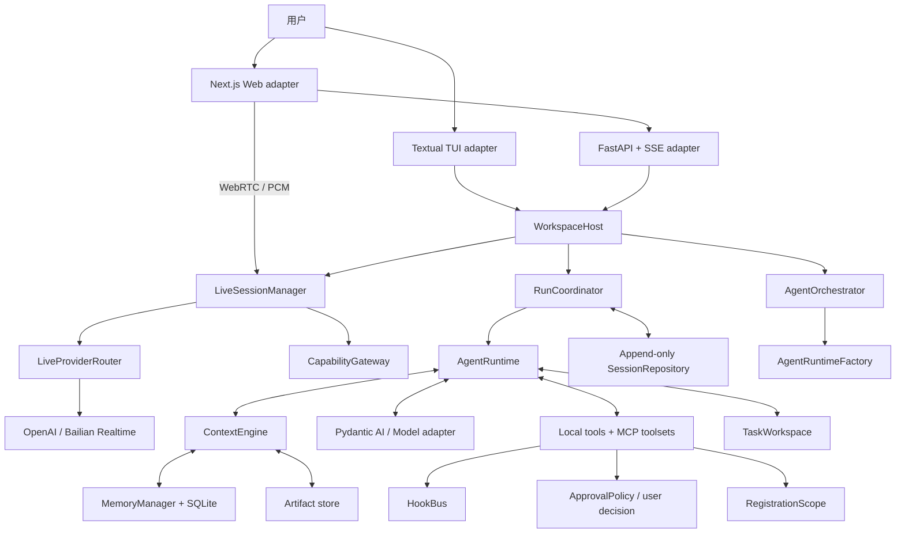

# 1. 系统全景与设计原则

## 1.1 分层结构

系统可以理解为六层：

| 层 | 主要职责 | 关键源码 |
|---|---|---|
| 交互层 | 输入、展示、审批交互、SSE/WebRTC 断线重连 | `ui/`、`web/`、`api/app.py` |
| 应用层 | 命令分派、workspace 并发规则、run 生命周期 | `application/host.py` |
| 会话层 | 恢复、交互队列、turn 持久化 | `run_coordinator.py`、`sessions.py` |
| Agent 层 | 模型调用、工具循环、流式输出、重试 | `runtime.py` |
| 上下文层 | token 预算、压缩、记忆、artifact | `context/` |
| 能力层 | 本地工具、MCP、Skill、Hook、子 Agent | `tools/`、`mcp_*`、`skills.py`、`agents/` |

## 1.2 最重要的 deep modules

### WorkspaceHost

`WorkspaceHost.dispatch(command)` 是 TUI 与 Web 共享的外部 seam。调用者只需要知道命令模型和返回模型，不需要理解 runtime、会话恢复或审批 future 如何协调。

它隐藏的复杂度包括：

- 每个 session 对应一个 `_SessionActor`；
- workspace 级单 run 互斥；
- `client_request_id` 幂等；
- run 事件 journal 与订阅；
- pending approval 的创建、决策与取消清理；
- model 切换和 context 控制命令。

### AgentRuntime

`AgentRuntime.run(...) -> RunOutcome` 是执行 seam。它将 Pydantic AI 的底层事件翻译为稳定的 Lumen `RunEvent`，并统一处理：

- planning/progress 控制工具；
- context prepare/commit；
- provider 重试；
- 流式文本与 commentary 回撤；
- 并行工具调度；
- deferred approval；
- 部分失败结果保存。

### ContextEngine

`prepare`、`commit`、`control` 构成上下文 seam。调用者无需知道 token counter、压缩器、checkpoint 或 memory repository 的内部结构。

### TaskWorkspace 与 AgentOrchestrator

`TaskWorkspace` 是 Work Product、effect journal、局部 mutation、验证和恢复的唯一权威。工具只声明 effect；是否已经 verified、是否允许 completion 由该 Module 判断。

`AgentOrchestrator` 是 Agent Thread 生命周期的唯一权威。它拥有 spawn 幂等、调度、消息、恢复、结果送达、import/reject 与 completion issues；`AgentRuntimeFactory` 只负责创建权限收窄的 child runtime 和管理 worktree 结果。模型工具与旧 Child Run 命令都是投影到该权威的 Adapter。

### LiveSessionManager 与 CapabilityGateway

`LiveSessionManager` 是 Workspace 级实时语音 deep module；它拥有 call 生命周期、事件 journal、转写持久化、工具串行化、安全恢复和主动 rollover。`LiveProviderRouter` 在建连前按 capability 选择并冻结 Route；OpenAI、百炼的 SDP/WebSocket、事件和 function-call 结构分别止于 Provider Adapter。

`CapabilityGateway` 是 Live 等替代 transport 的能力执行 seam：它投影文字 runtime 所用的同一份 `ToolRegistry`、权限策略、EffectKind recorder 与已连接 MCP toolset，执行时统一应用参数校验、Risk 审批、单调 `ToolGuard`、receipt、timeout 和 provider-call 幂等。canonical JSON 结果、模型文本和客户端展示意图分别生成，语音模型不会获得绕过 Host 的第二套能力策略。

### RegistrationScope 与契约目录

`RegistrationScope` 只拥有可逆注册和后台 task 的生命周期，不保存 Session、Plan、Agent 或 Work Product 状态。Tool、Hook、MCP、Capability 的注册返回 disposer；ResourceManager 重开或切换模型时按 LIFO 释放旧注册，避免 schema、listener 与 toolset 累积。

`docs/generated/contracts.json` 是从运行时 Pydantic/枚举权威确定性生成的导航投影，覆盖配置、Workspace command/result、RunEvent、Tool Contract V2、Session 版本与关键不变量。它帮助 CI 检查漂移，但不成为另一份可执行 schema。

## 1.3 核心设计原则

1. **完整事实与活动上下文分离**：JSONL 永远追加；模型只接收预算内的 active history。
2. **客户端不拥有 Agent 状态**：TUI/Web 都是 adapter，权威状态在 `WorkspaceHost` 和 `RunCoordinator`。
3. **进度与推理分轨**：`report_progress` 是模型主动提交的结构化公开说明；provider 的 reasoning/thinking 只投影为展示用 `ThinkingDelta`，不进入最终答案、不参与文字回撤，也不成为新的状态权威。
4. **权限、Effect 与并发分轴**：`Risk` 决定审批，`EffectKind` 决定状态追踪与验证，`ToolConcurrency` 决定调用能否重叠；workspace confinement 和 OS sandbox 决定“实际能访问哪里”。默认 `workspace_write` 使用 Seatbelt/bubblewrap，adapter 缺失时 fail closed。
5. **远端能力默认不可信**：未分类 MCP 工具使用 `external_unknown`，即使 auto 模式也要确认。
6. **失败也要形成可审计结果**：取消、模型失败、超时会携带 partial outcome，而不是丢弃已发生事实。
7. **媒体可替换、控制留在 Host**：可信 sideband 存在时可 direct WebRTC；否则音频经 Host PCM relay。API Key、工具、审批、完成门禁和 durable state 永不下放浏览器。

## 1.4 依赖方向

上层可以依赖下层 Interface，但 UI 不应直接操作 `AgentRuntime`、`TaskWorkspace` 或 `AgentOrchestrator` 内部状态。新的客户端应接入 `WorkspaceHost`；新的上下文来源应接入 `ContextEngine`/`ContextAssembler`；新的工具来源应接入 `ToolRegistry` 或 MCP toolset seam；新的 mutation 与验证语义应进入 `TaskWorkspace`。
