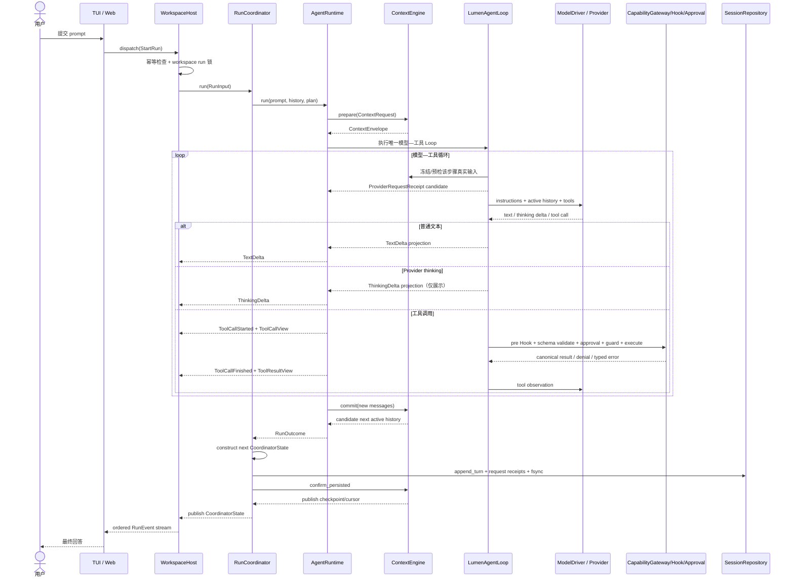
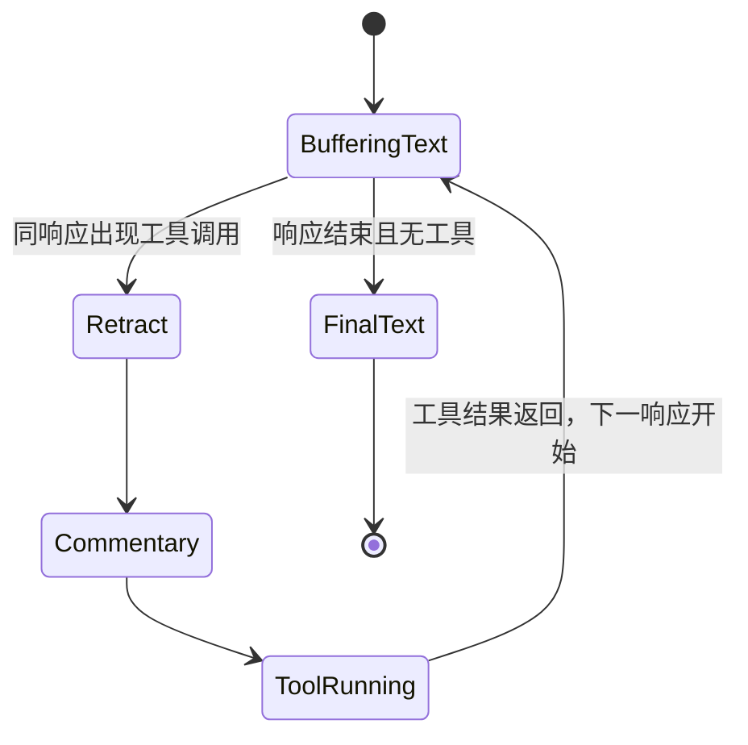

# 2. 完整 Agent 运行流程

## 2.1 从 prompt 到 RunOutcome

## 2.2 应用层启动

`WorkspaceHost._start_run` 做四件事：

1. 验证 session 存在；
2. 用 `(session_id, client_request_id)` 实现重复请求幂等；
3. 用 OS advisory lock 拒绝 workspace 中第二个本地 writer，但不阻止只读 Session 投影；
4. 取得锁后重新加载可能由另一 Host 更新过的 Session，避免从陈旧 actor 状态继续；
5. 建立 `_RunRecord`、`EventJournal` 和后台 task，并在 terminal/cancel 后释放锁。

真正执行发生在 `_execute`。它把 runtime 事件同时写入 journal，并负责把审批请求转成可等待的 future。这样 SSE 订阅者可以断线重连，TUI 也可以直接消费同一类事件。

## 2.3 Coordinator 的职责

`RunCoordinator` 保存当前 session 的：

- active history；
- plan；
- compaction checkpoint；
- 最近用户输入；
- 当前等待/恢复边界。

完整 raw/full history 的权威属于 `SessionRepository`；interactive queue 属于 `AgentRuntime`。Coordinator 不复制这两套状态，也不实现模型循环。它只把 active 投影交给 runtime，收到 `RunOutcome` 后先构造候选状态，再追加并 `fsync` turn；持久化成功后才让 ContextEngine 发布 checkpoint，最后替换内存状态。失败时读取 runtime 附着的 `PartialRunOutcome`，仍然持久化审批、usage、diagnostic、部分文本、已产生的 clarification 和已经发生的 provider request receipts。

## 2.4 Runtime 内的一轮模型响应

`AgentRuntime` 对上保持 `run(...) -> RunOutcome` Interface，内部只委托唯一的
`LumenAgentLoop`。Loop 通过低层 `PydanticAIModelDriver` 读取完整 provider stream，并只经
`CapabilityGateway` 执行工具。主模型—工具路径不再构造或调用 PydanticAI `Agent` graph；Session、
Context、审批和 Effect 因此都没有第二套运行时权威。Context 摘要与 Memory 提取仍可使用无工具、
严格结构化输出的 PydanticAI `Agent` 作为辅助 Adapter，它们不拥有 turn 调度或工具循环。

`agent.limits.model_stream_idle_timeout_seconds` 默认 300 秒，以流数据刷新空闲等待；
OpenAI/Anthropic 的 HTTP read timeout 包含 SSE 心跳，其他 Driver 在标准事件读取时计时。
`model_request_timeout_seconds` 默认 `null`，仅显式配置时限制含重试的单请求总时长，
到期抛出独立的 `LoopRequestTimeout`，不再误报用量耗尽。工具执行和审批不计入模型空闲时限。
请求数和工具数默认无硬上限，显式预算与完成门禁继续有效。

模型可能先输出文字，随后才决定调用工具。Lumen 不能提前知道这些文字是最终答案还是工具前 commentary，因此采用推测式渲染：

对应事件是 `TextDelta` → 必要时 `TextRetracted` + `CommentaryDelta`。UI 因此既能即时显示 token，又不会在最终答案中重复工具前说明。

Provider 原生 reasoning/thinking 使用独立的 `ThinkingDelta`。它不进入推测式文本 buffer，因此不会在出现工具调用时被回撤，也不会拼入最终回答；Timeline 只把连续增量合并成可折叠的展示块。

`TaskController.set_plan` 修订同一目标时保留 ID、定义与依赖均未变化的步骤状态、备注和 evidence；
定义或前置步骤变化时重置受影响步骤，新目标则建立新计划。结构变更仍使审批 revision 失效。
进度通过 `update_step` 逐项更新并立即发布 `PlanUpdated`，不得依赖客户端猜测完成状态。
普通模式下，本轮创建/更新的计划若仍有 pending/in_progress 步骤，`CompletionGate` 会要求模型先
完成、阻塞或合理跳过这些步骤，再生成最终回答。未被本轮触及的旧计划不阻碍独立问答；Plan 模式
仍保留全 pending 的待审批计划，已审批执行仍遵循原有 evidence 与验证门禁。

## 2.5 工具循环与限制

- `request_count` 可选限制单次 run 的逻辑模型请求数；transport 重试独立记录 `model_attempts`；
- `tool_calls` 可选限制交付到工具执行的调用数，在整个批次执行前检查；
- `parallel_tool_calls` 决定 runtime 是否启用并行调度；每个 invocation 仍由 `ToolConcurrency.EXCLUSIVE/PARALLEL_SAFE` 做最终分类，未声明时安全回退为 exclusive；
- ContextEngine.prepare_step 在同一 run 的完成步骤之间执行滚动压缩；最新 checkpoint 覆盖当前 turn 的消息前缀，持久化后才发布，Session 重载按 source_end 跳过已覆盖前缀而保留完整 raw history；
- transient Provider 错误默认最多重试 5 次，指数退避、抖动与 Retry-After 由 Loop 统一处理。撤回当前候选文字后重试同一请求，完整工具批次只执行一次；Provider 内置工具活动禁止自动重放。OpenAI/Anthropic SDK retries 为零；
- Provider context overflow 触发一次强制压缩，只有消息投影发生变化才重试；
- 失败/取消 turn 的 completed_model_steps 标记仅携带完整模型/工具批次，Coordinator 追加成功后发布，Session resume 恢复这些批次及原有 effect receipts。

## 2.6 终止路径

| 路径 | 公开事件 | 持久化结果 |
|---|---|---|
| 正常结束 | `RunCompleted` | 完整 outcome、messages、usage、plan、request receipts |
| 阻塞澄清 | `RunWaitingForUser` | messages、pending question、`waiting_for_user` turn |
| 用户取消 | `RunCancelled` | partial text、已发生工具与审批、已发生请求回执 |
| provider/代码失败 | `RunFailed` | error、diagnostics、可重试标志、已发生请求回执 |
| 用量达到上限 | `RunFailed` | 友好限制说明与 partial outcome |

`AgentRuntime` 先验证 exact response、构造 canonical messages 并提交 Context candidate；
`RunCoordinator` 缓冲 terminal event，将同一 terminal 写入 append-only turn 并 `fsync`，确认 Context
cursor/checkpoint 后才向 Host 发布。持久化失败只发布 `RunFailed`，不会出现
`RunCompleted → RunFailed` 或未持久化的 waiting 状态。拒答、内容过滤、error、unknown finish reason
均 fail closed；只有 `TOOL_CALL` 终止原因可以进入工具执行。
