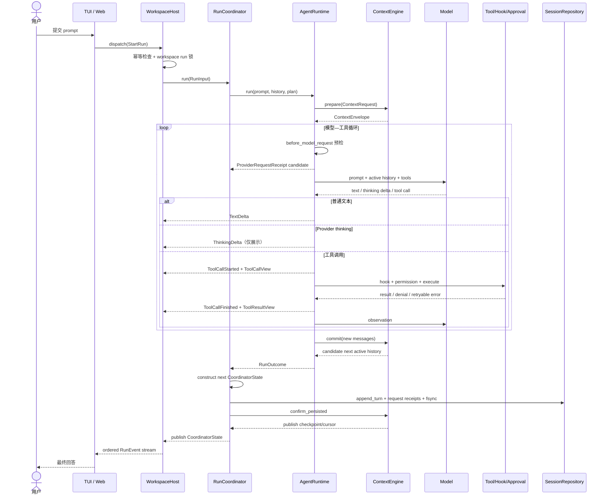
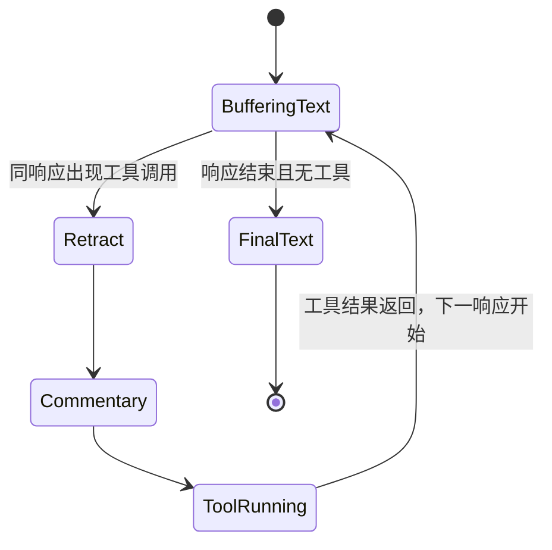

# 2. 完整 Agent 运行流程

## 2.1 从 prompt 到 RunOutcome

## 2.2 应用层启动

`WorkspaceHost._start_run` 做四件事：

1. 验证 session 存在；
2. 用 `(session_id, client_request_id)` 实现重复请求幂等；
3. 拒绝 workspace 中第二个并行主 run；
4. 建立 `_RunRecord`、`EventJournal` 和后台 task。

真正执行发生在 `_execute`。它把 runtime 事件同时写入 journal，并负责把审批请求转成可等待的 future。这样 SSE 订阅者可以断线重连，TUI 也可以直接消费同一类事件。

## 2.3 Coordinator 的职责

`RunCoordinator` 保存当前 session 的：

- active history；
- plan；
- compaction checkpoint；
- 最近用户输入；
- 当前等待/恢复边界。

完整 raw/full history 的权威属于 `SessionRepository`；interactive queue 属于 `AgentRuntime`。Coordinator 不复制这两套状态，也不实现模型循环。它只把 active 投影交给 runtime，收到 `RunOutcome` 后先构造候选状态，再追加并 `fsync` turn；持久化成功后才让 ContextEngine 发布 checkpoint，最后替换内存状态。失败时读取 runtime 附着的 `PartialRunOutcome`，仍然持久化审批、usage、diagnostic、部分文本、已产生的 clarification 和已经发生的 provider request receipts。

## 2.4 Runtime 内的一轮模型响应

模型可能先输出文字，随后才决定调用工具。Lumen 不能提前知道这些文字是最终答案还是工具前 commentary，因此采用推测式渲染：

对应事件是 `TextDelta` → 必要时 `TextRetracted` + `CommentaryDelta`。UI 因此既能即时显示 token，又不会在最终答案中重复工具前说明。

Provider 原生 reasoning/thinking 使用独立的 `ThinkingDelta`。它不进入推测式文本 buffer，因此不会在出现工具调用时被回撤，也不会拼入最终回答；Timeline 只把连续增量合并成可折叠的展示块。

## 2.5 工具循环与限制

- `request_count` 限制单次 run 的模型请求数；
- `tool_calls` 限制成功工具调用数；
- `parallel_tool_calls` 决定 runtime 是否启用并行调度；每个 invocation 仍由 `ToolConcurrency.EXCLUSIVE/PARALLEL_SAFE` 做最终分类，未声明时安全回退为 exclusive；
- context 增长由自动压缩处理，而不是累计 token 硬中断；
- transient provider 错误最多重试 3 次；一旦已经流出事件就不重试，避免重复输出。

## 2.6 终止路径

| 路径 | 公开事件 | 持久化结果 |
|---|---|---|
| 正常结束 | `RunCompleted` | 完整 outcome、messages、usage、plan、request receipts |
| 阻塞澄清 | `RunWaitingForUser` | messages、pending question、`waiting_for_user` turn |
| 用户取消 | `RunCancelled` | partial text、已发生工具与审批、已发生请求回执 |
| provider/代码失败 | `RunFailed` | error、diagnostics、可重试标志、已发生请求回执 |
| 用量达到上限 | `RunFailed` | 友好限制说明与 partial outcome |
