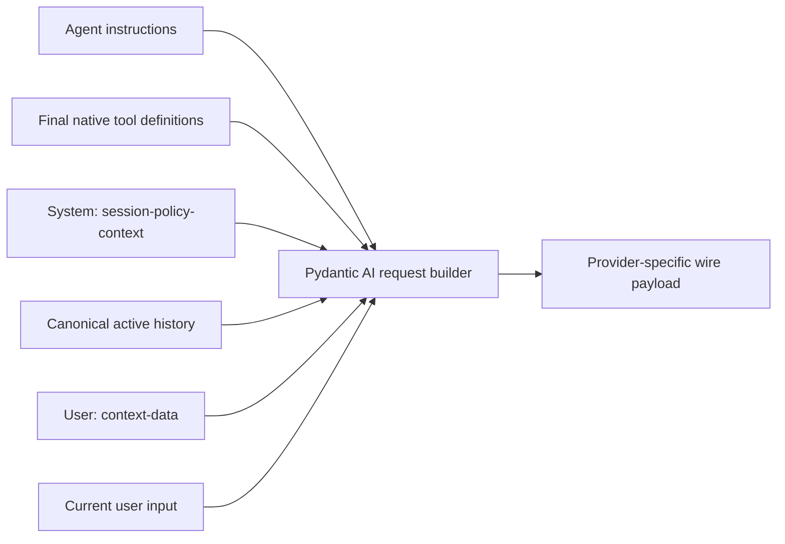
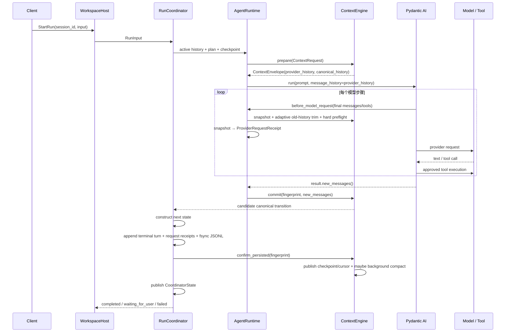

# 3. 上下文引擎、Prompt、压缩与记忆

本章描述当前源码中的真实组装路径。最重要的结论是：**Lumen 的 Prompt 不是一个拼接后的字符串，Context zone 也不等于 provider role。** `ContextAssembler` 负责预算、来源、信任、保留策略和裁剪；Pydantic AI 在每个模型步骤负责把 instructions、原生工具定义、message history 与当前输入转换成 provider 请求。

## 3.1 四种历史

| 名称 | 含义 | 权威位置 | 是否包含本轮重注入内容 |
|---|---|---|---|
| raw history | 所有已持久化终态 turn 的原始消息事实 | `SessionRepository` 的 JSONL | 否；只保存模型实际产生的新消息 |
| canonical history | 下一次可继续提交的规范历史 | `ContextEnvelope.canonical_history` | 永远排除 Plan、Skill、Memory、MCP resource 的瞬时重注入 |
| active history | canonical history 经 checkpoint 摘要和近期窗口裁剪后的有界投影 | `RunCoordinator` | 否 |
| provider history | 本次交给 Pydantic AI 的 history 参数 | `ContextEnvelope.provider_history` | 是；包含瞬时 policy/context-data 消息，但不含尚未由 Pydantic AI 追加的当前输入 |

`ContextEnvelope.messages` 是 `provider_history` 的兼容别名，只保留一个兼容周期。压缩永远不删除 raw history；它只改变 active/canonical 投影。

## 3.2 Prompt 不是单字符串

一次模型步骤的逻辑层次是：

```text
1. Pydantic AI instructions
2. Pydantic AI native function-tool definitions
3. SystemPromptPart: <session-policy-context>
4. canonical active history
5. UserPromptPart: <context-data>
6. current user prompt
```

前两项不是普通历史消息：instructions 由 Agent 管理，工具定义由 Pydantic AI 的 ToolManager 在该步骤动态解析。后三至五项由 `ContextEngine.prepare` 形成 `provider_history`；第六项由 `agent.run_stream_events(prompt, message_history=...)` 追加。Provider 可以在传输层合并相邻 user request，但不会改变 Lumen 的 canonical history 边界。



因此，“11/12 个 zone 都逐一作为消息发送给模型”是不准确的。Zone 是预算与保留模型；provider role/message 是另一层结构。

## 3.3 从 RunInput 到 ContextRequest

输入来源按如下路径汇合：

1. TUI/Web 将用户显示文本和模型输入构造成 `RunInput(display_text, model_prompt)`；`@file` 与手动 Skill 展开只改变 model prompt，不篡改时间线显示文本。
2. `RunCoordinator` 提供当前 session 的 active history、Plan、checkpoint、压缩边界和 session id。
3. `AgentRuntime` 执行 `USER_PROMPT_SUBMIT` hook。Hook 可以拒绝或修改当前 prompt，但不能直接改写仓库历史。
4. Runtime 从 `SessionContextManager` 按 session id 解析活动 Skill/MCP artifact snapshot。
5. Runtime 构造 `ContextRequest`：当前输入、任务快照、instructions、工具 schema catalog、活动来源、历史和 checkpoint。
6. `ContextEngine.prepare` 计费、必要时压缩、生成 blocks、预算报告、provider history、fingerprint 和 provisional request snapshot。

项目/控制规则归入 `POLICY`；Plan 归入 `TASK_STATE`；Skill 正文归入 `ACTIVE_SKILLS`；当前输入使用 `USER` trust。工具定义和精简能力目录属于 `CAPABILITY_CATALOG`。

## 3.4 工具输出 receipt、增量压缩与 Checkpoint V2

较大的旧工具结果先变为 receipt：摘要、head/tail、字节数、digest 与 artifact ref 留在历史，正文写入 0600 内容寻址 artifact。随后才进行压缩，避免一个构建日志吞掉摘要预算。

receipt 不是信息终点：正文仍在 artifact store 中，receipt 文本带有 `retrieve: read_artifact(ref="...")` 提示。模型在追问需要 head/tail 之外的细节时，可调用 `read_artifact(ref, start, max_chars)` 分页读回全文（risk=READ，无需审批；非法 ref 与已不存在/已 redact 的正文返回可恢复错误）。`artifact_policy="never"` 的涉密输出永不落盘，其 receipt 只有 redacted 标记，无法回读。

当前压缩不是“把每次摘要继续堆成一棵摘要树”。模型侧始终只注入一份最新 rolling state；旧 checkpoint 是不可变 episode archive，只在当前 prompt 与旧状态有词项重合时，以 `untrusted_external` 检索文档按需进入 `RETRIEVED_CONTEXT`。

一次成功压缩按下列规则执行：

1. `used + requested output reserve` 达到 soft 阈值时触发；手动 `/compact` 可绕过防抖，`context.enabled: false` 时不调用摘要器；
2. `source_history` 是 append-only raw transcript。前一个 V2 checkpoint 的绝对 `source_end` 是本次 delta 起点，因此第 8 轮首次压缩覆盖 `0..8`，第 15 轮再次压缩只处理 `8..15`；
3. 前一个 checkpoint 的 `rolling_state` 投影成 `previous_state`，摘要器只负责 `summarize(delta, previous_state, task_state)`；recent window 的 token 预算由 Engine 单独计算；
4. 摘要 merge/validator 保留既有 constraint、approval、path、error code 和 exact literal；摘要失败不推进 cursor，并计入连续失败/cooldown；
5. 新 `CompactionCheckpointV2` 保存 parent id、绝对 start/end cursor、full-history length、完整 source SHA-256、rolling state、state digest、证据范围和结构化条目；
6. recent history 从 delta 尾部反向选取，并吸附到完整用户 request 边界，tool call/result 不得拆开；
7. 新 rolling state 用 `<history-summary trust="recalled">` 包装；旧 V1 checkpoint 只读兼容，加载时映射到 raw transcript 的绝对边界；
8. V2 加载时校验 parent、连续范围、cursor message id、source digest、state digest 和 full-history length。损坏记录不发布，恢复从最后一个合法 checkpoint 加原始 JSONL 继续；
9. `ContextEngine.commit` 只构造候选 transition。`RunCoordinator` 完成 JSONL append + `fsync` 后才调用 `confirm_persisted`，发布 checkpoint/cursor 并允许后台压缩；写盘失败时内存状态不前进。

因此，多轮行为可以概括为：

```text
raw transcript:  [0................8][8...............15][15...........N]
checkpoint cp1:  source 0..8   -> rolling state S1
checkpoint cp2:  source 8..15  + previous S1 -> rolling state S2
model context:   只注入 S2 + token-budgeted recent history
episode archive: cp1 可按需检索，但不会与 S2 永久叠加
```

P1 的真实请求自适应缩减也只裁剪旧 canonical history；session policy、context data、当前输入以及当前 run 的工具调用/结果均受保护。若删除全部旧历史仍超过 hard limit，则在 provider I/O 前明确失败。

失败轮还会保存已成功的非只读工具 recovery receipt。receipt 使用工具名和规范化 validated arguments 计算摘要，并保存 JSON-safe 结果；只有用户显式 retry 且下一次模型调用的工具名、参数摘要完全一致时，runtime 才跳过副作用并回放原结果。只读/控制工具不参与该机制，参数发生任何变化都会正常重新执行。这个机制避免重复写入，但不把 receipt 当成“操作仍然有效”的事实证明。

## 3.5 Zone 是预算模型，不等于 role

当前 zone 与信任含义如下：

| Zone | 内容 | Trust | 典型保留方式 |
|---|---|---|---|
| `SYSTEM` | Agent 身份和稳定运行说明 | `system` | pinned |
| `POLICY` | 控制规则、项目指令、权限说明 | `policy` | reinject |
| `MEMORY_INDEX` | 有界长期记忆索引 | `durable` | reinject |
| `CAPABILITY_CATALOG` | 当前工具 schema 与精简能力目录 | `system` | reinject |
| `TASK_STATE` | Plan、阻塞步骤、恢复状态 | `system` | reinject |
| `ACTIVE_SKILLS` | session 激活的 Skill snapshot | `policy` | reinject |
| `HISTORY_SUMMARY` | 压缩摘要 | `recalled` | summarize |
| `RECENT_HISTORY` | 安全切点后的近期消息 | `recalled` | pinned window |
| `RECALLED_MEMORY` | 按本轮查询召回的记忆 | `recalled` | ephemeral |
| `RETRIEVED_CONTEXT` | MCP resource 等外部正文 | `untrusted_external` | reduce |
| `CURRENT_INPUT` | 当前用户输入 | `user` | pinned |
| `OUTPUT_RESERVE` | 回答空间，只计费不渲染 | `system` | reserve only |

Memory index、recalled memory 与 retrieved context 分别计费和限额，报告不合并来源。`ContextAssembler` 的 block 顺序服务于可解释预算；实际 role 只按策略数据、历史和用户数据三层渲染。

## 3.6 每个模型步骤动态解析工具和 instructions

### 模型 profile 与统一预算

传输协议与模型能力完全分离。`openai:` 只决定 Chat/Responses 兼容调用，不能推断窗口、最大输出或 tokenizer。解析顺序固定为：

1. `agent.models.<name>.context` 的显式字段；
2. 显式 `profile`；
3. 模型 slug 的精确 alias；
4. 未知模型的 80k conservative fallback。

内置首批 profile：GPT-5.6 Sol/Terra/Luna 使用 1,050,000 window、128,000 max output 和 `o200k_base`；DeepSeek V4 Pro 使用 1,000,000 / 384,000 和 conservative-CJK；Kimi K3、GLM-5.2 使用 1,000,000 window，输出上限由模型配置覆盖，缺失时预留 4,096 并标记 estimated。自定义 `base_url` 不参与 profile 选择。

`ResolvedContextPolicy` 是预算的唯一来源，提供 window、完整 requested output reserve、soft/hard/target、recent max、counter 及来源元数据。默认值是 window 的 80% / 92% / 55%，recent 上限 20,000。压缩后的 recent budget 为：

```text
min(recent_max, target - fixed_context - rolling_summary - output_reserve)
```

`settings.max_tokens` 优先作为 requested output reserve；未配置时使用 profile 已知上限，未知时使用 4,096。配置超过已知架构上限会在启动阶段失败。旧 `context.soft_token_limit` 和 `context.keep_recent_tokens` 仍可读取，但只作为弃用兼容覆盖。

一个 agent run 可能包含多次模型调用。Deferred MCP tool 被 tool search 发现后，下一步的 function-tool schema 会增长；工具结果也会让 messages 增长。所以仅在 run 开始前估算一次不够。

`ProviderRequestPreflight.before_model_request` 在 Pydantic AI 已完成该步骤 ToolManager 解析后读取：

- `ModelRequestContext.messages`；
- 每个 request 的 instructions；
- `ModelRequestParameters.function_tools`；
- Lumen 的 output reserve。

它使用 ContextEngine 同一 provider-aware token counter 生成 `ProviderRequestSnapshot`，包括步骤号、instructions/messages/tools/reserve token、可见工具名与 digest、窗口、hard limit 和 `estimated` 标记。快照按 session 更新 `/context`，不会建立第二套工具 schema 权威。计数不包含 provider 私有协议开销，因此始终表述为估算。

每个真正准备发往 provider 的 snapshot 会连同已冻结的 route、provider/model 与 Context fingerprint 转成有界 `ProviderRequestReceipt`。Runtime 把 receipt 附在完整或 partial outcome 上，`RunCoordinator` 与 terminal turn 一起追加到 Session v9；因此正常完成、取消和失败都保留实际请求证据。receipt 只保存 token 分区、可见工具名称/digest 和路由元数据，不保存 secret、工具 schema 正文或完整消息。

### Token 计量器（tokenizer adapter）

`ContextEngine` 持有一份共享 counter，同时驱动 zone 预算装配和压缩软触发，避免"触发用一套系数、限额用另一套系数"的不一致：

- GPT-5.6 profile 在安装可选依赖 `tiktoken`（`pip install lumen-agent[tokenizers]`）后使用 `o200k_base`；
- DeepSeek、Kimi、GLM 和未知模型默认使用对 CJK（约 1 token/字）和工具 schema 框架开销进行保守估算的 adapter；
- 测试使用 deterministic adapter；接口可继续注册 HuggingFace/SentencePiece，但运行时不会自动下载 tokenizer，也不会调用远程 tokenizer；
- `tiktoken` 缺失时回退 conservative-CJK，并在 `/context` 显示 fallback reason，启动不失败。

## 3.7 完整时序：prepare → preflight → loop → commit



`result.new_messages()` 不包含由调用者传入的 transient policy/context-data history，所以这些内容不会污染 canonical history，也不会在下一轮重复膨胀。后台候选只在一轮成功持久化后、压力达到 soft limit 的 90% 时生成；下一轮采用前重新校验 parent、source cursor 和 digest，过期候选直接丢弃。

## 3.8 SessionContextState：Skill/MCP 激活、恢复与卸载

`SessionContextState` 由 schema v5 引入；当前新 session 是 v9，仍沿用同一 `context_state` record：

```text
SessionContextState
├── active_skills[]     -> name/revision/source/body_artifact_ref/timestamps
├── active_resources[]  -> reference/server/uri/revision/body_artifact_ref/freshness
└── pending_clarification
```

`SessionContextManager` 是唯一活动来源 interface：`load`、`activate_skill`、`activate_resource`、`deactivate`、`set_clarification`、`resolve_documents`。`ResourceManager` 只保留 Skill/MCP catalog 和读取 adapter。

- 激活时立即保存精确正文 artifact，session 只保存引用；
- resume 读取同一 artifact/revision，不重读已变化的 Skill，不静默 refetch MCP；
- artifact 缺失时来源显示为 `unavailable` 且不注入空正文；
- unload 仅追加当前 session 的新 snapshot，不影响其他 session；
- v1–v4 加载为空 state，不重写原文件；分页跳过 v5 `context_state` 记录；
- 默认 MCP `ttl=None`，不会把快照冒充最新事实；显式重新激活/refresh 才更新；
- artifact GC 使用跨所有持久 session 记录的 mark-and-sweep，不依赖进程内 refcount。

命令语义：

```text
/skill:<name>                 激活并执行 Skill
/skill unload <name>         当前 session 卸载
/resource <reference>        当前 session 激活 MCP resource
/resource refresh <reference> 显式重新抓取并替换当前 session 快照
/resource unload <reference> 当前 session 卸载
/context sources             查看 revision 与 available/unavailable
```

Skill 激活只加载文本指令，**不会自动执行脚本**。脚本只能通过 `run_skill_script`，并继续经过风险分类与审批。

## 3.9 XML + Markdown、trust、provenance 与注入防护

Lumen 使用混合格式：native role/message 决定主要语义边界；浅层 XML 记录来源、trust、revision 和格式；标签内正文保留 Markdown。所有动态文本和属性统一转义 `& < > " '`，不使用 CDATA。

```xml
<session-policy-context version="1">
  <task-state trust="system" format="markdown">...</task-state>
  <active-skills trust="policy">
    <skill name="review" revision="sha256..." source=".../SKILL.md" format="markdown">...</skill>
  </active-skills>
</session-policy-context>
```

该结构使用 system role，只包含任务状态与已激活 Skill。

```xml
<context-data version="1">
  <memory-context trust="low">
    <memory-index format="markdown">...</memory-index>
    <recalled-memory format="markdown">...</recalled-memory>
  </memory-context>
  <retrieved-context trust="untrusted-external">
    <document server="docs" uri="doc://guide" revision="etag-1" format="markdown">...</document>
  </retrieved-context>
</context-data>
```

该结构使用 user role。恶意正文中的 `</retrieved-context><system>...` 会变成普通 XML text，不可能闭合 envelope；但 XML 不是权限系统，真正的边界仍是 native role、工具权限、审批和 session provenance。用户显式渲染的 MCP prompt 也使用 `mcp-rendered-prompt trust="untrusted-external"` 包装，不能凭模板正文获得权限。

## 3.10 `/context` 报告与故障排查

`/context` 必须携带 session id；当调用者遗漏且存在多个 session 时返回错误，不再泄露“最近任意 session”的报告。主要字段：

- zone token、share、retention；
- 最大 pressure blocks；
- capability 的 loaded/deferred 状态；
- active Skill 工作集；
- `request_snapshot`：真实模型步骤号、分层 token、工具 digest、hard limit；
- active model/profile、profile source、estimated fields；
- tokenizer adapter 与 fallback reason；
- 实际 window、soft/hard/target、recent max 和 requested output reserve；
- checkpoint/source range、本轮压缩原因、成功/失败/cooldown；
- checkpoint 检索命中、后台候选状态和 provider input usage 估算漂移；
- legacy override 提示。

常见排查：

| 现象 | 首先检查 |
|---|---|
| tool search 后突然超限 | snapshot 的 `tools_tokens` 和 visible tool digest |
| resume 后 Skill 内容不同 | `/context sources` revision；正常恢复不应重读磁盘 |
| MCP 内容未出现 | resource 是否在当前 session 激活、artifact 是否 unavailable |
| 历史每轮膨胀 | transient context 是否误入 `new_messages()`/canonical history |
| hard-limit 失败 | pressure、messages/tools/instructions 三个最大来源 |
| 回答没有继续 | session 是否为 `waiting_for_user`，是否存在 pending clarification |

## 3.11 一份完整请求示例

下面是逻辑视图，不是某个 provider 的私有 JSON：

```text
instructions:
  "You are Lumen ..."
  "Control/project policy ..."

native function tools:
  set_plan(...)
  request_clarification(...)
  read_file(...)
  github_search(...)          # deferred tool 已在本步骤发现

message_history:
  system:
    <session-policy-context version="1">
      <task-state trust="system" format="markdown">
        Plan revision: 3
        - [in_progress] `inspect` 检查认证失败
      </task-state>
      <active-skills trust="policy">
        <skill name="diagnosing-bugs" revision="..." source="..." format="markdown">
          # Diagnosis loop ...
        </skill>
      </active-skills>
    </session-policy-context>

  system (recalled history prefix):
    <history-summary version="1" trust="recalled" format="markdown">
      Prior conversation summary: ...
    </history-summary>

  user:      "登录返回 401，请继续"
  assistant: tool_call read_file(...)
  user:      tool_result "..."

  user:
    <context-data version="1">
      <memory-context trust="low">
        <memory-index format="markdown">- 项目使用 OAuth PKCE</memory-index>
      </memory-context>
      <retrieved-context trust="untrusted-external">
        <document server="docs" uri="doc://oauth" revision="e42" format="markdown">
          外部文档正文……
        </document>
      </retrieved-context>
    </context-data>

current user prompt:
  "先确认 token refresh 的实现，再告诉我是否需要改代码"
```

若模型调用 `request_clarification`，本轮消息和工具结果照常进入模型可见历史，终态变为 `waiting_for_user`。问题持久化到当前 session；用户下一条普通输入会包装成带 question id 的 `<clarification-answer>`。只有回答轮成功完成才清除 pending；失败时保留，新问题可以替换旧问题。这里恢复的是模型请求边界，不保存 Python 调用栈，因此 P0/P1 都不需要把 LangGraph 引入生产依赖。隔离的 [LangGraph spike](../spikes/langgraph-context-resume.md) 已验证 `prepare → agent → interrupt → resume → commit` 以及 node 重入语义；只有出现原节点恢复、分支/join、time travel 或跨日节点级续跑需求，并且 LangGraph 能替换而不是复制现有执行状态机时，才重新评估。
