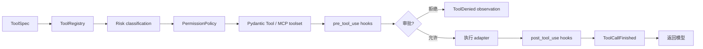
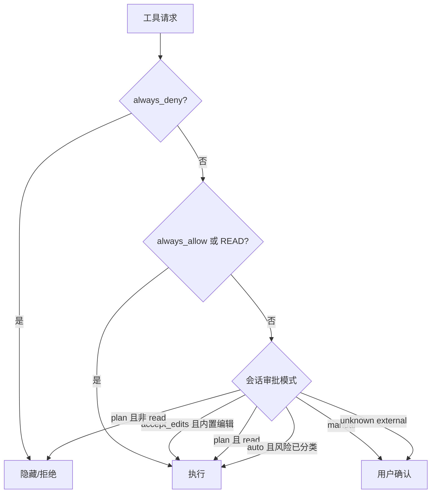

# 4. 工具、权限与安全

## 4.1 工具从定义到执行

`ToolSpec` 描述 callable、名称、说明、风险和超时。`ToolRegistry` 负责名称唯一性和插件来源；`PermissionPolicy` 将工具转成 allow / confirm / deny。

## 4.2 风险分类

| Risk | 含义 | 示例 |
|---|---|---|
| `read` | 无外部副作用的本地读取 | `read_file`、`search_text` |
| `write` | 修改工作区 | `write_file`、`edit_file` |
| `execute` | 启动进程或执行代码 | `run_command`、Skill script |
| `external` | 已明确分类的远端操作 | 配置过风险的 MCP 工具 |
| `external_unknown` | 未声明语义的远端能力 | 新发现且未分类的 MCP 工具 |

`external_unknown` 是故意设置的安全断点：auto 模式也不能自动批准它。

## 4.3 审批模式

同一模型响应产生多个待批工具时，runtime 可以通过 batch callback 聚合；应用层仍以每个 `call_id` 保存最终决定和审计信息。

## 4.4 工作区约束

本地文件工具通过 `Workspace` 解析路径：

- 拒绝绝对路径和 `..` 逃逸；
- resolve 后再次检查，阻断符号链接越界；
- 写入采用临时文件 + `os.replace`；
- 覆盖需要显式声明；
- 精确编辑要求目标文本只出现一次。

`run_command` 使用 argv 直接执行，不经过 shell；stdout/stderr 并发 drain，只保留有界头尾，同时记录总字节数。取消或超时时终止整个进程组。

## 4.5 Hook 链

Hook 支持 command adapter 与 Python adapter，事件包括：

- `user_prompt_submit`；
- `pre_tool_use`；
- `post_tool_use`；
- `stop`；
- `notification`。

多个匹配 hook 串行执行，首个 deny 短路。pre hook 可以修改参数，post hook 可以修改结果。command hook 通过 stdin 接收 JSON context，并受超时控制。

## 4.6 安全边界

必须区分三个概念：

1. **审批**：用户是否同意某次操作；
2. **路径 confinement**：文件工具能访问的目录；
3. **OS sandbox**：进程实际能访问的系统资源和网络。

Lumen 当前实现前两项。`run_command` 仍继承启动进程的用户权限，所以处理不可信仓库或 Skill 时，应在容器、Seatbelt、bubblewrap 等外部沙箱中运行 Lumen。
