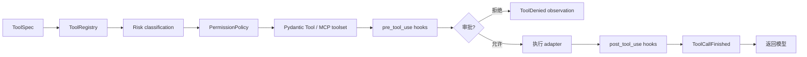
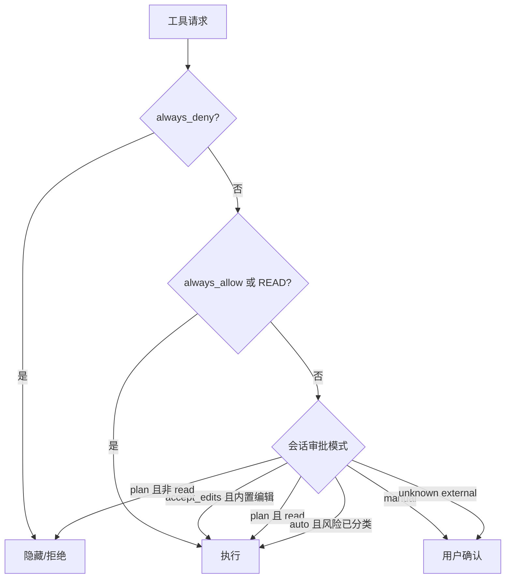

# 4. 工具、权限与安全

## 4.1 工具从定义到执行

`ToolSpec` 描述 callable、名称、说明、`Risk`、`EffectKind`、超时、`ToolOutputSpec` 和显式 concurrency policy。`ToolOutputSpec` 先把返回值验证为 canonical JSON value，再分别派生模型文本与客户端 presentation；host-only renderer 不进入 provider 输入 schema。默认 concurrency 是 `exclusive`，`EffectKind.OBSERVE` 不再自动证明线程安全。`ToolRegistry` 负责名称唯一性和来源；`PermissionPolicy` 将工具转成 allow / confirm / deny。`Risk` 只回答是否审批，`EffectKind` 回答状态追踪与验证要求，二者不能合并。

`CapabilityGateway` 使用同一输出契约，并在执行前聚合只读冻结 identity 上的 `ToolGuard`。Guard 只有 abstain/deny；任一 deny 都是单调的，无法被后续 Hook 或 Adapter 放宽。legacy `ToolSpec(function=...)` 仍通过兼容 Adapter 工作，待所有 builtin/MCP 完成显式输出迁移后删除。

`ToolPresentationSpec` 是 Tool Contract V2 的只读展示投影。runtime 只从 durable args/result 生成 schema-validated `ToolCallView` 与 `ToolResultView`，随后把 intent 放入 `ToolCallStarted/Finished`；TUI 与 Web 只负责渲染。未知工具使用通用 fallback，renderer 异常记录为有界 diagnostic，并且不能把已经成功的 authoritative tool outcome 改成失败。Session replay 直接重放同一 view，不读取 live callable 或 provider object。

文件 mutation 的发布权威位于 `Workspace.atomic_write`：新文件使用 no-replace publication，替换文件在临时文件 fsync 后按 expected revision 重验；显式 Work Product 与 legacy `write_file/edit_file` 共享该路径。平台不提供原子 compare-and-swap rename 时仍保留 syscall 级残余窗口，因此 `TaskWorkspace` 必须继续执行写后 verification 与 completion gate。

## 4.2 风险分类

| Risk | 含义 | 示例 |
|---|---|---|
| `read` | 无外部副作用的本地读取 | `read_file`、`search_text` |
| `write` | 修改工作区 | `write_file`、`edit_file` |
| `execute` | 启动进程或执行代码 | `run_command`、Skill script |
| `external` | 已明确分类的远端操作 | 配置过风险的 MCP 工具 |
| `external_unknown` | 未声明语义的远端能力 | 新发现且未分类的 MCP 工具 |

`external_unknown` 是故意设置的安全断点：auto 模式也不能自动批准它。

## 4.3 审批模式

同一模型响应产生多个待批工具时，runtime 可以通过 batch callback 聚合；应用层仍以每个 `call_id` 保存最终决定和审计信息。

允许范围分三层：`once` 只放行当前调用，`session` 写入当前 `_SessionActor.approval_keys`，`always` 额外写入项目级 `ApprovalRuleStore`。永久规则保存在 `~/.lumen/state/approval-rules/<project-id>.json`，使用与 session 相同的有界 key（`origin:tool[:executable]`），不会回写可能含凭据和注释的 YAML 配置。

## 4.4 工作区约束

本地文件工具通过 `Workspace` 解析路径：

- 拒绝绝对路径和 `..` 逃逸；
- resolve 后再次检查，阻断符号链接越界；
- mutation 路径逐级拒绝任何既有符号链接，并在创建父目录后再次解析；
- 调用方先取得 `sha256:` revision 或 `missing`，发布时必须传入同一个 `expected_revision`；
- 新建文件以 no-replace hard-link 发布，目标抢先出现时返回 `STALE_RESOURCE`；替换文件在临时文件 `fsync` 后再次校验 revision，再执行 `os.replace`；
- legacy `write_file/edit_file` 与 Work Product Adapter 共用 `Workspace.atomic_write`，不会形成第二条写入语义；
- 精确编辑要求目标文本只出现一次。

`run_command` 使用 argv 直接执行，不经过 shell；stdout/stderr 并发 drain，只保留有界头尾，同时记录总字节数。取消或超时时终止整个进程组。

命令还通过 `SandboxAdapter` 执行：默认 `workspace_write` 在 macOS 使用 Seatbelt、Linux 使用 bubblewrap，隔离 `HOME`/临时目录、关闭网络并按 allow-list 构造环境；adapter 不可用时拒绝执行。`run_command` receipt 只证明命令执行，不声称捕获命令产生的全部文件副作用。

`web_fetch` 与按配置注册的 `web_search` 属于 `Risk=external`、`EffectKind=observe`。抓取会在 DNS 解析和每次重定向后拒绝 loopback、私网与链路本地地址，并限制响应体大小；搜索 API key 只从配置指定的环境变量读取。

## 4.5 Hook 链

Hook 支持 command adapter 与 Python adapter，事件包括：

- `user_prompt_submit`；
- `pre_tool_use`；
- `post_tool_use`；
- `stop`；
- `notification`。

多个匹配 hook 串行执行，首个 deny 短路。pre hook 可以修改参数，post hook 可以修改结果。command hook 通过 stdin 接收 JSON context，并受超时控制。

## 4.6 安全边界

必须区分三个概念：

1. **审批**：用户是否同意某次操作；
2. **路径 confinement**：文件工具能访问的目录；
3. **OS sandbox**：进程实际能访问的系统资源和网络。

Lumen 当前三项都实现，但保证不同：审批是意图授权，`Workspace` 是路径解析约束，Seatbelt/bubblewrap 是 OS 强制。显式 `sandbox.mode: disabled` 会移除第三层，因此只应在受信环境使用；角色、Skill、插件与 child Agent 都不能扩大父级 sandbox 权限。
