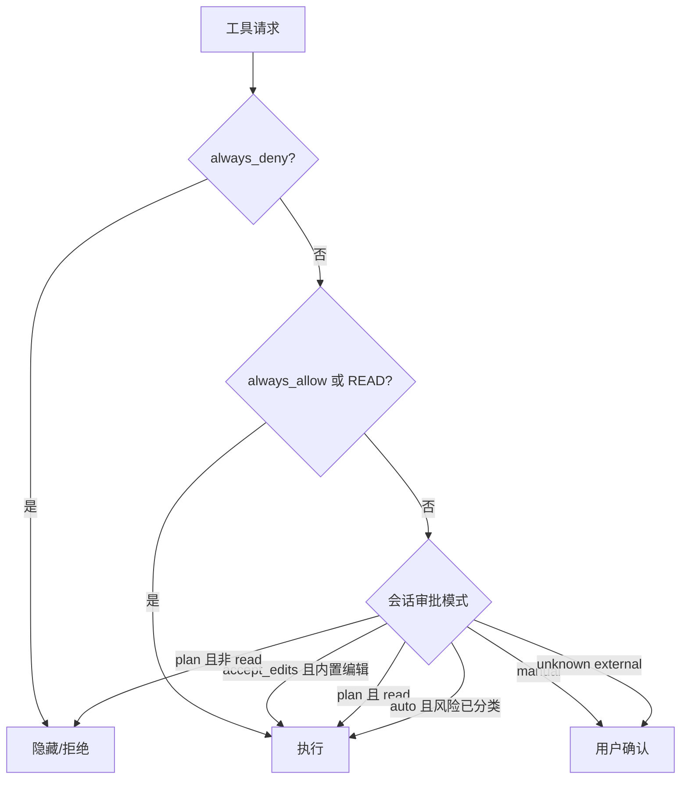

# 4. 工具、权限与安全

## 4.1 工具从定义到执行

```mermaid
flowchart LR
    Spec["ToolSpec"] --> Registry["ToolRegistry"]
    Registry --> Risk["Risk classification"]
    Risk --> Policy["PermissionPolicy"]
    Policy --> Catalog["CapabilityGateway catalog"]
    Catalog --> NL["LumenAgentLoop invocation"]
    NL --> Contract["effect contract preflight"]
    Contract --> Pre["pre_tool_use hooks"]
    Pre --> Validate["schema validate / coerce / freeze"]
    Validate --> Gate{"审批?"}
    Gate -->|拒绝| Denied["ToolDenied observation"]
    Gate -->|允许| Guard{"单调 ToolGuard"}
    Guard -->|拒绝| Denied
    Guard -->|允许| Exec["执行 adapter"]
    Exec --> Post["post_tool_use hooks"]
    Post --> Result["ToolCallFinished"]
    Result --> Model["返回模型"]
```

`ToolSpec` 描述 callable、名称、说明、`Risk`、`EffectKind`、超时、`ToolOutputSpec` 和显式 concurrency policy。`ToolOutputSpec` 先把返回值验证为 canonical JSON value，再分别派生模型文本与客户端 presentation；host-only renderer 不进入 provider 输入 schema。默认 concurrency 是 `exclusive`，`EffectKind.OBSERVE` 不再自动证明线程安全。`ToolRegistry` 负责名称唯一性和来源；`PermissionPolicy` 将工具转成 allow / confirm / deny。`Risk` 只回答是否审批，`EffectKind` 回答状态追踪与验证要求，二者不能合并。

`CapabilityGateway` 是本地与 MCP 工具的唯一执行权威。本地 callable 的 pre Hook 参数先经过 Pydantic schema validation/coercion，形成唯一冻结 invocation；审批、并发分类、幂等 key、恢复签名、只读 `ToolGuard`、presentation 和实际调用都消费同一参数事实。Guard 只有 abstain/deny；任一 deny 都是单调的，无法被后续 Hook 或 Adapter 放宽。legacy `ToolSpec(function=...)` 仍通过构造兼容 Adapter 工作，待所有 builtin/MCP 完成显式输出迁移后删除。

`agent.limits.parallel_tool_calls: sequential` 禁止调用重叠。当前原生 Loop 对 `parallel_safe` 和
`parallel` 均按实际 invocation 的 `ToolConcurrency` 分批，exclusive 调用形成串行屏障。
旧 SDK ToolDefinition 的 sequential 标志是兼容投影，不能覆盖 Gateway 的并发契约。

`ToolPresentationSpec` 是 Tool Contract V2 的只读展示投影。runtime 只从 durable args/result 生成 schema-validated `ToolCallView` 与 `ToolResultView`，随后把 intent 放入 `ToolCallStarted/Finished`；TUI 与 Web 只负责渲染。未知工具使用通用 fallback，renderer 异常记录为有界 diagnostic，并且不能把已经成功的 authoritative tool outcome 改成失败。Session replay 直接重放同一 view，不读取 live callable 或 provider object。

文件 mutation 的发布权威位于 `Workspace.atomic_write`：新文件使用 no-replace publication，替换文件在临时文件 fsync 后按 expected revision 重验；显式 Work Product 与 legacy `write_file/edit_file` 共享该路径。平台不提供原子 compare-and-swap rename 时仍保留 syscall 级残余窗口，因此 `TaskWorkspace` 必须继续执行写后 verification 与 completion gate。

## 4.2 风险分类

| Risk | 含义 | 示例 |
|---|---|---|
| `read` | 读取类审批级别，不推导 EffectKind | `read_file`、`git_status`、显式声明 read 的 MCP 工具 |
| `write` | 修改工作区或本地版本状态 | `write_file`、`edit_file`、`git_stage` |
| `execute` | 启动进程或执行代码 | `run_command`、Skill script |
| `external` | 已明确分类的远端操作 | `web_fetch`、`web_search` |
| `confirm` | 每次都必须由用户新确认的发布动作 | `git_commit`、`git_push` |
| `external_unknown` | 未声明语义的远端能力 | 新发现且未分类的 MCP 工具 |

`external_unknown` 是故意设置的安全断点：auto 模式也不能自动批准它。
`git_commit` 与 `git_push` 同样始终要求本次显式确认；不能靠 auto、session rule 或
对 `run_command` 的永久放行静默发布版本历史。`confirm` 仍只决定审批，不推导副作用；
未显式声明 EffectKind 的 confirm 工具按 unknown 处理。

## 4.3 审批模式

同一模型响应产生多个待批工具时，runtime 可以通过 batch callback 聚合；应用层仍以每个 `call_id` 保存最终决定和审计信息。

Plan 只信任 Capability Contract 自己声明的 `Risk=read`。不再根据 `rg`、`cat`、`git diff`
等 argv basename 猜测只读性，因为工作区可执行文件可以伪装成同名程序。Git 检查通过
结构化 `git_status` / `git_diff` 完成；通用 `run_command` 在 Plan 中一律拒绝。

允许范围分三层：`once` 只放行当前调用，`session` 写入当前 `_SessionActor.approval_keys`，`always` 额外写入项目级 `ApprovalRuleStore`。永久规则保存在 `~/.lumen/state/approval-rules/<project-id>.json`，不会回写可能含凭据和注释的 YAML 配置。普通工具使用 `origin:tool` key；`run_command` 使用 `origin:tool:sha256:<digest>`，绑定全部已校验参数（包括 argv、cwd 和 timeout）。规则不保存参数正文，不能由批准 `git status` 推导批准其他 Git 子命令或其他目录。旧 executable-wide key 保留在规则文件但不再匹配，必须重新审批。

## 4.4 工作区约束

本地文件工具通过 `Workspace` 解析路径：

- 拒绝绝对路径和 `..` 逃逸；
- resolve 后再次检查，阻断符号链接越界；
- mutation 路径逐级拒绝任何既有符号链接，并在创建父目录后再次解析；
- 调用方先取得 `sha256:` revision 或 `missing`，发布时必须传入同一个 `expected_revision`；
- 新建文件以 no-replace hard-link 发布，目标抢先出现时返回 `STALE_RESOURCE`；替换文件在临时文件 `fsync` 后再次校验 revision，再执行 `os.replace`；
- legacy `write_file/edit_file` 与 Work Product Adapter 共用 `Workspace.atomic_write`，不会形成第二条写入语义；
- 精确编辑要求目标文本只出现一次。

`run_command` 使用 argv 直接执行，不经过 shell；stdout/stderr 并发 drain，只保留有界头尾，同时记录总字节数。取消或超时时终止整个进程组。

命令还通过 `SandboxRunner` 执行：默认 `workspace_write` 在 macOS 使用 Seatbelt、Linux 使用 bubblewrap，隔离 `HOME`/临时目录、关闭网络并按 allow-list 构造环境；adapter 不可用时拒绝执行。`run_command` receipt 只证明命令执行，不声称捕获命令产生的全部文件副作用。

Git mutation 不通过通用命令放宽 `.git`。可选 builtin `git_status`、`git_diff`、`git_stage`、
`git_commit`、`git_push` 由 Host-owned `GitWorkspace` 实现：stage 只接受显式普通文件相对路径或删除，
通过不执行 clean/process filter 的 plumbing 更新 index，目录和符号链接安全失败；commit
核对 HEAD 与暂存区 fingerprint；push 核对 HEAD、分支、remote 名与脱敏 URL fingerprint，
只接受无内嵌密码的 HTTPS/SSH remote。所有 Git 进程禁用 repository hooks，仍在 workspace
OS sandbox 内执行，并禁用 fsmonitor 与自动维护；push 额外禁用 credential helper、代理、HTTP 重定向及非 HTTPS/SSH protocol，
SSH 只使用 batch mode、已知主机文件与现有 SSH agent；需认证的 HTTPS push 在引入 Host credential
broker 前应使用 SSH agent。只有 push 获得该次调用的网络能力。commit/push 始终要求显式审批，
外部 push 继续产生可恢复的 external-action receipt。

`web_fetch` 与按配置注册的 `web_search` 属于 `Risk=external`、`EffectKind=observe`，当前默认
exclusive。抓取会在 DNS 解析和每次重定向后拒绝 loopback、私网与链路本地地址；`fetch_max_bytes`
通过流式读取限制响应正文，HTML Adapter 保留公开链接。HTTP Adapter 为静态抓取声明 Accept 与
User-Agent，对 408、425、429、500、502、503、504 和传输故障做最多三次有界退避重试，并尊重
数值型 `Retry-After`。`download_file` 复用相同网络策略，但仍是 TaskWorkspace mutation：它只接收
需要原样落盘的 UTF-8 原始资源，不替代 `web_fetch` 阅读网页、API 或 RSS。搜索 API key 只从配置
指定的环境变量读取。

模型原生 `web_search`、配置型搜索/MCP、内置 `web_fetch` 是三条不同 Interface：前者由 provider
返回搜索与来源事件，中间层提供搜索发现，后者只读取已知公共 URL 的静态文本。需要认证、浏览器
交互、JavaScript 渲染或反爬挑战时必须使用显式 Browser MCP；内置 HTTP Adapter 不宣称具备浏览器
执行能力。

> **修订（2026-09-14）**：2026-09-10 审计（[网页检索能力审计](../research/2026-09-10-web-retrieval-capability-audit.md)）
> 的「浏览器运行时不进内置工具」结论按 [web-search-upgrade 计划](../plans/2026-09-14-web-search-upgrade.md) 正式修订。
> 当时前提是「内置 fetch 只做 HTTP 文本读取」；现在 `web_fetch` 升级为分层策略链——HTTP 快速路径
> （Trafilatura 正文抽取）→ 可选浏览器渲染层（Crawl4AI 惰性依赖，未安装或渲染失败时
> 降级回现有剥标签路径，行为不劣于现状）。SSRF 逐跳校验、审批矩阵与分页契约不变。
>
> **浏览器层已实现（Phase 2）**：Crawl4AI 为进程级懒加载 `AsyncWebCrawler` 单例（手动
> `start()`/`close()`），随 ResourceManager 的 resource scope 关闭释放；`tools.web.fetch_strategy: http_only`
> 可整体关闭。SDK 无内建 SSRF 防护，由本层强制执行三点：渲染前 `validate_public_url` 校验目标、
> `before_goto` hook 对每次顶层导航重新做公共主机校验、`on_page_context_created` 挂 `context.route`
> 拦截所有子请求（覆盖浏览器内 302 到内网）。残余风险为校验与连接之间的 DNS rebinding（TOCTOU）
> 及上游 hook 覆盖盲区；Cloudflare 等强风控不在承诺范围（`success=False` 直接降级，不重试）。

## 4.5 Hook 链

Hook 支持 command adapter 与 Python adapter，事件包括：

- `user_prompt_submit`；
- `pre_tool_use`；
- `post_tool_use`；
- `stop`；
- `notification`。

多个匹配 hook 串行执行，首个 deny 短路。pre hook 可以修改参数，post hook 可以修改结果。
command hook 通过 stdin 接收 JSON context，并复用项目的 `SandboxRunner`、环境清理、网络策略、
有界输出、超时及进程树终止。Python hook 与 Python tool plugin 是操作者显式配置的进程内受信代码，
不宣称受子进程 OS sandbox 约束。

pre hook 修改后的参数先完成 schema validation/coercion 并被冻结，再进入审批和单调 `ToolGuard`，
因此审批、guard、恢复与实际执行看到完全相同的参数；post hook 只能改写返回模型的 `model_output` 投影，不能修改 canonical output、客户端
presentation 或 effect receipt。`HookBus` 自身会把单个运行时异常记录为 diagnostic 并继续；若整个公开
pre-invoke Adapter 意外抛出，`CapabilityGateway` 仍会 fail closed。

## 4.6 安全边界

必须区分三个概念：

1. **审批**：用户是否同意某次操作；
2. **路径 confinement**：文件工具能访问的目录；
3. **OS sandbox**：进程实际能访问的系统资源和网络。

Lumen 当前三项都实现，但保证不同：审批是意图授权，`Workspace` 是路径解析约束，Seatbelt/bubblewrap 是 OS 强制。显式 `sandbox.mode: disabled` 会移除第三层，因此只应在受信环境使用；角色、Skill 与 child Agent 都不能扩大父级 sandbox 权限。Python plugin/hook 在加载前必须由操作者信任，因为它们与其他 Python import 一样运行在 Host 进程内。

`sandbox.network` 约束 `run_command` / Skill 脚本等 SandboxRunner 子进程，不是整个 Host 的网络开关。
已配置 MCP transport 与内置 web 工具使用各自 Interface、审批和访问约束。命令内 curl 的失败不能
推导为 MCP 不可用。`run_command` Schema 与结果明确给出该命令的 sandbox mode、网络策略和作用范围；
退出码、stderr 是失败证据，策略值本身不是对 DNS、TLS 或服务可用性的诊断。

每次模型请求由 `AgentRuntime` 根据实际发送的原生工具和可见函数工具生成联网选路指引，
文案由 `context/instructions.py` 统一维护，计入 ContextEngine 预算和请求 manifest。
已启用的 Provider 原生搜索优先用于发现资料；独立 `web_search` 在可见时可作为后备；
已知 URL 使用 `web_fetch`，需要原样保存文本才使用 `download_file`。
原生搜索未启用不等于供应商不支持，工具已启用也不等于请求已成功；后备路径不能绕过
用户拒绝、显式禁止的操作或审批。指引随请求工具变化，根与 child Runtime 共用同一实现，
不扩大工具权限、不修改 Sandbox，也不自动启用未经目录核实的供应商能力。

Seatbelt 默认允许读取受限的公共 TLS 配置/证书、DNS 配置、已允许路径的祖先 metadata、
系统开发工具路径 metadata 和必要设备；独立临时 HOME/TMP 与已允许写入路径可回读。
不开放整个 `/etc`、TLS 私钥目录或用户 HOME。系统依赖可读不等于联网放行，network=false
仍不生成网络 allow 规则，`.git` / `.lumen` 写保护与 fail-closed 保持不变。

## 4.7 外部结果与完成恢复

`TaskWorkspace.check_tool_effect` 在 strict 模式拒绝 unknown effect，ResourceManager 把它接入
Gateway 的既有 pre-invoke Interface，主 Runtime、派生 Gateway 与 Live 共用该判断。审批通过
不能补足副作用契约；MCP `readOnlyHint` 或工具名称也不会隐式扩大已配置权限。

非自记录的 mutation、external_action、unknown、execution 调用在 dispatch 前追加 `prepared` receipt，
随后以同一 effect ID 追加结果。超时、取消及派发后异常保留 `reconciliation_required`，进程中断
留下的 prepared 在恢复时同样进入对账；成功的 observe 不生成 effect。文件工具继续拥有自己的
snapshot / apply / verify journal；run_command 仍只提供 execution receipt，不证明全部文件副作用已验证。
失败的 execution 即使来自没有 prepared/after snapshot 的旧记录，也会阻止 strict 完成声明；
后续其他命令成功不能替代该调用的对账，只能通过既有 Host verification waiver 明确接受。

`CompletionBlocker.model_recoverable` 明确恢复责任。普通计划/本地产物问题保留有界模型重试；
无本地 work product 可验证的外部结果立即以 `completion_recovery_required` 停止完成声明，
不把 operator recovery 当成让模型重写正文的提示词。纯字符串 `evaluate()` 是兼容投影，原生
Loop 使用保留恢复责任的 `assess()`。

Host 在 StartRun 受理和编辑分支创建前检查待核实外部结果；后者与运行受理共用工作区进程锁。
只有调用既有、带范围与原因的 `WaivePlanVerification` 才能人工接受该结果，模型无此控制工具。
这不会重新分类历史事实、重放远端动作或修改以后的工具审批权限。
