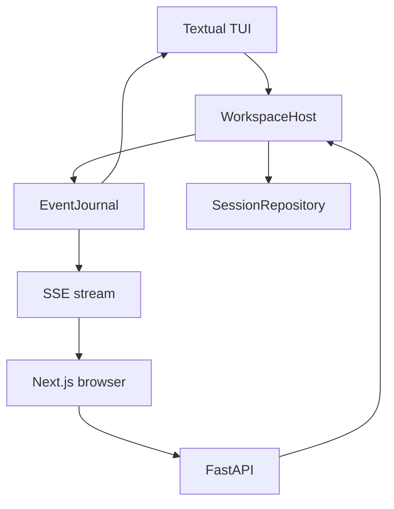
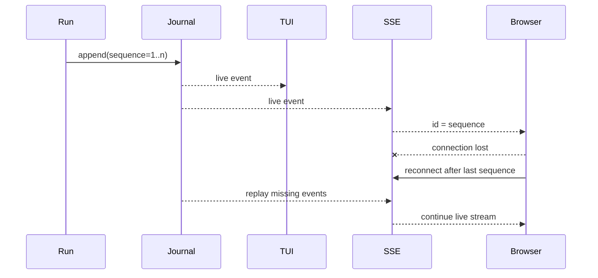

# 5. 会话、事件与客户端

## 5.1 单一权威、多种客户端

TUI 与 Web 不各自维护一套 Agent 状态。它们通过 `WorkspaceHost` 看到同一 session、run、approval 和 event sequence。

## 5.2 Command 模型

应用层命令定义在 `application/models.py`：

- session：`CreateSession`、`ForkSessionAtTurn`、`ListSessions`、`RenameSession`、`SetSessionArchived`、`DeleteSession`；
- run：`StartRun`、`RetryRun`、`CancelRun`；
- interaction：`QueueRunInput`、`DecideApproval`；
- settings：`SetApprovalMode`、`SelectModel`；
- capability：`InvokeSkill`、`ContextControl`、Agent/Work Product/Live 命令。

`dispatch` 的重载让每类命令拥有确定返回类型。客户端只需要理解这些 command/result，不需要操作 coordinator 内部对象。

## 5.3 Event Journal

`TimelineEventRecord` 是稳定的 tagged representation：`type + data + sequence`。它允许公开事件进入 JSONL、恢复为 dataclass，也让 SSE 用 sequence 实现断线续传。

## 5.4 SessionRepository

会话文件是 append-only JSONL：

- 第一条记录保存 session metadata 和创建时 schema；当前新会话写 v9；
- 后续每条 turn 保存 user input、状态、messages、timeline events、approval、usage、plan、diagnostics 与 compaction；
- 每个 terminal turn 还保存有界 `request_receipts[]`：实际 provider/model route、step、instructions/messages/tools token、visible tool 名称与 digest、context fingerprint、output reserve、hard limit 和 estimated 标记；不复制 secret 或大正文；
- context、settings、plan、Work Product/effect、Agent Thread/event/message/result 与 Live call 都使用独立类型化 record 追加，不挤入可变聚合对象；
- 标题、归档和删除状态由最新的 `session_catalog` record 投影；删除是 tombstone，不改写或物理移除 journal；
- v1–v8 文件加载时不重写。首次写入 v7/v8/v9 才有的事实前追加 `schema_upgrade`，读取时以有效 schema 校验后续 record；
- `load` 对不完整/非法 JSON 行明确报 `SessionCorruptError`，避免把损坏文件静默解释为合法状态；
- active prefix、rolling summary 和 checkpoint 可从 turn 中恢复；V2 checkpoint 必须通过 parent/range/cursor/digest/full-history 校验，V1 只读兼容并映射为绝对 transcript 边界；
- checkpoint 状态只在 append + `fsync` 成功后发布到运行中内存；
- 分页读取用于长时间线，不要求一次挂载全部 UI widget。

`SessionRepository.load` 始终以 JSONL 字节为权威，通过内容 digest 命中可删除的 read projection cache。缓存只保存 materialized read model；digest 不一致或调用 `clear_projection_cache()` 时从 JSONL 冷算。删除缓存不会丢数据，也不会改写 v1–v9 文件。

## 5.5 TUI adapter

Textual UI 的核心职责是把 `RunEvent` 投影为 timeline：

- 33ms 合并流式 Markdown；
- 固定 Todo/Plan 面板；
- 工具卡片和审批队列；
- 有限 widget 窗口与向上分页；
- `/context`、`/memory`、`/mcp` 等 command；
- prompt history、`@file` 和 `/` 补全；
- 离开底部后停止自动滚动，保留阅读位置。

Skill、MCP Prompt/Resource、Hook 列表与 Context control 都通过 `WorkspaceHost` command；TUI
不再直接调用 `ResourceManager` 或 `ContextEngine` 的 mutation Interface。普通图片输入支持工作区内
`@path.png` 和终端粘贴出的图片路径，两者先经 `ImportAttachmentPath` 转成 canonical
`AttachmentRef`。

## 5.6 Web adapter

FastAPI 提供 bootstrap、session、run、approval、context 和文件搜索端点。安全策略包括：

- 默认只监听 loopback；
- 一次性启动 token 换取 HttpOnly cookie；
- SSE 通过 sequence 恢复；
- 浏览器刷新不取消后台 run；
- bootstrap 投影当前模型的 `inputModalities`，Web 在上传前禁用不受支持的图片输入；
- OpenAPI schema 生成 TypeScript contract，CI 检查漂移。

Web Composer 支持图片选择、拖放和剪贴板图片。浏览器使用原始二进制请求上传，Host 校验格式、大小和
magic signature 后写入 ArtifactStore；`StartRun` / `QueueRunInput` 只携带 AttachmentRef。

Session 管理端点只向 `WorkspaceHost` 派发 command。历史列表默认过滤归档、删除墓碑和没有 turn/显式标题的空 Session；归档列表可显式请求。活动 run、未处理 Agent 或未验证 Work Product 会阻止归档与删除，Web Adapter 不直接修改 journal。

`WorkspaceHost` 接受 `StartRun` 时，会在调度模型或工具前通过 `RunCoordinator` 追加一个带唯一 `interaction_id` 的 `running` turn，并把首条规范化输入追加为 `session_catalog.title`。terminal turn 使用相同 ID 继续追加；`SessionRepository` 的读取投影以 terminal 记录取代 running 记录，JSONL 字节仍全部保留。Repository 在唯一 JSONL 写入 Seam 先使用 Pydantic JSON 语义规范化整条 record，因此 provider usage 中的 `Decimal` cost 会按精确十进制字符串持久化，日期、UUID 等标准领域标量也不要求每个调用者重复转换；不认识的不透明对象仍会使写入安全失败。若完整 terminal record 仍因其他富载荷无法序列化，Coordinator 会舍弃未提交的 Context fingerprint，并追加只含已流出 timeline 与错误信息的最小 `failed` terminal record；Host 在发出 `RunFailed` 前还会对仍处于 `running` 的同一 interaction 做最终对账。这保证已通过 SSE 展示的助手文本不会因终态持久化异常在切换 Session 后静默消失。执行中冷启动可以恢复用户输入，完成或失败后又不会出现重复 turn。Web 刷新按 URL 中的 Session ID 直接恢复 snapshot，再通过 `active_run_id` 重连同一进程内仍在执行的事件流，不以侧栏列表是否已投影为恢复前提。对于修复前已经形成的 title-only Session，只有存在 effect、Work Product 或 Agent 等执行证据时，Timeline Adapter 才从自动标题恢复有界输入并显示“回答不可重建”的中断提示；纯手动标题的空 Session 不会被误判为历史消息。

Web Adapter 将每个用户 turn 的 timeline 投影为两层：assistant 最终输出、计划、澄清与错误属于前景阅读层；thinking、commentary、progress、Tool、MCP、Skill、Agent 和 Work Product 属于可展开的活动层。活动层在执行或审批中展开，在成功 terminal 后默认折叠。该分组是纯客户端 presentation，不修改事件顺序、Session journal 或恢复权威。

CLI `lumen capabilities --json`、TUI `/context capabilities` 与 Web `GET /api/v1/capabilities` 消费同一个 `ResourceManager.capabilities_report()` 只读 Interface。它解释 Tool、Skill、MCP server 与 Agent Profile 的实际可见性、来源、Risk、EffectKind、ToolConcurrency、审批决定、Sandbox mode 与 schema digest；该报告不参与权限决策，因此不会形成第二套 capability authority。

## 5.7 客户端能力矩阵

| 能力 | Core shared | Web Adapter | TUI Adapter | 分类 / 说明 |
|---|---|---|---|---|
| Session、run、审批、Plan、Agent、Work Product | `WorkspaceHost` command/event | FastAPI + SSE | `HostSessionAdapter` | **Core shared** |
| Skill、MCP Prompt/Resource、Context control | 同一 Host command | HTTP control endpoint | slash command | **Core shared**；TUI 无内部 mutation 旁路 |
| 文本与交互队列 | `StartRun` / `QueueRunInput` | Composer | PromptEditor | **Core shared** |
| 图片输入 | AttachmentRef + ArtifactStore + Runtime Adapter | 文件选择、拖放、剪贴板 | `@path`、粘贴图片路径 | **Core shared**；UI 获取方式不同 |
| Responses / Chat 图片 wire format | `BinaryContent` provider boundary | 无协议分支 | 无协议分支 | **Core shared**；Responses=`input_image`，Chat=`image_url` |
| Realtime voice | Live canonical Interface | WebRTC / WebSocket controls | 无 | **Web-only** |
| 直接 `! command` | Sandbox / approval | 无 | PromptEditor shortcut | **TUI-only** |
| 浏览器原生图片预览/裁剪 | 无 | 当前仅附件 chip | 无 | **Planned** |
| 终端原生二进制剪贴板协议 | 无 | 不适用 | 终端通常只提供路径/文本 | **Unsupported**；使用图片路径 |

矩阵中的 “Core shared” 表示状态和行为权威在共享 Module；Web-only/TUI-only 只描述 transport 或交互
能力，不能反向成为第二套 Runtime 状态。
