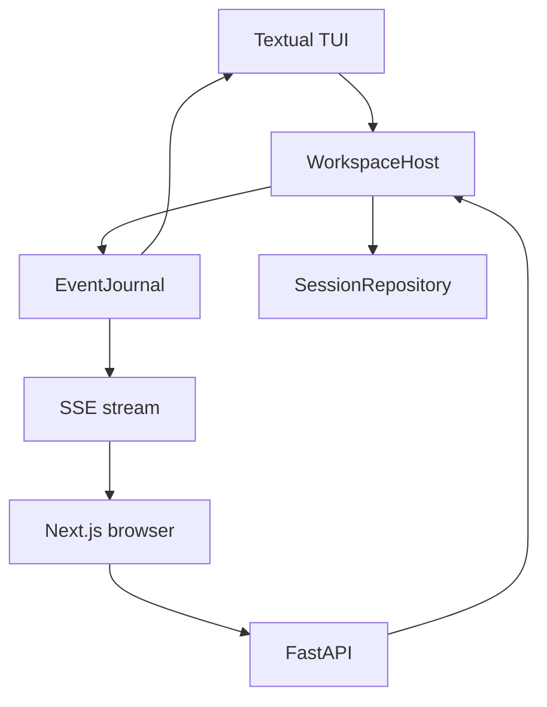
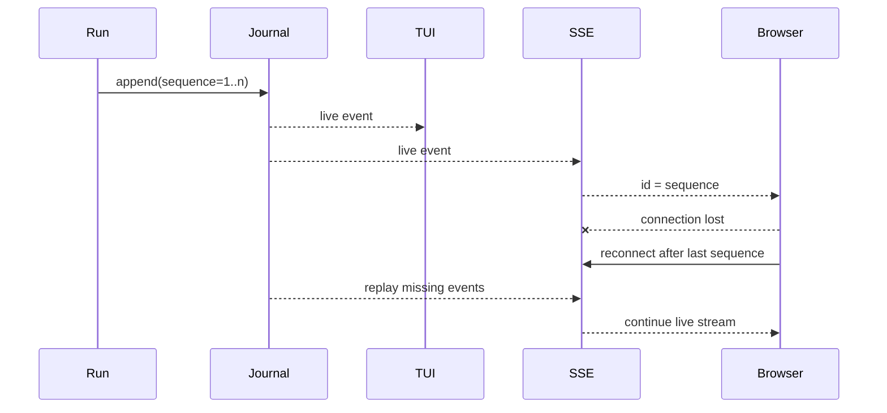

# 5. 会话、事件与客户端

## 5.1 单一权威、多种客户端

TUI 与 Web 不各自维护一套 Agent 状态。它们通过 `WorkspaceHost` 看到同一 session、run、approval 和 event sequence。

## 5.2 Command 模型

应用层命令定义在 `application/models.py`：

- session：`CreateSession`、`ForkSessionAtTurn`、`ListSessions`、`RenameSession`、`SetSessionArchived`、`DeleteSession`；
- run：`StartRun`、`RetryRun`、`CancelRun`；
- interaction：`QueueRunInput`、`DecideApproval`；
- settings：`SetApprovalMode`、`SelectModel`；
- capability：`InvokeSkill`、`ContextControl`、Agent/Work Product/Live 命令。

`dispatch` 的重载让每类命令拥有确定返回类型。客户端只需要理解这些 command/result，不需要操作 coordinator 内部对象。

## 5.3 Event Journal

`TimelineEventRecord` 是稳定的 tagged representation：`type + data + sequence`。它允许公开事件进入 JSONL、恢复为 dataclass，也让 SSE 用 sequence 实现断线续传。

普通增量事件会实时进入 EventJournal；terminal event 是例外。`RunCoordinator` 先把
`RunCompleted`、`RunWaitingForUser`、`RunFailed` 或 `RunCancelled` 作为单一 candidate 缓冲，只有相同
terminal 已随 turn append 并 `fsync` 后才交给 EventJournal。若 terminal turn 写入失败，Coordinator
追加最小 failed record 并只公开 `RunFailed`，客户端与 Session 不会观察到相互矛盾的两个终态。

## 5.4 SessionRepository

会话文件是 append-only JSONL：

- 第一条记录保存 session metadata 和创建时 schema；当前新会话写 v9；
- 后续每条 turn 保存 user input、状态、messages、timeline events、approval、usage、plan、diagnostics 与 compaction；
- 每个 terminal turn 还保存有界 `request_receipts[]`：实际 provider/model route、step、instructions/messages/tools token、完整有序 tool schema digest、context fingerprint、output reserve、hard limit 和 estimated 标记；内嵌 `ModelInputManifest` 还保存 source refs/digests、stable prefix、dynamic tail、request fingerprint 与 replay eligibility，但不复制 secret、instructions、完整 messages/schema 或大正文；
- context、settings、plan、Work Product/effect、Agent Thread/event/message/result 与 Live call 都使用独立类型化 record 追加，不挤入可变聚合对象；
- 标题和归档状态由最新的 `session_catalog` record 投影；首次删除 tombstone 是终态，后到的旧目录快照不能撤销删除；不改写或物理移除 journal；
- v1–v8 文件加载时不重写。首次写入 v5–v9 对应的新事实前追加 `schema_upgrade`，读取时按 marker 链得到的有效 schema 校验后续 record；
- `load` 对不完整/非法 JSON 行明确报 `SessionCorruptError`，避免把损坏文件静默解释为合法状态；
- active prefix、rolling summary 和 checkpoint 可从 turn 中恢复；V2 checkpoint 必须通过 parent/range/cursor/digest/full-history 校验，V1 只读兼容并映射为绝对 transcript 边界；
- checkpoint 状态只在 append + `fsync` 成功后发布到运行中内存；
- 分页读取用于长时间线，不要求一次挂载全部 UI widget。

`SessionRepository.load` 始终以 JSONL 字节为权威，通过内容 digest 命中可删除的 read projection cache。缓存只保存 materialized read model；digest 不一致或调用 `clear_projection_cache()` 时从 JSONL 冷算。删除缓存不会丢数据，也不会改写 v1–v9 文件。

编辑用户消息复用 `ForkSessionAtTurn(include_turn=False)`：对话上下文只保留目标之前的前缀，
已发生的工作区副作用不回滚。Host 在进程锁内检查待核实的外部结果，失败时不创建分支；
普通 StartRun 同样在建立 running 记录前检查。Session schema 仍为 v9，原始 journal 不改写。

失败/取消不再必然丢弃全部模型历史。Runtime 只把已完成模型/工具批次附在
`PartialRunOutcome.completed_messages`，Coordinator 追加成功后更新内存历史。Session load 要求
`completed_model_steps` 标记的数量与消息一致且通过历史有效性校验，再恢复到 active/full history。
无标记的旧失败记录保留审计语义。当前 turn 内压缩的 checkpoint 可覆盖消息前缀，加载按绝对
`source_end` 只补入未覆盖尾部；不会重复拼入已经被摘要的批次。

模型自动重试通过 `ProgressReported` 展示，用 `TextRetracted` 清除失败候选文字，不提前发出终态。
Timeline、TUI 与 Web 均支持跨 thinking 段按 Unicode 字符撤回。Host→Provider 的请求恢复与
Browser→Host 按 sequence 的 SSE 重连是两条不同链路，浏览器重连不会重新执行模型或工具。

## 5.5 TUI adapter

Textual UI 的核心职责是把 `RunEvent` 投影为 timeline：

- 33ms 合并流式 Markdown；
- 固定 Todo/Plan 面板；
- 工具卡片和审批队列；
- 有限 widget 窗口与向上分页；
- `/context`、`/memory`、`/mcp` 等 command；
- prompt history、`@file` 和 `/` 补全；
- 离开底部后停止自动滚动，保留阅读位置。

Skill、MCP Prompt/Resource、Hook 列表与 Context control 都通过 `WorkspaceHost` command；TUI
不再直接调用 `ResourceManager` 或 `ContextEngine` 的 mutation Interface。普通图片输入支持工作区内
`@path.png` 和终端粘贴出的图片路径，两者先经 `ImportAttachmentPath` 转成 canonical
`AttachmentRef`。

## 5.6 Web adapter

FastAPI 提供 bootstrap、session、run、approval、context 和文件搜索端点。安全策略包括：

- 默认只监听 loopback；
- 一次性启动 token 换取 HttpOnly cookie；
- SSE 通过 sequence 恢复；
- 浏览器刷新不取消后台 run；
- bootstrap 投影当前模型的 `inputModalities`，Web 在上传前禁用不受支持的图片输入；
- OpenAPI schema 生成 TypeScript contract，CI 检查漂移。

Web Composer 支持图片选择、拖放和剪贴板图片。浏览器使用原始二进制请求上传，Host 校验格式、大小和
magic signature 后写入 ArtifactStore；`StartRun` / `QueueRunInput` 只携带 AttachmentRef。

Session 管理端点只向 `WorkspaceHost` 派发 command。历史列表默认过滤归档、删除墓碑和没有 turn/显式标题的空 Session；归档列表可显式请求。归档、恢复可见性与软删除在工作区 OS execution lock 内检查最新 journal；活动 run、活动 Agent 或未结束的 Live 连接阻止操作。未核实的历史 effect、待导入结果和失败记录不阻止隐藏任务，也不会因此被豁免或重放；完成与续跑仍使用原有恢复门禁。重复删除已存在的墓碑返回成功，不追加重复 record；不存在的 ID 仍返回 404。Host 访问缓存 actor 前重新检查墓碑，避免跨进程删除后继续暴露会话。Web Adapter 不直接修改 journal。

`WorkspaceHost` 接受 `StartRun` 时，会在调度模型或工具前通过 `RunCoordinator` 追加一个带唯一 `interaction_id` 的 `running` turn。未命名 Session 随后追加标题“新对话”及 `title_generation_turn` 来源索引；Host 后台读取该 turn 的脱敏、有界输入，经 ResourceManager 的无工具模型调用生成短标题。生成不阻塞主 run；失败回退到本地摘要。目录更新只追加新 record，且只有来源索引仍匹配时才能写回；手动命名清除待生成索引并取消任务，删除也取消任务。Host 关闭时取消未完成的标题请求，后续打开可从持久化索引恢复。Web 仅在列表存在 `titlePending` 时轮询目录，不重载 timeline；其他 Adapter 读取相同 Host 投影。

terminal turn 使用相同 ID 继续追加；`SessionRepository` 的读取投影以 terminal 记录取代 running 记录，JSONL 字节仍全部保留。Repository 在唯一 JSONL 写入 Seam 先使用 Pydantic JSON 语义规范化整条 record，因此 provider usage 中的 `Decimal` cost 会按精确十进制字符串持久化，日期、UUID 等标准领域标量也不要求每个调用者重复转换；不认识的不透明对象仍会使写入安全失败。若完整 terminal record 仍因其他富载荷无法序列化，Coordinator 会舍弃未提交的 Context fingerprint，并追加只含已流出 timeline 与错误信息的最小 `failed` terminal record；Host 在发出 `RunFailed` 前还会对仍处于 `running` 的同一 interaction 做最终对账。这保证已通过 SSE 展示的助手文本不会因终态持久化异常在切换 Session 后静默消失。执行中冷启动可以恢复用户输入，完成或失败后又不会出现重复 turn。Web 刷新按 URL 中的 Session ID 直接恢复 snapshot，再通过 `active_run_id` 重连同一进程内仍在执行的事件流，不以侧栏列表是否已投影为恢复前提。对于修复前已经形成的 title-only Session，只有存在 effect、Work Product 或 Agent 等执行证据时，Timeline Adapter 才从自动标题恢复有界输入并显示“回答不可重建”的中断提示；纯手动标题的空 Session 不会被误判为历史消息。

冷启动 Host 没有对应 active task 时，Timeline Adapter 把仍为 `running` 的 turn 投影为
`interrupted`，不改写 journal，也不猜测恢复 provider stream。`/retry` 会恢复该 turn 的输入、附件和已有
recovery receipts；若 `TaskWorkspace` 仍有未验证 mutation 或 `unknown` Effect，则 retry 在 Provider I/O
前安全失败，必须先完成验证、回滚或用户 waiver。文字 Run 与 Live 工具执行共用 workspace 级 OS
advisory lock；锁只保护执行期写竞争，不拥有 run 状态，进程退出后由 OS 自动释放，其他 Host 的只读
Session/Timeline 操作不受影响。

`/context` 与 Web Context endpoint 还会从最新 turn 的 durable receipts、usage、timeline 和 diagnostics
生成 `latest_run` 只读投影。它只包含计数、token/cache、耗时、compaction、工具名、digest 变化类别和
有界错误类别，不复制 prompt、模型输出、工具参数、错误正文或未知 usage 字段；非工具耗时明确标为
model/context/Host 的估算，不能伪装成精确 provider latency。

Web Adapter 将每个用户 turn 的 timeline 投影为两层：assistant 最终输出、澄清与错误属于前景阅读层；thinking、commentary、progress、Tool、MCP、Skill、Agent 和 Work Product 属于可展开的活动层。计划事件不生成历史对话卡片，完整更新保留在 transcript 和 journal。活动层在执行或工具审批中展开，在成功 terminal 后默认折叠；Plan 方案确认入口独立保留。该分组是纯客户端 presentation，保留展示项的相对事件顺序，不修改 Session journal 或恢复权威。

普通模式的 `PlanProgress` 仅在当前 run 活动且当前 turn 有计划时，投影 composer 上方居中摘要与非模态清单，复用 `planPresentation` 和 `PlanPanel`，不创建第二套步骤状态。terminal 后移除胶囊，新 turn 未更新计划时不显示旧进度；旧 `PlanDrawer` 与页头入口已删除。Plan Mode 的 `PlanProposal` 在正文展示待审方案，`PlanReview` 在 composer 上方提供确认或修改入口；Host 的 revision 审核契约仍是唯一授权来源。审核请求通过同步引用防止重复发送，并检查当前 Session 与请求身份后才更新 UI、订阅运行；导航会使旧请求的客户端结果失效，不取消已经接受的 Host 工作。意见在请求失败时保留，在 Session 或方案 revision 改变时清空。

文档预览由 Web `DocumentProvider` 拥有临时 UI 状态，文件卡片只投影本轮成功的明确文件写入；链接本身不证明文件存在。用户点击后，经认证的 `/api/v1/files/content` 调用 `WorkspaceHost.read_document`，在线程中执行有界文件读取。逐段使用目录 descriptor 与 `O_NOFOLLOW` 拒绝符号链接竞态，拒绝隐藏/父级路径与特殊文件；响应固定为 attachment/octet-stream、no-store，不在应用源直接执行 HTML。Web 使用独立 sandbox iframe 和 CSP 渲染静态 HTML，关闭时 abort 请求并释放 Blob URL。该 Interface 读取当前工作区，不创建 Session record 或第二套产物索引；历史快照仍由 TaskWorkspace/ArtifactStore 管理。

模型文本中的 think/thinking 分隔符通过 `projectThinkingMarkup` 读取投影；主对话与运行记录标准视图复用同一 Interface，后者先投影再搜索和复制。原生 thinking 的通道归属优先于文本闭合标签；原生通道及用户轮次隔离 Markdown 状态，避免未闭合代码段影响后续正文。详细运行记录、工具结果、代码与转义示例保留原文。该处理不改变 Provider history、签名或 TextRetracted 的字符偏移，不能被用作内容脱敏或安全过滤器。

只有当前未决审批才显示“需要确认”并保持活动层展开；历史工具失败或拒绝仅计入可展开的失败记录，
不把已恢复的 run 永久标成待确认。终止错误保留在前景，不伪装成成功。Web 输入框的高亮层与原生
textarea 使用完全相同的字体、字重、换行宽度和滚动位置；文件高亮只改变颜色。`@文件` 根据实际
光标位置补全，保留后续文本，在受控值提交后恢复光标，并忽略失效搜索结果；中文/空格路径使用引号。

CLI `lumen capabilities --json`、TUI `/context capabilities` 与 Web `GET /api/v1/capabilities` 消费同一个 `ResourceManager.capabilities_report()` 只读 Interface。它解释 Tool、Skill、MCP server 与 Agent Profile 的实际可见性、来源、Risk、EffectKind、ToolConcurrency、审批决定、Sandbox mode 与 schema digest；该报告不参与权限决策，因此不会形成第二套 capability authority。

## 5.7 客户端能力矩阵

| 能力 | Core shared | Web Adapter | TUI Adapter | 分类 / 说明 |
|---|---|---|---|---|
| Session、run、审批、Plan、Agent、Work Product | `WorkspaceHost` command/event | FastAPI + SSE | `HostSessionAdapter` | **Core shared** |
| Skill、MCP Prompt/Resource、Context control | 同一 Host command | HTTP control endpoint | slash command | **Core shared**；TUI 无内部 mutation 旁路 |
| 文本与交互队列 | `StartRun` / `QueueRunInput` | Composer | PromptEditor | **Core shared** |
| 图片输入 | AttachmentRef + ArtifactStore + Runtime Adapter | 文件选择、拖放、剪贴板 | `@path`、粘贴图片路径 | **Core shared**；UI 获取方式不同 |
| Responses / Chat 图片 wire format | `BinaryContent` provider boundary | 无协议分支 | 无协议分支 | **Core shared**；Responses=`input_image`，Chat=`image_url` |
| Realtime voice | Live canonical Interface | WebRTC / WebSocket controls | 无 | **Web-only** |
| 直接 `! command` | Sandbox / approval | 无 | PromptEditor shortcut | **TUI-only** |
| 浏览器原生图片预览/裁剪 | 无 | 当前仅附件 chip | 无 | **Planned** |
| 终端原生二进制剪贴板协议 | 无 | 不适用 | 终端通常只提供路径/文本 | **Unsupported**；使用图片路径 |

矩阵中的 “Core shared” 表示状态和行为权威在共享 Module；Web-only/TUI-only 只描述 transport 或交互
能力，不能反向成为第二套 Runtime 状态。
