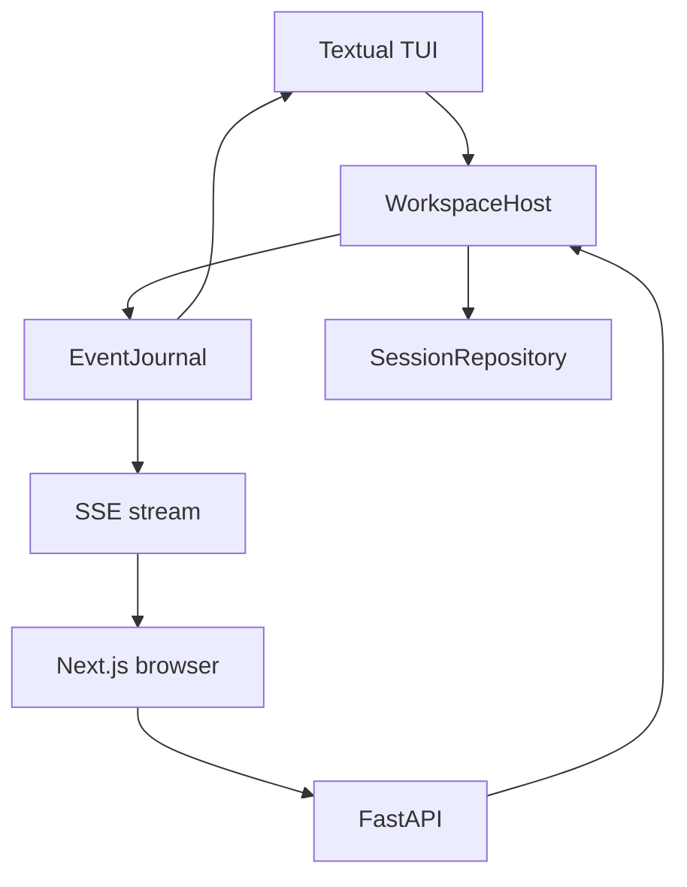
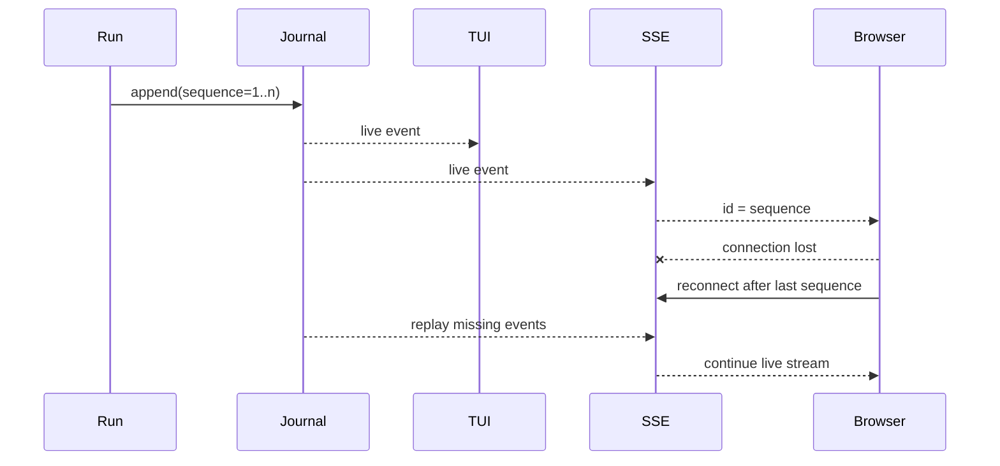

# 5. 会话、事件与客户端

## 5.1 单一权威、多种客户端

TUI 与 Web 不各自维护一套 Agent 状态。它们通过 `WorkspaceHost` 看到同一 session、run、approval 和 event sequence。

## 5.2 Command 模型

应用层命令定义在 `application/models.py`：

- session：`CreateSession`、`ListSessions`；
- run：`StartRun`、`RetryRun`、`CancelRun`；
- interaction：`QueueRunInput`、`DecideApproval`；
- settings：`SetApprovalMode`、`SelectModel`；
- capability：`InvokeSkill`、`ContextControl`。

`dispatch` 的重载让每类命令拥有确定返回类型。客户端只需要理解这些 command/result，不需要操作 coordinator 内部对象。

## 5.3 Event Journal

`TimelineEventRecord` 是稳定的 tagged representation：`type + data + sequence`。它允许公开事件进入 JSONL、恢复为 dataclass，也让 SSE 用 sequence 实现断线续传。

## 5.4 SessionRepository

会话文件是 append-only JSONL：

- 第一条记录保存 session metadata；
- 后续每条 turn 保存 user input、状态、messages、timeline events、approval、usage、plan、diagnostics 与 compaction；
- `load` 对不完整/非法 JSON 行明确报 `SessionCorruptError`，避免把损坏文件静默解释为合法状态；
- active prefix、rolling summary 和 checkpoint 可从 turn 中恢复；V2 checkpoint 必须通过 parent/range/cursor/digest/full-history 校验，V1 只读兼容并映射为绝对 transcript 边界；
- checkpoint 状态只在 append + `fsync` 成功后发布到运行中内存；
- 分页读取用于长时间线，不要求一次挂载全部 UI widget。

## 5.5 TUI adapter

Textual UI 的核心职责是把 `RunEvent` 投影为 timeline：

- 33ms 合并流式 Markdown；
- 固定 Todo/Plan 面板；
- 工具卡片和审批队列；
- 有限 widget 窗口与向上分页；
- `/context`、`/memory`、`/mcp` 等 command；
- prompt history、`@file` 和 `/` 补全；
- 离开底部后停止自动滚动，保留阅读位置。

## 5.6 Web adapter

FastAPI 提供 bootstrap、session、run、approval、context 和文件搜索端点。安全策略包括：

- 默认只监听 loopback；
- 一次性启动 token 换取 HttpOnly cookie；
- SSE 通过 sequence 恢复；
- 浏览器刷新不取消后台 run；
- OpenAPI schema 生成 TypeScript contract，CI 检查漂移。
