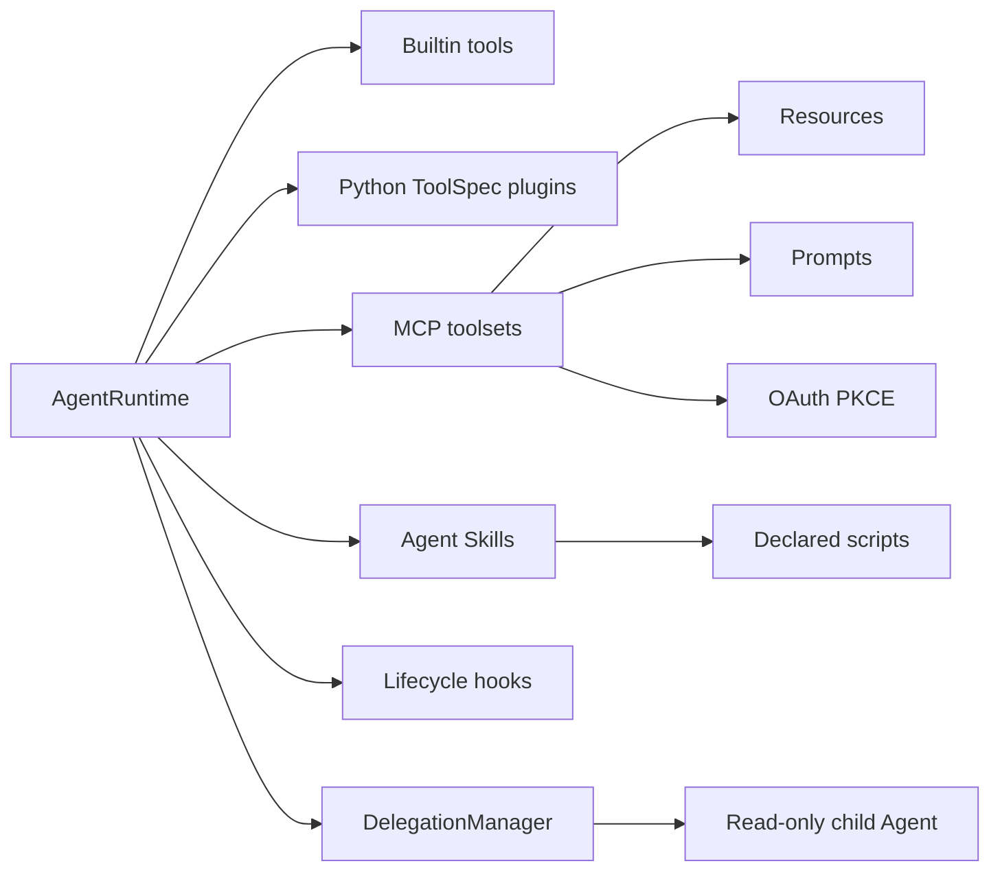
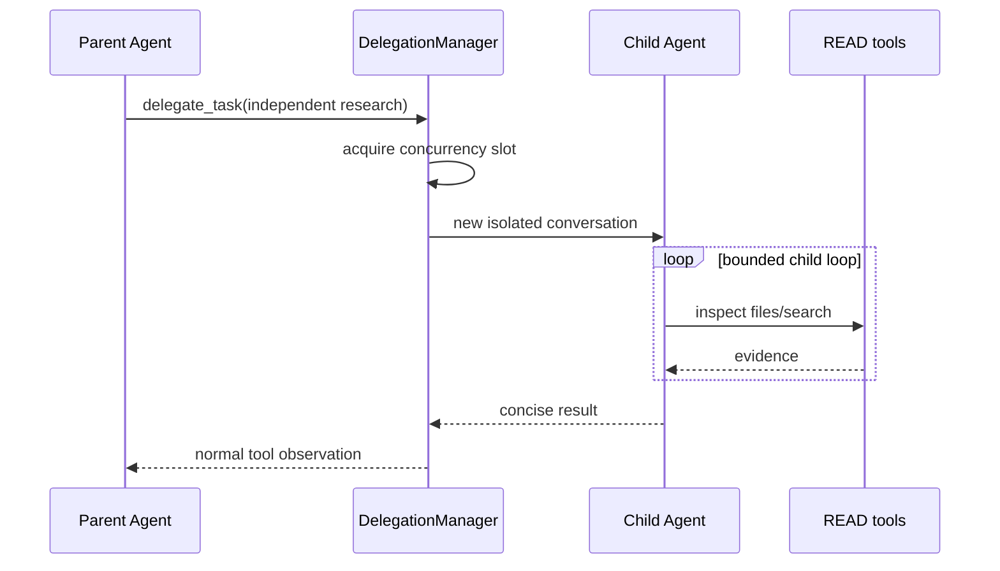

# 6. 扩展体系与子 Agent

## 6.1 能力来源总览

## 6.2 MCP

每个 MCP server 由 `McpToolsetBundle` 包装，负责：

- 将原始工具名映射为 `<server>_<tool>`；
- 为每个工具确定 risk 和 approval；
- 根据 `defer_tools` 与 `always_load_tools` 控制 schema 可见性；
- required server 启动失败时阻止启动，optional server 只产生 warning；
- resources/prompts 由 `McpContentRegistry` 单独管理。

MCP resource 不会因“被发现”自动污染上下文。显式激活时正文写入内容寻址 artifact，并只在当前 session 形成 resource snapshot；resume 恢复相同 revision，默认不自动 refetch。MCP prompt 也只在用户调用时渲染，并作为不可信外部模板包装，不能授予权限。

OAuth 使用授权码 + PKCE，凭证文件限制为 `0600`，支持刷新令牌。远端 server 的环境变量与本地 stdio server 的进程环境分别处理。

## 6.3 Agent Skills

Skill 发现优先级为 builtin < user < project。`SKILL.md` frontmatter 描述名称、说明、是否允许模型自主调用以及声明脚本。

运行流程：

1. 启动时只把精简 catalog 放入上下文；
2. 模型调用 `load_skill` 后，完整正文成为当前 session 的内容寻址 snapshot；
3. 相邻资源通过 `read_skill_resource` 读取，并限制在 Skill 目录；
4. 声明脚本通过 `run_skill_script` 执行，不能运行任意未声明文件；
5. script 环境经过清理，仍按 EXECUTE 风险审批；激活本身绝不执行脚本。

## 6.4 Tool 插件与 Hook

Python tool plugin 返回 `list[ToolSpec]`，适合增加模型可调用能力。Hook 面向生命周期拦截，适合策略、审计、格式化和通知。二者不是同一抽象：plugin 提供“做什么”，hook 改变“何时允许以及前后发生什么”。

## 6.5 子 Agent 委派

当前约束是有意设计的：

- 默认关闭，避免意外模型费用；
- 每个 child 使用新的 conversation；
- 只获得 `risk=read` 的本地工具；
- 不获得 MCP、write、execute 或 `delegate_task`；
- 委派深度固定为一层；
- 独立限制 concurrency、request、tool call 与 timeout；
- child 只返回结果，不直接向 UI 写事件或修改 session。

这适合并行代码检索、竞争假设和模块审查，不适合需要多 Agent 协作编辑、共享任务列表或长生命周期通信的场景。
