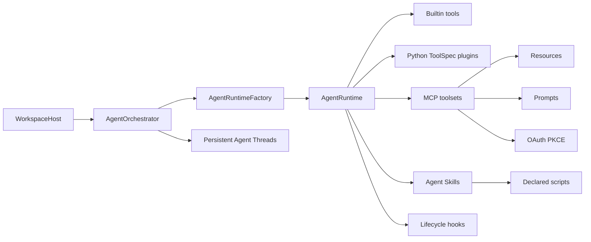
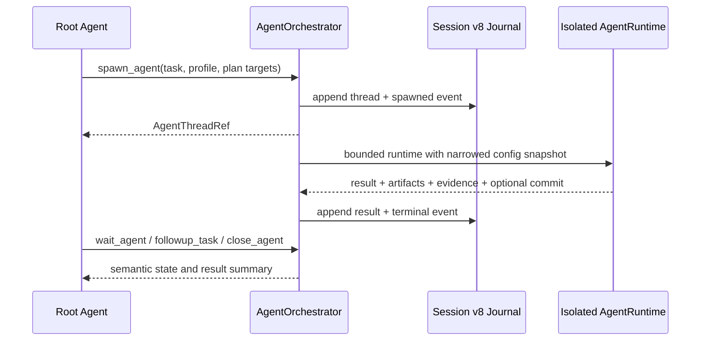

# 6. 扩展体系与子 Agent

## 6.1 能力来源总览

## 6.2 MCP

每个 MCP server 由 `McpToolsetBundle` 包装，负责：

- 将原始工具名映射为 `<server>_<tool>`；
- 为每个工具确定 risk 和 approval；
- 根据 `defer_tools` 与 `always_load_tools` 控制 schema 可见性；
- required server 启动失败时阻止启动，optional server 只产生 warning；
- resources/prompts 由 `McpContentRegistry` 单独管理。

MCP resource 不会因“被发现”自动污染上下文。显式激活时正文写入内容寻址 artifact，并只在当前 session 形成 resource snapshot；resume 恢复相同 revision，默认不自动 refetch。MCP prompt 也只在用户调用时渲染，并作为不可信外部模板包装，不能授予权限。

OAuth 使用授权码 + PKCE，凭证文件限制为 `0600`，支持刷新令牌。远端 server 的环境变量与本地 stdio server 的进程环境分别处理。

## 6.3 Agent Skills

Skill 发现优先级为 builtin < user < project。`SKILL.md` frontmatter 描述名称、说明、是否允许模型自主调用以及声明脚本。

运行流程：

1. 启动时只把精简 catalog 放入上下文；
2. 模型调用 `load_skill` 后，完整正文成为当前 session 的内容寻址 snapshot；
3. 相邻资源通过 `read_skill_resource` 读取，并限制在 Skill 目录；
4. 声明脚本通过 `run_skill_script` 执行，不能运行任意未声明文件；
5. script 环境经过清理，仍按 EXECUTE 风险审批；激活本身绝不执行脚本。

## 6.4 Tool 插件与 Hook

Python tool plugin 返回 `list[ToolSpec]`，适合增加模型可调用能力。Hook 面向生命周期拦截，适合策略、审计、格式化和通知。二者不是同一抽象：plugin 提供“做什么”，hook 改变“何时允许以及前后发生什么”。

## 6.5 原生多 Agent Runtime

`AgentOrchestrator` 由 `WorkspaceHost` 按根 Session 生命周期持有，是 Agent 状态、消息和调度的唯一权威；模型工具只是薄 Adapter。`AgentRuntimeFactory` 复用正常的 `AgentRuntime` 创建隔离 child runtime，并在创建时固化实际生效的模型、工具、审批、sandbox、cwd 与限额快照。

当前 V1 约束：

- 默认 `adaptive`；用户、项目指令或 Skill 明确要求并行时必须委派；
- 最大深度一层，child 不获得任何多 Agent 控制工具；
- `explorer` 只获得父级有效工具中的 `EffectKind.observe` 交集；
- `default` 与 `worker` 在独立 Git worktree 中执行写操作；
- 角色只能收窄父级模型、工具、审批与 sandbox 能力，不能扩大；
- Session 级并发、每 Run Agent 数、request、tool call 与 timeout 均有独立上限；
- 消息、事件、结果和不可伪造 evidence 追加写入 Session v8，大正文进入 ArtifactStore；
- worktree 导入先检查父工作区 dirty path 和三方冲突，重叠时进入协调状态；
- 活动、待审批、未送达结果、未处理失败、待导入、冲突或未通过证据都会阻止根 Agent 完成。

旧 `spawn_child`、`wait_children`、`cancel_child` 与 Child Run Host API 由兼容 Adapter 转发，不再作为新运行时的状态权威。完整设计决策见 [10-native-multi-agent-runtime.md](10-native-multi-agent-runtime.md)。
