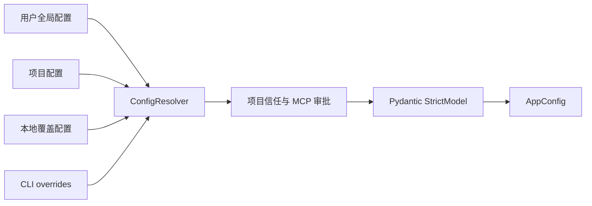
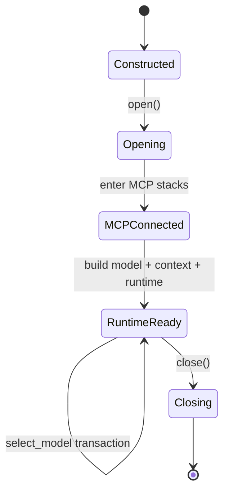

# 7. 配置、数据与生命周期

## 7.1 配置来源与合并

默认配置解析器按层读取并合并：

关键规则：

- 未知字段直接报错；
- 相对路径按声明所在配置层解析；
- secret 可以来自环境变量，不写入序列化配置；
- project-local executable 配置受 trust 控制；
- MCP 定义保留来源 scope、fingerprint 与 approval 状态；
- 单模型 `agent.model` 与多模型 `agent.models` 互斥。

## 7.2 AppConfig 结构

| 区域 | 控制内容 |
|---|---|
| `agent` | 模型、指令、请求限制、并行工具、Skill 开关 |
| `tools` | builtin 与 Python plugin |
| `mcp_servers` | transport、schema 延迟、risk、OAuth、resource/prompt |
| `permissions` | 默认模式、always allow/deny |
| `sessions` | JSONL 会话目录 |
| `agent.models.*.context` | 模型 profile、window/output/tokenizer 与模型级覆盖 |
| `context` | ratio 阈值、recent 上限、summary 与后台压缩策略 |
| `memory` | recall、自动学习、队列重试 |
| `delegation` | 子 Agent 并发与用量限制 |
| `hooks` | 生命周期 hook adapter |

## 7.3 ResourceManager 生命周期

构造阶段发现 Skill、注册本地工具、构造 MCP bundles 和 metadata。`open` 才建立远端连接并创建 runtime。模型切换使用事务式 rebuild：每个模型按“显式字段 → 显式 profile → 精确 slug alias → 80k conservative fallback”重新解析 `ResolvedContextPolicy` 和 token counter，再创建新的 ContextEngine；新 runtime 构建成功后才关闭旧 runtime，失败则恢复旧实例。session 的 rolling checkpoint 不丢失；从大窗口切到小窗口时，新 Engine 会立即按新 hard limit 安全降级或在 provider I/O 前明确失败。

`openai:`、`api: chat/responses` 和 `base_url` 只描述传输，不参与模型能力推断。`settings.max_tokens` 会被完整预留；若超过已知 profile 的架构输出上限，配置加载失败。旧 `context.soft_token_limit` / `keep_recent_tokens` 是兼容覆盖，并在 `/context` 中标记。

## 7.4 主要持久化位置

| 数据 | 默认位置 | 语义 |
|---|---|---|
| session | `.lumen/sessions/*.jsonl` | append-only 对话事实 |
| artifacts | `~/.lumen/artifacts/` | 大型工具输出内容寻址存储 |
| memory authority | `~/.lumen/state/memory.sqlite3` | 长期记忆权威库 |
| memory queue | `~/.lumen/state/memory-work.sqlite3` | 后台提取任务 |
| memory projection | `~/.lumen/projects/<id>/memory/` | 人类可读审计投影 |
| MCP OAuth | session credential root 下的受限文件 | refresh/access token |

## 7.5 数据信任级别

Context block 记录 source、trust、retention 和 evidence。系统指令、用户输入、本地已验证结果、模型输出、外部 MCP 内容不应被视为相同信任级别。尤其在自动记忆学习时，未经本地验证的外部内容不能独立提升为 durable fact。
