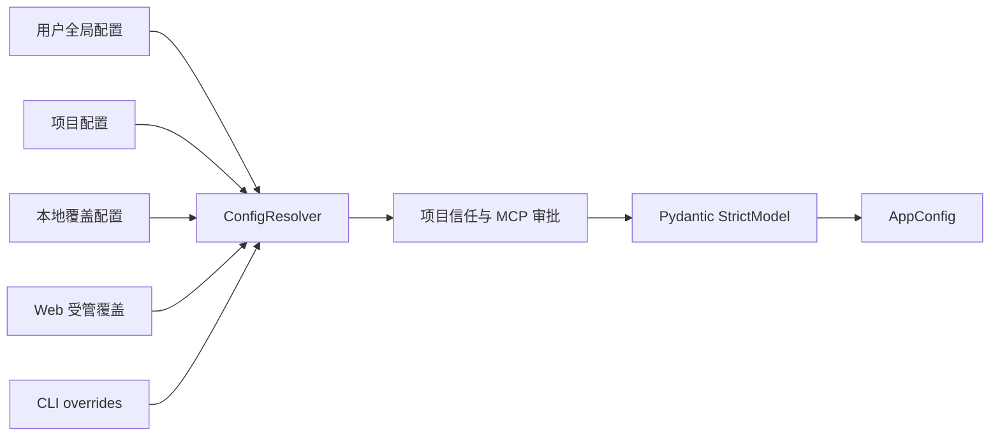
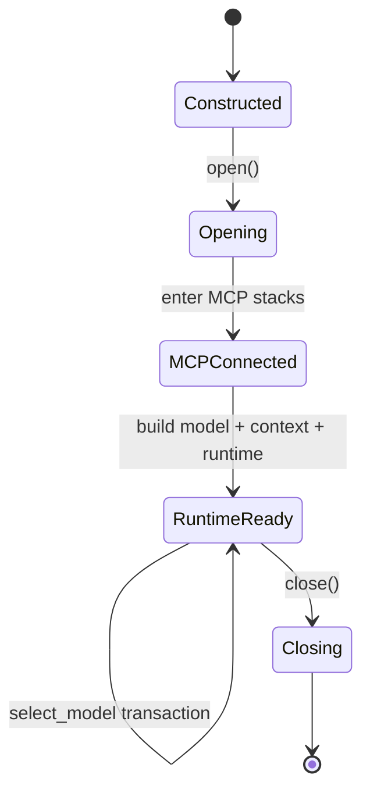

# 7. 配置、数据与生命周期

## 7.1 配置来源与合并

默认配置解析器按层读取并合并：

关键规则：

- 未知字段直接报错；
- 相对路径按声明所在配置层解析；
- secret 可以来自环境变量，不写入序列化配置；
- project-local executable 配置受 trust 控制；
- MCP 定义保留来源 scope、fingerprint 与 approval 状态；
- 单模型 `agent.model` 与多模型 `agent.models` 互斥。

Web 模型设置不重写用户维护的 YAML，而由 `WorkspaceConfiguration` 写入最高优先级的
`<workspace>/.lumen/agent.web.yaml`。该文件带所有权标记、使用 `0600` 权限并通过同目录临时文件
`fsync + os.replace` 原子发布；没有标记的同名文件拒绝覆盖。保存前先以 `ConfigResolver` 的
`source_overrides` 对完整合并结果执行严格校验，再以所有配置层内容摘要做乐观并发检查。
`--config` 独占模式保持只读。保存只更新下次启动的注册表，活动 Run 会阻止修改，浏览器会明确返回
`restartRequired`，不会伪装成运行时热切换。旧的单模型形式转换为注册表时，Module 会把原模型复制为
同名注册项并维持原默认选择；原模型若只有内联密钥则安全失败，要求先迁移到 `api_key_env`。

`ConfigResolver.resolve().report()` 是只读 observation projection：它展示最终配置、参与合并的 source 与显式字段 provenance，但不参与运行决策。`api_key`、MCP env/header、OAuth secret 等值在投影前统一脱敏；CLI 的 `--dump-effective-config` 只序列化该报告。

`docs/generated/contracts.json` 从当前 `AppConfig`、`WorkspaceCommand/CommandResult`、`RunEvent`、`ToolSpec` 枚举以及 Session schema/record authority 生成。`python -m lumen.contracts --check` 是 CI freshness gate；生成物只用于导航和漂移检测，不成为第二套运行 schema。

## 7.2 AppConfig 结构

| 区域 | 控制内容 |
|---|---|
| `agent` | 模型、指令、请求限制、并行工具、Skill 开关 |
| `tools` | builtin、Python plugin、Web fetch/search provider |
| `mcp_servers` | transport、schema 延迟、risk、effect、安全重试、OAuth、resource/prompt |
| `permissions` | 默认模式、always allow/deny；交互产生的项目永久规则另存状态文件 |
| `sessions` | JSONL 会话目录 |
| `agent.models.*.context` | 模型 profile、window/output/tokenizer 与模型级覆盖 |
| `context` | ratio 阈值、recent 上限、summary 与后台压缩策略 |
| `memory` | recall、自动学习、队列重试 |
| `agents` | 原生 Agent Profile、并发、每 Run 数量与用量限制；`delegation` 仅为弃用兼容输入 |
| `sandbox` | `workspace_write` / `disabled` 与平台 Adapter 配置 |
| `live` | Realtime Route、provider、媒体与严格 completion |
| `hooks` | 生命周期 hook adapter |

长任务配置的当前默认值：`agent.limits.request_count`、`tool_calls`、
`model_request_timeout_seconds` 均为 `null`；`model_stream_idle_timeout_seconds=300`，
`model_retries=5`，退避基础值 `model_retry_delay_seconds=2`、单次上限
`model_retry_max_delay_seconds=60`。空闲计时随数据到达延续，显式总时限不延续。
原生 `agents.request_count/tool_calls/timeout_seconds` 同样默认 `null`，请求/工具预算与父配置取
更严格值。旧有限配置和 delegation 兼容映射保持有效，不自动改写或续租。
完整字段含义、计数和排障见[第 14 章](14-long-running-recovery.md)。

这些设置不会热替换正在运行的 Python 类；源码升级后需重启 Lumen 进程。

`agent.limits.parallel_tool_calls` 默认 `parallel_safe`。只有已明确声明 PARALLEL_SAFE 的
调用可重叠；控制工具、未知副作用和 exclusive 调用仍作为有序屏障。
显式 `sequential` 配置保持有效，加载旧配置不会改写文件。

### 文本 Agent 推理强度（2026-09-08）

模型配置新增 `reasoning_effort` 和可选 `reasoning_levels`。档位为
`provider_default/off/minimal/low/medium/high/xhigh/max`；可选集合由模型、协议、端点对应的
Provider 显式目录或部署能力声明决定；不再使用 SDK 宽泛名称推断。DeepSeek V4、Kimi K3 和百炼
Anthropic 路由的 Qwen 3.8 有专门映射；不能仅凭 `anthropic:` 前缀认定兼容模型支持 Claude 档位。
未知模型标记“推理控制未配置”，已知不支持的模型标记“不支持调节”，单一默认选项不可点击。
`level_map` 向客户端提供别名与实际强度，例如 DeepSeek `medium → high`、Qwen `high → xhigh`。
新初始化模板对已知推理模型设置 medium；旧配置缺省继续保留原有 Provider/SDK 行为。
`provider_default` 表示不发送应用指定档位，`off` 表示明确关闭；不支持关闭时拒绝，不向上钳制。
内置目录只收录 OpenAI 5.6/6 及当前 DeepSeek、百炼、Kimi 路由；Claude、Gemini 无内置条目。

`reasoning.py` 负责 requested → effective → parameters 的统一解析；OpenAI Chat/Responses
直接设置对应原生 effort；DeepSeek Chat 另发送 thinking 开关。Anthropic 兼容路由使用
原生 effort。自定义部署声明仍保留预算型 Anthropic 和 Google level 参数 Adapter。
自定义预算型 Anthropic medium 固定使用 Lumen 的 10000 token 策略，不等同于 pi 的 8192。
显式 `max_tokens` 不会被偷偷放大；预算不够时配置或切换安全失败。

优先级：child 角色显式选择 > 同模型父 Session 有效选择 > 模型配置 > Provider 默认。
CLI `--thinking` 在首次打开该 Session 时追加覆盖；TUI `/thinking` 和 Web 选择器通过
Host `SelectReasoning` 更新同一状态。仅空闲时可切换，下次 Run 前冻结。每个 Session 按
逻辑模型名与实际模型 ID 保存选择；切换模型不会把其他模型的档位带过去。

同层新档位与旧 settings 推理字段混用时报错；Session/角色显式覆盖会替换旧原生冲突字段。
高层显式选择也清理 `extra_body` 中已知的推理控制及 `output_config.effort`，保留其中无关字段；
同层配置混用仍报错。未选择新档位的旧 settings
保持兼容，UI 标记为未校验，不声称获知服务端实际预算。

Session v10 起使用原有 `session_settings` 和 `agent_thread.config` 保存类型化推理选择与参数，
只包含推理字段，不能持久化任意 settings、凭据或 extra_body；DeepSeek Chat 开关只保存类型化
`wire_thinking`。v1–v10 只读加载，首次追加
新事实才写 `schema_upgrade`；fork 保留 Session 选择，旧 child 快照保留兼容解析。
新 child spawn 冻结选择；同模型继承父级，角色改模型则重新按目标模型解析。
Session 恢复保留用户选择，同时从当前模型刷新能力元数据，防止历史上的单选列表锁死新能力；
新 Run 开始前重新校验显式选择、解析参数并追加变化事实，已派发 child 的冻结快照不随之漂移。
Web 设置页通过 Host `InspectReasoning` 查询正在编辑的模型定义，复用同一解析器；
`POST /api/v1/configuration/reasoning` 只做本地能力解析，不写配置、不访问 Provider。
请求诊断 `resolved_reasoning` 记录来源、映射和客户端参数，不代表服务端回显或真实预算。
Live Realtime 的 `reasoning_effort` 仍属于独立协议。
供应商规则、代理的 `reasoning_profile`、来源审计及升级流程见
[Provider 目录约定](15-provider-catalog.md)和[自动生成的对应列表](../generated/provider-reasoning.md)。

模型还可配置 `native_web_search.mode: auto|enabled|disabled` 与
`search_context_size: low|medium|high`。`auto` 只开启 Provider Catalog 精确核对的路由；当前为
DeepSeek V4 Flash / Pro Responses、Kimi Code K3 Responses，以及百炼 Qwen3.8 Max / Flash
Anthropic 端点。该配置随模型定义保存并进入冻结 Driver 请求，不复用 MCP 开关或 ToolRegistry
状态。目录还拥有可选字段兼容性：Kimi K3 保留 `web_search`，但在 wire request 中省略其拒绝的
`search_context_size`。

MCP server 的定义仍在 `mcp_servers.<name>`，启停策略单独保存在 `mcp.enabled.<name>`。
Web 设置只写受管层的布尔值；`false` 会在 ResourceManager 构建连接前排除 server，且保存后需重启。

## 7.3 ResourceManager 生命周期

构造阶段发现 Skill、注册本地工具、构造 MCP bundles 和 metadata。`open` 才建立远端连接并创建 runtime。模型切换使用事务式 rebuild：每个模型按“显式字段 → 显式 profile → 精确 slug alias → 80k conservative fallback”重新解析 `ResolvedContextPolicy` 和 token counter，再在局部 candidate Scope 中创建并完整打开新的 ContextEngine、`PydanticAIModelDriver` 和唯一的 `LumenAgentLoop` Runtime。成功后以一次无等待赋值同时发布 Runtime、Scope、Memory extractor 与活动模型名，再关闭旧 Scope；构建失败不修改共享引用。Host 状态锁串行化 start/switch。session 的 rolling checkpoint 不丢失；从大窗口切到小窗口时，新 Engine 会立即按新 hard limit 安全降级或在 provider I/O 前明确失败。

可逆注册由内部 `RegistrationScope` 持有。它只管理 Tool/Hook/MCP/Capability disposer 和后台 task 生命周期，不保存 Session、Plan、Agent 或 Work Product 状态。模型切换先在候选 runtime Scope 内完成构建与验证，再原子发布并关闭旧 Scope；关闭会取消并等待 task、以 LIFO 执行所有 disposer，单个清理异常不会阻断其余清理，并只保留有界 diagnostic。同一 `ResourceManager` 重开或重复切换不会累积 MCP schema、toolset、listener 或 capability。

`openai:` / `anthropic:`、`api: chat/responses` 和 `base_url` 只描述传输，不参与模型能力推断。
`settings.max_tokens` 会被完整预留并原样用于 Provider 请求；未显式配置时，resolved profile reserve 会被
写入请求。未知模型按 window 自适应选择初始 reserve（80K fallback window 对应 16K，大窗口最多 32K，
且始终不超过 window 的 1/4），并可在 length stop 后有界增长。若配置超过已知 profile 的架构输出
上限，配置加载失败。旧 `context.soft_token_limit` / `keep_recent_tokens` 是兼容覆盖，并在 `/context` 中标记。

## 7.4 主要持久化位置

| 数据 | 默认位置 | 语义 |
|---|---|---|
| session | `.lumen/sessions/*.jsonl` | append-only 对话事实 |
| artifacts | `~/.lumen/artifacts/` | 大型工具输出内容寻址存储 |
| memory authority | `~/.lumen/state/memory.sqlite3` | 长期记忆权威库 |
| memory queue | `~/.lumen/state/memory-work.sqlite3` | 后台提取任务 |
| memory projection | `~/.lumen/projects/<id>/memory/` | 人类可读审计投影 |
| approval rules | `~/.lumen/state/approval-rules/<id>.json` | 项目级跨 Session allow 规则 |
| Web managed config | `.lumen/agent.web.yaml` | 机器管理的模型覆盖；不保存密钥明文 |
| MCP OAuth | session credential root 下的受限文件 | refresh/access token |
| contract catalog | `docs/generated/contracts.json` | 可重建的 schema/枚举导航投影，不是运行权威 |

## 7.5 数据信任级别

Context block 记录 source、trust、retention 和 evidence。系统指令、用户输入、本地已验证结果、模型输出、外部 MCP 内容不应被视为相同信任级别。尤其在自动记忆学习时，未经本地验证的外部内容不能独立提升为 durable fact。
# 配置与数据
