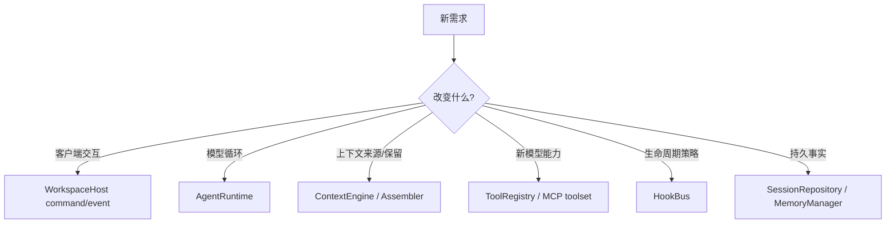

# 8. 源码导航与调试指南

## 8.1 按问题定位入口

| 你要修改的问题 | 首先阅读 | 通常还需阅读 |
|---|---|---|
| Agent 为什么没继续调用工具 | `runtime.py` | `tools/execution.py`、provider 配置 |
| TUI 与 Web 状态不一致 | `application/host.py` | `application/events.py`、`api/app.py` |
| resume 后上下文错误 | `run_coordinator.py` | `sessions.py`、`context/engine.py` |
| token 超限或压缩异常 | `context/engine.py` | `assembler.py`、`compaction.py`、`budget.py`、`tokenizers.py` |
| 工具越权或审批不正确 | `tools/registry.py` | `approval.py`、`hooks.py`、`tools/workspace.py` |
| MCP 工具未出现 | `mcp_tools.py` | `resources.py`、`config.py` |
| MCP 断线/调用报错中断 run | `mcp_tools.py`（`ResilientMcpToolset`） | `resources.py`、`tools/execution.py` |
| 历史 receipt 细节丢失 | `resources.py`（`read_artifact`） | `context/artifacts.py`、`context/transcript.py` |
| Skill 未加载/脚本被拒绝 | `skills.py` | `resources.py`、Skill `SKILL.md` |
| Web 断线后漏事件 | `application/events.py` | `api/app.py`、Web reducer |
| 长期记忆污染 | `context/memory/manager.py` | `extraction.py`、`redaction.py`、`records.py` |
| 子 Agent 行为异常 | `delegation.py` | `resources.py`、`config.py` |

## 8.2 推荐阅读调用链

```text
cli.py
  -> config_resolver.py / config.py
  -> resources.py
  -> application/host.py
  -> run_coordinator.py
  -> runtime.py
       -> context/engine.py
       -> pydantic_ai Agent
       -> tools / MCP / hooks / delegation
  -> sessions.py
  -> events.py
  -> ui/app.py 或 api/app.py
```

## 8.3 测试分层

- 纯规则：config、budget、workspace path、error classification；
- module interface：ContextEngine、WorkspaceHost、RunCoordinator；
- runtime integration：FunctionModel/TestModel 驱动工具循环；
- adapter：FastAPI endpoint、Web reducer、Textual snapshot；
- packaging：OpenAPI schema、Next build、wheel 内置静态资源和 Skills。

常用质量门：

```bash
uv run ruff check .
uv run pyright
uv run pytest
pnpm --dir src/web test
pnpm --dir src/web typecheck
pnpm --dir src/web build
uv build
```

## 8.4 新功能应放在哪个 seam



不要让 TUI 直接修改 runtime 内部字段，也不要让工具自行写 timeline。新行为应通过相应 interface 返回结果或发出类型化事件，使 TUI、Web、测试和恢复逻辑同时受益。

## 8.5 当前值得继续深化的方向

1. 将后台子 Agent 状态提升为应用层可订阅事件；
2. 引入 worktree adapter，让可写子 Agent 隔离文件系统；
3. 统一插件、Hook、命令和 UI 扩展的发行 interface；
4. 增加真实模型任务基准，而不只验证确定性单元行为；
5. 提供可选 OS sandbox adapter；
6. 为文件编辑增加 checkpoint/rewind module。
