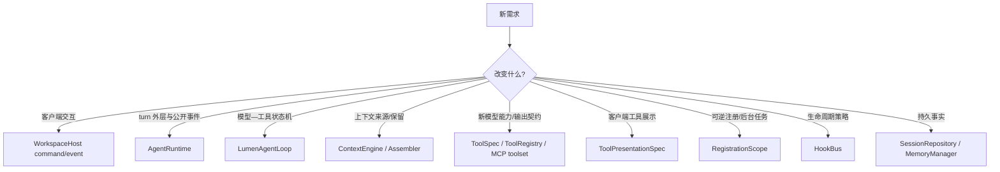

# 8. 源码导航与调试指南

## 8.1 按问题定位入口

| 你要修改的问题 | 首先阅读 | 通常还需阅读 |
|---|---|---|
| Agent 为什么没继续调用工具 | `runtime.py`、`agent_loop/loop.py` | `agent_loop/pydantic_driver.py`、`tools/gateway.py`、`resources.py`、provider 配置 |
| TUI 与 Web 状态不一致 | `application/host.py` | `application/events.py`、`api/app.py` |
| resume 后上下文错误 | `run_coordinator.py` | `sessions.py`、`context/engine.py` |
| token 超限或压缩异常 | `context/engine.py` | `assembler.py`、`compaction.py`、`budget.py`、`tokenizers.py` |
| 工具越权或审批不正确 | `tools/registry.py` | `approval.py`、`trust.py`、`hooks.py`、`tools/workspace.py`、`sandbox.py` |
| 工具结果、模型文本与 UI 卡片不一致 | `tools/spec.py` | `tools/presentation.py`、`tools/gateway.py`、`events.py` |
| 安全工具被串行或非安全工具被并行 | `tools/spec.py`（`concurrency_for`） | `runtime.py`、`tools/gateway.py` |
| 文件 mutation 报 `STALE_RESOURCE` | `tools/workspace.py` | `tools/capability.py`、`work_products/adapters.py` |
| MCP 工具未出现 | `runtime.py`（`_lumen_tool_schemas` / `search_tools`） | `resources.py`、`mcp_tools.py`、`config.py` |
| MCP 断线/调用报错中断 run | `mcp_tools.py`（`ResilientMcpToolset`） | `resources.py`、`agent_loop/loop.py`、`tools/gateway.py` |
| 历史 receipt 细节丢失 | `resources.py`（`read_artifact`） | `context/artifacts.py`、`context/transcript.py` |
| Skill 未加载/脚本被拒绝 | `skills.py` | `resources.py`、Skill `SKILL.md` |
| Web 断线后漏事件 | `application/events.py` | `api/app.py`、Web reducer |
| `/context` 与实际 provider 请求不一致 | `run_diagnostics.py`、`agent_loop/loop.py`（request manifest） | `context/types.py`、`run_coordinator.py`、`sessions.py` |
| 重开/切换模型后工具或 listener 重复 | `lifecycle.py` | `resources.py`、`tools/registry.py`、`tools/gateway.py` |
| CLI/TUI/Web 能力清单不一致 | `resources.py`（`capabilities_report`） | `application/host.py`、`api/app.py`、`ui/slash_handlers.py` |
| Web 抓取被拒绝或搜索未注册 | `tools/web.py` | `resources.py`、`config.py`、DNS/redirect SSRF 校验 |
| Live 语音连接、工具或恢复异常 | `live/manager.py` | `live/router.py`、`live/protocol.py`、Provider Adapter、`tools/gateway.py`、Web media client |
| 长期记忆污染 | `context/memory/manager.py` | `extraction.py`、`redaction.py`、`records.py` |
| 子 Agent 行为异常 | `agents/orchestrator.py` | `agents/runtime_factory.py`、`resources.py`、`sessions.py` |

## 8.2 推荐阅读调用链

```text
cli.py
  -> config_resolver.py / config.py
  -> resources.py
  -> application/host.py
  -> run_coordinator.py
  -> runtime.py
       -> context/engine.py
       -> agent_loop/LumenAgentLoop（唯一 Loop 权威）
       -> PydanticAIModelDriver -> pydantic_ai Model / Provider Adapter
       -> CapabilityGateway -> tools / MCP / hooks / agents
  -> sessions.py
  -> events.py
  -> ui/app.py 或 api/app.py
```

## 8.3 测试分层

- 纯规则：config、budget、workspace path、error classification；
- module interface：ContextEngine、WorkspaceHost、RunCoordinator；
- runtime integration：FunctionModel/TestModel 驱动工具循环；
- adapter：FastAPI endpoint、Web reducer、Textual snapshot；
- packaging：OpenAPI schema、Next build、wheel 内置静态资源和 Skills。

常用质量门：

```bash
uv run ruff check .
uv run pyright
uv run python -m lumen.contracts --check
uv run pytest
pnpm --dir src/web test
pnpm --dir src/web typecheck
pnpm --dir src/web build
uv build
```

## 8.4 新功能应放在哪个 seam



不要让 TUI 直接修改 runtime 内部字段，也不要让工具自行写 timeline。新行为应通过相应 interface 返回结果或发出类型化事件，使 TUI、Web、测试和恢复逻辑同时受益。展示 renderer 必须是从 durable args/result 派生的纯投影；注册必须有 disposer，领域状态不能藏进 `RegistrationScope`。

## 8.5 当前值得继续深化的方向

1. 继续缩小 `WorkspaceHost.dispatch` 的命令认知面，同时保持它是所有客户端共享的唯一应用 seam；
2. 为 Agent progress、Live recovery 和 Work Product completion gate 增加跨 TUI/Web/headless 的契约矩阵；
3. 用既有 request receipts、usage 与 `latest_run` 投影建立真实 Provider 任务基线，不新增 telemetry
   store 或后台平台；
4. 只有出现第二个真实发行 Implementation 或稳定替换需求时，才扩展插件、Hook 或 UI 发行 Interface。
