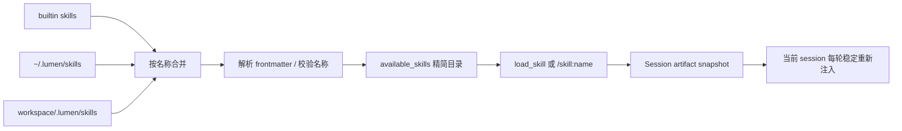

# MCP 与 Agent Skills 深入说明

MCP 和 Skill 都能扩展 Lumen，但它们解决的问题不同：MCP 是连接外部系统的协议适配层，Skill 是向模型渐进式披露专业方法的本地指令包。

## 1. 核心区别

| 维度 | MCP | Agent Skill |
|---|---|---|
| 本质 | 协议连接与外部能力适配器 | 指令、参考资料与声明脚本组成的本地包 |
| 主要内容 | tools、resources、prompts | `SKILL.md`、references、scripts |
| 发现方式 | `mcp_servers` 配置 | 扫描 builtin、user、project skill roots |
| Runtime 入口 | `MCPToolset` | compact catalog + `SessionContextManager` |
| 上下文策略 | 延迟工具 Schema，资源按 session 显式激活 | 先目录、后正文，session artifact snapshot |
| 默认信任 | 外部未知；未分类工具必须确认 | 仅允许已发现且路径受约束的 Skill |

## 2. MCP 工具接入链路


关键实现：

- `build_mcp_toolset()` 根据配置建立 `StdioTransport` 或 `StreamableHttpTransport`；
- 每个工具公开为 `<server>_<tool>`，避免多个 Server 之间重名；
- 风险解析顺序为 `tool_risks`、兼容的 `read_only_tools`、最后 `external_unknown`；
- `external_unknown` 不会在 auto 模式中静默执行；
- deny 的工具不会进入可见 Toolset；需要确认的工具由 approval wrapper 暂停；
- `defer_tools` 默认开启，只有 `always_load_tools` 中的 Schema 常驻上下文。

### 连接韧性（ResilientMcpToolset）

包装链最外层是 `ResilientMcpToolset`，解决"连接层故障终止整个 run"的问题：

- Server 侧业务错误（`ToolError`/`McpError`）由 pydantic-ai 直接转为 `ModelRetry` 喂回模型，run 不会中断；
- 传输层错误（stdio 进程死亡、HTTP 连接断开、session 被关闭等，含全部叶子均为传输错误的 ExceptionGroup）触发一次受锁保护的重连：退出并重建底层 `MCPToolset` 会话（同时清空其工具缓存），然后重试该调用一次；
- 重连失败或重试仍失败时转为 `ModelRetry`，模型收到"server 不可用"的可行动反馈，run 继续；后续每次调用都会再次尝试重连，Server 恢复后自愈；
- `CancelledError` 与混入非传输叶子的 ExceptionGroup 原样传播，绝不吞掉取消；
- 重连结果回写 `mcp_status`，`/mcp` 可看到运行期的 ok/error 变化；
- 会话关闭使用受保护的 client exit：重连失败耗尽 enter/exit 计数后，teardown 不再因此报错。

## 3. MCP Resources 与 Prompts

`McpContentRegistry` 将工具与内容分开管理。

### Resource

启动时调用 `list_resources()` 只建立描述符目录。显式调用后，Lumen 才读取正文、写入 0600 内容寻址 artifact，并把引用追加到当前 session 的 `context_state`。`McpContentRegistry` 不再拥有 workspace-global `active_documents`。这些正文以 user-role `<context-data>` 进入 `RETRIEVED_CONTEXT`，不能因为来自 MCP 就自动提升为长期事实。

默认 `ttl=None`：resume 优先保证可复现，不会把远端已经变化的内容冒充最新事实。重新激活/显式 refresh 才生成新 revision；artifact 缺失时标记 `unavailable` 并从 Prompt 排除，不静默 refetch。

Resource 引用支持：

- 完整形式：`server::uri`；
- 简写形式：唯一的 URI 或名称；
- 引用未知或存在歧义时直接拒绝。

### Prompt

启动时调用 `list_prompts()` 只记录名称、描述和参数。显式调用 `render_prompt()` 时才通过 `get_prompt()` 请求渲染内容。发现 Prompt 本身不会把正文注入上下文。

### OAuth

OAuth 只允许用于 `streamable_http`。凭证由 `JsonCredentialStore` 单独持久化，文件权限收紧，避免令牌进入普通配置和会话记录。

## 4. Skill 发现与优先级



覆盖优先级为：

```text
builtin < user < project
```

项目级 Skill 可以覆盖用户级和内置同名 Skill。符号链接和不符合命名规范的 Skill 会被拒绝或产生诊断。

## 5. 渐进式披露

Skill 不是启动时完整注入的 Prompt 文件集合。

1. 启动阶段只把 `name`、`description`、`location` 放入 `<available_skills>`；
2. 模型根据 description 判断任务是否匹配；
3. 匹配后调用 `load_skill(name)` 获取完整正文；
4. 用户也可以使用 `/skill:<name>` 手动展开；
5. 激活正文写入内容寻址 artifact，session state 保存 name/revision/source/ref；
6. 后续请求仍受 `ACTIVE_SKILLS` zone cap 约束；
7. resume 恢复相同 artifact，不读取已变化的源文件；重新激活才更新 revision；
8. `/skill unload <name>` 只影响当前 session，P0 不自动删除失去引用的 artifact。

`disable-model-invocation: true` 的 Skill 不会出现在模型目录中，只允许用户手动调用。

## 6. Skill 资源与脚本安全

### read_skill_resource

模型不能通过普通 `read_file` 读取用户级 Skill 目录，因此 Lumen 提供更窄的 `read_skill_resource`：

- 必须先按名称解析一个已发现 Skill；
- 路径必须是相对于该 Skill `base_dir` 的相对路径；
- `resolve()` 后再次执行包含关系检查，阻止 `..` 和符号链接逃逸；
- 只读取存在的 UTF-8 文本文件。

### run_skill_script

Skill 脚本不是任意命令执行入口：

- 只能运行 Skill 解析阶段声明的脚本；
- 脚本必须仍位于 Skill 根目录；
- 仅支持 Python、sh 和 bash；
- 不使用 shell 字符串扩展；
- 只传递收紧后的环境变量集合；
- 设置 `LUMEN_WORKSPACE` 和独立超时；
- 仍按 EXECUTE 风险经过工具权限与审批。

加载或激活 Skill 只处理文本，永远不会自动运行脚本。只有显式 `run_skill_script` tool call 才可能执行上述声明脚本。

## 7. 修改入口

| 需求 | 主要源码 |
|---|---|
| MCP transport、风险、延迟 Schema、连接韧性 | `src/lumen/mcp_tools.py` |
| MCP resource / prompt 发现与激活 | `src/lumen/mcp_resources.py` |
| OAuth 凭证存储 | `src/lumen/mcp_oauth.py` |
| Skill 解析、发现、catalog | `src/lumen/skills.py` |
| Session Skill/MCP snapshot | `src/lumen/context/session_manager.py` |
| Skill 工具、资源与脚本执行 | `src/lumen/resources.py` |
| 配置模型与校验 | `src/lumen/config.py` |
