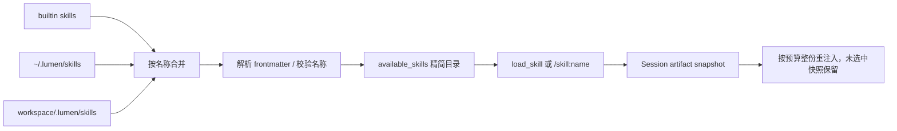

# MCP 与 Agent Skills 深入说明

MCP 和 Skill 都能扩展 Lumen，但它们解决的问题不同：MCP 是连接外部系统的协议适配层，Skill 是向模型渐进式披露专业方法的本地指令包。

Provider 原生 `web_search` 不属于 MCP。它由模型端点执行，作为冻结 `ModelDriverRequest` 的
native tool 进入请求 manifest；MCP 则先由 `ResourceManager` 建立连接，再把能力投影到统一
`CapabilityGateway`。两条路径不能共享一个开关或状态权威。

## 1. 核心区别

| 维度 | MCP | Agent Skill |
|---|---|---|
| 本质 | 协议连接与外部能力适配器 | 指令、参考资料与声明脚本组成的本地包 |
| 主要内容 | tools、resources、prompts | `SKILL.md`、references、scripts |
| 发现方式 | `mcp_servers` 配置 | 扫描 builtin、user、project skill roots |
| Runtime 入口 | `MCPToolset` | compact catalog + `SessionContextManager` |
| 上下文策略 | 延迟工具 Schema，资源按 session 显式激活 | 先目录、后正文，session artifact snapshot |
| 默认信任 | 外部未知；未分类工具必须确认 | 仅允许已发现且路径受约束的 Skill |

## 2. MCP 工具接入链路

```mermaid
flowchart LR
    Config["McpServerConfig"] --> Trust["来源 / 指纹 / 审批"]
    Trust --> Transport["stdio 或 streamable HTTP"]
    Transport --> Bundle["McpToolsetBundle"]
    Bundle --> Prefix["server_tool 名称前缀"]
    Prefix --> Risk["tool_risks / external_unknown"]
    Risk --> Deferred["deferred schema / always loaded"]
    Deferred --> Search["run-local search_tools / visible set"]
    Search --> Policy["CapabilityGateway + PermissionPolicy + HookBus"]
    Policy --> Resilient["MCP Adapter 断线重连"]
    Resilient --> Runtime["LumenAgentLoop"]
```



关键实现：

- `build_mcp_toolset()` 根据配置建立 `StdioTransport` 或 `StreamableHttpTransport`；
- 每个工具公开为 `<server>_<tool>`，避免多个 Server 之间重名；
- 风险解析顺序为 `tool_risks`、兼容的 `read_only_tools`、最后 `external_unknown`；
- `external_unknown` 不会在 auto 模式中静默执行；
- strict 模式下 unknown effect 在调用前返回 `effect_contract_required`；Risk 为 read 也不例外。
  缺失契约出现在工具说明、启动 warning 及 `effect_contracts_missing` 投影，操作者需明确配置
  `tool_effects`。已发生的外部结果保留人工对账，不让模型通过改报告解除完成门禁；
- deny 的工具不会进入可见 Toolset；需要确认的工具由 approval wrapper 暂停；
- `defer_tools` 默认开启，只有 `always_load_tools` 中的 Schema 常驻上下文。

当前生产路径只使用 `LumenAgentLoop`。MCP capability 进入唯一的 `CapabilityGateway`；deferred
工具初始不暴露 schema，模型通过保留的 `search_tools` 得到 `ToolSearchReturnPart`，被发现工具从
下一次 Provider 请求开始可见。未加载工具的伪造调用以 typed `tool_not_loaded` 安全失败。

`search_tools` 的 Provider 可见 description 包含有界工具名称和用途目录（约 6,000 字符），
从当前 Gateway 投影，不暴露父级被收窄的能力。搜索支持 Unicode 和名称、来源、描述匹配；
`queries: [""]` 或 `["*"]` 按名称浏览下一批最多 10 个未加载工具。跨语言关键词无匹配时可以
使用浏览，不把词面匹配失败解释成能力不存在。发现只加载 Schema，不改变 Risk、EffectKind 或审批。
Runtime 指令同时提供 MCP 启动连接状态；这是启动快照，不保证后续请求必然成功。

`mcp.enabled.<server>: false` 会在 `ResourceManager` 构建前排除对应 server：不连接、不加载工具、
Resources 或 Prompts，状态投影为 `disabled`。Web 设置只修改这个布尔策略并要求重启，不复制
`mcp_servers` 中的 URL、OAuth、header 或 secret；未写策略的已有 server 继续默认启用，以保持兼容。

远端 MCP 工具仍进入统一 Tool Contract：未声明副作用时 Risk 为 `external_unknown`、EffectKind 为 `unknown`，并发默认 `exclusive`。Capability observation 会显示 loaded/deferred/disabled、审批决定和 schema digest；它只解释实际策略结果，不替代 `ToolRegistry`、`PermissionPolicy` 或 MCP toolset 的权威。

### 连接韧性（ResilientMcpToolset）

包装链最外层是 `ResilientMcpToolset`，解决"连接层故障终止整个 run"的问题：

- Server 侧业务错误（`ToolError`/`McpError`）由 MCP Adapter 交给 Gateway，投影为 typed model-visible failure，run 不会因单次工具失败中断；
- 传输层错误（stdio 进程死亡、HTTP 连接断开、session 被关闭等，含全部叶子均为传输错误的 ExceptionGroup）仅对 `tool_effects: observe` 的工具触发一次受锁保护的重连：退出并重建底层 `MCPToolset` 会话（同时清空其工具缓存），然后重试该调用一次；
- 未声明、mutation、execution 和 external_action 不自动重放，返回 `mcp_outcome_unknown`，要求先核实远端结果。`tool_risks: read` 只决定审批，不能代替 `tool_effects: observe` 的幂等声明；
- observe 工具重连失败或重试仍失败时形成 typed failure，模型收到“server 不可用”的可行动反馈；后续 observe 调用仍可重新尝试连接，Server 恢复后自愈；
- `CancelledError` 与混入非传输叶子的 ExceptionGroup 原样传播，绝不吞掉取消；
- 重连结果回写 `mcp_status`，`/mcp` 可看到运行期的 ok/error 变化；
- 会话关闭使用受保护的 client exit：重连失败耗尽 enter/exit 计数后，teardown 不再因此报错。

## 3. MCP Resources 与 Prompts

`McpContentRegistry` 将工具与内容分开管理。

### Resource

启动时调用 `list_resources()` 只建立描述符目录。显式调用后，Lumen 才读取正文、写入 0600 内容寻址 artifact，并把引用追加到当前 session 的 `context_state`。`McpContentRegistry` 不再拥有 workspace-global `active_documents`。这些正文以 user-role `<context-data>` 进入 `RETRIEVED_CONTEXT`，不能因为来自 MCP 就自动提升为长期事实。

默认 `ttl=None`：resume 优先保证可复现，不会把远端已经变化的内容冒充最新事实。重新激活/显式 refresh 才生成新 revision；artifact 缺失时标记 `unavailable` 并从 Prompt 排除，不静默 refetch。

Resource 引用支持：

- 完整形式：`server::uri`；
- 简写形式：唯一的 URI 或名称；
- 引用未知或存在歧义时直接拒绝。

### Prompt

启动时调用 `list_prompts()` 只记录名称、描述和参数。显式调用 `render_prompt()` 时才通过 `get_prompt()` 请求渲染内容。发现 Prompt 本身不会把正文注入上下文。

### OAuth

OAuth 只允许用于 `streamable_http`。凭证由 `JsonCredentialStore` 单独持久化，文件权限收紧，避免令牌进入普通配置和会话记录。

## 4. Skill 发现与优先级



覆盖优先级为：

```text
builtin < user < project
```

项目级 Skill 可以覆盖用户级和内置同名 Skill。符号链接和不符合命名规范的 Skill 会被拒绝或产生诊断。

### 安装远端 Skill

安装是将原始 `SKILL.md` 和实际存在的引用资源按目录结构保存到发现根目录，不需要执行 Skill
正文中的流程。工作区写权限下使用 `.lumen/skills/<name>/`，不能尝试其他工具绕过限制写入
`~/.lumen/skills/`。项目 Skill 仍要求项目已受信任。操作者可通过
`agent.user_skill_install_enabled: true` 授权受管用户目录，默认关闭；保留父级
`sandbox.mode: disabled` 已有能力的兼容路径。这个权限仅允许受管目录安装和 Work Product
恢复，通用文件工具、命令 sandbox 和子 Agent 不会因此获得全局写权限。
安装 Tool 描述包含实际可用 scope；不可用 scope 返回结构化状态，无写入。显式全局请求不能静默
降为项目安装，且不引导用户为安装 Skill 关闭整个命令 sandbox。

在 `tools.builtins` 显式启用 `install_skill`。SkillInstaller 负责 GitHub 默认分支解析、commit
固定、ZIP 获取、候选识别和安装策略；支持仓库、tree/blob/raw URL、指定 path/ref、工作区本地源。
多候选要求精确路径，不猜目标。完整目录保留二进制资源、相对路径、空目录和可执行标记；网络阶段
有 110 秒总期限，流式下载与解包各限 32 MiB。拒绝符号链接、特殊文件、逃逸及大小写冲突。
私有仓库读取操作者环境 token，不接受工具参数中的凭据；当前无 Git/SSH 回退。

DirectoryResourceAdapter 实现既有 ResourceAdapter Interface：目录清单与全部字节存入单个
ArtifactStore snapshot，TaskWorkspace 仍是 prepared/applied/verified、恢复与完成门禁的唯一权威。
在目标同文件系统暂存后整目录发布，更新前检查原 revision；常规发布失败恢复旧目录，崩溃后的
未完成 journal 由 TaskWorkspace 对账。相同内容是 no-op，覆盖需显式授权；安装元数据检测到
本地修改时拒绝替换。Gateway 使用 `Risk.EXTERNAL` 与 `EffectKind.MUTATION`，Plan 禁止安装。

ResourceManager 是 Skill 发现的权威，安装完成、`list_skills`、按名称加载和新轮次绑定时刷新。
空目录启动也注册 Skill 发现与加载工具。Runtime 每次请求读取最新目录摘要，因此同一轮安装后
即可加载，不需要重启。已激活正文仍是 Session artifact snapshot，刷新目录不改变历史或当前激活。
下载正文和资源不会自动执行。`download_file` 保留为独立 UTF-8 原始文件传输工具。

## 5. 渐进式披露

Skill 不是启动时完整注入的 Prompt 文件集合。

1. 模型目录只把 `name`、`description` 放入 `<available_skills>`，独立计入 `CAPABILITY_CATALOG`；
2. 模型根据 description 判断任务是否匹配；
3. 匹配后调用 `load_skill(name)` 获取完整正文；
4. 用户也可以使用 `/skill:<name>` 手动展开；
5. 激活正文写入内容寻址 artifact，session state 保存 name/revision/source/ref；
6. 后续请求按完整正文选择驻留 Skill，不截断指令；最近激活的一份完整保留，较早的只整份装入；
7. resume 恢复相同 artifact，不读取已变化的源文件；重新激活才更新 revision；
8. `/skill unload <name>` 只影响当前 session，P0 不自动删除失去引用的 artifact。

`disable-model-invocation: true` 的 Skill 不会出现在模型目录中，只允许用户手动调用。

模型目录预算为 `min(window × 1%, 8000)` tokens，与工具 schema 和运行时事实分开计量。
按当前输入中的名称、描述词项匹配和名称排序选择完整条目，超长条目不截断后伪装成完整描述。
模型通过 `list_skills(query="...", offset=0, limit=20)` 搜索或分页浏览未展示条目；
`limit` 范围为 1–50，响应包含 `total` 和 `next_offset`，manual-only 条目不进入模型检索。
极小窗口连目录提示都放不下时，仍可通过工具说明发现 `list_skills`。

`ACTIVE_SKILLS` 的 10% 是常规驻留目标。最近激活的 Skill 可以超过目标，但不能突破完整请求
硬限制；确实无法容纳时 preflight 失败，不以部分指令继续执行。较早的正文在剩余目标和固定预算内
整份装入；未装入的名称通过请求内提示与 `/context` 报告暴露，重新 `load_skill` 可再次选择。
这只改变请求投影，不删除 Session 快照，也不根据模型推测新增任务生命周期状态。
压缩和 resume 都从相同 Artifact 恢复完整选中正文。`/context` 的 complete 表示完整注入，
不表示模型一定理解或遵守了指令。

加载工具仍返回全文以兼容共享该工具的子 Agent 和无 Session 调用者；不会用加载回执承诺尚未
接通的注入路径。激活时复用同一次解析的正文保存快照，避免再次扫描导致 revision 与返回正文不一致。
引用资源只在需要时读取，沿用现有工具结果 Artifact 与历史压缩，不自动递归加载或执行脚本。

## 6. Skill 资源与脚本安全

### read_skill_resource

模型不能通过普通 `read_file` 读取用户级 Skill 目录，因此 Lumen 提供更窄的 `read_skill_resource`：

- 必须先按名称解析一个已发现 Skill；
- 路径必须是相对于该 Skill `base_dir` 的相对路径；
- `resolve()` 后再次执行包含关系检查，阻止 `..` 和符号链接逃逸；
- 只读取存在的 UTF-8 文本文件。

### run_skill_script

Skill 脚本不是任意命令执行入口：

- 只能运行 Skill 解析阶段声明的脚本；
- 脚本必须仍位于 Skill 根目录；
- 仅支持 Python、sh 和 bash；
- 不使用 shell 字符串扩展；
- 只传递收紧后的环境变量集合；
- 设置 `LUMEN_WORKSPACE` 和独立超时；
- 仍按 EXECUTE 风险经过工具权限与审批。

加载或激活 Skill 只处理文本，永远不会自动运行脚本。只有显式 `run_skill_script` tool call 才可能执行上述声明脚本。

## 7. 修改入口

| 需求 | 主要源码 |
|---|---|
| MCP transport、风险、延迟 Schema、连接韧性 | `src/lumen/mcp_tools.py` |
| MCP resource / prompt 发现与激活 | `src/lumen/mcp_resources.py` |
| OAuth 凭证存储 | `src/lumen/mcp_oauth.py` |
| Skill 解析、发现、catalog | `src/lumen/skills.py` |
| Session Skill/MCP snapshot | `src/lumen/context/session_manager.py` |
| Skill 工具、资源与脚本执行 | `src/lumen/resources.py` |
| 配置模型与校验 | `src/lumen/config.py` |
