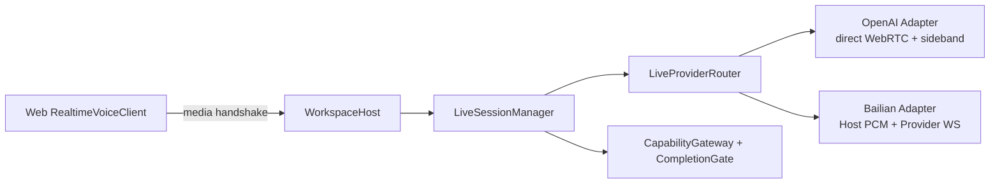

# Web Realtime 语音 Runtime 决策记录

## 1. 决策

Lumen 使用 `LiveProviderRouter` 在一次 Live call 建立前选择 Provider Profile，并将选择结果冻结为
Route snapshot。`LiveSessionManager` 只处理 canonical event/command，不读取任何厂商 raw JSON；
Provider wire protocol 止于 `RealtimeProviderAdapter`，浏览器媒体差异止于 discriminated media
handshake 和 Web `RealtimeVoiceClient`。

V1 有两个生产 Adapter：

- `OpenAIRealtimeAdapter`：浏览器 direct WebRTC，Host 使用可信 sideband 控制工具与完成协议。
- `BailianRealtimeAdapter`：浏览器 AudioWorklet 通过认证的 PCM WebSocket 连接 Lumen，Host 再连接
  百炼原生 Realtime WebSocket；工具事件和凭据不经过浏览器。



Router 只负责 capability admission、有序 fallback 和冻结 Route；它不编码 Provider events。只有在媒体
建立、音频响应和任何副作用发生前才允许 fallback。活动 call 不进行静默 Provider 切换。

## 2. Canonical Interface

- `LiveSessionSpec`：instructions、tools、voice、turn detection、transcription、strict completion。
- `LiveProviderCapabilities`：媒体模式、打断、转写、FC、server tool authority、completion control、
  session limit。
- `LiveProviderEvent`：speech、transcript、audio、tool call、response、usage、error。
- `LiveProviderCommand`：cancel、tool result、continue、speak approved。
- `RealtimeProviderAdapter.open(...)`：创建 Provider connection 并返回 browser handshake。
- `LiveProviderConnection`：`send`、`send_audio`、`close`。

启动握手是 discriminated value：

- `direct_webrtc`：包含 Answer SDP。
- `host_websocket`：包含同源媒体路径和 PCM sample rate。
- `managed_rtc`：为未来火山 RTC Adapter 保留；没有生产 Implementation 时 Router 不会生成它。

旧的 `RealtimeTransport(create_call/connect_sideband)` 已删除。它把 OpenAI 的 call ID 和 sideband
拓扑暴露为所谓通用 Interface，删除后协议复杂度集中到两个 Provider Adapter，符合 deletion test。

## 3. 安全与完成门禁

1. Provider API Key、百炼 Workspace 凭据只存在于 Host；不得进入 bootstrap、握手响应、SSE、日志
   或浏览器 bundle。
2. 浏览器 DataChannel 和 PCM WebSocket 都不是工具命令权威。所有工具调用必须由 Provider Adapter
   的服务端连接生成 canonical `tool_call_ready`，再交给 `CapabilityGateway`。
3. PCM WebSocket 复用 Web cookie、Host allow-list 和严格 Origin 校验；单帧上限 64 KiB。
4. Risk 决定审批；EffectKind 决定 receipt、并发和验证。Live 不创建第二套工具策略。
5. `native_required_tool` Route 使用 `complete_live_turn`；当前 OpenAI Adapter 属于此类。
6. `host_gated_synthesis` Route 只让 Provider 输出文本。`CompletionGate` 通过后才发出
   `live.response.approved`，浏览器才合成语音；失败则发出 `live.completion.blocked`，不会播放被阻止的
   完成声明。当前百炼严格 Route 属于此类。
7. `advisory_only` Route 在 `strict_completion: true` 时 admission 失败，不允许静默降级。

## 4. 生命周期、持久化与恢复

连接状态仍为 `creating → connecting → active → reconnecting/closing → closed`，异常可进入
`failed` 或 `reconciliation_required`。Session v9 append-only `live_session` record 额外保存 Route、
Provider、region、media kind 和 completion control snapshot；原始音频仍不保存。

进程重启不自动重放 Provider call。没有待确认调用时将旧 call 分类为 `closed`；仍有 pending call 时
分类为 `reconciliation_required`。未知命令副作用、external action 和审批结果不会自动重放。

Host WebSocket 断开会结束对应 Provider call，避免百炼连接继续计费。主动 rollover 仍由浏览器建立
新 call；Route selection 重新执行，但旧 call 的副作用不会转移或重放。

## 5. 配置与兼容

推荐配置使用命名 Route：

```yaml
live:
  enabled: true
  default_route: cn-primary
  fallback_routes: [cn-fast]
  routes:
    cn-primary:
      provider: bailian
      model: qwen3.5-omni-plus-realtime
      region: cn-beijing
      api_key_env: DASHSCOPE_API_KEY
      workspace_id_env: DASHSCOPE_WORKSPACE_ID
      voice: Tina
      completion_control: host_gated_synthesis
  strict_completion: true
```

旧的单 Provider OpenAI 字段继续在内存中形成 `legacy-openai` Route，不重写用户配置。命名 Route
使用 Pydantic discriminated provider config；Provider-specific 凭据、endpoint、模型和 completion
能力不会进入通用 Router Interface。

## 6. 验证入口

- Router contract：`tests/test_live_router.py`
- OpenAI canonical Adapter 与 Manager：`tests/test_live.py`
- 百炼 wire contract：`tests/test_bailian_realtime.py`
- Host PCM、认证、SSE：`tests/test_web_api.py`
- Web 状态：`src/web/src/lib/live/live-reducer.test.ts`
- Web 构建：`pnpm --dir src/web test/typecheck/build`
- 全量：`uv run ruff check .`、`uv run pyright`、`uv run pytest`

火山 RTC AI 是后续独立 Provider/Media Adapter 候选。其托管 MCP、记忆、RAG 不得成为 Lumen 的第二
状态权威；只有签名 Function Calling 回调、RTC media 和 Start/Update/StopVoiceChat 控制会接入现有
Manager/CapabilityGateway Interface。
