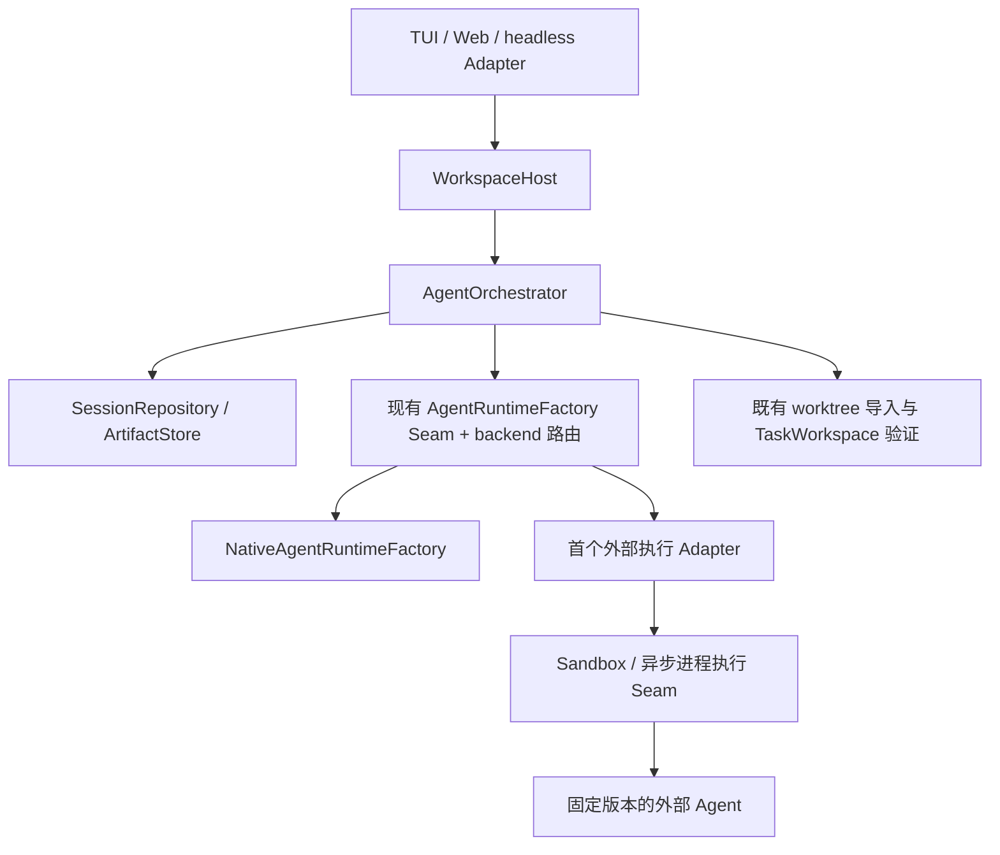

# Lumen 外部 Agent 接入：研究评估、设计与实施计划

状态：Proposed；尚未实施。日期：2026-09-15。

依据：[研究报告](../research/主流Agent外部接入方案研究报告.html)、当前源码与契约测试，以及文末官方资料。
本计划聚焦 Lumen 委派外部 Agent；让 Lumen 被 IDE/其他 Agent 接入列为独立后续需求。
本文不替代 Accepted 架构决策，不表示已经具备所述新增能力。

## 1. 结论与报告修正

**沿用 AgentOrchestrator，扩展现有执行 Seam，先交付一个默认关闭、受限、可取消的外部顾问。**
不要重新建设 subagent runtime，也不要把完整外部 Agent 放进 ModelDriver 冒充模型。

报告对“四类接入”的划分、能力不足显式失败、上下文与权限分离、取消不等于回滚的判断有价值。
但第 7 章以 dongbi-agent-harness / AgentLoop v2 的早期阶段为前提，不能作为当前 Lumen 的直接施工单。

| 报告建议 | 对当前 Lumen 的取舍 |
|---|---|
| 先独立接口包、注册表，再做内建 provider | 已有 Orchestrator 和 Factory Seam；跟随第一个真实外部 Implementation 扩展内部契约，无需独立包 |
| 先状态文件、后事件日志 | 已有 journal、Plan、TaskWorkspace；可增加可读投影，不建立可双向编辑的第二套权威 |
| 引入树形 Session、三个循环回调 | 与本次外部接入无直接依赖；保持既有 fork、Coordinator 队列和单一 Loop |
| 直接复制五个 capability flag | 按 Lumen 实际控制操作定义；尤其拆开续轮次、运行中消息、重启恢复 |
| 优先 ACP，随后 SDK | ACP 作为首选验证路径；能否满足隔离、审批、取消决定准入，覆盖面不构成验收 |
| 最后收权限边界 | 前移到首次启动前；沙箱、依赖、认证、拒绝路径与首个 Adapter 一起交付 |
| 原生透传用户认证、只覆盖一个权限旋钮 | 不能继承整套环境、插件、Hook、MCP 和项目设置；凭据与配置必须分别处理 |
| 依赖全部自带、不查 PATH | Python 项目先采用显式安装、固定可执行文件路径和受测版本；不在 spawn 中安装或自动升级 |
| “三次信号确定终止” | 采用取消请求→限时等待→进程组终止→回收验证；不能确认退出就进入 reconciliation |

证据质量也需要降级处理：报告大量引用二手资料，且已声明没有运行验证。
“唯一双向 MCP”“最成熟”等排名不构成设计依据；各产品版本、SDK 权限默认值不直接复制。
ACP 官方目录明确将 Claude Agent、Codex CLI 列为通过 Adapter 接入，不能笼统表述为产品原生 ACP。
协议版本和能力以 initialize 的实际响应为准，不从包版本推断，也不因为报告提到 draft 就承担双版本实现。

## 2. 当前实现与真实缺口

源码路径相对于仓库根目录；以下是静态核对结果，不是本轮测试运行结果。

| 当前事实 | 依据 | 接入影响 |
|---|---|---|
| Orchestrator 已持有 spawn 幂等、并发、generation、消息、结果交付、恢复与完成约束 | `src/lumen/agents/orchestrator.py` | 继续作为生命周期唯一权威 |
| Factory 已有 snapshot/execute/queue_message/close/import/reject | 同文件 `AgentRuntimeFactory` | 扩展此 Seam；不要另建 Scheduler |
| 实际装配固定 NativeAgentRuntimeFactory | `src/lumen/resources.py` | 增加明确 backend 路由；已有模型 Provider 注册表不复用 |
| profile/snapshot 强绑定原生模型名、model_id、tool_names | `src/lumen/agents/types.py`、`runtime_factory.py` | 外部执行不能伪造模型 ID、工具约束或预算执行结果 |
| Native child 通过 Gateway 收窄权限；写任务使用 worktree | `runtime_factory.py` 的 snapshot、_execute_runtime、_tools_for | 外部进程自带工具不自动经过此 Gateway |
| interrupt 取消 asyncio task；异常分支记 interrupted/failed | `orchestrator.py` 的 interrupt_agent、_execute | 外部 Adapter 必须确认清理；取消协程不等于停止外部执行 |
| 重载时只读 child 直接重新调度；写 child 先 reconciliation | `orchestrator.py` 的 _recover_session | 外部只读任务也可能重复计费或产生远端动作，不能继承自动重放 |
| worktree 元数据从 execute 返回值写入 Thread | `orchestrator.py` 的 _execute、`runtime_factory.py` 的 _execute_worktree | 外部长进程需要在派发前持久化隔离目录与执行标识，覆盖中途崩溃窗口 |
| Session schema v11；fork 对未完成 Agent 标记 not_carried | `src/lumen/sessions.py` | 保留历史可读及 fork 语义，不复制活跃外部进程 |
| MCP 默认 risk=external_unknown、effect=unknown | `src/lumen/mcp_tools.py` | 普通 MCP 工具接入不等价于受生命周期管理的 Agent 委派 |
| Web 已经通过 Host 暴露 Agent 动作；认证为本地启动 token/cookie/Origin 流程 | `src/lumen/api/app.py` | 可复用内部 Host 命令；不是现成的第三方远程 API 认证方案 |

已有验证入口包括 `tests/test_agent_execution.py`、`tests/test_balanced_agent_integration.py`、
`tests/test_completion_gate.py`、`tests/test_sessions.py`、`tests/test_workspace_host.py` 与
`tests/test_web_api.py`。其中执行测试已有父 dirty path 导入拒绝、异步恢复、进程后代回收等案例。

另有两项应先写验证、再判断是否修复：

- MCP Instructions：本地 MCP 模块没有找到显式注入路径，但底层 SDK 可能处理；必须抓取实际模型请求验证，不能凭文本搜索宣告缺失。
- writable child 的 MCP：snapshot 候选允许 MCP origin，而 `_tools_for` 的重建主要是 builtin 与少数 portable tools；需验证“快照声明”和“实际可调用集合”一致。先独立处理契约差异，不借外部接入扩大 MCP 权限。

## 3. 目标结构与 Module 边界

- **Interface**：模型仍使用现有 spawn/message/followup/wait/interrupt/list/close；角色绑定 backend，不让模型填写任意命令、路径、环境或权限参数。
- **Implementation**：先 native + 一个外部 Adapter。backend 路由是装配字典及分派，不拥有 Thread、队列或结果数据库。
- **Seam**：Orchestrator 调度前检查能力，Adapter 翻译协议并报告观察结果，状态转移仍由 Orchestrator 持久化。
- **Depth / Locality**：协议差异集中在外部 Module。只有接入写模式时，才将现有 worktree 准备/收尾复用为内部模块；不复制 Git 生命周期。
- **Leverage**：继续使用 Host 审批、Session journal、ArtifactStore、完成门禁、Sandbox 和进程回收，不引入通用 workflow 框架。

## 4. 最小接入契约

### 4.1 能力与有效策略

首个 Implementation 联动定义内部 `AgentBackendCapabilities`，采用严格 Pydantic 和枚举。
以下是语义设计，字段名在实现 PR 内冻结，不提前发布全功能 SDK：

| 语义 | 必须区分的行为 |
|---|---|
| 上下文初始化 | 初始任务为 fresh；后续 continuation 只接该 child 自己的历史；父 transcript fork 暂不提供 |
| 生命周期 | 一次任务、结束后 followup、进程重启后的 resume 分开声明 |
| 活跃消息 | 即时 steering 与下一轮排队分开；不支持时拒绝或明确告知只排队，不能谎报送达 |
| 输出 | 首期文本；未来支持 output schema 时必须校验，失败不降级为成功文本 |
| 策略执行 | 声明能否落实 workspace mode、工具/嵌套委派禁用及显式预算；声明不是安全证明 |

有效能力 = Adapter 已实现能力 ∩ 对端协商能力 ∩ Lumen 当前策略。
未声明视为不支持。静态不满足在创建进程前失败；只有握手可知的差异允许初始化进程，
但在 session/prompt 前拒绝并回收。这里的“不产生任务副作用”不等于“握手零 I/O”。

给出机器可识别错误码，例如 `UNSUPPORTED_CAPABILITY`、`BACKEND_DISABLED`、
`POLICY_UNENFORCEABLE`、`PROTOCOL_MISMATCH`、`EXECUTION_STATE_UNKNOWN`；附有界原因。
显式模型选项、工具限制、request/tool budget 无法落实时拒绝；不静默忽略、不无提示换 backend。
任务总 timeout 保持默认无限制；握手、取消和清理有独立有界超时。

### 4.2 配置和持久化

- `AgentProfile` 新增默认 native 的 backend 选择。只有显式启用的受信任配置能注册外部 backend；项目角色不能安装可执行文件或放宽策略。
- 外部配置限于固定 executable/argv、受测版本、凭据引用和允许环境；不提供任意 shell 模板，不持久化密钥值。
- 在现有 Snapshot 上新增可选的严格外部执行快照，并将 native 专属模型字段改为条件校验：旧记录继续要求/保留原字段，外部记录不填虚假模型名。
- 外部快照持有 backend/adapter 版本、有效能力和策略摘要；执行状态持有 attempt/generation、workspace 与不透明外部 session 标识。配置变更后恢复不能静默切实现。
- spawn 幂等保持既有语义；generation 是续轮次，attempt 是传输执行尝试，两者不能混用。关联键包含父 Session 和 Agent ID。
- 执行意图先入 journal，再启动；拿到外部 session ID 后先记录，再发送任务。发送后丢失响应时记 unknown，不自动重复发送。
- 新持久化语义按仓库规则引入下一版 schema（预计 v12，以合并时版本为准）；v1–v11 加载不改写，只在新事实写入时追加 upgrade。配置保持 v2 加性扩展，保留 v1 内存迁移行为。
- transcript 是外部证据 artifact，不伪装成原生 ModelMessage。大输出限额并脱敏；截断不能成为完整验证 evidence。

### 4.3 权限与执行边界

首个产品切片是外部顾问：输入任务与经过选择的上下文，输出意见和证据，无父工作区写入。
优先使用受限快照目录/容器；其运行状态目录与被分析文件分离。实际可用隔离以平台验证为准。

准入必须证明：不能写父目录、不能读取未授权路径/凭据、不能绕过子 Agent 深度限制、不能执行
Host 专属 Git stage/commit/push；需要模型网络时使用受控凭据与网络配置。对端自带工具、MCP、
Hook 和嵌套 Agent 不由 Lumen 工具 allow-list 自动限制。只有提示词或原生 plan mode 的 backend
不通过受限模式验收；沙箱缺失/启动失败则拒绝，不回退全权限。

复用原生认证的含义是引用用户授权的认证机制；不复制整套 HOME、不继承全量环境、不自动登录，
日志不保存凭据。只读不等于无远端副作用或无费用，也不据此把整个委派标成 Risk.READ。
审批 Risk、EffectKind 与调用并发分别定义；未知副作用保持 unknown，strict 完成门禁继续生效。

首期不能桥接的外部权限请求直接拒绝并返回原因。后续桥接必须经根 Host 的具体请求审批，
包含父 Session/Agent/generation/request 标识；拒绝迟到、跨 Session 和重复已消费的审批。
根 Host 的 Git 新审批要求不被外部 provider 自带批准模式覆盖。

## 5. 生命周期、恢复与交付

| 场景 | 处理与验收 |
|---|---|
| 禁用 / 静态能力不满足 | 不启动进程、不派发任务 |
| initialize 不兼容 | 关闭连接、回收进程、明确失败 |
| prompt 派发前崩溃 | 重载先核对执行意图与进程，不因为没有结果而重发 |
| 已派发后断流 / Host 重启 | 默认 reconciliation_required；只有已验证的查询/恢复语义允许重新附着，禁止盲目重放 |
| 主动取消 / timeout | 协议 cancel，限时等待，复用进程组终止与管道回收；确认停止后才 interrupted |
| 无法确认远端动作或进程结束 | reconciliation_required；不能把本地连接关闭当作已取消 |
| 正常退出但协议无最终结果 / 非零退出 | failed 或 unknown 分类；exit code 0 不独立代表任务完成 |
| 返回 completed | 结果入 journal 后发布事件；delivery、失败处理、effect、evidence 等现有门禁仍检查 |
| 重复/迟到结果 | 按 Agent/generation/attempt 去重或隔离，不能覆盖新轮次结果 |
| Session fork | 外部活跃执行 not_carried；不共享可续写的外部会话句柄 |

更新 `_recover_session` 时必须按 backend 的恢复能力分流，保留原生只读的既有安全恢复路径。
更新 `_execute` 的取消和异常分类时避免无条件把未知执行覆写成 interrupted/failed。
Adapter 不透明重试派发；允许重连观察不意味着允许重发任务。取消无回滚承诺。

## 6. 分阶段实施与 PR 切分

估算按一名熟悉仓库的开发者计算，是规划区间；依赖协议验证和平台隔离结果，不是交付承诺。

| 阶段 | 范围与代码落点 | 退出门禁 | 估算 |
|---|---|---|---|
| P0：准入验证 | 固定一个 ACP Agent/Adapter 版本；验证 initialize、认证、隔离、禁用嵌套委派、取消及断流；记录实际请求/响应的脱敏 fixture | 有明确 capability/policy 矩阵；不满足隔离就停止该 backend 路线，不进入功能实现 | 1–2 天 |
| P1：契约与安全路由 | `agents/types.py`、`orchestrator.py`、`resources.py`、`config.py`、profiles、sessions；native 默认路由 + 首个 Adapter 的预检骨架 | 原生行为不变；disabled/unsupported 零任务派发；旧 schema 可读；外部只读不自动重放 | 2–3 天 |
| P2：顾问切片 | 外部 Adapter + Sandbox/异步进程 Seam；文本任务、进度、结果、取消、故障分类；按需更新 Host/UI 错误展示 | 一个真实受限任务完整闭环；取消后无残留；crash 窗口与重复事件验证；结果送达门禁成立 | 3–5 天 |
| P3：持续交互 | capability 驱动 followup/message；经验证的恢复句柄；需要时增加 Host 审批桥 | 不支持的控制拒绝；跨 Session、迟到审批与 generation 测试通过；状态未知时不重放 | 2–4 天 |
| P4：隔离写入 | 复用 worktree 准备/收尾/导入，将执行前元数据持久化；写权限继续受限 | 主工作区不变直到批准导入；dirty overlap、三方冲突、取消保留现场、导入验证全部通过 | 3–5 天 |
| P5：第二种外部 Implementation | 仅有真实需求时新增另一 ACP Agent 或专用 SDK Adapter | 同一契约测试集通过；再据真实差异决定是否抽公共代码 | 条件式 |

P0→P1→P2 是首期交付，约 6–10 人日。P3/P4 按需求追加，不能用“做完所有协议”作为首期完成条件。
P1 与 P2 可以拆 PR，但外部功能在 P2 验收前始终不可用。P0 选择 ACP 是减少协议实现数量的工程假设；
若受测 Adapter 无法约束权限，优先评估一个能满足条件的专用 SDK Implementation，而非放宽准入。

### 每阶段验证

1. 先运行最小相关回归：Agent 执行、Orchestrator 集成、Session 和 completion；新增测试关注协议/崩溃边界，不镜像实现细节。
2. Python 改动运行 `uv run ruff check .`、`uv run pyright`。涉及上述 Runtime/Agent/配置/Session 改动时，在最小回归后运行 `uv run pytest` 全量。
3. Host/schema/API 改动加跑 `uv run pytest tests/test_workspace_host.py tests/test_web_api.py`，核对 Default、Plan、TUI、Web、headless 一致性。
4. 受影响时通过命令更新 contracts/OpenAPI；Web 改动运行 test、typecheck、build；TUI 改动跑交互与 snapshot 回归。
5. Accepted 架构文档更新时重建 Atlas，核对手写 index 图解。若新增依赖/入口，更新 lockfile、构建 wheel 并隔离安装验证 CLI。
6. P2 必须有真实外部进程与受测平台验收：文本任务、拒绝写父目录、拒绝未授权文件访问、长任务取消、进程后代回收、断流与重新加载。fixture 和构建成功不能代替这些验证。

发布观察指标：启动/握手耗时、首进度时间、取消至退出耗时、unknown/reconciliation 次数、重复派发次数、结果交付耗时。
外部 usage 缺失显示 unavailable，不填 0；区分模型费用与 Lumen 队列/进程开销。首期不承诺成本或性能改善比例。

## 7. 独立后续：让 Lumen 被接入

只有明确 IDE 或外部编排器需求时才实施。作为 ACP server 或 MCP server，新增 Adapter 必须调用
WorkspaceHost command/event Interface；禁止直接调用 Runtime 或手工操作 Agent 状态。
先选一个实际 consumer，实现会话、发送、取消、事件与审批的最小闭环。远程多租户、A2A、通用
服务发现、插件市场、树形 Session 改造、跨产品全文 transcript 转换均不在本次范围内。
现有 Web cookie/Origin 安全模型不直接作为机器调用认证；公开服务需要单独设计身份、Session 所有权和连接生命周期。

## 8. 本轮交付及资料

本轮仅完成分析与计划，没有修改运行时代码、安装外部 Agent 或执行真实委派。
核对了源码/测试入口、计划链接和 diff；未运行 pytest、Ruff、Pyright、Web 构建，纯文档范围无需全套运行。
首期下一步是 P0 的一个固定版本验证，然后在既有 Factory Seam 上完成 P1/P2。

外部事实核对日期：2026-09-15。下列链接为移动文档；实现时应记录受测版本与 commit：

- [ACP 官方 Agent 目录](https://agentclientprotocol.com/get-started/agents)：区分原生实现与 Adapter；Claude、Codex、Pi 均列有桥接信息。
- [ACP v1 initialization](https://agentclientprotocol.com/protocol/v1/initialization)：协议版本、能力与认证协商；未声明能力不支持。
- [DeepSeek Harness subagent 官方文档](https://github.com/deepseek-ai/deepseek-harness/blob/master/docs/subsystems/subagent.md)：委派 Seam 的参考入口；不直接复制其运行时体系。
