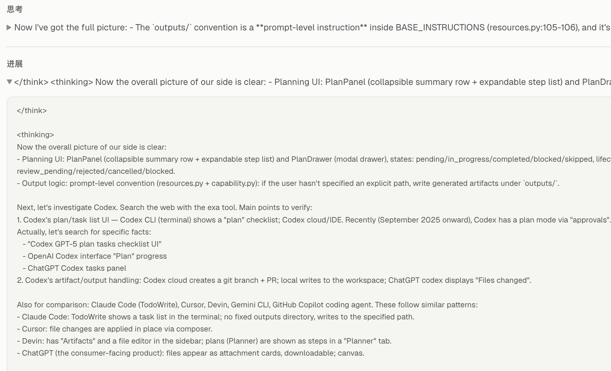

# Thinking 标签、计划 UI 与产物输出审校

日期：2026-09-04。范围：指定 Lumen 会话、当前 Web 页面、源码与公开 Codex 实现。
结论是：标签属于收到的响应文本，已确认的产品缺陷是运行记录标准视图绕过了已有展示投影。
计划 UI 基础合理，但不能根据字段更多断言领先；输出目录应是兜底约定，交付体验应围绕文件本身。

## 1. 标签究竟来自哪里

区分三个概念：协议字段 `type: thinking`、SDK 的 `ThinkingPart`、普通字符串里的
`<thinking>` / `<think>`。前两者有结构语义，后者只是模型或兼容服务可能输出的文本，不能
假定所有模型只会输出某一种 XML 标签。[Pydantic AI 的 Anthropic Adapter 文档](https://pydantic.dev/docs/ai/models/anthropic/)
描述了这一路协议接入。

本次核对了 Session `4674c2af-6390-45b3-822c-8e8c6b6acd5f`，只读取记录，没有改写历史：

1. 模型标识是 `anthropic:qwen3.8-max`。Anthropic 在这里表示接口 Adapter，不表示实际模型是 Claude。
2. 该 turn 保存的第 25 个（零基）响应消息，其第 3 个 part 是 TextPart，正文已经含有
   `</think>` 与 `<thinking>`。对应 timeline 的 TextDelta 与后续 CommentaryDelta 都保留这段文本。
3. `PydanticAIModelDriver` 将 TextPart / ThinkingPart 翻译为不同事件，不插入这些标签。
   Loop 在模型继续调用工具时把尚未作为终稿的文本撤回并转为 commentary，不添加标签。
4. BASE_INSTRUCTIONS 与 CONTROL_INSTRUCTIONS 没有要求生成 `<think>`，也没有强制模型输出
   `<thinking>`。它们已要求公开进度简短且不输出私有推理；增加同义禁令不能替代展示修复。
5. 排除了一个容易误判的 SDK 分支：通用 `DEFAULT_THINKING_TAGS` 确实是 `<think>`，但当前
   Anthropic profile 实际是 `<thinking>`。这 23 个 ThinkingPart 的 signature 都是空字符串，
   不是 None；SDK 按原生 thinking block 回传。空字符串、None、正常签名三种合成输入经
   MockTransport 的公共 request Interface 验证：分别为原生 thinking、带 `<thinking>` 的文本、
   原生 thinking，没有插入 `<think>`。没有调用真实模型或把会话发送到外部。

可以确认标签在收到的响应内容中存在，不能仅凭持久化的 SDK 消息进一步断定是模型 token
生成还是上游兼容代理转换。该会话没有逐字节 HTTP/SSE 原始抓包；不把推断写成模型厂商缺陷。

## 2. 已修复的展示逻辑

截图对应 Web 的运行记录标准视图。此前主对话经过 `projectThinkingMarkup`，但
`TranscriptInspector → TranscriptRecord` 直接展示 `item.text`，其摘要和展开正文都会泄漏标签。
这解释了为什么只改主对话解析器后，运行记录仍然出现同样的问题。

本次改动：

- 标准运行记录的显示、搜索、复制共用主对话的投影；详细视图仍展示原始 JSON。
- 补上 progress 文本的处理；工具原文不参与模型标签解释。
- 原生 thinking 段遇到闭合标签后仍属于 thinking，不能被错误投影为最终回答。
- 原生思考与正文之间、用户轮次之间隔离 Markdown 状态；空白标签段不形成空活动项。
- 保留代码块、行内代码、转义例子和原始消息；不清洗签名，不改变 journal 和撤回偏移。

这不是敏感内容过滤器，也没有禁止模型未来产生任何异常格式。TUI 原始 transcript、headless
协议输出与诊断记录仍有各自用途；本次没有把 Web 展示修复冒充为所有客户端的协议改写。

## 3. 现场 UI 检查

检查流程与结果：

| 步骤 | 实际观察 | 判断 |
| --- | --- | --- |
| 1. 打开完成的调研任务 | 页头已有常驻“计划 4/4”，过程默认收起，最终答复可读 | 合理；原报告“没有持续可见入口”的说法不准确 |
| 2. 打开任务计划 | 右侧 460px 模态抽屉、目标、4 条完成步骤、每条“查看说明” | 结构清楚，但查看计划会遮挡并阻断主对话交互 |
| 3. 标准运行记录搜索问题段落 | 修复前标题为进展，摘要直接出现两种标签；展开正文同样受影响 | 已复现的展示缺陷 |
| 4. 构建并刷新同一会话 | 相同查询只显示正文，分类为思考；切到详细视图仍能找到原标签 | 修复生效且保留诊断证据 |

用户提供的故障画面：

本次也查看了浏览器实时截图和 DOM。未重跑模型、未制造一个新长任务来表演进度动画；运行中
持续可见性的判断结合了 PlanPanel、页头入口和样式源码。没有执行完整的移动端、屏幕阅读器或
WCAG 审计。以下视觉评价是设计判断，不是竞品优劣的测量结果。

总体上，Lumen 的层级简洁、详情按需展开，值得保留。但完成步骤正文为 13px 且降饱和，长中文
标题在窄抽屉里阅读费力；独立的状态文字、图标、查看说明增加扫描负担。页头 4/4 提供完成数，
却不能在运行中直接回答“现在做什么”。截图里的技术推理也不能代替用户能理解的进度说明。

## 4. Codex 对比：哪些能够证实

源码固定在 `openai/codex@728cb12fe5794b0c3a8e776fb4994b1650b973a8`，不是从 issue 推测当前实现。

| 维度 | Codex 的可核验事实 | Lumen 的启示 |
| --- | --- | --- |
| 执行清单 | update_plan 接受 explanation 和步骤快照；pending / in_progress / completed；description 要求至多一项进行中 | 展示结构化状态，不把自由文本进度推断成步骤完成 |
| 校验强度 | 本版本 handler 反序列化后发出 PlanUpdate；“至多一个”不能仅凭 description 宣称是硬校验 | 分清模型指令、schema 校验与完成门禁 |
| CLI 显示 | Updated Plan 历史项；完成项对勾、删除线与弱化，进行中方框、青色加粗，待办弱化 | 强调当前动作而不是所有元数据同等突出 |
| Plan Mode | 与 update_plan 清单是不同概念；此版本在 Plan Mode 中拒绝 update_plan。规划可执行不改变受跟踪项目状态的探索命令 | 不应把“自动分步执行”与“先规划后确认”混成一个入口 |
| 文件工作 | CLI 在工作目录创建/编辑，IDE 在 workspace 中编辑；App 有文件预览，代码可通过 review 检查 | 改进产物可发现性与检查操作，不必复制竞品目录结构 |

源码依据：[plan handler](https://github.com/openai/codex/blob/728cb12fe5794b0c3a8e776fb4994b1650b973a8/codex-rs/core/src/tools/handlers/plan.rs)、
[tool schema](https://github.com/openai/codex/blob/728cb12fe5794b0c3a8e776fb4994b1650b973a8/codex-rs/core/src/tools/handlers/plan_spec.rs)、
[CLI 渲染](https://github.com/openai/codex/blob/728cb12fe5794b0c3a8e776fb4994b1650b973a8/codex-rs/tui/src/history_cell/plans.rs)、
[Plan Mode 模板](https://github.com/openai/codex/blob/728cb12fe5794b0c3a8e776fb4994b1650b973a8/codex-rs/collaboration-mode-templates/templates/plan.md)。
官方操作入口见 [Codex commands](https://learn.chatgpt.com/docs/developer-commands?surface=cli)。

桌面 App / IDE / CLI 不能当成同一套视觉实现。当前公开材料不足以确认原报告所述的底部
“Step X/Y 胶囊”在所有版本中位置一致，本次也没有操作 Codex 的真实复杂任务来截图对照，故不以
该细节论证 Lumen 必须照搬。GitHub issue 是问题线索，不是全部用户的共识，也不是当前规范。

## 5. 输出目录：当前行为与建议

`resources.py` 与 `write_file` description 的确约定了 `outputs/`，但没有执行器把任何路径
自动重定向到这里。用户提供路径、项目规范和源码修改位置仍受原有 workspace 校验约束。
它是默认行为指引，不是隔离或安全机制；目录名称本身不能保障审计和恢复。

Codex 的 [文件说明](https://learn.chatgpt.com/docs/artifacts-viewer) 区分 CLI、IDE 与桌面预览能力；
[review 文档](https://learn.chatgpt.com/docs/code-review?surface=app) 说明 review 可以展示用户及
其他来源的未提交改动，不应全部标为当前任务产物。[Worktree 文档](https://learn.chatgpt.com/docs/environments/git-worktrees)
讲的是执行隔离，不是强制产物目录。Cloud 的 PR 流程也不能代表通用文档任务的唯一交付方式。

建议把路径规则改为以下优先级（本次仅建议，未修改输出规则）：

1. 用户明确指定的允许路径。
2. 修改已有文件时保留原位置；遵守项目或已加载 Skill 的适用路径规范。
3. 新的长期项目文档跟随已有 docs / reports 等目录惯例。
4. 无项目惯例的独立报告、导出或临时交付，才使用 outputs/ 兜底。

默认规则不应扩大权限；明确路径被 workspace 校验拒绝时应如实解释，不能自动逃逸。最终答复
提供可点击文件链接，而不是只有 code 样式的路径；文件存在性和版本必须来自实际写入结果。

更重要的是结果入口：用户应能在任务结束处看到文件、预览、复制路径和继续修改。第一版可先
展示会话已验证的 Work Products，标注“本会话文件”，不能直接声称“本轮全部产物”。目前
EffectReceipt 没有 run_id / tool_call_id，WorkProductKind 仅有 text/json/yaml；shell 产生的
二进制、外部文件和多轮版本归属并不自动完整。后续如需本轮清单，应在既有 journal 增补明确
归属与来源证据，经 schema 兼容设计后投影，不能凭文件时间猜测。

不建议新增独立 `.lumen/deliverables.json` 作为权威清单。若需要索引，只能是可从 journal
重建的缓存。HTML 预览必须隔离脚本和父页权限；别把产物中的任意 HTML 直接挂到带会话权限的页面。

## 6. 后续优先级与验收

| 优先级 | 建议 | 可验证的验收条件 |
| --- | --- | --- |
| P0（已做） | 统一标准视图标签投影 | 同一旧会话正常阅读无控制标签；详细视图原文可查；代码样例和复制正确 |
| P1 | 执行中显示一行“已完成 2/5 · 正在：核对来源” | 复用已有 Plan 投影；正文滚动后仍可查看；停止后无 spinner；受阻显示原因，不能伪造完成 |
| P1 | 常用清单采用轻量展开，完整元数据留在详情 | 桌面看计划不必反复遮住正文；键盘可展开收起，关闭返回原焦点；窄屏保持可用 |
| P1 | 结果文件入口与路径优先级 | 文档就地修改、独立导出兜底；用户能打开实际文件；不会把其他会话或用户修改冒充本轮产物 |
| P2 | 精简计划触发条件 | 一次简单编辑无需先建完整计划；跨阶段、存在依赖或需要验收时才使用步骤；不改变 Plan Mode 授权 |
| P2 | 核对失真的进度 | 最终回答前对未结束步骤给出具体反馈；UI 只显示已记录状态，不根据时间或工具次数推断完成 |
| P2 | 可读性与长清单 | 当前步骤突出，完成步骤弱化但可读；8 项以上可折叠，完整列表保持依赖顺序；blocked 不必一律等同于等待用户 |

先复用标题与“正在”前缀，暂不增加 active_form 持久字段；仅为文案增加 schema 复杂度收益有限。
完成门禁可以阻止一部分不实完成，但不能保证模型及时更新清单，更不能从任意自然语言判定
真实业务结果。应以会话恢复、revision 顺序和证据关联来提高可靠性。

## 7. 对原报告的更正

原报告关于现有 Module 和输出提示词的位置有参考价值；以下结论不采用：

- “五态所以领先”“验收字段所以更完整”：缺少任务成功率、交互成本或可用性证据。
- “Plan Mode 禁止任何命令”：与所核验的 Codex 模板不符。
- “Lumen 没有持续可见入口”：当前页头已有入口，缺的是足够的当前动作信息。
- “严格完成门禁天然不会 stale”：检查终态与实时进度同步是两件事。
- “outputs 天然安全、天然受 Work Product 管理”：安全来自路径及 mutation Interface，不来自目录名。
- “新增 deliverables.json 同时不新增权威”：若独立写入并作为事实源，将违反现有单一权威原则。
- 跨产品的像素级布局、Tasks 排序细节和未重新核实的 issue 编号：不作为本次建议的事实依据。

## 8. 验证与限制

Web：115 项 Vitest 通过，TypeScript typecheck 与 Next production build 通过。
在用户当前 Chrome 页面复现故障，构建后刷新同一会话验证标准视图与详细视图差异。
合成 Anthropic 请求通过 MockTransport 验证三类签名序列化，无真实网络调用。
本次没有修改 Python Runtime、Provider 配置、任务完成规则、计划 UI 布局或输出路径策略。
计划与文件交付的表格是后续建议，不应作为已经上线的功能描述。
