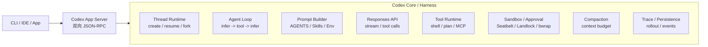
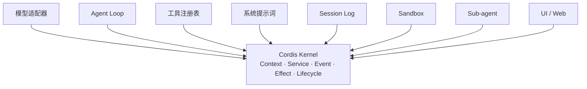

# Codex Harness、DeepSeek Harness 与 Pi Agent：核心架构、底层原理与工程取舍

> **调研日期：** 2026-08-26<br>
> **研究对象：** OpenAI Codex Harness、DeepSeek Harness（dsh）、Pi coding agent / pi-mono

> **Lumen 实施结论（2026-08-27）：** 本文的外部研究事实保持原始快照。Lumen 已据此完成
> `LumenAgentLoop` 单轨升级：Lumen 自己拥有请求、工具批次、继续、重试、取消、恢复和完成语义，
> PydanticAI 继续在 `PydanticAIModelDriver` 下提供 Model/Provider 适配。这不是“全面超越
> PydanticAI”，而是按各自优势重新划分权威；主模型—工具路径中的 PydanticAI `Agent` graph 与运行时
> selector 已删除。无工具的 Context 摘要和 Memory 结构化提取仍可复用其 typed Agent Adapter，但不拥有
> turn 或工具调度权威。

从 Agent Loop、Prompt/Context、Tool Runtime、Sandbox、Session、Compaction、Skills、MCP、Sub-agent、事件模型与嵌入协议等维度，拆解三种现代 Agent Harness 的核心设计。

## 目录

1. [核心结论](#1-核心结论)
2. [Harness 是什么](#2-harness-是什么)
3. [OpenAI Codex Harness：强核心运行时](#3-openai-codex-harness强核心运行时)
4. [DeepSeek Harness：Agent 的插件化操作系统](#4-deepseek-harnessagent-的插件化操作系统)
5. [Pi Agent：极简 Coding Harness](#5-pi-agent极简-coding-harness)
6. [Agent Loop：三者底层实现差异](#6-agent-loop三者底层实现差异)
7. [Context、Prompt 与 Compaction](#7-contextprompt-与-compaction)
8. [Tools、Skills、MCP 与能力注入](#8-toolsskillsmcp-与能力注入)
9. [Session、Checkpoint、Fork 与 Replay](#9-sessioncheckpointfork-与-replay)
10. [Sandbox、Approval 与执行安全](#10-sandboxapproval-与执行安全)
11. [嵌入与协议](#11-嵌入与协议)
12. [全面对比矩阵](#12-全面对比矩阵)
13. [场景选型](#13-场景选型)
14. [企业 Agent 平台推荐架构](#14-企业-agent-平台推荐架构)
15. [主要研究资料](#15-主要研究资料)

## 1. 核心结论

如果只用一句话概括：**Codex 是一个“产品级强内核 Harness”**，**DeepSeek Harness 是一个“微内核 + 一切皆插件的 Agent 操作系统”**，而 **Pi 是一个“刻意保持极简、让用户自己组装能力的 Coding Harness”**。

| 产品 | 核心判断 | 主要特征 |
| --- | --- | --- |
| Codex | 强运行时 + 稳定协议边界 | Core 统一实现 Agent Loop、Thread/Turn/Item 生命周期、工具执行、安全审批、沙箱、持久化与压缩，通过 App Server JSON-RPC 向多种客户端暴露同一套 Harness。 |
| DeepSeek Harness | Everything is a Plugin | Cordis 负责插件装载、卸载、依赖与上下文；模型、工具、Session、Agent Loop、Sandbox、UI、调度和持久化都可以是插件。 |
| Pi | Minimal Harness | 默认只保留少量强能力和简单 Agent Loop，不内置 MCP、Sub-agent、Plan mode 等复杂抽象，通过 TypeScript Extensions、Skills、Prompt Templates 和 SDK/RPC 扩展。 |

> **综合建议：** 自研企业 Agent Harness 时，可采用 Codex 的稳定执行核心、DeepSeek 的可逆能力注册，
> 以及 Pi 的极简 Loop 表面；不应照搬其全部抽象。对 Lumen 而言，自研 Loop 的必要性来自 Session、
> Effect、审批、恢复和多 Agent 完成门禁需要单一权威，而不是 PydanticAI Provider 适配能力不足。

## 2. Harness 是什么

Harness 可以理解为“模型之外，所有让 Agent 真正工作起来的运行时”。模型负责推理，而 Harness 负责把推理变成一个可靠、可恢复、可观察、可执行的系统。

| 层 | 职责 | 典型能力 |
| --- | --- | --- |
| Model | 推理、生成、Tool Calling | LLM、reasoning、structured output |
| Harness | 让模型持续、安全、可控地行动 | Agent Loop、Context、Tools、Skills、Session、Sandbox、Approval、Compaction、Checkpoint |
| Surface | 把 Harness 变成产品体验 | CLI、IDE、Web、Desktop、API、SDK |

因此，Coding Agent 的竞争已经不仅是“哪个模型更强”，而是 **Model × Harness** 的组合。相同模型放在不同 Harness 中，工具选择、上下文效率、错误恢复和长任务稳定性都会出现明显差异。

## 3. OpenAI Codex Harness：强核心运行时

### 3.1 总体架构



### 3.2 Agent Loop

Codex 官方将 Agent Loop 定义为 Harness 的核心：用户输入后，系统构造 Prompt，调用 Responses API 推理；如果模型发出 tool call，就执行工具并把结果追加到上下文，再次推理，直到得到最终 assistant message。

```text
while (!done) {
  request = buildResponsesRequest(threadContext, tools, instructions)
  response = model.stream(request)
  if (response.hasToolCalls) {
      results = executeTools(response.toolCalls)
      append(results)
  } else {
      done = true
  }
}
```

产品级 Codex 并不只有这一段循环。Codex Core 还负责 Thread 生命周期、配置与认证、工具执行、MCP/Skills、审批、沙箱、持久化和 compaction。

### 3.3 Prompt 构造与 Prompt Cache

Codex 的一个工程化特点是：让后续请求尽可能保持前一次 Prompt 的**精确前缀**。原因是 Responses API 的 prompt caching 只有在前缀一致时收益最大。因此，静态 instructions、tools 和环境信息尽量保持稳定；动态变化更多采用“追加新 message”，而不是改写旧 message。

这也是 Codex 对中途改变 tool 列表、model、sandbox 和 cwd 比较谨慎的原因：这些变化都可能破坏 cache prefix。

### 3.4 Context Compaction

当上下文达到阈值时，Codex 会自动压缩。官方披露目前会使用 Responses API 的 `/responses/compact` 能力，返回更短的 item 列表，并可包含不透明的 compaction item，以便模型继续保留原会话的有效状态。

### 3.5 Thread、Turn、Item

| Primitive | 含义 |
| --- | --- |
| Thread | 持久会话容器，可 create、resume、fork、archive。 |
| Turn | 一次用户输入引发的一整轮 Agent 工作。 |
| Item | 原子事件，如 user message、assistant message、tool execution、approval request、diff，并具有 started、delta、completed 生命周期。 |

这套协议非常适合多 UI：同一个 Harness 可以给 CLI、VS Code、Desktop 和 Web 共享，而客户端只需要消费结构化事件。

## 4. DeepSeek Harness：Agent 的插件化操作系统

### 4.1 Cordis 微内核

DeepSeek Harness 最核心的设计不是 Agent Loop，而是 **Cordis**。Cordis 负责插件生命周期、依赖、共享 Context、Service、typed event 和 reversible effect；真正的 Agent 能力全部由插件提供。



关键点是，连 `agent-loop` 自己也是插件。因此 DeepSeek Harness 没有一个不可替换的 Agent 核心，这与 Codex 有本质差异。

### 4.2 事件驱动的 Step / Turn

DeepSeek Harness 把一次模型请求加工具调用定义为一个 **Step**，一个 Turn 可以包含 0 到 N 个 Step。核心流转如下：

```text
turn/start
  claim input
  assemble prompt + tool schemas
  agent/pre-step
  step/start
  derive model history from session log
  agent/request -> llm/stream -> assistant/*
  tool/call -> tools/pre-execute -> execute -> post-execute -> tool/result
  step/end
  if more work -> next step
agent/turn-stopping
turn/end
```

`agent/request`、`tools/pre-execute`、`tools/execute`、`tools/post-execute` 等本身都是扩展点，可以在不修改 Agent Loop 的情况下插入 policy、transform、telemetry 或 remote executor。

### 4.3 Session Event Log 是事实源

DeepSeek Harness 明确规定：**模型看到的一切必须可从 Session Log 重建**。系统提示、assistant chunk、tool call/result、context injection、sub-agent 调度等都进入 append-only event stream。Fork、resume、trajectory、replay 和 telemetry 都从同一事件流派生。

这是一种接近 Event Sourcing 的思想，比普通的“messages 数组 + checkpoint”更强。

### 4.4 Capability Seam

DeepSeek 将可替换能力抽象为三部分：Service Definition、Service Provider 和 Consumer。例如 filesystem、subprocess、sandbox、subagent 都可以更换 provider，而上层 tool 不需要感知具体实现。

因此，把本地 Bash 切换到远程沙箱，本质上是替换 provider，而不是 fork 整套 Agent。

### 4.5 多运行模式

| 模式 | 设计目的 |
| --- | --- |
| Standard | 完整 Coding Agent：文件、Shell、Web、Skills、Plan、Goals、Sub-agent、Workflow。 |
| PTC / Code Mode | 工具以 SDK 暴露，模型可生成一段 TypeScript 程序组合多步工具操作，减少逐次 tool-call 往返。 |
| Minimal | 仅 persistent bash + str_replace_editor，适合最小 Harness 基准测试。 |
| Creation | 允许 Agent 检查运行时、试验 Cordis 插件并生成自定义 preset。 |

## 5. Pi Agent：极简 Coding Harness

### 5.1 哲学：少做，而不是全做

Pi 将自己描述为 **minimal terminal coding harness**。它默认提供可工作的 Coding Agent，但有意跳过许多常见能力，例如默认 Sub-agent 和 Plan Mode，把这些交给 Extension 或第三方 package。

Pi 的扩展体系分为四类：**TypeScript Extensions、Skills、Prompt Templates、Themes**。Extension 可以注册 tool、command、event handler、UI、permission gate、custom compaction、SSH/sandbox，甚至自己实现 MCP 和 sub-agent。

### 5.2 分层

| 层 | 主要对象 | 职责 |
| --- | --- | --- |
| LLM abstraction | `pi-ai` | 多模型 provider 统一接口。 |
| Agent runtime | `pi-agent-core / Agent` | 基本 tool-calling loop、消息状态、abort、steer/follow-up。 |
| Coding agent | `AgentSession` | Tools、Skills、Context files、compaction、session persistence、model switching。 |
| Integration | SDK / RPC | 嵌入其他应用或跨语言进程调用。 |

### 5.3 Session 树，而不是线性 Chat

Pi 把 Session 保存为 JSONL，并通过 `id / parentId` 构建树。用户可以在同一个 Session 文件内跳回任意历史节点继续，形成分支，而不用复制整份会话。

### 5.4 Context 与 Skills

Pi 在启动时从 global、parent directories 到 cwd 加载 `AGENTS.md` / `CLAUDE.md`，也支持 `AGENTS.override.md`。Skills 遵循 Agent Skills 标准，既可以显式使用 `/skill:name`，也可以由 Agent 按需加载。

### 5.5 为什么 Pi 不默认 MCP？

Pi 的设计倾向是：优先让 Agent 通过 CLI + README/Skill 使用已有工具，而不是把大量 MCP schema 永久塞进上下文。其核心目标是降低上下文膨胀和复杂度。需要 MCP 时，可以用 Extension 自己实现。

> **安全注意：** Pi Packages 的 Extension 是普通 TypeScript 代码，具有完整系统访问权限。因此 Pi 的可扩展性优先级高于默认安全隔离，供应链治理需要由使用方承担。

## 6. Agent Loop：三者底层实现差异

| 维度 | Codex | DeepSeek Harness | Pi |
| --- | --- | --- | --- |
| Loop 定位 | Codex Core 的核心运行逻辑 | 一个可替换的 Cordis 插件 | 极简 runtime 内核 |
| 单位 | Thread → Turn → Item | Session → Turn → Step → Events | Session → Message / Tool events |
| 扩展方式 | 工具、MCP、Skills、Hooks + Core config | 在任意扩展点挂插件或直接替换 loop | TypeScript Extension 事件与注册 API |
| 是否内建复杂编排 | 较强，含 plan、多 agent 等演进能力 | 强，但都以插件或模式组合 | 默认刻意较弱 |

从框架研究角度看，DeepSeek Harness 最接近通用 Agent Framework；从产品稳定性角度看，Codex Core 更像经过产品约束的 production runtime；Pi 更像极简实验台和可嵌入 coding agent kernel。

## 7. Context、Prompt 与 Compaction

### 7.1 三种上下文策略

- **Codex：优化 Prompt Prefix。** Codex 会组合 model-specific instructions、sandbox/approval developer message、config developer instructions、AGENTS 指令、Skills metadata 和 environment context，重点是保持 request prefix 稳定，从而最大化 prompt cache。
- **DeepSeek：从 Session Log 派生模型历史。** 每一步请求前，通过 Session Event Log 生成 model-visible history。新的模型可见输入必须成为 durable session event，因此天然支持 replay 与审计。
- **Pi：文件上下文 + 自动/手动压缩。** AGENTS/CLAUDE 文件作为项目上下文，长会话通过 compaction 摘要较旧内容，同时保留近期工作；Extension 可以自定义 compaction。

| 目标 | Codex | DeepSeek | Pi |
| --- | --- | --- | --- |
| Cache efficiency | 非常强调 | 可以实现，但不是核心公开叙事 | 非核心设计目标 |
| Replay fidelity | 强 | 非常强，event log first | 强，JSONL tree |
| Compaction | Responses compact + auto threshold | 插件能力，可替换 | 内建 + extension override |

## 8. Tools、Skills、MCP 与能力注入

| 能力 | Codex | DeepSeek Harness | Pi |
| --- | --- | --- | --- |
| Built-in Tools | shell、plan、web 等 | 由插件注册 | read/bash/edit/write/grep/find/ls 等 |
| Skills | 支持，metadata 注入 + 按需读取 | 作为插件能力 | Agent Skills standard，按需加载 |
| MCP | 一等支持 | 可作为能力插件或 adapter | 默认不内建，可由 Extension 实现 |
| 动态 Tool Set | 支持，但会考虑 prompt-cache 成本 | 天然适合 scoped registry | Extension 可动态 register / enable |
| Sub-agent | 有多 Agent runtime / trace | 标准模式支持，provider 可替换 | 默认不内建，可扩展 |

这里体现了三种哲学：Codex 是“给模型一个精心控制、稳定的能力面”；DeepSeek 是“能力都是服务，可以被组合、替换和作用域化”；Pi 是“默认能力面越小越好，需要什么自己装”。

## 9. Session、Checkpoint、Fork 与 Replay

### Codex

Thread 是持久实体，支持 create、resume、fork、archive。App Server 把进度、tool execution、diff 和 approval 都流式暴露。Rollout trace 还能重建 inference、tool call、code mode、terminal 和 multi-agent interaction graph。

### DeepSeek Harness

最强的是 append-only SessionEvent。模型可见内容、工具轨迹、sub-agent 和 context injection 统一落日志，天然支持 event-sourcing 风格的恢复、分叉、回放和 trajectory inspection。

### Pi

JSONL session 通过 parentId 形成树；`/tree` 可直接跳到历史节点形成新分支。它的实现简单、透明，非常适合本地工具和二次开发。

## 10. Sandbox、Approval 与执行安全

- **Codex：** 安全边界最产品化。Shell 执行受到 SandboxPolicy 约束；macOS 使用 Seatbelt，Linux 可通过 Landlock / bubblewrap 等机制限制文件与网络。风险动作可进入 approval 流程。需要注意的是，Codex 自己的 shell sandbox 不会自动约束第三方 MCP server，MCP 需要自行承担 guardrail。
- **DeepSeek Harness：** 将 sandbox、filesystem、subprocess 和 approval 都作为 capability seam，因此可以把本地执行替换为远程沙箱，架构灵活性很强。
- **Pi：** 默认更偏开发者信任模型。它可以通过 Extension 加入 permission gate、path protection、SSH/sandbox，但第三方 Pi package 本身可执行任意代码，因此供应链治理由使用方承担。

## 11. 嵌入与协议

### 11.1 Codex App Server

Codex 用双向 JSON-RPC 把 Harness 与 UI 解耦，支持 stdio JSONL，且协议围绕 Thread、Turn、Item 生命周期设计。VS Code、Desktop 和 Web 都复用同一 Core，适合“一套 Agent Runtime，多种产品 Surface”。

### 11.2 DeepSeek Harness

DeepSeek 更侧重 Cordis 运行时内部组合，而不是固定一个不可变的 client protocol。Web/headless 只是不同 profile/bundle，应用形态本身也可以由插件组合。

### 11.3 Pi

Pi 提供 SDK 和 RPC 两种方式。Node 内部推荐 SDK；非 Node 客户端可通过 stdin/stdout JSONL RPC。相比 Codex App Server，它更简单，也更容易二次集成。

## 12. 全面对比矩阵

| 维度 | Codex Harness | DeepSeek Harness | Pi |
| --- | --- | --- | --- |
| 核心哲学 | 产品级强内核 | 一切皆插件 | 最小可用 Harness |
| 主要语言 | Rust | TypeScript/Node + native sandbox components | TypeScript/Node |
| Core 可替换性 | 中 | **极高** | 高（extension），但基础 Agent runtime 相对固定 |
| Agent Loop 可替换 | 不是主设计目标 | **是，一等插件** | 可扩展/封装，默认保持简单 |
| 事件驱动程度 | 高 | **极高** | 高 |
| Session 模型 | Thread/Turn/Item | Append-only SessionEvent | JSONL tree |
| Replay / Trace | 强 | **极强** | 强 |
| Prompt Cache 优化 | **非常强** | 依 provider/实现 | 非核心目标 |
| Compaction | API-native auto compact | 插件化 | 内建 + 可扩展 |
| Sandbox | **成熟、产品级** | 插件扩展点，灵活 | 需扩展或外部方案 |
| MCP | 内建重要能力 | 插件化可组合 | 刻意不默认提供 |
| Sub-agent | 内建演进中 | 标准模式支持、provider 抽象 | 默认不内建 |
| 多 UI / 嵌入 | **App Server 很成熟** | Profile/Bundle 组合 | SDK + RPC |
| 适合学习底层 | 高 | **极高** | **极高** |
| 适合快速二开 | 中高 | 高，但预览期变化快 | **很高** |
| 企业稳定性 | **最高** | 架构强，但当前为 Developer Preview | 需自行补充治理层 |

## 13. 场景选型

### 13.1 选择 Codex 思路

适合长期任务、复杂 coding、稳定工具执行、多 Surface、权限审批和安全沙箱，并且把 Agent 当作产品级 runtime 的场景。

### 13.2 选择 DeepSeek 思路

适合构建通用 Harness 平台的场景：模型、Loop、Tools、Sandbox、Storage 和 Sub-agent 都需要支持企业自定义替换。

### 13.3 选择 Pi 思路

适合快速实现小而美、可嵌入、可魔改的 Agent。核心保持简单，能力通过插件逐步增加，而不是一开始建立巨型框架。

## 14. 企业 Agent 平台推荐架构

综合三者，推荐一种混合式 Harness：

```mermaid
flowchart TB
    P[App Server / Agent Protocol\nThread · Turn · Item · Event]
    R[Stable Agent Runtime\nLoop · State · Cancellation\nRetry · Checkpoint · Budget]
    B[Capability / Plugin Bus\nLLM | Tools | Skills | RAG | Memory | MCP\nSandbox | Search | Planner | Sub-agent]
    E[Append-only Event / Trace\nReplay · Fork · Observability]
    P --> R --> B --> E
```

具体建议如下：

- **从 Codex 学：** 不要让整个 Agent Loop 都完全动态化。生产环境需要一个稳定的 Runtime Contract，负责 cancellation、budget、tool lifecycle、approval、thread persistence 和 compaction。
- **从 DeepSeek 学：** 把 Model、Retriever、Memory、Tool、Sandbox 和 Sub-agent provider 做成 capability seam；用 Event Bus 解耦 observability、policy、telemetry 和业务逻辑。
- **从 Pi 学：** 不要默认把所有工具和 Skill 都加载进上下文。采用最小能力集 + 按需发现，减少 schema/token 膨胀。
- **Session 设计：** 推荐 append-only event stream + derived state，而不是仅把 `messages JSON` 作为唯一事实源。
- **Context 设计：** 区分 immutable prefix、project instructions、task state、recent turns、tool evidence 和 memory；保持 prompt prefix 稳定以利于 cache。
- **Tool 设计：** 统一 tool registry，但执行必须经过 policy → validation → approval → sandbox → execution → normalize → audit。
- **Sub-agent：** 不要直接把多 Agent 写死在主 Loop 中；把它做成一种 Tool/Capability Provider，方便替换本地 child agent、remote worker 或其他产品。

> **最终判断：** 如果目标是研发类似 Codex / Claude Code 的企业级通用 Agent Harness，DeepSeek Harness 的架构最值得研究；如果目标是做真正可交付、可控、安全稳定的 Agent 产品，Codex 的 runtime contract 最值得借鉴；如果目标是先快速做 MVP 并保持代码清晰，Pi 的极简主义最值得借鉴。

## 15. 主要研究资料

1. OpenAI，[Unrolling the Codex agent loop](https://openai.com/index/unrolling-the-codex-agent-loop/)：Agent Loop、Prompt 构造、Prompt Cache、Compaction。
2. OpenAI，[Unlocking the Codex harness: how we built the App Server](https://openai.com/index/unlocking-the-codex-harness/)：Codex Core、Thread/Turn/Item、JSON-RPC、App Server。
3. OpenAI Codex，[openai/codex](https://github.com/openai/codex)：Rust runtime、sandbox、app-server、rollout trace。
4. OpenAI Codex，[codex-rs/core/README.md](https://github.com/openai/codex/blob/main/codex-rs/core/README.md)：Seatbelt、Landlock/bubblewrap、SandboxPolicy。
5. OpenAI Codex，[rollout-trace](https://github.com/openai/codex/blob/main/codex-rs/rollout-trace/README.md)：trace bundle、tool/inference/multi-agent runtime objects。
6. DeepSeek Harness，[官方介绍](https://www.deepseek.com/harness/)：Everything is a Plugin、多运行模式、Trajectory。
7. DeepSeek Harness，[deepseek-ai/deepseek-harness](https://github.com/deepseek-ai/deepseek-harness)。
8. DeepSeek Harness，[Architecture](https://github.com/deepseek-ai/deepseek-harness/blob/master/docs/architecture.md)：Cordis、plugin tree、events、turn flow、session log、capability seams。
9. Pi Monorepo，[badlogic/pi-mono](https://github.com/badlogic/pi-mono)。
10. Pi Coding Agent，[README](https://github.com/badlogic/pi-mono/blob/main/packages/coding-agent/README.md)：minimal harness、Extensions、Skills、Session、RPC/SDK。
11. Pi，[session.md](https://github.com/badlogic/pi-mono/blob/main/packages/coding-agent/docs/session.md)：JSONL tree、branching。
12. Pi，[sdk.md](https://github.com/badlogic/pi-mono/blob/main/packages/coding-agent/docs/sdk.md)：AgentSession、SDK/RPC integration。

> **资料范围说明：** DeepSeek Harness 截至 2026-08-26 仍标为 Developer Preview，接口存在 breaking changes 风险；本文对其评价以当前公开架构和源码为准。Pi 生态存在 fork/镜像，本文以 badlogic/pi-mono 所代表的主线设计与公开文档为主要依据。Codex 的部分服务端内部实现并未全部公开，本文对 Codex 的描述仅采用官方工程文章与开源 codex-rs 可验证部分。
