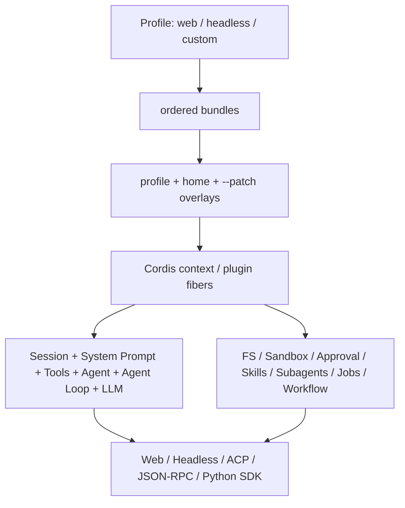

# DeepSeek Harness 深度研究：架构、机制与对 Lumen 的升级启示

研究日期：2026-08-18

DeepSeek Harness 证据快照：官方仓库 `deepseek-ai/deepseek-harness`，commit
[`99f6f02fecdb7dff40c3fbc9470f5907c29f74ca`](https://github.com/deepseek-ai/deepseek-harness/commit/99f6f02fecdb7dff40c3fbc9470f5907c29f74ca)，仓库版本 `0.1.0-rc.7`。

Lumen 证据范围：当前工作区源码、契约测试和 Accepted 架构记录；工作区包含尚未提交的在途修改，因此本文以文件内容而不是仅以 Git HEAD 为准。

资料原则：外部事实只采用 DeepSeek 官方仓库、官方文档站和仓库内源码/测试说明；本文明确区分“官方事实”“基于源码的分析”和“对 Lumen 的建议”。

## 1. 执行摘要

DeepSeek Harness（命令名 `dsh`）不是 DeepSeek API 的轻量 wrapper，而是 DeepSeek AI 官方开发的完整 Agent harness。它的核心命题是 **Everything is a Plugin**：模型 Adapter、Agent loop、Session、工具、Sandbox、审批、Web UI、子 Agent、压缩和持久化都由 Cordis 插件树组合。官方同时明确标注它仍处于 developer preview，未来会发生破坏兼容的变更。[官方 README](https://github.com/deepseek-ai/deepseek-harness/blob/99f6f02fecdb7dff40c3fbc9470f5907c29f74ca/README.md)

它最有价值的部分不是“插件多”，而是四个相互咬合的工程机制：

1. **可逆的能力注册生命周期**：插件注册 Service、事件监听器、工具和 prompt section 时同时获得清理语义，卸载/HMR 会撤销贡献；依赖通过 `inject` 声明，不靠手工启动顺序。
2. **事件溯源式 Agent spine**：Session append-only log 是模型历史、恢复、fork、UI replay 和持久化的共同事实源；官方不变量是“模型可见的内容必须已记录”。
3. **Service Definition / Provider / Consumer 三分法**：文件、LLM、Sandbox、持久化、子 Agent、压缩等能力均把契约、实现和模型工具拆开，Provider 可替换而 Consumer 不感知具体技术。
4. **契约机械化**：配置目录、工具目录、持久化事件目录、Module graph、Cordis API、双语文档和运行时 invariant 均由源码生成或在 CI 校验，降低大规模插件树的漂移风险。

对 Lumen 的总判断是：**不应把现有架构改写为“Everything is a Plugin”**。Lumen 的 `WorkspaceHost`、`RunCoordinator`、`AgentRuntime`、`ContextEngine`、`TaskWorkspace` 和 `AgentOrchestrator` 已经形成高 Depth 的 Module，并且围绕单一状态权威、安全恢复和完成门禁建立了比 DeepSeek Harness 更强的约束。全面插件化会扩大 Interface 面积、削弱 Locality，并容易产生第二套状态权威。

Lumen 应选择性吸收以下能力，推荐顺序为：

1. **P0：有效配置与能力清单**——增加脱敏的 `--dump-effective-config`、工具/Skill/MCP/Agent Profile inventory 和来源 provenance。
2. **P0：Tool Contract V2**——为工具增加规范化结构化输出、模型渲染投影、客户端展示投影、显式并发分类和不可被后续 listener 反向放宽的单调 guard。
3. **P0：文件 mutation 的乐观并发控制**——把现有 snapshot 检查推进到原子写入临界区，消除“检查后、写入前”的 TOCTOU 窗口。
4. **P0：生成式契约目录与运行时 invariant**——从 Pydantic/registry/record schema 生成配置、工具、命令、事件和 Session record 目录，并在 CI 检查漂移。
5. **P1：有限的可逆 Registration Scope**——先用于 Tool/MCP/Hook/Skill 与模型切换事务，不动状态权威 Module。
6. **P1：持久化 request receipt 与 read-side projection**——记录实际模型步骤的 route、工具 digest、token 预算和 context fingerprint；以 JSONL 为权威构建纯投影/可重建索引。
7. **P2：只有出现第二个真实实现时再增加 Provider seam**——例如外部 Codex/ACP child backend 或第二个 Session backend。
8. **P2 实验：Code Mode / 动态 Workflow**——必须经 `CapabilityGateway`、Sandbox、`TaskWorkspace` effect journal 和 completion gate，不能让模型程序直接取得进程级能力。

## 2. 研究边界与项目成熟度

### 2.1 当前发布形态

在固定快照中，根包版本是 `0.1.0-rc.7`，要求 Node `^22.19.0 || >=24.0.0`；最直接的产品入口是 `npx @deepseek-ai/dsh web`。仓库同时提供 headless、ACP、JSON-RPC SDK、Python SDK 和多个示例 composition；当前官方产品说明没有把 TUI 列为已交付运行表面。Python SDK 不是 Python 版内核，而是通过 JSON-RPC stdio 驱动同版本打包的 Harness runtime 子进程。[根 `package.json`](https://github.com/deepseek-ai/deepseek-harness/blob/99f6f02fecdb7dff40c3fbc9470f5907c29f74ca/package.json) [CLI Reference](https://github.com/deepseek-ai/deepseek-harness/blob/99f6f02fecdb7dff40c3fbc9470f5907c29f74ca/apps/cli/reference/README.md) [Python SDK README](https://github.com/deepseek-ai/deepseek-harness/blob/99f6f02fecdb7dff40c3fbc9470f5907c29f74ca/python/sdk/README.md)

按仓库文件名统计，快照中 `packages/` 下有 226 个 package manifest，仓库有 819 个测试文件和 219 个 package-owned invariant companion。它们说明项目覆盖面和机械化治理投入很大，但不能直接等价为稳定性或生产成熟度；官方的 developer-preview 声明仍是更高优先级的成熟度信号。

### 2.2 不能过度解读的事项

- 当前配置、事件和插件 Interface 仍可能破坏兼容，不能把 rc.7 的内部类型当成长期标准。
- 官方文档详细描述的是设计契约，真实生产质量仍要由部署环境、真实模型 E2E、故障注入和长期运行数据验证。
- `worker_threads`、Cordis plugin isolation 或 Service key 本身不是安全边界；官方对 Code Runtime 也明确把 `isolation` 视为诊断标签，而不是安全承诺。[Code Runtime](https://github.com/deepseek-ai/deepseek-harness/blob/99f6f02fecdb7dff40c3fbc9470f5907c29f74ca/docs/subsystems/code-runtime.md)
- DeepSeek Harness 的 Session 格式策略是不能忠实解释就拒绝，当前不提供旧格式迁移；这与 Lumen 必须加载 v1–v9 且不重写历史的兼容目标不同，不能照搬。[Session Persistence](https://github.com/deepseek-ai/deepseek-harness/blob/99f6f02fecdb7dff40c3fbc9470f5907c29f74ca/docs/subsystems/persistence.md)

## 3. 总体架构：Cordis 插件树而不是固定内核层次

DeepSeek Harness 的运行体是启动时组合出来的一棵 Cordis 插件树：



官方所说“没有 privileged core”应理解为：产品行为由可替换的插件组合形成，而不是所有 package 在重要性、状态所有权或依赖方向上真的完全对称。官方架构文档仍明确列出 `session`、`system-prompt`、`tools`、`agent`、`agent-loop` 和 `llm` 构成 Agent spine；其他能力通常是可选 seam。[Architecture](https://github.com/deepseek-ai/deepseek-harness/blob/99f6f02fecdb7dff40c3fbc9470f5907c29f74ca/docs/architecture.md) [Core subsystem](https://github.com/deepseek-ai/deepseek-harness/blob/99f6f02fecdb7dff40c3fbc9470f5907c29f74ca/docs/subsystems/core.md)

### 3.1 Cordis 的五个关键语义

1. 插件通过 `apply(ctx)` 注册贡献，也可使用 object/class 形式。
2. `ctx` 是 Service repository；Consumer 依赖稳定 key，例如 `ctx.tools`、`ctx.llm`、`ctx.sessions`，不 import 具体 Provider。
3. `inject` 声明必要依赖；框架等待 Service 可用后再激活插件。
4. typed event 有 `emit`、`waterfall`、`parallel`、`serial` 四种 dispatch 语义；`waterfall` 是可短路、可包裹的 middleware。
5. 注册是 reversible effect；插件卸载时 listener、tool、timer 和 prompt section 自动撤销，外部资源通过 `ctx.effect()` 返回 disposer。[Cordis Primer](https://github.com/deepseek-ai/deepseek-harness/blob/99f6f02fecdb7dff40c3fbc9470f5907c29f74ca/docs/cordis-primer.md) [首个插件教程](https://deepseek-harness.github.io/deepseek-harness/en/develop/basic/)

这套模型真正解决的是“动态组合之后如何正确撤销”和“依赖何时就绪”，而不仅是 import 插件。其代价是行为可能分散在多个 waterfall listener 和配置 row 中，阅读单个实现文件不一定能得出最终有效行为。

### 3.2 Profile、Bundle、Patch 与 HMR

Profile 是部署 composition；Bundle 是一组 Cordis config row；最终配置按 bundle 顺序、profile patch、home patch、`--patch` overlay 叠加。Patch 通过 row id 替换完整 config 或插入 row；`dsh --profile web --dump-config` 可显示机器真正启动的树。配置变化可通过 HMR 卸载旧插件并重新挂载，新旧注册不会并存。[Architecture](https://github.com/deepseek-ai/deepseek-harness/blob/99f6f02fecdb7dff40c3fbc9470f5907c29f74ca/docs/architecture.md) [App Boot](https://github.com/deepseek-ai/deepseek-harness/blob/99f6f02fecdb7dff40c3fbc9470f5907c29f74ca/packages/boot/app-boot/README.md)

优点是部署差异可配置、可检查、可热替换；风险是 overlay 替换整块 config，使用者必须理解 row id、层次优先级和 Service 依赖。DeepSeek Harness 通过生成的 Config Catalog、启动 fail-loud audit 和 Loader composition tests 抵消这种复杂度，而不是假设配置天然可靠。[Config Catalog](https://github.com/deepseek-ai/deepseek-harness/blob/99f6f02fecdb7dff40c3fbc9470f5907c29f74ca/docs/config-catalog.md)

## 4. Agent loop：Turn、Step、Inbox 与事件域

DeepSeek Harness 的一个 **step** 是一次模型请求及该响应触发的工具执行；一个 **turn** 可包含零到多个 step。Loop 大致为：

1. 从 Agent inbox claim 下一步输入；普通 follow-up 进入 `next-turn`，steering/injected context 进入 `next-step` 的不同唤醒语义。
2. 追加 `turn/start`，经过 `agent/pre-step` waterfall；listener 可拒绝或重写本次进入的 message batch。
3. 追加 `step/start` 和 `user/message`，组装 prompt 与 tool schema，从 Session log 推导模型 history。
4. 经 `agent/request` 和 `llm/stream` 调用模型；原始 chunk、最终 assistant message、tool call/result 均进入 Session log。
5. 并行安全工具进入有界 rolling pool，exclusive 工具形成 barrier；结果按模型调用顺序提交。
6. 有工具债务或 steering 时开始下一 step；自然停止前经过 `agent/turn-stopping`，最后追加 `turn/end`。[Agent Lifecycle](https://github.com/deepseek-ai/deepseek-harness/blob/99f6f02fecdb7dff40c3fbc9470f5907c29f74ca/docs/agent-lifecycle.md)

它将事件分为三类：

| 事件域 | 语义 | 例子 |
|---|---|---|
| Session event | durable fact，必须可 replay | `turn/*`、`step/*`、`user/message`、`assistant/*`、`tool/*` |
| Agent event | process-local 协调和拦截 | inbox、status、pre-step、request、turn-stopping |
| Capability event | seam 的 policy/provider hook | `tools/*`、`fs/*`、`approval/*`、`telemetry/*` |

最重要的不变量是 **model-visible means logged**：任何进入模型请求的输入都必须能从 log 重建。与之配套，UI/SDK 要读取 replayable transcript 就订阅 `session/event`；`agent/*` 只表达现场协调，不能冒充 durable history。[Architecture](https://github.com/deepseek-ai/deepseek-harness/blob/99f6f02fecdb7dff40c3fbc9470f5907c29f74ca/docs/architecture.md)

### 4.1 设计优点

- 同一 log 同时支撑模型历史、UI replay、恢复、fork、telemetry 和 persistence，减少“展示事件”和“恢复事实”漂移。
- next-turn/next-step inbox 明确区分 follow-up、steering 和不唤醒的 context injection。
- cancellation、dispose、idle 和单条 message 的完成语义分开；官方明确禁止把 `whenIdle()` 错当成某条 follow-up 的结果。
- 空内容、max-token finish、失败 step、被拒绝的 pre-step 仍留下结构化边界，审计比只保存最终 assistant 文本完整。

### 4.2 设计成本

- 扩展 listener 可影响 request、tool 和 turn；最终行为需要结合注册顺序与 waterfall short-circuit 理解。
- 对每个 model-visible 输入都建 event，事件词汇、格式兼容和 projection 纪律要求很高。
- HMR 期间 live Agent、Session 和插件 fiber 的所有权需要复杂的 quiescence/rollback 约束；官方大量 defensive rules 正是这类复杂度的副产品。

## 5. Capability seam：Definition、Provider、Consumer

DeepSeek Harness 认为真正的 seam 至少包含三个角色：

- **Service Definition**：稳定 Interface 和共享类型；
- **Service Provider**：一个或多个 Implementation；
- **Consumer**：人类命令、模型工具或上层 Module。

典型例子：

| 能力 | Definition | Provider | Consumer |
|---|---|---|---|
| LLM | `ctx.llm` registry | DeepSeek、pi-ai、replay | Agent loop、compaction |
| Session persistence | `ctx.sessionPersistence` | JSONL、SQLite | Session lifecycle/query |
| Filesystem | `ctx.fs` | local、sandbox、E2B | file tools、LSP、workspace |
| Sandbox | `ctx.sandbox` | bwrap/Landlock、Seatbelt、Windows ACL | bash/PowerShell executors |
| Compaction | `ctx.compaction` | basic summarizer | auto policy、`/compact` |
| Subagent | `ctx.subagents` registry | spawn/fork in-process、ACP、Codex、Claude Code、DSH SDK | delegation/control/report tools |
| Code runtime | `ctx.codeRuntime` | worker-thread | Code Mode tool bridge |

完整 capability graph 由源码生成，可直接看到 Definition、Provider 和 Consumer 的依赖关系。[Capability Seams](https://github.com/deepseek-ai/deepseek-harness/blob/99f6f02fecdb7dff40c3fbc9470f5907c29f74ca/docs/capability-seams.md)

这种拆分在“确有多个 Provider”时非常有 Leverage；如果只有一个 Implementation 且 Consumer 很少，三 package 拆分也可能变成 pass-through。DeepSeek Harness 接受较大的 package 数换取配置替换性，Lumen 的 deletion test 则要求更严格地证明新 Interface 有 Depth。

## 6. 工具体系与模型 Provider

### 6.1 ToolDefinition 不只是函数 schema

DeepSeek Harness 的工具契约同时声明：

- 参数 schema；
- 规范化输出 JSON schema；
- `execute(args, exec)` 返回 canonical lossless-JSON value；
- `output.render()` 把 canonical value 投影为模型可见 `ContentBlock[]`；
- 可选 `presentationMeta`、`presentCall`、`presentResult` 供 replay-safe UI 渲染；
- `timeoutMs`、`isConcurrencySafe(args)` 等只属于 Host 的字段，构造模型 schema 时使用显式 allow-list，避免把执行回调或策略元数据泄漏给模型。[Tools](https://github.com/deepseek-ai/deepseek-harness/blob/99f6f02fecdb7dff40c3fbc9470f5907c29f74ca/docs/subsystems/tools.md) [工具教程源码](https://github.com/deepseek-ai/deepseek-harness/blob/99f6f02fecdb7dff40c3fbc9470f5907c29f74ca/docs/user/develop/basic/tool.md)

这比“函数返回字符串”更强：同一执行结果可分别服务模型、UI、程序化组合和审计；输出也接受运行时 schema 校验，错误有稳定 code，不需要从文本解析。

### 6.2 执行管线

主路径是：

```text
tool/call durable event
  -> tools/pre-execute waterfall
  -> monotonic guards
  -> approval if needed
  -> tools/execute around-waterfall
  -> tool body
  -> tools/post-execute
  -> output schema validation + render
  -> definition.finalizeContent
  -> immutable tools/result observation
  -> tool/result durable event
```

其中 monotonic guard 只能返回 deny 或 abstain，没有 allow，因而 listener 顺序不能把已经形成的拒绝重新放宽。参数在 policy 前经过 lossless JSON materialization 和 deep-freeze，执行 identity 使用不可伪造 token；around middleware 可替换 signal，但 runtime 会与 caller signal 重新合并。[Tool Execution Pipeline](https://github.com/deepseek-ai/deepseek-harness/blob/99f6f02fecdb7dff40c3fbc9470f5907c29f74ca/docs/tool-execution-pipeline.md)

### 6.3 并发与嵌套执行

工具默认 exclusive；只有 `isConcurrencySafe(args) === true` 才进入 parallel group。并行调用按 barrier 和 bounded rolling pool 调度，但 durable result 按模型顺序提交。Code Mode 内的嵌套 tool dispatch 仍通过同一个 registry 和 policy pipeline，并带 root call/parent token 关联，避免 composite tool 绕过 guard。[Tools](https://github.com/deepseek-ai/deepseek-harness/blob/99f6f02fecdb7dff40c3fbc9470f5907c29f74ca/docs/subsystems/tools.md)

### 6.4 LLM Adapter 与 DeepSeek 实现

`LlmAdapter` 是 Provider-neutral seam：Adapter 按 route 注册，统一输出 block start/delta/end、usage、finish 等 `StreamChunk`，并可声明模型发现、容量、reasoning 和 retry policy。Agent loop 只消费这套词汇，不解析 DeepSeek/OpenAI/其他 Provider 的 wire event。[LLM Streaming](https://github.com/deepseek-ai/deepseek-harness/blob/99f6f02fecdb7dff40c3fbc9470f5907c29f74ca/docs/subsystems/llm-streaming.md) [LLM Adapter 开发指南](https://github.com/deepseek-ai/deepseek-harness/blob/99f6f02fecdb7dff40c3fbc9470f5907c29f74ca/docs/user/develop/practice/llm-adapter.md)

官方 DeepSeek Adapter 使用 OpenAI-compatible `/chat/completions` 和 SSE；每次请求解析 endpoint、model catalog 与 credential snapshot，处理 thinking/effort、retry、idle timeout、attribution header 和 AbortSignal。[DeepSeek Adapter](https://github.com/deepseek-ai/deepseek-harness/blob/99f6f02fecdb7dff40c3fbc9470f5907c29f74ca/packages/llm/llm-deepseek/src/adapter.ts) [DeepSeek Provider plugin](https://github.com/deepseek-ai/deepseek-harness/blob/99f6f02fecdb7dff40c3fbc9470f5907c29f74ca/packages/llm/llm-deepseek/src/index.ts)

当前 DeepSeek chat serializer 会拒绝 image content，因此 Harness 拥有 attachment 能力不等于该 Provider route 已支持多模态输入。[DeepSeek serializer](https://github.com/deepseek-ai/deepseek-harness/blob/99f6f02fecdb7dff40c3fbc9470f5907c29f74ca/packages/llm/llm-deepseek/src/serialize.ts) 这也印证 Lumen 当前“transport protocol 与 model capability profile 分离”的方向：能力必须由具体 route/profile 明示，不能从品牌或 API 兼容性推断。[Lumen Context 架构](../architecture-guide/03-context-and-memory.md)

## 7. Session、持久化、Projection 与 Compaction

### 7.1 Session log 和存储 seam

内存 `Session` 是 typed append-only event log；LLM history 通过 `deriveMessages()` 计算，不另存一份并行 history。持久化只保存相同的 `SessionEvent`，没有第二套 persisted DTO。JSONL Provider 使用 checksummed concatenated Zstandard frame 或 raw line；SQLite Provider 一行对应一个 event，并共用一组 persistence contract tests。[Session](https://github.com/deepseek-ai/deepseek-harness/blob/99f6f02fecdb7dff40c3fbc9470f5907c29f74ca/docs/subsystems/session.md) [Session Persistence](https://github.com/deepseek-ai/deepseek-harness/blob/99f6f02fecdb7dff40c3fbc9470f5907c29f74ca/docs/subsystems/persistence.md)

持久化采用 write-behind batching：`session/event` 同步通知，后台 controller 固定窗口聚合写入；`session/flush` 是 claim 下一 ordinary turn 前的 durability checkpoint。崩溃后发现未闭合 turn 时不截断；冷恢复保留已提交事件，为悬空 tool call 补 synthetic unknown-outcome error result，再补 step/turn 的 `interrupted` close，使 transcript 重新平衡。[Persistence Provider contract](https://github.com/deepseek-ai/deepseek-harness/blob/99f6f02fecdb7dff40c3fbc9470f5907c29f74ca/packages/session/session-persistence/README.md)

当前 persistence 产品面也有明确缺口：没有 retention/delete API，list 尚未分页/过滤，恢复语义是关闭中断 turn，而不是从 partial step 精确续跑。[Persistence limitations](https://github.com/deepseek-ai/deepseek-harness/blob/99f6f02fecdb7dff40c3fbc9470f5907c29f74ca/packages/session/session-persistence/README.md)

### 7.2 Projection 是纯 read model

Session projection unit 由 `init()`、`apply(state, event)`、`view(state)` 三个同步纯函数组成。Framework 对每个 committed event 驱动所有 unit，领域不自己订阅 event，客户端也不自己 fold；checkpoint cache 只是可丢弃加速层，log 仍是权威。[Session Projections](https://github.com/deepseek-ai/deepseek-harness/blob/99f6f02fecdb7dff40c3fbc9470f5907c29f74ca/docs/subsystems/session-projection.md)

这是 CQRS/event-sourcing 中较克制的一种用法：projection 没有写权限，schema/version 不匹配就从 log 重算，不成为第二权威。

### 7.3 Compaction 修改 surface，不删除 log

Compaction 通过 log-only 的 `compaction/start`、`summary`、`end` 记录完整生命周期；summary 作为新的 `user/message` 以 surface replace 操作遮蔽旧节点，旧事件仍保留。Tool result pruner 先做 deterministic head/middle/tail 缩减，再决定是否需要模型摘要；范围必须保持 tool call/result pairing。失败请求只有在 surface replacement generation 确实前进时才允许 retry，防止无进展重试循环。[Compaction](https://github.com/deepseek-ai/deepseek-harness/blob/99f6f02fecdb7dff40c3fbc9470f5907c29f74ca/docs/subsystems/compaction.md)

与 Lumen 相比，DeepSeek Harness 的 surface replacement 和 lifecycle bracket 更事件化；Lumen 的 V2 rolling checkpoint、Artifact receipt、provenance zone、两阶段 `commit -> fsync -> confirm_persisted` 对摘要正确性、历史兼容和外部正文信任控制更强。两者适合借鉴机制，不适合互相复制完整数据模型。

## 8. 安全：Approval、Sandbox、文件 freshness 与凭据

### 8.1 Approval

Approval outcome 是闭合集合：`allowed-once`、`rejected`、`cancelled`、`unavailable`；只有第一项放行，缺失/异常 answerer 一律 fail closed。当前 session policy 只有 `ask` 和 `never`，每次 asked/decided 都形成 log-only audit pair。[User Approval](https://github.com/deepseek-ai/deepseek-harness/blob/99f6f02fecdb7dff40c3fbc9470f5907c29f74ca/docs/subsystems/approval.md)

该机制的 fail-closed 和一次性 identity 值得借鉴，但策略表达力低于 Lumen 的 `Risk`、approval mode、once/session/always scope、项目永久规则和 `external_unknown` 安全断点，不应反向简化 Lumen。

### 8.2 Process Sandbox

Sandbox mode 为 `read-only`、`workspace-write`、`danger-full-access`；只约束文件 effect，network 和 process visibility 明确不在此词汇内。Provider 报告 `full` 或 `partial` enforcement；bwrap/Landlock、Seatbelt、Windows ACL 的能力差异不会被抹平。confined mode 无可用 Provider 时必须抛 `SANDBOX_UNAVAILABLE`，不得静默直通。[Process Sandbox](https://github.com/deepseek-ai/deepseek-harness/blob/99f6f02fecdb7dff40c3fbc9470f5907c29f74ca/docs/subsystems/sandbox.md)

官方 CLI 安全说明进一步明确：默认 `workspace-write` 约束的是 Bash/fs mutation 到 workspace/temp，并不限制读取、网络访问或进程可见性。[CLI security](https://github.com/deepseek-ai/deepseek-harness/blob/99f6f02fecdb7dff40c3fbc9470f5907c29f74ca/apps/cli/reference/README.md) 所以它不能被描述成完整主机 Sandbox；Lumen 当前关闭网络、隔离 HOME/temp 的 `workspace_write` 目标比该默认词汇更强。

这提示 Lumen 后续应把 Sandbox“配置意图”和“实际 enforcement 事实”分别展示。Lumen 当前默认 `workspace_write` fail closed 的方向正确，但 UI/诊断若只显示 mode、不显示 backend 与 enforcement 细节，操作者仍可能高估边界。

两项目都依赖平台能力并需持续验证：DeepSeek Harness 文档指出旧 Landlock ABI 和 Windows ACL 只能 partial，macOS 路径依赖已被 Apple 标记 deprecated 的 `sandbox-exec`。[Local Sandbox Provider](https://github.com/deepseek-ai/deepseek-harness/blob/99f6f02fecdb7dff40c3fbc9470f5907c29f74ca/packages/sandbox/sandbox-local/README.md) Lumen 应保留真实内核 E2E 和 unavailable/partial 诊断，不能只测 argv 生成。

### 8.3 文件观察与原子 mutation

DeepSeek Harness 的 FS Provider 先把路径解析为 opaque `FsTarget`，以 `FsVersion` 表达 freshness。读操作记录 present/absent observation；写入使用 `createIfAbsent` 或 `replaceIfVersion`，编辑在 literal match 之前先检查 version，并在同一 mutation critical section 内完成匹配、替换和 atomic publication。稳定错误码区分未观察、版本过期、目标不存在、歧义编辑和 Sandbox 拒绝。[Filesystem](https://github.com/deepseek-ai/deepseek-harness/blob/99f6f02fecdb7dff40c3fbc9470f5907c29f74ca/docs/subsystems/filesystem.md)

这一点是 Lumen 最直接的安全启发之一：Lumen `TaskWorkspace` 已在 mutation 前后做 SHA-256 snapshot、effect journal 和局部验证，但当前 `_FileAdapter.apply()` 从旧 artifact 生成新正文后直接原子覆盖；snapshot 检查和实际 `_atomic_write()` 之间仍有 TOCTOU 窗口。[Lumen TaskWorkspace](../../src/lumen/work_products/workspace.py) [Lumen resource adapters](../../src/lumen/work_products/adapters.py)

### 8.4 凭据和不可信输出

DeepSeek Harness 的防御规则要求子进程环境移除常见 secret/key/token/password 变量，临时/overflow 文件使用私有目录、随机名称和 owner-only exclusive create；dynamic settings 只保存 credential reference，不把密钥复制进普通配置或进程环境。[Defensive Patterns](https://github.com/deepseek-ai/deepseek-harness/blob/99f6f02fecdb7dff40c3fbc9470f5907c29f74ca/docs/defensive-patterns.md)

文件权限不是同 UID 隔离：官方 credential Provider 说明 `0600/0700` 只能阻止其他 OS 用户，Agent 的同 UID shell/fs 仍可能读取凭据，当前也没有 OS keychain Provider。外部 MCP command 被视为 Agent Sandbox 之外的受信任可执行代码，默认不启用。[Credential Provider](https://github.com/deepseek-ai/deepseek-harness/blob/99f6f02fecdb7dff40c3fbc9470f5907c29f74ca/packages/credentials/credentials-local/README.md) [CLI security notes](https://github.com/deepseek-ai/deepseek-harness/blob/99f6f02fecdb7dff40c3fbc9470f5907c29f74ca/apps/cli/reference/README.md)

Lumen 已要求 secret 不进入日志、Session、diff 和 artifact 摘要；后续应补充自动化 secret-redaction property tests，而不是只依赖约定。

## 9. Skills、多 Agent、Jobs、Code Mode 与 Workflow

### 9.1 Skills

Skill registry 支持多个 Provider、global + per-scope layering、cwd-sensitive discovery、缓存失效和 incomplete observation。模型初始只得到 name/description catalog，完整正文按需加载；catalog 变化通过 durable replacement message 更新，incomplete scan 保留 last-good view。[Skills](https://github.com/deepseek-ai/deepseek-harness/blob/99f6f02fecdb7dff40c3fbc9470f5907c29f74ca/docs/subsystems/skills.md)

Lumen 已实现 builtin/user/project 优先级、按需正文、session snapshot、artifact revision 和 script 审批，恢复语义更严格；可借鉴的是 Provider observation 的 `complete` 标记和 last-good catalog，而不是重新设计 Skill 状态权威。

### 9.2 多 Agent Provider 与 continuable Activation

`ctx.subagents` 是 named-provider registry，支持 in-process spawn/fork、ACP、Codex、Claude Code 和 DSH SDK Provider。Provider capability 在 start 前显式检查；不支持的 output schema、depth、tool filter 或 persona 必须 fail loud，不能接受后忽略。[Subagent](https://github.com/deepseek-ai/deepseek-harness/blob/99f6f02fecdb7dff40c3fbc9470f5907c29f74ca/docs/subsystems/subagent.md)

Continuable child 的 durable identity 是 child Session；process-local Activation 只表达当前是否 resident，不另建执行状态机。Agent inbox 是唯一 FIFO，follow-up authority 由 durable direct-parent 关系和 exact live Agent 校验；caller signal 只控制 admission，到 inbox acceptance 后 child 独立继续。父级不能在仍拥有 live descendants 时 settle，dispose 按 child-first 到达 quiescence。

这套 provider breadth 很强，但不包含 Lumen 当前的 worktree import/reject、父工作区 dirty-path 检查、Plan evidence 和 `TaskWorkspace` completion gate。Lumen 的 `AgentOrchestrator` 应继续是唯一 lifecycle authority；未来若接外部 Agent，只把“执行 child turn”变成 backend，不把线程、导入、证据与完成判断交给 Provider。[Lumen 多 Agent Accepted 决策](../architecture-guide/10-native-multi-agent-runtime.md)

其交付语义也仍有边界：continuable Activation 是进程内对象，child report 没有 offline durable mailbox、read receipt、idempotency key 或 exactly-once protocol；父级接受消息只证明 admission，不证明对端已读取或完整持久化，崩溃窗口可能产生交付歧义。[Subagent report limitations](https://github.com/deepseek-ai/deepseek-harness/blob/99f6f02fecdb7dff40c3fbc9470f5907c29f74ca/packages/subagent/tool-subagent-report/README.md)

### 9.3 Background Jobs

通用 Job registry 把 producer resource、owner authorization、running/stopping/terminal 状态、bounded wait、output cursor 和 teardown quiescence统一起来。它适合 bash、subagent 等长任务共享控制工具。[Jobs](https://github.com/deepseek-ai/deepseek-harness/blob/99f6f02fecdb7dff40c3fbc9470f5907c29f74ca/docs/subsystems/jobs.md)

Lumen 目前尚不需要为了抽象而增加通用 Job Module；只有当 Agent、长命令、下载/索引等至少两个生产能力出现重复的 wait/cancel/output/ownership 逻辑时，才通过 deletion test 引入。

### 9.4 Code Mode 与动态 Workflow

Code Runtime 运行模型生成的程序，并把 Host 提供的 async binding 暴露为命名空间；输入/输出必须跨 lossless JSON 边界，timeout、abort、worker death、invalid output 和 output limit 是闭合失败分类。Workflow 则允许模型程序并行/串联启动子 Agent，有总 Agent 上限、取消、child quiescence 和结构化终态。[Code Runtime](https://github.com/deepseek-ai/deepseek-harness/blob/99f6f02fecdb7dff40c3fbc9470f5907c29f74ca/docs/subsystems/code-runtime.md) [Workflow](https://github.com/deepseek-ai/deepseek-harness/blob/99f6f02fecdb7dff40c3fbc9470f5907c29f74ca/docs/subsystems/workflow.md)

它的收益是减少多次模型往返、允许数据转换和动态 orchestration；风险是模型程序成为新的控制平面。对 Lumen 而言，这只能是后置实验：binding 必须调用统一 `CapabilityGateway`，每个 nested call 继续走 Risk、EffectKind、审批、Sandbox、effect journal 和验证；程序运行必须是可硬终止的隔离进程/容器，不能把 Python 主进程对象直接暴露给模型代码。

## 10. 客户端、SDK、Telemetry、文档与测试治理

### 10.1 客户端与 SDK

DeepSeek Harness 的 Web、headless、ACP、JSON-RPC 和 Python SDK 都投影同一 Agent/Session spine。Python `Session.run()` 明确拥有从 durable inbox receipt 到整个 Agent 再次 idle 的 activity interval；它不声称 final response 与某条 prompt 存在不可歧义的一对一因果关系。[Python SDK README](https://github.com/deepseek-ai/deepseek-harness/blob/99f6f02fecdb7dff40c3fbc9470f5907c29f74ca/python/sdk/README.md)

### 10.2 Telemetry

Session Telemetry 是可选 capability，默认关闭。它把 Session event 投影为逻辑记录并通过 OTel best-effort 发送；没有 durable outbox 或 exactly-once，接收方需按 `(session.id, event.seq)` 去重。基础 composition 没有内建 redaction rule，显式启用 FULL 可能导出消息、工具参数/结果、路径和命令输出中的敏感内容。[Session Telemetry](https://github.com/deepseek-ai/deepseek-harness/blob/99f6f02fecdb7dff40c3fbc9470f5907c29f74ca/docs/subsystems/session-telemetry.md) [Telemetry Provider](https://github.com/deepseek-ai/deepseek-harness/blob/99f6f02fecdb7dff40c3fbc9470f5907c29f74ca/packages/session/session-telemetry/README.md)

因此它目前更接近可选的 Session 事件导出，而不是完整的 Metrics/Trace/Cost/SLO 平台。Lumen 若增加外部 telemetry，应先定义 redaction、采样、可靠性和用户可见的启用状态，不能把 Session 原始事实默认外发。

### 10.3 文档与测试治理

测试治理尤其值得重视：

- unit tests 强制每个 registry 有 HMR cleanup test；
- coverage gate 对 `packages/*/*/src` 做 per-file 100%，同时官方强调 coverage 只证明执行过，不证明产品正确；
- real API E2E 使用真实 DeepSeek，keyless CI 自动 skip；
- snapshot 覆盖协议、持久化 log、Web 浏览器和 SDK；
- product-visible plugin 必须通过真实 Loader composition，而不是只手工 `ctx.plugin()`；
- E2E 验证外部 world，例如重新读取文件，而不是相信 Agent 自述。[Testing Policy](https://github.com/deepseek-ai/deepseek-harness/blob/99f6f02fecdb7dff40c3fbc9470f5907c29f74ca/docs/testing.md)

更重要的是，项目把大量文档当成生成物：Config Catalog、Tool Catalog、Persistence Catalog、Module Graph、Cordis API 和双语 pairing 都有 freshness check；每个 package 还提供 invariant companion，对它真正拥有的 event/data 关系做运行时断言，不用“Service 方法存在”冒充 invariant。[Runtime Invariants](https://github.com/deepseek-ai/deepseek-harness/blob/99f6f02fecdb7dff40c3fbc9470f5907c29f74ca/docs/subsystems/invariants.md)

## 11. DeepSeek Harness 的核心优势与局限

### 11.1 优势

1. **部署可组合性高**：同一代码库可从最小 headless 到完整 Web，能力差异由 composition 表达。
2. **扩展生命周期完整**：注册、卸载、HMR、依赖激活和 rollback 是框架语义，不靠每个插件自行约定。
3. **Session 事实源统一**：模型 history、UI、fork、恢复和持久化从同一 event log 派生。
4. **工具契约强**：参数、规范输出、模型渲染、UI 展示、并发和 policy metadata 分离。
5. **Provider seam 真实存在**：LLM、Session persistence、FS、Sandbox、Subagent 等已有多个 Implementation，不是为未来假设创建的空 Interface。
6. **安全失败分类细**：approval unavailable、sandbox unavailable/partial、FS stale、worker exit 等不被压成一个字符串异常。
7. **运行时和文档机械校验强**：生成目录、真实 composition、package invariant 和 snapshot 减少大规模系统漂移。
8. **高级 orchestration 面广**：continuable subagent、background jobs、Code Mode 和 workflow 已落在共同能力管线之上。

### 11.2 局限与风险

1. **仍是 developer preview**：当前 Interface 与持久化格式不能作为稳定生态标准。
2. **package 和配置图巨大**：226 个 package 带来发布、依赖、版本和认知成本；“可替换”并不自动等于“容易理解”。
3. **行为分散**：waterfall listener、scope、bundle patch 和 HMR 共同决定有效行为，调试需要强工具支持。
4. **插件代码仍是进程内可信代码**：Cordis scope 限制可见性和生命周期，不构成恶意插件 Sandbox。
5. **Sandbox 不是完整系统隔离**：官方词汇只覆盖文件 effect，network/process visibility 另行处理；Windows/旧 Landlock 可能只有 partial enforcement。
6. **审批策略较窄**：`ask/never` 和 one-shot allow 不覆盖 Lumen 的风险分级、session/project 规则与未知外部动作策略。
7. **格式兼容策略偏开发期**：旧/新格式不能解释时直接拒绝，没有 Lumen 式长期 schema upgrade chain。
8. **动态 Code/Workflow 扩大攻击面**：即便 nested tools 走统一 registry，模型程序、binding bridge、资源上限和 teardown 都增加新的故障类。
9. **插件化可能牺牲 Deep Module Depth**：部分能力被拆成 Definition/Provider/Consumer 多 package，适合生态替换，但不一定适合规模较小、强调 Locality 的 Python framework。
10. **Subagent 投递不是可靠消息系统**：没有 offline mailbox、read receipt、幂等键或 exactly-once，进程故障会留下交付歧义。
11. **持久化产品能力尚未闭环**：缺少 retention/delete 与分页列表，partial step 只能关闭为 interrupted，不能精确续跑。
12. **Telemetry 需部署方自行治理隐私**：默认关闭但 FULL export 没有基础 redaction，传输也是 best-effort。
13. **DeepSeek Adapter 当前仍是文本链路**：Attachment subsystem 的存在不能证明具体 route 已支持图片输入。

## 12. Lumen 当前基线与相对位置

Lumen 当前的关键事实源和 deep Module 已在架构审计中明确：[当前实现审计](../architecture-guide/12-current-implementation-audit.md)。主要结构如下：

| 领域 | Lumen 权威 Module | 当前优势 |
|---|---|---|
| 客户端命令、run、审批 | `WorkspaceHost` | TUI/Web/headless 共享 command/event contract |
| 单 Session turn/恢复 | `RunCoordinator` | 候选状态先持久化，成功后再发布 |
| 模型/工具 loop | `AgentRuntime` | Pydantic AI provider translation、recovery receipt、completion gate |
| Context | `ContextEngine` | zone/trust/provenance、token preflight、V2 rolling checkpoint、ArtifactStore |
| Work Product/effect | `TaskWorkspace` | prepared→applied→verified/failed、局部验证、恢复/协调 |
| 多 Agent | `AgentOrchestrator` | 深度一、能力只收窄、worktree import、安全完成门禁 |
| Session | `SessionRepository` | v1–v9 append-only 兼容、升级只追加 marker |
| Tool policy | `ToolRegistry` + Gateway | `Risk` 与 `EffectKind` 正交、未知外部动作 fail-safe |

相关源码：[WorkspaceHost](../../src/lumen/application/host.py)、[AgentRuntime](../../src/lumen/runtime.py)、[ContextEngine](../../src/lumen/context/engine.py)、[Tool contract](../../src/lumen/tools/spec.py)、[AgentOrchestrator](../../src/lumen/agents/orchestrator.py)、[SessionRepository](../../src/lumen/sessions.py)。

Lumen 相对 DeepSeek Harness 的明显优势是：

- 核心状态权威更少、更集中，调用者面对的是高 Depth Interface；
- `Risk`、`EffectKind`、`TaskWorkspace` 和 completion gate 形成从意图授权到变更验证的闭环；
- Context 对 trust、transient reinjection、artifact、checkpoint integrity 和历史 schema 兼容更严格；
- writable child 使用独立 worktree，并在导入时检查父工作区 dirty path 和三方冲突；
- Python 内核可直接嵌入，不需要像 DeepSeek Python SDK 一样管理 Node/runtime 子进程。

Lumen 当前相对短板是：

- ToolSpec 主要是 callable + risk/effect/timeout，缺少 canonical output schema、模型/客户端双投影和参数相关的并发分类；
- Python tool plugin 是启动时 import 并返回 `list[ToolSpec]`，没有统一 registration disposer、依赖激活和 HMR transaction；
- 有效配置、能力来源、loaded/deferred/disabled 状态尚未形成一份统一、脱敏、机器可读的 inventory；
- SessionRepository 把 JSONL append、兼容读取和多领域 materialization 集中在单一 Implementation，read-side projection 和检索扩展成本会继续上升；
- 文档虽有 Accepted 决策和 OpenAPI 生成物，但工具、配置、Session record、command/event 和 Module graph 的自动目录仍不完整；
- `TaskWorkspace` 的 before snapshot 与最终 atomic write 之间存在并发修改窗口。

## 13. 两个项目的关键对比

| 维度 | DeepSeek Harness | Lumen | 判断 |
|---|---|---|---|
| 架构主张 | Everything is a Plugin | 少数 deep Module + Adapter | Lumen 不应全面转向前者 |
| 依赖激活 | Cordis Service + `inject` | ResourceManager 显式构造/打开 | DSH 动态组合更强；Lumen Locality 更好 |
| 扩展撤销 | effect/disposer + HMR | 各 Module 自己 close，tool plugin 静态 | Lumen 可局部补 Registration Scope |
| Agent loop | event-sourced turn/step | Runtime outcome + timeline + terminal turn append | DSH replay 粒度更细；Lumen Interface 更深 |
| Context | log surface + compaction/pruning | zone/trust/artifact/V2 checkpoint/preflight | Lumen 更强，不应改写 |
| 工具输出 | canonical JSON + model/UI projection | 主要返回函数结果/文本 | DSH 值得直接借鉴 |
| 工具安全 | waterfall + monotonic guard + approval | Risk/EffectKind + Hook + approval + Gateway | 应合并优点，不替换 Lumen 双轴 |
| 文件 mutation | opaque target + version CAS | snapshot/effect/verify，但有 TOCTOU | DSH freshness guard 可补强 Lumen |
| Sandbox | per-call mode + full/partial fact | workspace_write/disabled，默认 fail closed | Lumen 应增加 enforcement 诊断 |
| Session backend | JSONL/SQLite 真实 Provider seam | JSONL 单实现、长期兼容 | 暂不抽象；先做 projection/index |
| 多 Agent | 多 Provider、continuable、可递归预算 | 唯一 Orchestrator、深度一、worktree import | Lumen 安全闭环更强，DSH backend breadth 更强 |
| Code/Workflow | 已内建可选 seam | 无 | 仅适合 P2 隔离实验 |
| 客户端 | Web/headless/ACP/SDK composition | TUI/Web/headless Host contract | 两者方向一致 |
| 契约治理 | 大量 generated catalog/invariant | Accepted docs、OpenAPI、契约测试 | Lumen 可显著吸收 DSH 方法 |
| 兼容策略 | preview，未知/旧格式可拒绝 | v1–v9 必须加载且不重写 | 必须坚持 Lumen 策略 |

## 14. 对 Lumen 的具体启发：吸收、改造与拒绝照搬

### 14.1 可直接吸收

1. **有效配置 dump 与 provenance**：让操作者看到最终值来自 global/project/local/CLI 哪一层，以及某能力为什么 loaded、deferred、disabled 或 failed。
2. **工具 canonical output**：把执行值、模型文本、UI 卡片分开，所有投影从同一规范值产生。
3. **单调 guard**：Hook 可以改写/拦截，但 safety guard 只有 deny/abstain，任何后置扩展都不能扩大权限。
4. **文件 version guard**：在写入临界区重验 expected revision，稳定返回 stale error。
5. **generated catalogs**：从真实 schema/registry 生成文档并在 CI 检查 freshness。
6. **real composition tests**：插件/MCP/Skill/Hook 不只单测 factory，还要穿过 `ResourceManager -> WorkspaceHost -> AgentRuntime` 的真实入口。
7. **Sandbox enforcement fact**：报告 backend、full/partial/unavailable，不只报告请求的 mode。

### 14.2 需要按 Lumen 不变量改造

1. **Registration Scope** 只管理 capability contribution 生命周期，不拥有 Session、Run、Plan、TaskWorkspace 或 Agent Thread 状态。
2. **Session projection** 必须是可从 JSONL 重建的 read model，缓存可丢弃，不能成为第二状态权威。
3. **外部 Subagent Provider** 只能实现 child execution Adapter；thread id、ownership、message、result、worktree import、evidence 和 completion 仍由 `AgentOrchestrator` 统一提交。
4. **Code Mode** 的每个 nested call 必须进入同一 `CapabilityGateway`；未知 effect 阻止 strict completion，模型程序没有 ambient filesystem/process/network。
5. **事件粒度增强** 要以 v10 append record 兼容设计进行，v1–v9 继续只读加载，不重写 header。

### 14.3 不建议照搬

1. 不把 `WorkspaceHost`、`RunCoordinator`、`AgentRuntime`、`ContextEngine` 和 `AgentOrchestrator` 拆成可任意 HMR 的插件。
2. 不为了“Everything is a Plugin”把一个 Implementation 拆成 Definition/Provider/Consumer 三个空壳 package。
3. 不采用 DeepSeek Harness 的旧格式直接拒绝策略；Lumen 的历史兼容是产品不变量。
4. 不把 Lumen 的 Risk/EffectKind/approval scope 降级为 `ask/never`。
5. 不追求 package 数量或 100% coverage 数字本身；优先测试真实入口、失败路径、世界状态和恢复不变量。
6. 不在安全底座完成前引入模型生成的同进程脚本 orchestration。

## 15. 推荐升级路线

### P0-A：有效配置与 Capability Inventory

**根因**：Lumen 的配置合并、Tool/MCP/Skill/Agent Profile 来源和模型切换结果分散在多个报告中，发生“为什么这个工具可见/不可见、为什么需要审批、当前到底使用哪个 profile”时缺少单一观察入口。

**建议设计**：

- 在 `ConfigResolver` 旁增加只读 `ResolvedConfigReport`，记录字段 provenance，但对 secret 只显示 `env:<name>`/credential reference，不显示值。
- `ResourceManager` 输出 capability inventory：name、origin、loaded/deferred/disabled/failed、risk、effect、approval decision、workspace/sandbox requirement、schema digest。
- CLI 增加 `lumen --dump-effective-config` 与 `lumen capabilities --json`；TUI/Web 的 `/context` 复用同一只读 Interface。
- dump 不参与运行决策，避免形成第二配置权威。

**验收**：同一 fixture 在 CLI/TUI/Web 得到同一 inventory；任何 secret fixture 均不能出现在 stdout、Session 或 snapshot；修改配置层后 provenance 测试能指出最终胜出的来源。

### P0-B：Tool Contract V2

**根因**：当前 [`ToolSpec`](../../src/lumen/tools/spec.py) 对权限/副作用表达良好，但执行结果的机器值、模型文本和客户端展示没有统一契约；并发安全主要由 EffectKind 推导，无法按参数细分。

**建议设计**：

- 新增 `ToolOutputSpec`：Pydantic `TypeAdapter`/JSON schema、`render_model(value)`、可选 `present(value)`；成功执行必须先验证 canonical value。
- `ToolExecutionResult` 保留 canonical value、model blocks、presentation metadata、typed error、effect receipt id；Session 只持久化有界/允许字段，大正文进入 ArtifactStore。
- 新增 `concurrency(args) -> EXCLUSIVE | PARALLEL_SAFE`，默认 exclusive；`EffectKind.OBSERVE` 只能作为默认建议，不能自动证明线程安全。
- 在可扩展 Hook 之后运行 `ToolGuard`，返回 deny/abstain；guard 看只读、冻结后的 execution identity。
- 现有 `ToolSpec(function=...)` 通过薄兼容 Adapter 映射到文本输出；删除条件是所有内置工具与 MCP Gateway 均迁移完成。

**验收**：非法输出在到达模型/UI 前失败；Host-only 字段不进入 provider schema；TUI/Web 对同一 result snapshot 渲染一致；guard 顺序 property test 证明 deny 不可反转；parallel-safe 测试覆盖同参数与不同参数分类。

### P0-C：文件 mutation 的 Expected Revision

**根因**：`TaskWorkspace` 已比较 `product.current.revision` 与 mutation 前 snapshot，但从 snapshot 到 `_atomic_write()` 仍可被外部进程插入修改。

**建议设计**：

- 在 `ResourceAdapter.apply/restore` 增加 `expected_revision`；写入临界区重新读取/校验当前 revision。
- 新建文件使用 no-replace publication；替换文件使用 expected digest/version，不匹配返回稳定 `STALE_RESOURCE`，不进入 APPLIED。
- 若平台无法原子 compare-and-swap，至少在临时文件完成后、`os.replace` 前重验，并把无法排除的 race 明确标为 reconciliation required。
- legacy `write_file/edit_file` 也通过同一 guard，不能只保护显式 Work Product 工具。

**验收**：故障注入在“初次 snapshot 后、publish 前”修改目标，Lumen 必须拒绝覆盖；非目标字节保持不变；symlink replacement 和父目录逃逸继续 fail closed。

### P0-D：Generated Contract Catalog + Runtime Invariants

**根因**：系统契约已很多，靠手工 Architecture Atlas 容易发生 schema、工具、命令、事件和文档漂移。

**建议设计**：

- 生成并校验五类目录：AppConfig、WorkspaceCommand/Result、RunEvent、ToolSpec、Session record/schema upgrade。
- 从 import graph/明确 metadata 生成 Module graph，但只作为导航，不把依赖图当设计正确性证明。
- 增加开发/测试模式 runtime invariants：model-visible transient 内容不进入 canonical history；checkpoint 只在 fsync 后发布；child tool set 是父有效集与 role/workspace 交集；effect 状态机合法；根 completion 时无 unresolved Agent/Work Product。
- invariant 由拥有该关系的 Module 注册；没有可观察关系时不写空泛检查。

**验收**：生成物 freshness 纳入 CI；人为新增 record/tool/config 字段但不更新目录时 CI 失败；每条 invariant 都有能先红后绿的回归测试。

### P1-A：有限 Registration Scope

**根因**：模型切换、MCP 连接、Hook/Tool plugin 和 Skill catalog 都需要成组激活/撤销；目前关闭逻辑由各处显式管理，未来动态 reload 容易残留 listener、tool 或 background task。

**建议设计**：

- 引入内部 `RegistrationScope`，只提供 `add_disposer()`、`create_task()`、`close_and_wait()`；关闭必须达到 quiescence。
- `ToolRegistry.add()`、Hook registration、MCP bundle attach、Skill provider attach 返回 disposer，并由 scope 统一持有。
- 先用于 `ResourceManager.select_model()` 的 transaction：新 scope 完成构建和验证后原子替换，旧 scope 再撤销。
- 不让 scope 保存领域状态；Session/Plan/Agent/Work Product 仍由原 Module 拥有。

**验收**：重复 reload 后工具/Hook/listener 数量不增长；旧 background task 全部停止；新构建失败时旧 runtime 继续可用；任意 disposer 异常不阻止其余清理并形成 bounded diagnostic。

### P1-B：Provider Request Receipt 与 Session Read Projection

**根因**：Lumen 已在内存生成真实模型步骤 `ProviderRequestSnapshot`，但 terminal turn 记录并未形成完整的逐 step request ledger；Session load 随 record 类型增长承担越来越多 materialization 逻辑。

**建议设计**：

- 先在 turn terminal record 保存有界 `request_receipts[]`：step、provider/model route、instructions/messages/tools token、visible tool digest、context fingerprint、output reserve、hard limit、estimated 标记；不保存 secret 和大正文。
- 只有确实需要崩溃后 mid-turn 恢复时，才升级为 v10 的 append-only `step_start/request_receipt/step_end`；不要同时保留第二套可执行状态机。
- 把 Agent state、Work Product state、settings、plan、live state 的加载逻辑逐步提取为纯 fold projection；JSONL 仍是权威。
- 可选 SQLite 全文/列表索引只作为可删除、可重建 read model；revision/digest 不一致时从 JSONL 重建。

**验收**：给定同一 JSONL，projection 冷算和缓存结果相同；删除索引不丢数据；v1–v9 fixture 全部继续加载且文件字节不变；receipt 能重建“哪一个模型、哪组工具和多少预算发出了这次请求”。

### P1-C：统一 Tool Presentation Contract

**根因**：TUI 与 Web 都有工具卡片，但展示语义容易在 Adapter 中重复判断工具名和结果文本。

**建议设计**：由 Tool Contract V2 产生纯 `ToolCallView`/`ToolResultView` 数据，不携带回调；Host event 只传 schema-validated presentation intent，TUI/Web 各自渲染。Presentation 必须可由 durable args/result replay，不能读取 live object。

**验收**：live 与 replay 卡片相同；未知工具使用通用 fallback；presentation callback 异常不能改变 authoritative tool outcome。

### P2-A：外部 Subagent Backend（有第二实现时才做）

当真实需求要求接 Codex/ACP/远端 Agent 时，在 `AgentRuntimeFactory` 后引入 execution backend Interface；本地 Lumen runtime 与外部 backend 构成两个 Implementation 后才公开 seam。`AgentOrchestrator` 继续发 id、校验 Session ownership、持久化消息/result、执行 import/reject 和 completion gate。

**验收**：外部 backend 不能扩大父 tool/sandbox/approval；断线、重复 spawn、late result、跨 Session id、unknown external effect 和 dirty worktree 都有契约测试。

### P2-B：受限 Code Mode / Workflow Spike

只在 Tool V2、Registration Scope、expected revision 和 request receipt 完成后做隔离 spike：

- 模型程序在单独 Sandbox 进程/容器运行；
- 唯一 binding 是 JSON-RPC 风格 `tools.call(name, args)`；
- Host 对每次 nested call 重新执行 schema、Risk、EffectKind、审批、Sandbox 和 effect journal；
- 限制 wall time、CPU、memory、输出、nested call 数与并发；
- 程序取消必须 kill + await quiescence；
- strict completion 下任何 unknown/unverified nested effect 阻止成功。

成功标准不应是“能跑脚本”，而是相同任务相对普通 tool loop 在 token/延迟上有可测收益，且安全、恢复、审计契约没有降级；否则删除 spike。

## 16. 建议的决策顺序与收益矩阵

| 建议 | Leverage | 实现复杂度 | 主要风险 | 前置条件 |
|---|---:|---:|---|---|
| 有效配置/能力清单 | 高 | 低 | 脱敏遗漏 | 无 |
| Tool Contract V2 | 很高 | 中高 | 兼容层双轨 | 先定义删除条件 |
| Expected Revision | 很高 | 中 | 平台原子语义 | TaskWorkspace tests |
| Generated Catalog/Invariant | 高 | 中 | 生成器变成新负担 | 只生成稳定契约 |
| Registration Scope | 高 | 中高 | 错误所有权/HMR race | 先做模型切换 pilot |
| Request Receipt/Projection | 高 | 中高 | schema 膨胀、第二权威 | v1–v9 fixture gate |
| External Subagent Backend | 中高 | 高 | 权限和结果归属 | 第二真实 Provider |
| Code Mode/Workflow | 不确定 | 很高 | 扩大攻击面 | 所有 P0/P1 安全底座 |

推荐先完成前四项。它们不改变 Lumen 的顶层状态权威，却能显著提升可观察性、工具组合能力、并发正确性和文档可信度；也为以后接外部 Agent 或 Code Mode 提供必要地基。

## 17. 最终结论

DeepSeek Harness 最值得学习的不是“插件化”口号，而是它围绕插件化付出的完整工程成本：可逆 lifecycle、依赖激活、fail-loud composition、统一 event log、规范化工具值、单调 guard、可重建 projection、生成契约和真实入口测试。脱离这些机制只复制 `apply(ctx)` 或配置 row，不会得到同等可扩展性，反而会制造隐式全局状态。

Lumen 当前的架构主线是正确的：深 Module、单一状态权威、Append-only Session、Risk/EffectKind 正交、Context 两阶段发布、TaskWorkspace 验证和 AgentOrchestrator 完成门禁构成了自己的差异化优势。后续升级应把 DeepSeek Harness 当作 **能力生命周期和契约治理的参考实现**，而不是目标架构模板。

最优路线是：保留 Lumen 的 core depth，只在 Tool/MCP/Skill/Hook 等真正需要动态组合的位置引入可逆注册；先补 canonical tool output、文件 expected revision、有效配置 inventory 和生成式契约，再谨慎推进 session read projection、外部 Agent backend 与受限 Code Mode。这样既能获得 DeepSeek Harness 的扩展 Leverage，又不牺牲 Lumen 已建立的安全、恢复和长期兼容不变量。
