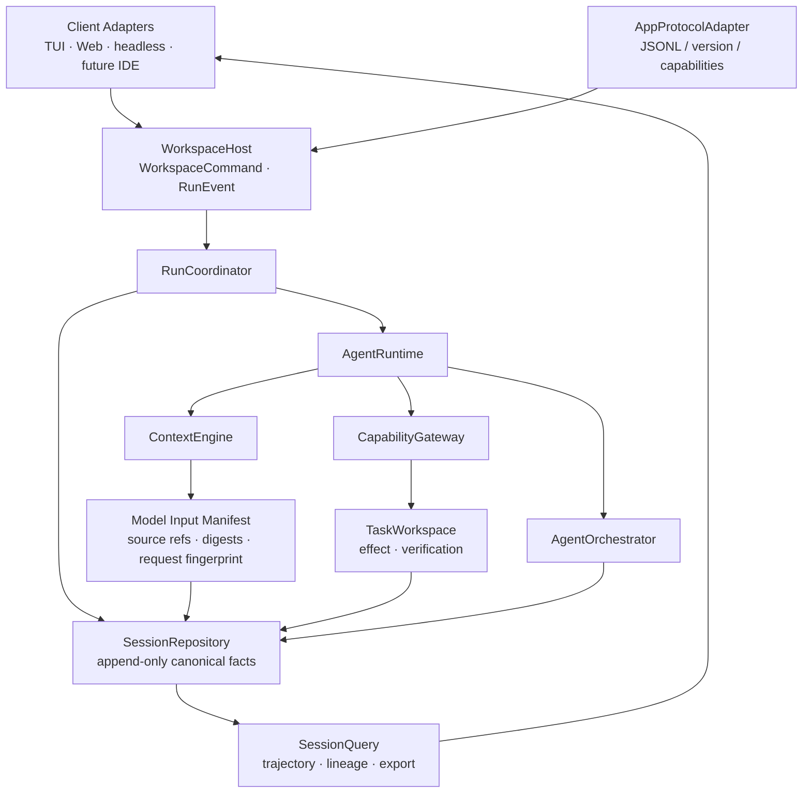

# Lumen Agent Harness 技术对标与升级研究报告

> 研究日期：2026-08-26 
> 研究对象：Lumen 当前实现、`agent-harness-research.md`，以及其中引用的 Codex、DeepSeek Harness、Pi 一手资料 
> 结论性质：架构研究与升级建议，不是 Accepted 决策或实现规范

> **实施跟踪（2026-08-27）：** 报告提出的 Model Input Manifest、完整 tool schema digest、
> provider-neutral `ModelDriver`/`ReplayModelDriver` 与 M2–M3 `LumenAgentLoop` Core 已完成；M4
> Runtime parity slice 也已接入低层 `PydanticAIModelDriver`、公开 Hook pipeline、blocking
> clarification、请求边界 interactive input 和共享 recovery receipt。默认模型—工具 Loop 仍由
> PydanticAI `Agent` 执行；全 provider、provider-private/suspended part、deferred MCP 与全 Surface
> Gate 尚未完成。后续状态以 Accepted 的
> `docs/architecture-guide/13-native-agent-loop-migration.md` 和源码为准。

## 1. 技术摘要

Lumen 不缺少一个可靠的 Agent Loop，也不需要通过“Everything is a Plugin”重写内核。当前项目最成熟、最难被对标项目替代的部分，是围绕**唯一运行时权威**建立的深 Module：`WorkspaceHost`、`RunCoordinator`、`AgentRuntime`、`ContextEngine`、`TaskWorkspace`、`AgentOrchestrator` 和 `CapabilityGateway`。它们已经把客户端一致性、恢复、安全、审批、副作用追踪、工作对象验证和多 Agent 完成门禁连成了一条生产路径。

真正值得借鉴的改进集中在四个方向：

1. **从 Codex 借鉴模型请求的前缀稳定性与缓存经济性。** Lumen 已有 durable `ProviderRequestReceipt`，但目前没有 provider cache 命中/写入观测，也没有区分稳定前缀与动态尾部的显式契约。
2. **从 DeepSeek 借鉴“模型可见输入可重建”的审计强度。** Lumen 的 canonical history、timeline、Context source 和 request receipt 分散保存了大部分证据，但还缺少一个能回答“第 N 次模型调用究竟看到了什么、由哪些来源组成”的有界 manifest。
3. **从 DeepSeek 与 Pi 借鉴会话轨迹查询、透明分支和可嵌入协议。** Lumen 的 JSONL journal、SSE 和 turn-level fork 已可靠，但缺少公开的 trajectory/query/export Interface、item-level 分支导航，以及面向 IDE/外部进程的稳定双向协议。
4. **从 DeepSeek 的 Code Mode 与 Pi 的极简执行体验研究低往返执行。** 这应作为受控实验，而不是引入第二套 Agent Runtime、任意 TypeScript 执行器或默认高权限扩展。

综合优先级：先做 **Model Input Manifest + Prompt Cache Observability**，再做 **Session Query/Trajectory + App Protocol**；Execution Provider、扩展包治理与低往返执行进入后续研究。Item-level Session tree 有价值，但不应早于可重建性与查询能力。

## 2. 研究范围、方法与证据等级

本报告按“外部设计主张 → Lumen 运行时权威 → 持久化事实 → 客户端投影 → 契约测试”交叉核验。事实优先级遵循仓库规则：源码与契约测试最高，Accepted 架构记录次之，研究文档只作为问题清单和外部线索。

证据等级：

- **A：** Lumen 源码、schema、契约测试，或对标项目的官方工程文章/官方仓库文档。
- **B：** 从多个 A 级事实推导出的架构判断，报告中明确标注为判断或建议。
- **C：** 尚需 prototype/benchmark 验证的收益假设，不能直接进入产品承诺。

重点本地证据包括：

- 当前权威与实现审计：[`docs/architecture-guide/12-current-implementation-audit.md`](../architecture-guide/12-current-implementation-audit.md)
- Session 与客户端：[`docs/architecture-guide/05-sessions-events-clients.md`](../architecture-guide/05-sessions-events-clients.md)
- Context 与 request receipt：[`src/lumen/context/types.py`](../../src/lumen/context/types.py)、[`src/lumen/context/engine.py`](../../src/lumen/context/engine.py)
- 应用层 Seam：[`src/lumen/application/host.py`](../../src/lumen/application/host.py)、[`src/lumen/application/models.py`](../../src/lumen/application/models.py)
- 工具契约：[`src/lumen/tools/spec.py`](../../src/lumen/tools/spec.py)、[`src/lumen/tools/gateway.py`](../../src/lumen/tools/gateway.py)
- Session journal 与 fork：[`src/lumen/sessions.py`](../../src/lumen/sessions.py)
- 插件与生命周期：[`src/lumen/tools/registry.py`](../../src/lumen/tools/registry.py)、[`src/lumen/lifecycle.py`](../../src/lumen/lifecycle.py)
- 执行路径：[`src/lumen/tools/capability.py`](../../src/lumen/tools/capability.py)、[`src/lumen/sandbox.py`](../../src/lumen/sandbox.py)
- 完成门禁：[`src/lumen/completion.py`](../../src/lumen/completion.py)、[`src/lumen/work_products/workspace.py`](../../src/lumen/work_products/workspace.py)、[`src/lumen/agents/orchestrator.py`](../../src/lumen/agents/orchestrator.py)

## 3. 对原研究文档的评价

### 3.1 研究文档做对了什么

原文对三个 Harness 的主轴判断是成立的：Codex 强调稳定 Core 与多 Surface 协议；DeepSeek Harness 强调 event-log-first、capability seam 和插件生命周期；Pi 强调小内核、透明 Session 与低门槛扩展。这三个视角正好覆盖 Lumen 的产品内核、可替换能力和开发者体验。

尤其值得保留的研究问题是：

- 模型请求是否保持稳定前缀，缓存收益是否可测；
- 模型可见输入能否从 durable facts 精确重建；
- 文件系统、子进程和 sandbox 能否替换 Implementation；
- Session 是否既能恢复，也能查询、分支和导出 trajectory；
- Core 能否通过稳定协议服务 IDE、Desktop、Web 与自动化；
- 扩展能力是否按需暴露，避免 schema/token 膨胀。

### 3.2 需要修正的边界

1. **“综合采用三者优点”不能直接推出架构。** Codex 的强 Core、DeepSeek 的 Loop 插件化和 Lumen 的唯一权威原则存在张力。若同时照搬，会得到多个调度与恢复权威。Lumen 应保留强 Core，只在确有第二种 Implementation 的地方新增 Seam。
2. **DeepSeek 的优势偏架构弹性，不等于生产安全更强。** Lumen 的 Risk、EffectKind、ToolConcurrency 三轴、未知远端副作用 fail-closed、TaskWorkspace verification 和 Agent import gate 更完整。插件化本身不能替代这些约束。
3. **Pi 的 Session tree 是交互优势，不自动等于更高 replay fidelity。** Lumen 的 turn record、checkpoint digest、ArtifactRef、request receipt 和 recovery receipt 更丰富；Pi 的主要领先点是树形导航的简单透明。
4. **外部资料需要固定版本。** 原文引用的 `badlogic/pi-mono` 当前会跳转到 `earendil-works/pi`。后续报告应记录仓库、commit SHA、访问日期和适用版本，避免生态迁移后仍把旧链接当作稳定身份。
5. **文档存在可清理的编辑问题。** DeepSeek 架构图重复了“系统提示词”，工具对比表重复了表头。这不影响主结论，但会降低研究材料作为长期证据的可信度。

## 4. Lumen 当前架构基线

Lumen 的运行路径是 Adapter → Host → Coordinator/Runtime → Context/Tools/Session。各状态概念已有明确权威：

| 状态/行为 | 唯一运行时权威 | Durable fact / 投影 |
|---|---|---|
| workspace command、active run、审批 | `WorkspaceHost` | run timeline、Session records |
| 单 Session turn、恢复、交互队列协调 | `RunCoordinator` | append-only Session journal |
| 单 Agent model/tool loop | `AgentRuntime` | messages、events、partial outcome、request receipts |
| 上下文 prepare/commit/control | `ContextEngine` | compaction/checkpoint、ArtifactStore refs |
| 工作对象与 mutation 验证 | `TaskWorkspace` | work state、effect journal |
| Agent Thread 生命周期 | `AgentOrchestrator` | Agent records、evidence、import state |
| capability 执行 | `CapabilityGateway` | canonical output、effect receipt、timeline projection |
| 长期历史 | `SessionRepository` | v9 append-only JSONL；v1–v8 兼容读取 |

这套基线意味着升级应遵循两个约束：

- 新能力优先扩展既有深 Module 的 Interface，不在 Web、TUI、headless、IDE 各自复制行为。
- 新的 manifest、索引、trace 或 cache 数据只能是 durable fact 或可重建 projection，不能成为第二套 Session/Runtime 权威。

## 5. Lumen 已经做得更好的地方

### 5.1 状态权威与完成语义更严格

Lumen 不把“模型输出了完成文本”视为完成。`CompletionGate` 会综合 Plan evidence、TaskWorkspace verification 与 AgentOrchestrator unresolved state；未验证 mutation、待导入 worktree、冲突、待审批、缺失 evidence 都可以阻止完成声明。对标文档没有呈现同等细粒度、跨工作对象与多 Agent 的完成契约。

### 5.2 工具契约比通用插件总线更精确

`ToolSpec` 将 `Risk`、`EffectKind` 和 `ToolConcurrency` 分开；`ToolOutputSpec` 将 canonical value、model text 与 client presentation 分开。`CapabilityGateway` 再统一执行 validation、policy、approval、guard、timeout、idempotency、effect recording 和 presentation fallback。这比“注册一个工具函数”提供了更高的安全 Leverage，也比把所有逻辑放入 Event Bus 更容易定位责任。

### 5.3 mutation、恢复与导入安全更完整

TaskWorkspace 使用 `prepared → applied → verified/failed → rolled_back` journal，并验证目标变化与非目标不变。Agent worktree 导入前检查 baseline、父工作区 dirty path 与三方冲突。`run_command` 采用 argv-only、无 shell expansion、独立进程组、超时/取消清理和有界 stdout/stderr。Pi 风格的任意扩展执行和简单 session tree 并不具备这些默认保障。

### 5.4 多 Surface 已共享 Core

TUI、FastAPI/SSE、Next.js Web 和 headless 已通过 `WorkspaceHost` command/result 与 `RunEvent` 共享同一应用层 Seam。浏览器刷新、SSE sequence replay、审批和后台 run 都不是 UI 本地状态。这已经具备 Codex App Server 的核心思想；差距主要在**进程外协议稳定性与 SDK 生态**，不是 Core 复用本身。

### 5.5 上下文与大载荷治理更成熟

Lumen 的 ContextEngine 具有 token zone、hard-limit preflight、checkpoint 两阶段发布、ArtifactStore、tool output receipt 化、memory 以及 durable `ProviderRequestReceipt`。图片、大正文、diff 和 transcript 使用 ArtifactRef/内容寻址存储，Session 只保留引用与有界摘要。这比仅以 messages 或 session tree 为中心的方案更适合长期任务。

## 6. 值得借鉴、且对 Lumen 有真实增量的方向

### 6.1 P0：Model Input Manifest——让每次模型请求可解释、可重建

**外部启发：** DeepSeek Harness 的强不变量是“model-visible means logged”，每一步请求从 Session event log 派生。

**研究基线与当前进展：** 报告开始时，`ProviderRequestReceipt` 只保存 route、provider/model、token 分区、visible tool 名称/digest 和 Context fingerprint；Session turn 另行保存 messages、context/checkpoint、timeline 和 recovery receipt。M0–M1 已补充有界 `ModelInputManifest`：对 instructions、实际 messages、完整有序 tool schema、Context sources、stable prefix 和 dynamic tail 计算 digest，并保存 source ref/revision 与 replay eligibility。它仍不复制正文或 canonical history。

**建议：** 在现有 ContextEngine → AgentRuntime → SessionRepository 路径上扩展一个有界的 `ModelInputManifest`（可以是 `ProviderRequestReceipt` V2，或被其引用的 Artifact）：

- canonical history range / checkpoint cursor；
- system/developer/project instruction 的 source ref、digest、优先级与渲染版本；
- active Skill、MCP resource、memory、work-product context 的 source ref 与 digest；
- tool schema 的 canonical digest、稳定顺序与 capability origin；
- attachment refs、route、model、sandbox/approval policy digest；
-最终 request fingerprint，以及无法重建的 provider-private item 标记。

大正文仍进入 ArtifactStore，manifest 只保留引用、digest 和有界 metadata。它不复制 messages，不生成第二套 history，也不接管 ContextEngine。其价值是 debug、审计、replay eligibility、回归比较和缓存分析。

**验收标准：** 给定一次 terminal turn 和 step，可离线证明其 input sources 完整；缺失 artifact 或版本不兼容时明确返回 `non_replayable`，不能静默近似。

### 6.2 P0：Prompt Cache Contract 与可观测性

**外部启发：** Codex 将精确前缀稳定性视为性能设计约束，避免中途改写静态 instructions、tools、model、sandbox 和 cwd。

**研究基线与当前进展：** 报告开始时，`visible_tool_digest` 只对排序后的工具名称取 hash。M0–M1 已升级为完整有序 schema digest，并增加 instructions/tool schema/context sources/stable prefix/dynamic tail/request fingerprint。`observe_provider_usage()` 目前仍只比较 input token 估算漂移；provider cache read/write 观测与 miss 分类尚未实施。

**建议：**

- 定义 provider-neutral 的请求布局：`stable_instructions_prefix`、`stable_tool_schema_prefix`、`append_only_history`、`dynamic_tail`；
- 对完整 canonical tool schema、instructions source set、policy/sandbox envelope 分别计算 digest；
- 仅在 provider 提供时记录 `cache_read_tokens`、`cache_write_tokens`、`uncached_input_tokens` 等 observation，不把厂商字段变成核心语义；
- 为 cache miss 输出可解释分类：model/route change、tool schema change、instruction change、policy envelope change、compaction boundary change；
- 增加离线 benchmark，比较固定任务在冷/热请求下的 token、latency 和 cache ratio。

**风险：** 为追求 cache 而隐藏必要的权限变化是错误优化。policy、sandbox 或可见工具改变时必须优先保证正确性，并把 miss 作为可解释成本。

### 6.3 P1：Session Query / Trajectory / Trace Export

**外部启发：** DeepSeek 从 SessionEvent 派生 trajectory，Codex 以 Thread/Turn/Item 和 rollout trace 支撑调试，Pi 的 JSONL tree 便于人工理解。

**Lumen 现状：** Session v9 已包含丰富事实，timeline 支持 sequence replay，Repository 有可删除的读取 projection cache；但查询能力主要服务 load/list/checkpoint，没有公开的 typed trajectory/query Interface。

**建议：** 新增只读 `SessionQuery` 深 Module，输入 Session journal 与 ArtifactStore，输出稳定 projection：

- 按 turn/step/tool/agent/effect/status/time 查询；
- 建立 `provider request → tool call → effect → verification → evidence` 关系；
- 导出脱敏 trajectory bundle，包含 schema version、source digests 和 replay eligibility；
- 支持失败路径诊断：最后 durable step、未完成 effect、等待审批、缺失 artifact；
- 索引必须可删除重建，journal 仍是唯一权威。

优先做查询与 export，再讨论 UI。这样 Web/TUI/CLI/测试/未来 IDE 都消费同一 Interface。

### 6.4 P1：稳定 App Protocol 与 SDK

**外部启发：** Codex 的双向 JSON-RPC 用 Thread/Turn/Item 生命周期承载进度、工具、diff 和 server-initiated approval；Pi 用简单 RPC 降低非 Node 嵌入成本。

**Lumen 现状：** `WorkspaceHost` 已有 typed command/result，`RunEvent` 已可恢复，FastAPI/SSE 与 OpenAPI 已生成 TypeScript schema。因此 Lumen 已完成协议化最难的 Core 收口，但 transport 仍以进程内调用和 Web REST/SSE 为主。

**建议：** 在不新增 Runtime 状态的前提下，增加一个 `AppProtocolAdapter`：

- JSONL over stdio 作为第一 transport，后续可选 socket；
- initialize/version/capabilities handshake；
- command request/response + ordered event notification；
- approval/clarification 使用 server-initiated request 或等价的关联消息；
- schema 从 `WorkspaceCommand`、`CommandResult`、`RunEvent` 生成；
- 明确向后兼容规则、feature negotiation、cancel 和 reconnect semantics。

先用 headless/IDE proof-of-concept 验证真实第二个客户端，再承诺稳定公共 SDK。避免同时维护独立的 REST 领域模型和 RPC 领域模型。

### 6.5 P1（条件性）：Execution Provider Seam

**外部启发：** DeepSeek 将 filesystem、subprocess、sandbox 拆成 capability provider，使本地执行与远程沙箱可以替换。

**Lumen 现状：** Tool/Realtime/Memory/Timeline 等已经有真实 Interface，但 workspace 文件与 subprocess 路径仍主要依赖本地 Implementation。`run_command` 已安全而深，但本地与远程执行世界的替换尚未成为统一契约。

**建议条件：** 只有在确定需要第二种生产 Implementation（如本地 sandbox + remote container/worktree）时，才引入 `ExecutionWorld` 或更窄的 `ProcessExecutor`/`WorkspaceFilesystem` Interface。契约至少包含：

- workspace identity、cwd/path resolution 与 symlink policy；
- cancellation、timeout、bounded streaming、process-tree semantics；
- execution receipt、effect classification 与 replay policy；
- artifact transfer、baseline revision 和 import/verification；
- parent permission ∩ role allow-list ∩ sandbox mode 的单调收窄。

不要为了形式上对齐 DeepSeek 而把每个内部调用都包装成 service provider。

### 6.6 P2：扩展包 Manifest、信任与生命周期

**外部启发：** Pi 的 Extensions/Skills/Prompts/Themes 体验简单，DeepSeek 的 reversible effect 和 scope 便于卸载与重组。

**Lumen 现状：** `PluginConfig` 只有 module/factory/source_dir，factory 只返回 `list[ToolSpec]`；`RegistrationScope` 已能 LIFO dispose 并等待后台任务静止，但它故意不拥有 Session、Plan、Agent 或 Work Product 状态。

**建议：** 保持插件只扩展明确 capability，不让插件替换 `AgentRuntime`、`SessionRepository` 或 `AgentOrchestrator`。为真实的工具/Hook/Context provider 扩展引入包级 manifest：

- 包 ID、版本、入口、兼容范围与 provenance；
- 声明工具、Hook、Context source、后台任务等 capability；
- 请求的 Risk、EffectKind、network/filesystem/process 权限；
- project trust、签名/lockfile、dependency audit 与 quarantine 状态；
- activation scope、dispose 行为和健康检查。

热重载和 package manager 不是第一阶段目标；先完成可解释加载、冲突检测、权限收窄和确定性卸载。

### 6.7 P2：Item-level Branching 与 Session Tree UX

**外部启发：** Pi 在一个 JSONL 中通过 `id/parentId` 形成树，可跳到任意节点继续。

**Lumen 现状：** `fork(session_id, through_turn)` 以 turn 为粒度创建新 Session，复制已完成 turn，并将 active/pending Agent 标记为 `not_carried`。它安全、清晰，但大 Session 的分支复制成本较高，也不能从 turn 内某个 item 分叉。

**建议：** 不直接把现有 journal 改成可变树。先让 `SessionQuery` 支持 lineage；再研究 fork record 引用 immutable ancestor range/artifact，而不是复制完整正文。item-level fork 只允许在语义完整的边界，例如用户消息、assistant terminal、tool result 已持久化且 effect 已对账的位置。任何 pending/unknown effect 都必须阻止分叉或要求 reconciliation。

### 6.8 P2 实验：受控 Tool Program / Code Mode

**外部启发：** DeepSeek PTC/Code Mode 让模型生成一段程序组合多个工具，减少 model ↔ tool 往返。

**Lumen 现状：** 每个 `run_command` 是单次、argv-only、stdin=DEVNULL 的隔离进程；TUI `! command` 复用同一 fail-closed sandbox。它安全、可取消，但多步机械任务需要多次模型 round trip，交互式 CLI 也没有 persistent PTY。

**建议实验：** 不执行任意 TypeScript，不新增第二套工具权限。可以研究一个受限的 `ToolProgram`：

- 静态、版本化 schema，只能调用当前 `CapabilityGateway.catalog()` 的 allowlisted capability；
- 有 step/time/output/effect 上限；每个子调用仍经过 validation、policy、approval、sandbox 和 receipt；
- mutation 仍进入 TaskWorkspace，unknown external effect 仍不可自动重放；
- 运行结果生成一棵有界 trace，失败时精确指出最后完成的子步骤；
- 仅对可批处理、低风险、可验证任务启用。

是否加入 persistent terminal，取决于真实用例与 remote execution 需求。若实现，terminal session 必须有 Session 所有权、输入/输出界限、取消与进程树清理、恢复时不可假装重连已死亡进程。

## 7. 优先级矩阵

以下评分是基于当前源码成熟度、预期 Leverage、架构风险和验证成本的**定性判断**，不是生产指标。

| 候选 | 价值 | 实现就绪度 | 架构风险 | 建议优先级 | 决策 |
|---|---:|---:|---:|---:|---|
| Model Input Manifest | 5 | 4 | 2 | 5.0 | 立即进入 ADR/契约设计 |
| Prompt Cache 可观测性 | 5 | 4 | 2 | 4.8 | 与 manifest 同期设计 |
| Session Query / Trajectory | 5 | 4 | 2 | 4.5 | P1 实施 |
| App Protocol / SDK | 4 | 4 | 2 | 4.2 | 先用第二客户端验证 |
| Execution Provider Seam | 5 | 3 | 3 | 4.0 | 有 remote Implementation 后实施 |
| 扩展包治理 | 4 | 3 | 3 | 3.7 | 先 manifest/trust，后生态 |
| Item-level branching | 3 | 3 | 3 | 3.2 | 先 lineage/query，后存储优化 |
| Tool Program / Code Mode | 4 | 2 | 5 | 2.9 | sandboxed experiment |
| Persistent terminal | 3 | 2 | 5 | 2.6 | 等 Execution Seam 与需求证据 |

## 8. 推荐目标架构

推荐的演进不是新建“插件操作系统”，而是在现有深 Module 旁增加三个高 Leverage、低权威的能力：

依赖原则：

- `ModelInputManifest` 描述请求，不组装请求；ContextEngine 仍是上下文唯一 Seam。
- `SessionQuery` 读取 journal，不写调度状态；索引和图 projection 可删除重建。
- `AppProtocolAdapter` 翻译 command/event，不持有 Session actor 或 approval future。
- `ExecutionWorld` 只在本地与远程两个生产 Implementation 成立时出现。
- 插件通过 capability manifest 扩展已有 Seam，不能扩大父级权限或接管 Core authority。

## 9. 分阶段路线图

### Phase 0：建立基线与 ADR（1 个迭代）

- 固定外部研究来源的仓库、commit SHA、访问日期；修复原研究文档重复项与 Pi 链接身份。
- 采集当前 provider 请求的 token、latency、tool schema 变化和 compaction 边界基线。
- 起草 `ModelInputManifest` 与 provider cache observation ADR；列出不保存 secret/大正文的字段约束。
- 用 10–20 个可重复任务建立 replay eligibility 与 cache benchmark fixture。

### Phase 1：请求可重建与缓存解释（1–2 个迭代）

- 扩展 ProviderRequestReceipt 或引入 manifest ArtifactRef。
- 对 instructions、完整 tool schema、policy/sandbox envelope 计算 canonical digest。
- 添加 provider-neutral cache observation 与 miss-reason projection。
- 覆盖失败、取消、compaction、model/tool/policy 切换和旧 Session 兼容测试。

### Phase 2：Session Query 与 Trace Export（1–2 个迭代）

- 实现 read-only `SessionQuery` Interface 与可重建索引。
- 输出 turn/step/tool/effect/agent/evidence 关系图和脱敏 trajectory bundle。
- 在 CLI/TUI/Web 中只增加薄 Adapter；先服务故障诊断和测试回归。

### Phase 3：协议化嵌入（1–2 个迭代）

- 从现有 command/event schema 生成 stdio JSONL protocol。
- 建立 initialize、version、capability negotiation、cancel、approval、reconnect 契约。
- 以一个真实 IDE 或独立 headless client 证明 Interface；没有第二客户端前不承诺永久公共 SDK。

### Phase 4：条件性实验

- 有 remote sandbox 需求时实现 Execution Provider prototype，验证取消、artifact transfer、effect receipt 和 worktree import。
- 在 CapabilityGateway 之上做受限 ToolProgram benchmark；只在 latency/token 收益显著且安全不变量不退化时推进。
- Session lineage 稳定后评估 ancestor reference 与 item-level fork。

## 10. 验证指标与完成门槛

建议升级以以下指标验收，而不是以“新增了 Interface/插件点”为完成：

| 目标 | 可验证指标 |
|---|---|
| 请求可重建 | 随机抽取 terminal steps，100% 能解析 manifest；不可重建步骤有明确原因；无 secret/大正文进入 journal |
| 缓存可解释 | provider 暴露 cache usage 时完整采集；主要 miss 可归因；不因稳定前缀优化掩盖 policy/tool 变化 |
| trajectory | 从冷 journal 重建结果与热索引一致；删除索引不丢事实；failure path 能定位最后 durable step |
| 协议 | 两个独立客户端通过同一 command/event schema；旧客户端与新 server 的兼容矩阵有契约测试 |
| remote execution | cancel/timeout 可清理进程树；artifact 与 revision 可验证；权限只收窄；unknown effect 不自动重放 |
| Tool Program | 相同任务减少模型 round trip/latency；每个子调用仍有 approval/effect/receipt；失败可局部诊断 |

所有变更仍需保留：Session v1–v9 兼容、append-only upgrade、Risk/EffectKind/ToolConcurrency 分离、workspace path/symlink 防逃逸、strict TaskWorkspace verification、Agent depth-one 与 worktree import checks、Default/Plan/TUI/Web/headless 的共享契约。

## 11. 明确不建议照搬的设计

1. **不把 AgentRuntime 变成可任意替换插件。** 这会削弱 cancellation、recovery、completion 和 provider event translation 的单一权威。
2. **不引入通用 Event Bus 取代类型化调用。** 观测事件可以扩展，policy、mutation、审批与完成门禁不能退化成隐式 listener 顺序。
3. **不让 Extension 获得宿主完整权限。** Pi 的低摩擦扩展适合开发者工具，但与 Lumen 默认 fail-closed、安全审计和 child capability narrowing 冲突。
4. **不复制“SessionEvent + messages”两套 canonical history。** 应使用 manifest/ref 补齐可重建性，而不是为研究对齐另建状态权威。
5. **不在没有第二 Implementation 时抽象 filesystem/subprocess/provider。** 先用 deletion test 和真实替换需求证明 Depth。
6. **不以 Code Mode 绕过 CapabilityGateway。** 批处理程序只是组合器，不是新的权限、执行或 effect authority。

## 12. 最终判断

Lumen 当前已经更接近“产品级强内核 Harness”，其核心短板不在安全、恢复或多 Agent 生命周期，而在**外部可解释性与生态可嵌入性**：模型输入缺少一步一 manifest、prompt cache 缺少可观测契约、Session facts 缺少统一 query/trajectory、Host command/event 缺少稳定的进程外协议。

因此最优升级路径是：

> 保留 Lumen 的强 Core 与唯一权威；用 Codex 的 cache/protocol 思维提升效率和嵌入性；用 DeepSeek 的 event-derived 思维补齐模型输入与轨迹可重建；用 Pi 的简洁体验优化分支和扩展，但拒绝其默认高信任执行模型。

这条路径能提升 Depth 与 Leverage，同时保持 Locality：复杂性进入 `ContextEngine`、`SessionQuery`、`AppProtocolAdapter` 和未来真实的 Execution Seam，而不会散落到每个客户端、插件和 Agent 角色。

### 12.1 补充决策：从 PydanticAI Agent graph 演进为 LumenAgentLoop

进一步核对 `src/lumen/runtime.py`、`src/lumen/models.py`、`CapabilityGateway` 与 Pi Agent core 后，建议把自研 AgentLoop 提升为一项独立的核心升级，但调整实施顺序：**Model Input Manifest、Prompt Cache Contract 和 recorded replay suite 是 Lumen Loop 的前置门禁，而不是迁移完成后的补充工作。**

目标不是立即移除 PydanticAI。首期由 Lumen 收回“模型请求 → 工具批次 → 结果回填 → 完成判定”的状态机权威，同时把 PydanticAI 降为低层 `ModelDriver` Implementation，继续提供 OpenAI、Anthropic、Google、Ollama 等 provider 适配。现有 `AgentRuntime`、`ContextEngine`、`CapabilityGateway`、`SessionRepository`、`TaskWorkspace` 和 `AgentOrchestrator` 的 Interface 与唯一权威保持不变。

这项升级已由 [Accepted 单轨决策](../architecture-guide/13-native-agent-loop-migration.md) 接管；
当前 Module 权威、Session 非目标、删除依据、验证与回滚要求以该记录为准，旧实施计划已删除。

## 13. 外部一手资料

1. OpenAI, [Unrolling the Codex agent loop](https://openai.com/index/unrolling-the-codex-agent-loop/)
2. OpenAI, [Unlocking the Codex harness: how we built the App Server](https://openai.com/index/unlocking-the-codex-harness/)
3. OpenAI Codex, [App Server protocol README](https://github.com/openai/codex/blob/main/codex-rs/app-server/README.md)
4. DeepSeek Harness, [Architecture](https://github.com/deepseek-ai/deepseek-harness/blob/master/docs/architecture.md)
5. DeepSeek Harness, [Session subsystem](https://github.com/deepseek-ai/deepseek-harness/blob/master/docs/subsystems/session.md)
6. DeepSeek Harness, [Packages and stable APIs](https://github.com/deepseek-ai/deepseek-harness/blob/master/packages/README.md)
7. Pi Coding Agent, [current README](https://github.com/earendil-works/pi/blob/main/packages/coding-agent/README.md)
8. Pi Agent core, [agent-loop.ts](https://github.com/earendil-works/pi/blob/main/packages/agent/src/agent-loop.ts)
9. PydanticAI, [low-level Model API](https://pydantic.dev/docs/ai/api/models/base/)
